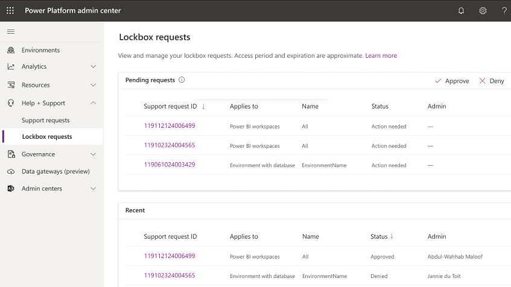

# Securely access customer data using Customer Lockbox in Power Platform and Dynamics 365

[!INCLUDE[new-PPAC-banner](~/includes/new-PPAC-banner.md)]

Most operations, support, and troubleshooting performed by Microsoft personnel (including subprocessors) don't require access to customer data. With Power Platform Customer Lockbox, we provide an interface for the customers to review and approve (or reject) data access requests in the rare occasion when data access to customer data is needed. It's used in cases where a Microsoft engineer needs to access customer data, whether in response to a customer-initiated support ticket or a problem identified by Microsoft.

This article covers how to enable Customer Lockbox and how lockbox requests are initiated, tracked, and stored for later reviews and audits.

> [!Note]
> Customer Lockbox is available in public clouds and US Government Community Cloud (GCC), GCC High, and Department of Defense (DoD) regions.

## Summary

You can enable Customer Lockbox for your data sources within your tenant. Enabling Customer Lockbox will enforce the policy only for environments that are activated for [Managed Environments](managed-environment-enable.md). Power Platform administrators can enable the lockbox policy.

For more information, go to [Enable the lockbox policy](#enable-the-lockbox-policy).

In the rare occasion when Microsoft attempts to access customer data that's stored within Power Platform (for example, Dataverse), a lockbox request is sent to the Power Platform administrators for approval. For more information, go to [Review a lockbox request](#review-a-lockbox-request).

All updates to a lockbox request are recorded and made available to your organization as audit logs. For more information, go to [Audit lockbox requests](#audit-lockbox-requests).

Power Platform and Dynamics 365 applications and services store customer data in several Azure storage technologies. When you turn on Customer Lockbox for an environment, customer data associated with the respective environment is protected by the lockbox policy, irrespective of the storage type.  

> [!NOTE]
> - Currently, the applications and services where lockbox policy is going to be enforced once enabled are Power Apps (excluding Cards for Power Apps), AI Builder, Power Pages, Power Automate, Microsoft Copilot Studio, Dataverse, Customer Insights, Customer Service, Communities, Guides, Connected Spaces, Finance (except Lifecycle Services), Project Operations (except Lifecycle Services), Supply Chain Management (except Lifecycle Services), and the real-time marketing feature area of the Marketing app.
> - Features powered by Azure OpenAI Service are excluded from Lockbox policy enforcement unless product documentation for a given feature states that Lockbox applies.
> - Nuance Conversational IVR is excluded from Lockbox policy enforcement unless product documentation for a given feature states that Lockbox applies. 
> - [Maker Welcome Content](welcome-content.md) is excluded from Lockbox policy enforcement.
> - You must disable Lucene.NET search from your website and move to Dataverse Search to be able to use Customer Lockbox. More information: [Portals search using Lucene.NET search is deprecated](/power-apps/maker/portals/important-changes-deprecations#portals-search-using-lucenenet-search).

## Workflow

1. Your organization has an issue with Microsoft Power Platform and opens a support request with Microsoft Support. Alternatively, Microsoft proactively identifies a problem (for example, a proactive notification is triggered), and a Microsoft-initiated event is opened to investigate and mitigate or fix the root cause.

2. A Microsoft operator reviews the support request/event and attempts to troubleshoot the issue by using standard tools and telemetry. If access to customer data is needed for further troubleshooting, a Microsoft engineer triggers an internal approval process for access to customer data, irrespective of lockbox policy being enabled or not.

3. In addition, a lockbox request is generated if the respective data store is associated with an environment protected according to the lockbox policy enablement. An email notification is sent to the designated approvers (Power Platform administrators) about the pending data access request from Microsoft.  

   > [!IMPORTANT]
   > The Microsoft engineer won’t be able to proceed with their investigation until the lockbox request is approved by the customer. This could cause delays in addressing the support ticket or prolonged outages. Make sure you monitor email notifications and/or lockbox requests in the Power Platform admin center and respond in a timely manner to avoid service interruptions.

   :::image type="content" source="media/lockbox-request.png" alt-text="A sample lockbox request.":::

4. The approver signs into the Power Platform admin center and approves the request. If the request is rejected or not approved within four days, it expires, and no access is granted to the Microsoft engineer.

5. After the approver from your organization approves the request, the Microsoft engineer obtains the elevated permissions that were initially requested and fixes your issue. Microsoft engineers have a set amount of time - 8 hours - to fix the issue, after which, access is automatically revoked.

## Enable the lockbox policy

Power Platform administrators can create or update the lockbox policy in the Power Platform admin center. Enabling the tenant level policy will apply only to environments that are activated for [Managed Environments](managed-environment-enable.md). It may take up to 24 hours for all data sources and all environments to be implemented with Customer Lockbox.

1. Sign in to the [Power Platform admin center](https://admin.powerplatform.microsoft.com).
2. Use the Tenant settings page to review and manage tenant-level settings. To view tenant-level settings, select the **Gear** icon () in the upper-right corner of the Microsoft Power Platform site and select **Power Platform settings** > **Settings** > **Tenant settings** in the left-side navigation pane.

3. Set **Customer Lockbox** to **Enable**.

   :::image type="content" source="media/lockbox-turn-on.png" alt-text="Turn on the lockbox policy.":::

## Review a lockbox request

1. Sign in to the [Power Platform admin center](https://admin.powerplatform.microsoft.com).

2. Select **Policies** > **Customer Lockbox**.

3. Review the request details.

   |Field  |Description  |
   |---------|---------|
   |Support request ID     | The ID of the support ticket associated with the lockbox request. If the request is a result of Microsoft-initiated internal alert, the value will be “Microsoft initiated”.|
   |Environment     | The display name of the environment in which data access is being requested.         |
   |Status     | The status of the lockbox request.   <ul><li>**Action needed**: Pending approval from the customer</li><li>**Expired**: No approval received from the customer </li><li>**Approved**: Approved by the customer </li><li>**Denied**: Denied by the customer</li></ul>        |
   |Requested     | The time at which the Microsoft engineer requested access to customer data in customer’s environment.      |
   |Request expiration     | The time by which the customer needs to approve the lockbox request. The status of the request will change to **Expired** if no approval is given by this time.         |
   |Access period     | The length of time the requestor wants to access customer data. This value is by default 8 hours and can't be changed.         |
   |Access expiration     | If access is granted, this is the time until which the Microsoft engineer has access to customer data.   |

4. Select a lockbox request, and then select **Approve** or **Deny**.

   > [!div class="mx-imgBorder"]
   > 

   > [!NOTE]
   > The lockbox requests that have occurred in the past 28 days are displayed in the **Recent** table.
   >
   > Once a request is approved, it cannot be revoked for the entire duration of the access period of 8 hours.

## Audit lockbox requests

> [!Warning]
> The schema documented in this section for the lockbox audit events is deprecated and won't be available starting in July 2024. You can audit Customer Lockbox events using the new schema available at [Activity category: Lockbox operations](admin-activity-logging.md#activity-category-lockbox-operations).

Actions related to accepting, denying, or expiration of a lockbox request are recorded automatically in [Microsoft 365 Defender](https://security.microsoft.com/homepage).  

:::image type="content" source="media/lockbox-defender.png" alt-text="Microsoft 365 Defender page.":::

Audit traces include these and other fields for each lockbox request:

- Unique identifier for the request
- Request creation time
- Organization ID
- User ID  (unique identifier for the Microsoft operator performing the request)
- Request status
- Associated support ticket ID
- Request expiration time
- Data access expiration time
- Environment ID
- Request justification

The Microsoft 365 **Audit** tab allows admins to search for events associated with lockbox sessions. View the **Power Platform Lockbox** category for Power Platform related lockbox events.

:::image type="content" source="media/lockbox-select-power-platform.png" alt-text="Select the Power Platform lockbox category.":::

Admins can directly export the result set based on the filter criteria.

Customer Lockbox produces two types of audit logs:
1.	Logs that are initiated by Microsoft and correspond to lockbox request being created, expired, or when access sessions end. This set of audit logs do not correspond to a specific user ID since the actions are initiated by Microsoft.
2.	Logs that are initiated by end user actions, such as when a user approves or denies a lockbox request. If the user that performs these operations does not have an E5 license assigned, the logs are filtered out and will not show up in the audit logs.

By default, the audit logs are preserved for a duration of one year. You need a 10-Year Audit Log Retention add-on license to retain audit records for 10 years. See [Audit (Premium)](/microsoft-365/compliance/audit-solutions-overview?view=o365-worldwide#audit-premium-1&preserve-view=true) for more details on audit log retention.

## Licensing requirements for Customer Lockbox

Customer Lockbox policy will be enforced only on environments that are activated for Managed Environments. Managed Environments is included as an entitlement in standalone Power Apps, Power Automate, Microsoft Copilot Studio, Power Pages, and Dynamics 365 licenses that give premium usage rights. To learn more about Managed Environment licensing, see [Licensing](managed-environment-licensing.md) and [Licensing overview for Microsoft Power Platform](pricing-billing-skus.md).

In addition, access to Customer Lockbox for Microsoft Power Platform and Dynamics 365 requires users in the environments where the Lockbox policy is enforced to have any of these subscriptions:

- Microsoft 365 or Office 365 A5/E5/G5
- Microsoft 365 A5/E5/F5/G5 Compliance
- Microsoft 365 F5 Security & Compliance
- Microsoft 365 A5/E5/F5/G5 Insider Risk Management
- Microsoft 365 A5/E5/F5/G5 Information Protection and Governance
[Learn more](https://go.microsoft.com/fwlink/?linkid=2214240) about applicable licenses.

## Exclusions

- Lockbox requests aren't triggered in the following engineering support scenarios:

    - Emergency scenarios that fall outside of standard operating procedures, such as a major service outage that requires immediate attention to recover or restore services in unexpected or unpredictable cases. These “break glass” events are rare and, in most instances, don't require any access to customer data to resolve.

    - A Microsoft engineer accesses the underlying platform as part of troubleshooting and is inadvertently exposed to customer data. It's rare that such scenarios would result in access to meaningful quantities of customer data.  

- Customer Lockbox requests are also not triggered by external legal demands for data. For details, refer to the discussion of government requests for data in the [Microsoft Trust Center](https://www.microsoft.com/trust-center/).

- Customer Lockbox won't apply to the access and manual review of customer data shared for Copilot AI features. Customer Lockbox will remain enabled for all in-scope data. 

## Known issues

- Tenant-to-tenant migration isn't supported when Customer Lockbox is enabled. You must disable Customer Lockbox to move an environment to another tenant. You can re-enable Customer Lockbox once the migration is completed.

[!INCLUDE[footer-include](../includes/footer-banner.md)]
