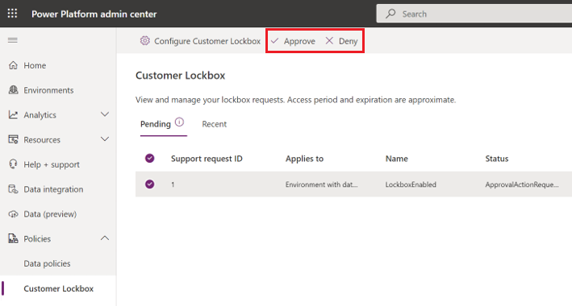

# Power Platform Lockbox 

Lockbox for Power Platform provides an interface for customers to review and approve or reject customer data access requests. It is usually used in cases where a Microsoft engineer needs to access customer data to resolve a support request. 

## Summary

Lockbox for Power Platform allows an organization to define which [Common Data Service databases](https://docs.microsoft.com/powerapps/maker/common-data-service/data-platform-intro) and Project Oakdale databases need to be protected with lockbox by creating a lockbox policy. Global administrators can configure the lockbox policy. See Configuring lockbox policy to learn more. 

Whenever Microsoft attempts to access data that is stored in a database that is protected by lockbox, a lockbox request will be sent to the global administrators and users who are assigned the [Customer Lockbox access approver](https://docs.microsoft.com/azure/active-directory/users-groups-roles/directory-assign-admin-roles#customer-lockbox-access-approver) admin role. See Reviewing lockbox requests to learn more. 

Once access is granted to Microsoft, any action taking place in the database during the elevated access period is recorded and made available to the organization as SQL audit logs. These can be exported to the customer’s own data lake. See Auditing data access to learn more. 

> [!NOTE]
> Lockbox only protects Common Data Service databases and Project Oakdale databases. Customer data stored in other data stores is currently out of scope.

## Workflow

1. Your organization has an issue with Power Platform requiring opening a support request with Microsoft Support.

2. A Microsoft support engineer reviews the support request and attempts to troubleshoot the issue by using standard tools and telemetry. If the troubleshooting fails, the support engineer can request elevated permissions by using a Just-In-Time (JIT) access service. 

3. After the access request is submitted by the Microsoft support engineer, the Just-In-Time access service evaluates the request by considering factors such as: 

   - The scope of the resource 
   - Whether the requester is an isolated identity or using multi-factor authentication 
   - Permissions levels 

   Based on the JIT rule, this request may include an approval from Internal Microsoft Approvers. For example, the approver might be the Customer support lead or the DevOps Manager. 

4. When the request requires direct access to customer data, a lockbox request is generated if the database is protected according to the organization’s lockbox policy. An email notification is sent to the designated approvers about the pending data access request from Microsoft. 

   :::image type="content" source="media/lockbox-sample-approval.png" alt-text="Sample lockbox approval ":::

5. The approver signs in to the Power Platform admin center and approves the request. If the request is rejected or if it is not approved within 12h, it expires, and no access is granted to the Microsoft engineer. 

6. After the approver from your organization approves the request, the Microsoft engineer receives the approval message, logs into the tenant, and fixes the customer's issue. Microsoft engineers have a set amount of time to fix the issue after which the access is automatically revoked. 

   > [!NOTE]
   > All actions performed by a Microsoft engineer are recorded and made available in SQL audit logs.

## Configure a lockbox policy

Global administrators can create or update the lockbox policy in the Power Platform admin center. The lockbox policy can protect all environments, some environments, or no environments. 

> [!NOTE]
> If your organization has a lockbox policy in place, every data access by Microsoft will be regulated and will require an explicit approval from the designated approvers in your organization.

1. Sign in to the [Power Platform admin center](https://admin.powerplatform.microsoft.com). 

2. Select **Governance** > **Lockbox policy**.

3. Configure the lockbox policy.
   
   |Setting  |Description  |
   |---------|---------|
   |All Power BI workspaces     |  Select this to extend the lockbox protection to all your organization’s Power BI workspaces that store data in the Common Data Service.      |
   |Environments with a database     | Select this to protect your organization’s environments that are associated with a Common Data Service database.      |

   > [!div class="mx-imgBorder"] 
   > 

## Approve or deny a Power Platform Lockbox request

1. Sign in to the Power Platform admin center. 

2. Select **Help + Support** > **Lockbox requests**.

3. Review the request details.

   |Field  |Description  |
   |---------|---------|
   |Support request ID     |         |
   |Environment     |         |
   |Status     |         |
   |Requested     |         |
   |Request expiration     |         |
   |Access period     |         |
   |Access expiration     |         |
   |Admin     |         |

3. Select a Lockbox request, and then choose **Approve** or **Deny**.
   > [!div class="mx-imgBorder"] 
   > 

## Auditing Power Platform Lockbox requests

Audit records that correspond to Lockbox requests are logged in SQL audit logs. You can access these logs by using **Export Analytics Data**. Actions related to a accepting or denying a Lockbox request and actions performed by Microsoft engineers (when access requests are approved) are also logged in the SQL audit logs. You can search for and review these audit records.

[screenshot of example SQL audit log data]

To export SQL audit logs to your organization's [Azure data lake](https://docs.microsoft.com/azure/architecture/data-guide/scenarios/data-lake):

1. Sign in to the Power Platform admin center. 

2. Select **Data export (preview)** from the left-side menu, and then select **New data export**.

   > [!div class="mx-imgBorder"] 
   > 

3. Select **Select analytics data** > **SQL audit logs**.

   > [!div class="mx-imgBorder"] 
   > 

4. Enter Data Lake details, and then select **Create**.

   |Field  |Description  |
   |---------|---------|
   |Subscription     |         |
   |Resource group     |         |
   |Storage account     |         |

   > [!div class="mx-imgBorder"] 
   > 

Your export will appear in the list under the **Data Lake** tab.

> [!div class="mx-imgBorder"] 
> 

**Fields description**

|Field  |Description  |
|---------|---------|
|Data package     |         |
|Environment     |         |
|Last export status    |         |
|Data last exported on     |         |
|Created by     |         |
|Created on   |        |

## Data export options

You can select **More actions** (...) next to some data export connection fields to take additional actions such as delete the connection or show export history.

1. Sign in to the Power Platform admin center. 

2. Select **Data export (preview)** from the left-side menu.

3. Select the **Data Lake** tab, and then select a data export from the list.

4. Select a field such as **Last export status**, select **More actions** (...), and then select an action.

   [screenshot]

## Exclusions

Power Platform Lockbox requests aren't triggered in the following engineering support scenarios:

- A Microsoft engineer needs to do an activity that falls outside of standard operating procedures. For example, to recover or restore services in unexpected or unpredictable scenarios.

- A Microsoft engineer accesses the Power Platform as part of troubleshooting and inadvertently has access to customer data. For example, 

  [need info]

- If the support engineer can't troubleshoot the issue by using standard tools and telemetry, the next step is to request elevated permissions by using a Just-In-Time (JIT) access service. This request can be from the original support engineer. Or, it can be from a different engineer because the problem is escalated.

After the access request is submitted by the Azure Engineer, Just-In-Time service evaluates the request taking into account factors such as:

The scope of the resource
Whether the requester is an isolated identity or using multi-factor authentication
Permissions levels
Based on the JIT rule, this request may also include an approval from Internal Microsoft Approvers. For example, the approver might be the Customer support lead or the DevOps Manager.

When the request requires direct access to customer data, a Customer Lockbox request is initiated. For example, remote desktop access to a customer's virtual machine.

The request is now in a Customer Notified state, waiting for the customer's approval before granting access.

At the customer organization, the user who has the Owner role for the Azure subscription receives an email from Microsoft, to notify them about the pending access request. For Customer Lockbox requests, this person is the designated approver.

Example email:

[screenshot]

If you have an issue that requires Microsoft support to access your data, you can use Power Platform Lockbox to approve or reject data access requests from Microsoft. With Lockbox, you can:
1. Create data-access polices
2. Approve or reject data access requests

## Things to note

Be aware of the following regarding Power Platform Lockbox.

- We only protect Data Flex Pro databases.
- There are emergency scenarios where Power Platform Lockbox can be circumvented. See [Exclusions](#exclusions).
- Users can act upon requests for environments they don't have access to.
- For Private Preview: Copying an environment with data protected with Power Platform Lockbox to another environment results in the data in the environment copied to no longer being protected with Power Platform Lockbox.
