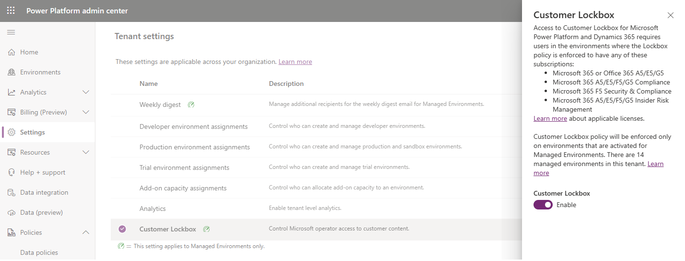

# About Lockbox for Microsoft Power Platform 

Lockbox for Microsoft Power Platform provides an interface to review&mdash;and approve or reject&mdash;data access requests. It's usually used in cases where a Microsoft engineer needs to access your data to resolve a support request.

## Summary

You define which environments with [Dataverse databases](/powerapps/maker/common-data-service/data-platform-intro) need to be protected with lockbox by creating a lockbox policy. Global administrators can configure the lockbox policy. More information: [Configure the lockbox policy](#configure-the-lockbox-policy)

Whenever Microsoft attempts to access data that's stored in an Azure SQL database that's protected by lockbox, a lockbox request is sent to the global administrators. More information: [Review a lockbox request](#review-a-lockbox-request)

After access is granted to Microsoft, any action taking place in the Azure SQL database during the elevated access period is recorded and made available to your organization as SQL audit logs. You can export these logs to your own data lake. More information: [Audit lockbox requests](#audit-lockbox-requests)

> [!NOTE]
> Dataverse leverages several Azure storage technologies. A single Dataverse database could store data in Azure SQL, Azure Cosmos DB, Azure Storage, etc. When you turn on lockbox for an environment with a Dataverse database, lockbox only supports access requests to Dataverse data stored in Azure SQL. Any Dataverse data stored in non-SQL data stores is currently out of scope.

## Workflow 

1. Your organization has an issue with Microsoft Power Platform, and opens a support request with Microsoft Support.

2. A Microsoft Support engineer reviews the support request and attempts to troubleshoot the issue by using standard tools and telemetry. If the troubleshooting fails, the support engineer requests elevated permissions by using a just-in-time (JIT) access service. 

3. After the access request is submitted by the Microsoft support engineer, the JIT access service evaluates the request by considering factors such as:

   - The scope of the resource.
   - Whether the requester is an isolated identity or is using multifactor authentication.
   - Permissions levels.

   Based on the JIT rule, this request might include an approval from internal Microsoft approvers. For example, the approver might be the customer support lead or the DevOps manager.

4. When the request asks for direct access to customer data, a lockbox request is generated if the Azure SQL database is protected according to the organization's lockbox policy. An email notification is sent to the designated approvers about the pending data access request from Microsoft. 

   :::image type="content" source="media/lockbox-sample-approval.png" alt-text="Sample lockbox approval":::

5. The approver signs in to the Power Platform admin center and approves the request. If the request is rejected or it isn't approved within 12 hours, it expires, and no access is granted to the Microsoft engineer. 

6. After the approver from your organization approves the request, the Microsoft engineer obtains the elevated permissions that were initially requested and fixes your issue. Microsoft engineers have a set amount of time to fix the issue, after which the access is automatically revoked. 

   > [!NOTE]
   > All actions performed by a Microsoft engineer are recorded and made available in SQL audit logs.

## Configure the lockbox policy

Global administrators can create or update the lockbox policy in the Power Platform admin center. The lockbox policy can protect all environments, some environments, or no environments.

> [!NOTE]
> If your organization has a lockbox policy in place, every data access by Microsoft will be regulated and will require an explicit approval from the designated approvers in your organization.

1. Sign in to the [Power Platform admin center](https://admin.powerplatform.microsoft.com). 

2. Select **Governance** > **Lockbox policy**.

3. Configure the lockbox policy.

   |Setting  |Description  |
   |---------|---------|
   |Environments with a database     | Select this to protect your organization's environments that are associated with a Dataverse database.      |

   > [!div class="mx-imgBorder"] 
   > 

## Review a lockbox request

1. Sign in to the [Power Platform admin center](https://admin.powerplatform.microsoft.com). 

2. Select **Governance** > **Lockbox requests**.

3. Review the request details.

   |Field  |Description  |
   |---------|---------|
   |Support request ID     | The ID of the support ticket associated with the lockbox request.         |
   |Environment     | The display name of the environment in which data access is being requested.         |
   |Status     | The status of the lockbox request.   <ul><li>**Action needed**: Pending approval from the customer</li><li>**Expired**: No approval received from the customer </li><li>**Approved**: Approved by the customer </li><li>**Denied**: Denied by the customer</li></ul>        |
   |Requested     | The time at which the Microsoft engineer requested access to customer's organization's data.         |
   |Request expiration     | The time by which the customer needs to approve the lockbox request. The status of the request will change to **Expired** if no approval is given by this time.         |
   |Access period     | The approximate length of time the requestor wants to access customer data. This is an estimate, and might change slightly.         |
   |Access expiration     | If access is granted, this is the time until which the Microsoft engineer has access to customer data. It's an estimate, and might change slightly.         |

4. Select a lockbox request, and then select **Approve** or **Deny**.

   > [!div class="mx-imgBorder"] 
   > 

> [!NOTE]
> The lockbox requests that have occurred in the past 28 days are displayed in the **Recent** table.

## Audit lockbox requests

All actions taken by the Microsoft engineer during the data access period are recorded in the form of SQL audit logs. These logs can be exported to your organization's data lake for subsequent analysis. You can configure that data export by using the new Data Export functionality.

> [!NOTE]
> Actions related to accepting or denying a lockbox request aren't recorded in the SQL audit logs; these are only available on the **Lockbox requests** page.

The following image is an example of the SQL logs that are generated. On row 248, observe that a **Select** action has been executed on the TimeZoneDefinitionBase table.

> [!div class="mx-imgBorder"] 
> 

To export SQL audit logs to your organization's [data lake](/azure/architecture/data-guide/scenarios/data-lake):

1. Sign in to the [Power Platform admin center](https://admin.powerplatform.microsoft.com). 

2. On the left pane, select **Data export (preview)**, and then select **New data export**.

   > [!div class="mx-imgBorder"] 
   > 

3. Select **Select analytics data** > **SQL audit logs**.

   > [!div class="mx-imgBorder"] 
   > 

4. Enter details about the data lake, and then select **Create**.

   |Field  |Description  |
   |---------|---------|
   |Subscription     | The Azure subscription used by the customer for this data export.        |
   |Resource group     | The resource group under the Azure subscription to be used for the data export.        |
   |Storage account     | The account under the resource group to be used for the data export.        |

   > [!div class="mx-imgBorder"] 
   > 

Your export will appear in the list on the **Data Lake** tab of the **Data export (preview)** page.

> [!div class="mx-imgBorder"] 
> 

|Field  |Description  |
|---------|---------|
|Data package     | The type of data export, will contain **SQL audit logs**.      |
|Environment     | The environments for which SQL audit logs are being exported to the data lake. If the lockbox policy protects all environments, the value will be **All**. If it protects some environments, the names of each of those environments will be displayed.        |
|Status   | The status is **Connected** when a connection has been set up. If lockbox isn't enabled for any environment, the status is **Disabled**.        |

## Exclusions

Lockbox requests aren't triggered in the following engineering support scenarios:

- A Microsoft engineer needs to do an activity that falls outside of standard operating procedures. For example, to recover or restore services in unexpected or unpredictable scenarios. 

- A Microsoft engineer executes scripts on a single database or multiple databases to maintain a healthy data infrastructure. These scripts are peer-reviewed and require elevated permissions to execute. All operations executed on a database by such scripts are recorded and made available in the SQL audit logs. 

Additionally, note that environment lifecycle operations (create, delete, backup, recover, copy, reset, and so on) have no impact on the lockbox policy. For example, if the data from a lockbox-protected environment (environment A) is copied to an environment that isn't lockbox-protected (environment B), the copied data in environment B isn't protected by lockbox. 
