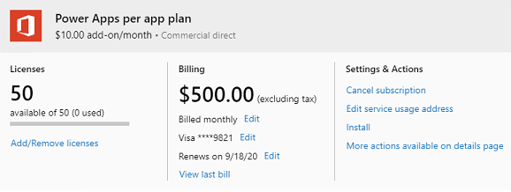

# About Power Apps per app plans

Power Apps per app plan allows individual users to run **two applications** and **one portal** for a specific business scenario in a **specific environment** based on the full capabilities of Power Apps. This plan provides an easy way for users to get started with Power Apps before broader scale adoption. These are available to purchase from the Office admin center and you can allocate add-ons in the [Capacity](https://admin.powerplatform.microsoft.com/resources/capacity) area in the Power Platform admin center. More information: [Capacity add-ons](capacity-add-on.md).

The following release plan topic announces the availability of this feature: [New licensing options for Power Automate standalone paid plans](https://docs.microsoft.com/power-platform-release-plan/2019wave2/power-automate/new-licensing-options-power-automate-standalone-paid-plans).

> [!IMPORTANT]
> Although, Power Apps per app plans appear in the [Microsoft 365 admin center](https://admin.microsoft.com), you shouldn't attempt to assign them to users there. Power Apps per app plans must be allocated to an environment (and not to users) by an admin in the [Power Platform admin center](https://admin.powerplatform.microsoft.com). 
>
> After per app plans are allocated to an environment, they are assigned when apps are shared with users in the environment.
>
> You cannot assign Power Apps per app plan baseline access licenses to users in a trial environment.

## Steps for using per app plans 

There are three steps to follow to use a per app plan:

1. Purchase Power Apps per app plans
2. Allocate per app plans to environments
3. Set up apps to use per app plans
4. Share the app

## Step one: Purchase per app plans

You can purchase per app plans from your sales channel or in the [Microsoft 365 admin center](https://admin.microsoft.com).

> [!div class="mx-imgBorder"] 
> 

You can see your purchased plan in the Microsoft 365 admin center (**Billing** > **Your products**).

> [!div class="mx-imgBorder"] 
> 

Once you've made your purchase, there are no further actions needed in the Microsoft 365 admin center such as license assignment since this license is not assigned to users but rather to environments.

## Step two: Allocate per app plans

After purchase, you allocate per app plans to environments. If you have multiple environments like test and production, you need to allocate per app plans capacity to all these environments appropriately.

In the [Power Platform admin center](https://admin.powerplatform.microsoft.com), select **Resources** > **Capacity** in the left-side navigation pane. If your organization has purchased add-ons that includes per app plans, an **Add-ons** tile appears on the **Capacity** screen displaying summary information about the capacity add-ons that your organization has.


To allocate add-ons, select **Manage**. For detailed information, see [Allocate or change capacity in an environment](capacity-add-on.md#allocate-or-change-capacity-in-an-environment).

> [!NOTE]
> As an admin, you can restrict who can allocate add-on capacity to environments. More information: [Control who can allocate add-on capacity](capacity-add-on.md#control-who-can-allocate-add-on-capacity)
>
> If there are users who want to transition to per app, follow the two steps below in order
> 1. Allocate capacity of the per app licenses to the required environment.
> 2. Remove any user license from the user.

## Step three: Set up apps to use per app plans

After an admin allocates Power Apps per app plan to an environment, they're assigned to unlicensed users when an app in that environment is shared with them. 

Follow these steps to turn off assigning per app plans for users when an app is shared with them:

1. Choose the app in [Power Apps](https://make.powerapps.com).

2. Select **...** > **Settings**.

   

3. Under **Pass assignment**, change the **Auto assign per app passes** toggle to **Yes**. The **Auto assign per app passes** toggle appears in all app setting.

   

> [!IMPORTANT]
> Turning off the per app plan is currently available only for canvas apps. Model-driven apps and portals will have this ability in the future.
>
> For the time being, "Ad-hoc subscription" consent plans must be enabled for an organization's tenant. An ad-hoc subscription refers to trial licenses that can be assigned by admins to users via Azure Active Directory (Azure AD) or the Microsoft 365 admin portal, or that users can sign themselves up for via https://signup.microsoft.com. End users that receive a per app plan also receive an "ad-hoc" Power Apps baseline access plan. This plan ensures users can launch apps shared with them when they're expected to be entitled access via a per app plan. The requirement for ad-hoc subscription consent plans will be removed in the future. [This documentation](powerapps-powershell.md#block-trial-licenses-commands) outlines how ad-hoc subscription consent plans are blocked and unblocked for an organization.

### Check capacity
Check the **App passes** capacity for the environment with the app you're sharing. Make sure you have sufficient app passes assigned for the number of users using the app.

Go to **Resources** > **Capacity** > **Add-ons** tab.

> [!div class="mx-imgBorder"] 
> 

## Step four: Share the app

After completing the first three steps, you can now share apps. 

### Sharing model-driven apps

Share the model-driven app. See [Share a model-driven app with Power Apps](https://docs.microsoft.com/powerapps/maker/model-driven-apps/share-model-driven-app). 

> [!IMPORTANT]
> When the user launches the app, we create the user in the required Common Data Service environment. Users will not get added at the time of app sharing.

### Sharing canvas apps
To share canvas apps, see [Share a canvas app in Power Apps](https://docs.microsoft.com/powerapps/maker/canvas-apps/share-app).  

## Consumption of per app licensing

The per app license gives a user access to two Power Apps and one portal for a single environment. See the table below for an example of the consumption of licenses by the number of applications and the environments used. 

:::image type="content" source="media/per-app-license-consumption.png" alt-text="Per app license consumption example":::

> [!NOTE]
> Sharing an app with a user consumes the per app capacity. 
> 
> The consumption reporting for the per app license is a work in progress. Please check back for more details once the reporting is launched. 

## Known issues

### Reducing per app capacity to zero
If you allocate per app capacity to an environment and later reduce per app capacity to zero, users that were added to Common Data Service while per app capacity was greater than zero will **not** get disabled in Common Data Service. However, these users won’t be able to launch apps since there is no per app capacity allocated to the environment. Admins should remove the role of the user they do not intend to access the platform.

### Disabled user account

If a user account is disabled in an environment, adding per app capacity, sharing the app with the user, and the user launching the app will **not** enable the user. We are working to address this issue. 

## FAQ

### I assigned the baseline access license to my users as a workaround suggested earlier. Now that this workaround is not needed, what should I do to ensure my users are setup correctly? 
Ensure that the per app capacity is allocated to the environment. After this step, you can remove the baseline access license from the user using [these instructions](https://signup.microsoft.com/signup?sku=bf666882-9c9b-4b2e-aa2f-4789b0a52ba2). 

### What happens if I assign a user the Power Apps per user license when earlier they were using apps by consuming the per app license? 
Once the user is allocated a Power Apps per user license, when per app license consumption reports are available they will show per app licenses aren’t consumed by users that are assigned a per user plan.

### When will I be able to see the list of users who are using the Power Apps per app license?
We are currently working on this report. Please check back again for more details. This report will be available in the Power Platform admin center. 

### What are the differences in the admin experience between the Power App per app and the Power App per user license?
Power Apps per user plan is a user license assigned by admins from https://admin.microsoft.com. Once the user has this license they can access any number of Power Apps apps. However, the Power Apps per app plan provides a capacity to run apps and the management experience for this license is in the Power Platform admin center. The license is assigned to users when apps in the environment are shared with them. Admins allocate the capacity of per app to an environment and the makers share the app with users. This sharing consumes the per app capacity. Once the reporting is available, admins can see the users who are consuming capacity in the Power Platform admin center and not in the Microsoft 365 admin center.

### Can I assign Power Apps per app plans in the Microsoft 365 admin center (admin.microsoft.com)? 
No. Although after purchasing Power Apps per app plans they appear in [https://admin.microsoft.com](https://admin.microsoft.com), they shouldn't be assigned to users in this website. Power Apps per app plans are to be allocated to an environment by an admin in [https://admin.powerplatform.microsoft.com](https://admin.powerplatform.microsoft.com). After per app plans are allocated to an environment, the plans are assigned to users when apps are shared with users in the environment.

### For users expected to use a Power Apps per app plan, why are they prompted to start a trial after signing in to <https://make.powerapps.com>?

<https://make.powerapps.com> is being updated to not require a license to begin making an app. Licenses are required for users to run apps.

### For users expected to use a Power Apps per app plan, why are they prompted to start a trial when attempting to create a premium connection?

<https://make.powerapps.com> is being updated to not require a license to begin making an app. Licenses are required for users to run apps.

### For users expected to use a Power Apps per app plan, why are users that use an app shared with them prompted to start a Power Apps trial? 

For users to run Power Apps apps they must have a license, this includes being assigned a trial, per user plan or be accessing an app in an environment with Power Apps per app plan allocation. 
<!-- 
Users are receiving trial prompts because Power Apps per app plan is currently dependent on a $0 ad-hoc subscription license being assigned to any user that will utilize a per app plan. The ad-hoc subscription license is called "Power Apps per app baseline access". When users access a canvas app for the first time, the platform attempts to auto-assign this to users so no action is required by a Power Platform admin or an end user. The auto assignment fails when the [AllowAdHocSubscription](https://docs.microsoft.com/powershell/module/msonline/set-msolcompanysettings?view=azureadps-1.0#parameters) flag is set to false at the tenant level or [Remove-AllowedConsentPlans -Types "Internal"](https://docs.microsoft.com/power-platform/admin/powerapps-powershell#block-trial-licenses-commands) has been executed for the tenant. When the Power Apps per app baseline access license isn't assigned to a user, the Power Apps client prompts the user to start a trial to get an entitlement. 

**Mitigation steps**:

For customers that want to use a Power Apps per app plan and they have the *AllowAdHocSubscriptions* flag set to false, admins should do the following. 

1. Turn on, at least temporarily, ad-hoc subscriptions. Run the following PowerShell command: 
  
   > ```powershell
   > Set-MsolCompanySettings -AllowAdHocSubscriptions $true 
   > ```

   [Documentation for this PowerShell cmdlet](https://docs.microsoft.com/powershell/module/msonline/set-msolcompanysettings?view=azureadps-1.0#parameters)

2. Add to your tenant the required ad-hoc subscription to use a Power Apps per app plan by selecting the following link and completing the sign-up process: [https://signup.microsoft.com/signup?sku=bf666882-9c9b-4b2e-aa2f-4789b0a52ba2](https://signup.microsoft.com/signup?sku=bf666882-9c9b-4b2e-aa2f-4789b0a52ba2). 

3. You are now able to assign the Power Apps per app baseline access license to all users expected to use a Power Apps per app plan. Assigning the baseline access plan can be done in [https://portal.azure.com](https://portal.azure.com) or [https://admin.microsoft.com](https://admin.microsoft.com). 

4. You can assign the Power Apps per app baseline access individually to users or assign the license to a security group that contains all users that will receive a Power Apps per app plan. 

5. This step is optional, at this point the admin can turn off AllowAdHocSubscriptions for their tenant by using the following command: 

   > ```powershell
   > Set-MsolCompanySettings -AllowAdHocSubscriptions $false
   > ```

6. Execute the following command, if viral consent plans were previously removed: [Add-AllowedConsentPlans -(Types @("Viral")](https://docs.microsoft.com/power-platform/admin/powerapps-powershell#block-trial-licenses-commands)

   Viral licenses can be assigned to a user either by an admin or by non-admins that assign these licenses to themselves. The ability for a non-admin to assign the license themselves is controlled by [AllowAdHocSubscriptions](https://docs.microsoft.com/azure/active-directory/users-groups-roles/directory-self-service-signup). 

   If AllowAdHocSubscriptions is off and viral consent plans are allowed, end-users can use viral licenses already assigned to them but won't be able to sign up for viral licenses on their own. 
-->

### Why are makers prompted to start a trial when creating a premium connection using gateways? 
This is an artifact of previous, but no longer required, licenses being assigned to Power Apps makers. This license check and prompt to start a trial will eventually be removed. 

**Mitigation steps**:
The maker should sign up for the trial to proceed with creating the connection that uses a gateway. 
