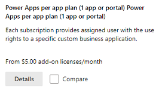

# About Power Apps per app plans

Power Apps per app plan allows individual users to run one application or portal for a specific business scenario in a **specific environment** based on the full capabilities of Power Apps. This plan provides an easy way for users to get started with Power Apps before broader scale adoption. These are available to purchase from the Office admin center and you can allocate add-ons in the [Capacity](https://admin.powerplatform.microsoft.com/resources/capacity) area in the Microsoft Power Platform admin center.More information: [Capacity add-ons](capacity-add-on.md).

> [!IMPORTANT]
> - Although, Power Apps per app plans appear in the [Microsoft 365 admin center](https://admin.microsoft.com), you shouldn't attempt to assign them to users there. Power Apps per app plans must be allocated to an environment (and not to users) by an admin in the [Power Platform admin center](https://admin.powerplatform.microsoft.com). After per app plans are allocated to an environment, they are assigned when apps are shared with users in the environment.
> - Power Apps for Windows isn't supported if you have the Power Apps per app plan.

## Steps for using per app plans 

There are three steps to follow to use a per app plan:

1. Purchase Power Apps per app plans
2. Allocate per app plans to environments
3. Set up apps to use per app plans
4. Share the app

## Step one: Purchase per app plans

You can purchase per app plans from your sales channel or in the [Microsoft 365 admin center](https://admin.microsoft.com).

> [!div class="mx-imgBorder"] 
> 

You can see your purchased plan in the Microsoft 365 admin center (**Billing** > **Your products**).

Once you've made your purchase, there are no further actions needed in the Microsoft 365 admin center such as license assignment since this license is not assigned to users but rather to environments.

## Step two: Allocate per app plans

After purchase, you allocate per app plans to environments. If you have multiple environments like test and production, you need to allocate per app plans capacity to all these environments appropriately.

In the [Power Platform admin center](https://admin.powerplatform.microsoft.com), select **Resources** > **Capacity** in the left-side navigation pane. If your organization has purchased add-ons that includes per app plans, an **Add-ons** tile appears on the **Capacity** screen displaying summary information about the capacity add-ons that your organization has.

To allocate add-ons, select **Manage**. For detailed information, see [Allocate or change capacity in an environment](capacity-add-on.md#allocate-or-change-capacity-in-an-environment).

> [!NOTE]
> As an admin, you can restrict who can allocate add-on capacity to environments. More information: [Control who can allocate add-on capacity](capacity-add-on.md#control-who-can-allocate-add-on-capacity)
>
> If there are users who want to transition to per app, follow the two steps below in order:
> 1. Allocate capacity of the per app licenses to the required environment.
> 2. Remove any user license from the user.

## Step three: Set up apps to use per app plans

After an admin allocates Power Apps per app plan to an environment, they're assigned to unlicensed users when an app in that environment is shared with them. 

Follow these steps to turn off assigning per app plans for users when an app is shared with them:

1. Choose the app in [Power Apps](https://make.powerapps.com).

2. Select **...** > **Settings**.

   

3. Under **Pass assignment**, change the **Auto assign per app passes** toggle to **Yes**. The **Auto assign per app passes** toggle appears in all app setting.

   

> [!IMPORTANT]
> If per app plans are not allocated to the environment the app is installed in, the toggle is disabled. 
> 
> Turning off the per app plan is currently available only for canvas apps. Model-driven apps and portals will have this ability in the future.

### Check capacity
Check the **App passes** capacity for the environment with the app you're sharing. Make sure you have sufficient app passes assigned for the number of users using the app.

Go to **Resources** > **Capacity** > **Add-ons** tab.

> [!div class="mx-imgBorder"] 
> 

## Step four: Share the app

After completing the first three steps, you can now share apps. 

### Sharing model-driven apps

Share the model-driven app. See [Share a model-driven app with Power Apps](/powerapps/maker/model-driven-apps/share-model-driven-app). 

> [!IMPORTANT]
> When the user launches the app, we create the user in the required Microsoft Dataverse environment. Users will not get added at the time of app sharing.

### Sharing canvas apps
To share canvas apps, see [Share a canvas app in Power Apps](/powerapps/maker/canvas-apps/share-app).  

## Consumption of per app licensing

The per app license gives a user access to one Power Apps or one portal for a single environment. See the table below for an example of the consumption of licenses by the number of applications and the environments used. 

<table>
<thead>
  <tr>
    <th></th>
    <th colspan="3">Environment 1</th>
    <th colspan="3">Environment 2</th>
    <th>Per app licenses consumed</th>
  </tr>
</thead>
<tbody>
  <tr>
    <td>User 1</td>
    <td>App A</td>
    <td>App A</td>
    <td>Portal 1</td>
    <td></td>
    <td></td>
    <td></td>
    <td>3</td>
  </tr>
  <tr>
    <td>User 2</td>
    <td>App A</td>
    <td>App B</td>
    <td></td>
    <td>App C</td>
    <td>App D</td>
    <td>Portal 2</td>
    <td>5</td>
  </tr>
  <tr>
    <td>User 3</td>
    <td>App A</td>
    <td></td>
    <td></td>
    <td>App C</td>
    <td></td>
    <td></td>
    <td>2</td>
  </tr>
</tbody>
</table>

> [!NOTE]
> - Sharing an app with a user consumes the per app capacity. 
> - Each user is required to have a license. 
> - The consumption reporting for the per app license is a work in progress. Please check back for more details once the reporting is launched. 

## Known issues

### Reducing per app capacity to zero
If you allocate per app capacity to an environment and later reduce per app capacity to zero, users that were added to Dataverse while per app capacity was greater than zero will **not** get disabled in Dataverse. However, these users won’t be able to launch apps since there is no per app capacity allocated to the environment. Admins should remove the role of the user they do not intend to access the platform.

## FAQ

### Has per app licensing changed? I thought that each app pass granted a user access to two apps and one portal?  

Yes. Prior to October 2021 each app pass granted a user access to two apps and one portal. In order to simplify the Per App model, starting in October 2021 each app pass will grant a user access to one app or portal.  

Customers with existing per app plan subscriptions purchased prior to October 1, 2021 will maintain the current entitlement for the duration of their agreement term. Each existing per app plan license will now receive a total of three app passes, entitling users to continue accessing up to two apps and one portal. These app passes will be available for allocation to an environment and assignment to users beginning in October 2021. Power Apps per app plan subscriptions purchased after October 1, 2021 will receive one app pass for each license, entitling assigned users to access one app or one portal.  

### I assigned the baseline access license to my users as a workaround suggested earlier. Now that this workaround is not needed, what should I do to ensure my users are setup correctly? 
As of October, 2020, the baseline access license is no longer required. Ensure that the per app capacity is allocated to the environment. After this step, you can remove the baseline access license from the user using [these instructions](/microsoft-365/admin/manage/remove-licenses-from-users?view=o365-worldwide). 

### What happens if I assign a user the Power Apps per user license when earlier they were using apps with the per app license? 
Once the user is allocated a Power Apps per user license, per app license consumption reports will show per app licenses aren’t being consumed.

### When will I be able to see the list of users who are using the Power Apps per app license?
We are currently working on this report. Please check back again for more details. This report will be available in the Power Platform admin center. 

### What are the differences in the admin experience between the Power App per app and the Power App per user license?
Power Apps per user plan is a user license assigned by admins from https://admin.microsoft.com. Once the user has this license they can access any number of Power Apps apps. However, the Power Apps per app plan provides a capacity to run apps and the management experience for this license is in the Power Platform admin center. The license is assigned to users when apps in the environment are shared with them. Admins allocate the capacity of per app to an environment and the makers share the app with users. This sharing consumes the per app capacity. Once the reporting is available, admins can see the users who are consuming capacity in the Power Platform admin center and not in the Microsoft 365 admin center.

### Can I assign Power Apps per app plans in the Microsoft 365 admin center (admin.microsoft.com)? 
No. Although after purchasing Power Apps per app plans they appear in [https://admin.microsoft.com](https://admin.microsoft.com), they shouldn't be assigned to users in this website. Power Apps per app plans are to be allocated to an environment by an admin in [https://admin.powerplatform.microsoft.com](https://admin.powerplatform.microsoft.com). After per app plans are allocated to an environment, the plans are assigned to users when apps are shared with users in the environment.

### Why are makers prompted to start a trial when creating a premium connection using gateways? 
This is an artifact of previous, but no longer required, licenses being assigned to Power Apps makers. This license check and prompt to start a trial will eventually be removed. 

**Mitigation steps**:
The maker should sign up for the trial to proceed with creating the connection that uses a gateway. 

### Are users with a disabled account in an environment able to use per app plan? 
Yes. If a user account is disabled in an environment, there are three different mitigation steps that may be followed.

**Mitigation steps**
1. Add per app capacity to an environment, add disabled users to an Azure AD security group, share the app with the security group, and the user launching the app will be enabled in the environment.
2. Add per app capacity and use the following PowerShell cmdlet to 'force sync' disabled users will enable these users in the environment. An admin can run the [Add-AdminPowerAppsSyncUser](https://docs.microsoft.com/powershell/module/microsoft.powerapps.administration.powershell/add-adminpowerappssyncuser?view=pa-ps-latest) PowerShell cmdlet to enable disabled users in an environment.
3. Add per app capacity to an environment, use [this Power Automate flow template](https://us.flow.microsoft.com/galleries/public/templates/6e4162ca7afc48479e3ad1caadc6c1e6/force-sync-azure-active-directory-group-members-to-specified-cds-instance/) to enable many disabled users in an environment an admin can  to run the force sync operation to enable users. 

[!INCLUDE[footer-include](../includes/footer-banner.md)]
