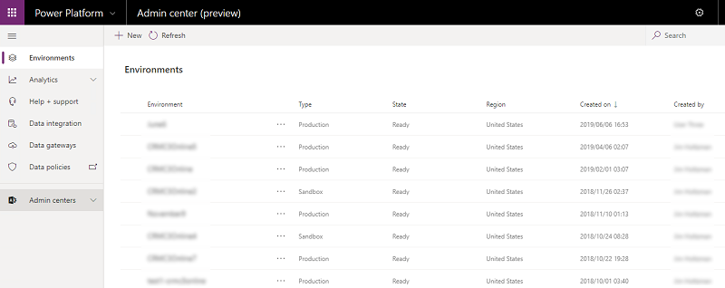

# About settings

Multiple factors determine what feature settings you use to configure your Dynamics 365 apps and environments and where those settings are located.

Getting to feature settings can vary based on the type of app you're using and whether you're managing your environment settings in the Dynamics 365 Admin center of the Power Platform Admin center. This topic provides guidance on how to access feature settings 

## Environment settings in the Power Platform Admin center

Currently in Preview, the Power Platform Admin center is the place to create and manage PowerApps environments.

> [!div class="mx-imgBorder"] 
> 

## Instance settings in the Dynamics 365 Admin center

You can still 

## Settings in legacy web client apps

Legacy web clients look like the following:

<image of legacy web client with Settings tab>

To view settings, go to **Settings** and then pick the feature setting to configure.

## Settings in Unified Interface apps

