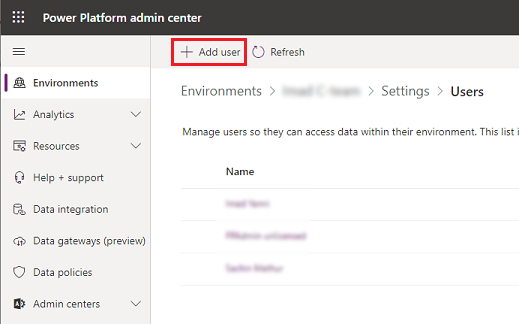
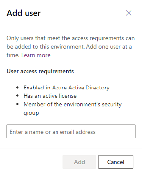

# About the Project Oakdale environment (Preview)
<!-- fwlink 2143567 -->

[!INCLUDE [cc-beta-prerelease-disclaimer.md](../includes/cc-beta-prerelease-disclaimer.md)]

Introduced in September, 2020, *Project Oakdale* is a built-in, low-code data platform for Microsoft Teams that empowers users to build custom apps and workflows in Teams by using Power Apps and Power Automate. Project Oakdale—built on Common Data Service—provides relational data storage, rich data types, enterprise-grade governance, and one-click solution deployment to the Teams app store.

The Project Oakdale environment is automatically created for the selected team when you [create an app](/powerapps/teams/create-first-app) with the new Power Apps app in Teams for the first time or install a Power Apps app from the app catalog for the first time. The Project Oakdale environment is used to store, manage, and share team-specific data, apps, and flows. Each team can have one environment, and all data, apps and flows created with the Power Apps app inside a team are available from that team's [Project Oakdale](/powerapps/teams/overview-data-platform) database.  

> [!NOTE]
> - This is a preview feature
> - [!INCLUDE [cc-preview-features-definition.md](../includes/cc-preview-features-definition.md)]
> - The capability to promote Project Oakdale environments to Common Data Service won’t be available at public preview, but is expected to be available by general availability (GA).

You can identify a Project Oakdale environment in the [Power Platform admin center](https://admin.powerplatform.microsoft.com) by using the **Type** column in the list of environments.

> [!div class="mx-imgBorder"] 
> 

## Licensing and restrictions

Note the following regarding access to Microsoft Power Platform apps in Teams.

- Project Oakdale capabilities will be available as part of select Microsoft 365 subscriptions. See the [Microsoft 365 licensing](https://www.microsoft.com/licensing/product-licensing/microsoft-365-enterprise?activetab=m365-enterprise:primaryr5).

- Teams can invite guests who can access the apps, flows, and data in the Teams Project Oakdale database within their team. However, they won't be allowed to install, make, or edit apps. They can only discover and run apps in their team. 

- Apps created in Teams that use Project Oakdale will only be accessible in Teams and Teams Mobile, regardless of the user's license.  

- For any standalone Power Apps or Power Automate usage, which includes API access as well, the Project Oakdale schema will need to be promoted to Common Data Service.  

- No direct API access or pro developer experience will be provided, and only Power Apps embedded within the Teams client will be able to access the runtime.

See also: [Project Oakdale licensing FAQs](powerapps-flow-licensing-faq.md#project-oakdale)

## Admin experience

Tenant owners and members will be allowed to create their first app template or create a blank table app for the team. More information: [Project Oakdale tables: Overview](https://docs.microsoft.com/powerapps/teams/create-table)

Team owners will be allowed to delete a team associated with a Project Oakdale environment, which will trigger the deletion of that environment.

## Environment lifecycle

This section provides a summary of key lifecycle operations that will be allowed with Project Oakdale environments.

> [!NOTE]
> The Project Oakdale environment name is the same as the team name. You can filter the list of environments in the Power Platform admin center to show just Project Oakdale environments.

|Operations  |Feature description  |Available in preview  |
|---------|---------|---------|
|Backup     | Automated backups and labeled backups can be taken. Admins can view them in the Power Platform admin center. Backups will be available for up to 7 days.        |  Yes       |
|Restore     | Only point-in-time restores to the same environment will be possible. Note: if the environment has been promoted, the point-in-time restore will only be available starting from the moment it was promoted. | Yes        |
|Copy     | Not available by default for Project Oakdale environments.        | No        |
|Create     | Only through Teams. Note: these Project Oakdale environments will be limited to a 1:1 mapping to the Teams team it was created in and bound to the Microsoft 365 group associated with the team.        | No        |
|Delete     | The environment can be deleted by the team owner. Note: the environment will be deleted automatically if the team it was created in is also deleted.| Yes  |
|Reset     | Not available by default for Project Oakdale environments.        | No        |
|Promote     | Unlocks all the functionality of Common Data Service services for the environment.         | Yes        | 

The lifetime of the environment will be tied to the team it was created in. If you promote an environment to Common Data Service, the 1:1 mapping isn't guaranteed because the environment can now be used by applications outside of Teams. The promoted environment is bound by the lifecycle rules associated with the Power Apps license and the configuration of the environment.

Some operations are blocked by default, such as the Copy and Reset operations. For scenarios where you need this capability, use Common Data Service environments. See the previous table for details.

> [!IMPORTANT]
> Project Oakdale environments won't be allowed to change types until the promote operation has been carried out on the environment. After the promotion is complete, the Project Oakdale environment will have the full capabilities found in Common Data Service. In addition to the standard termination of the environments, if the Microsoft Office license expires, there will also be an inactivity clause for these environments. Specifically, when an environment is unused for over three months, it will be disabled and ultimately deleted. 
>
> If the team is deleted, the Project Oakdale environment that was created will also be deleted. The Project Oakdale environment itself may be deleted from within the team by the team owner. A warning will be provided prior to allowing the deletion to go through, to ensure there are no accidental deletions. 

## User access to Project Oakdale environments

In an environment such as Teams that can be collaborative in the development and use of apps, bots, and data, it's important to understand how access is granted to the different types of roles within the service.

This section summarizes user access to Project Oakdale environments and resources.

### User access requirements

For users to access Project Oakdale environment apps, bots, and data, they must:

- [Be enabled in Azure Active Directory](create-users-assign-online-security-roles.md#create-a-user-account).
- Have an active Microsoft 365 license with a plan that includes Project Oakdale.
- Be a member of the environment's security group.

### Conceptual model

Every team in Teams is linked 1:1 to a [Microsoft 365 group](https://docs.microsoft.com/microsoft-365/admin/create-groups/office-365-groups?view=o365-worldwide).

Microsoft 365 Groups supports two user membership types: owners and members. Members can be users from the customer's own tenant or from a guest tenant. Any user management (addition, removal, user type change) made in a team will be reflected in the Microsoft 365 group, and vice versa.

Access to a Project Oakdale environment and its resources (apps, data) will be restricted to users in the team. The Microsoft 365 group linked to a team will be automatically associated with the Project Oakdale environment, restricting access to users of that Microsoft 365 group. This Microsoft 365 Groups association with the Project Oakdale environment won't be editable until the environment is promoted to Common Data Service. 

### Role assignments 

<table style="width:100%">
<tr>
<th>Persona</th>
<th>Description</th>
<th>Security role auto-assigned</th>
</tr>
<tr>
<td width="20%"> Teams owner </td>
<td width="50%"> Owners can manage team membership and settings in the team. They have full access to the Project Oakdale environment's apps, resources, and data. They can perform environment maintenance tasks such as backup and restore through the Power Platform admin center.</td>
<td width="30%"> System Administrator   </td>
</tr>
<tr>
<td width="20%"> Teams member </td>
<td width="50%"> Members can view the Project Oakdale environment's resources, run all apps and resources, and create or update their own resources. They have full access to all data. </td>
<td width="30%"> Teams member </td>
</tr>
<tr>
<td width="20%"> Teams guest</td>
<td width="50%">  Guests are people from outside the tenant that a team owner invites, such as a partner or a customer. They can view and run all resources in the team. By default, guests have full access to records they create and don't have access to other users' records. </td>
<td width="30%"> Teams guest</td>
</tr>
<tr>
<td width="20%"> Global admin / Power Platform admin who isn't in the team</td>
<td width="50%"> These are tenant-level admins who manage the health and maintenance of the tenant's environments. They need not be members of the team, but through their tenant-level admin privileges they can perform environment maintenance tasks such as backup and restore for all Project Oakdale environments. They are set to the Administrative access mode as opposed to the Read-Write access mode if they aren't in the team, so they'll only have Administrative access to the Project Oakdale environments. They can be explicitly given Read-Write access by another admin who already has Read-Write access to the environment.  </td>
<td width="30%"> System Administrator  </td>
</tr>
<tr>
<td width="20%"> Colleagues with access </td>
<td width="50%"> Colleagues with access are people in the tenant who aren't in the team but have been invited to run apps in the team. By default, colleagues with access have no access to data. Their data access rights can be granted based on the app or resources that they need to run. Note: when a colleague with access is invited to run apps in a team, the Microsoft 365 group association with the team's Project Oakdale environment will be automatically removed to allow app run access to the colleague with access. </td>
<td width="30%"> Common Data Service User</td>
</tr>
<tr>
<td width="20%"> Dynamics 365 admin who isn't in the team (that is, isn't in the Microsoft 365 group) </td>
<td width="50%"> These admins won't have access to manage the health and maintenance of the team environment.   </td>
<td width="30%"> No access, because a Project Oakdale environment will always have the team's Microsoft 365 group associated with it, and Dynamics 365 Service admins are excluded from environments for which they aren't in the associated group.  </td>
</tr>
</table>

> [!NOTE]
> [Record sharing](wp-security-cds.md#record-sharing) isn't supported in Project Oakdale.  You can't share a record with another user or team.

## Project Oakdale environments settings and actions
<!-- fwlink 2133713 2134780(settings) 213924(backup/restore) -->

To change settings for a Project Oakdale environment, go to **Environments** > [select a Project Oakdale environment] > **Settings**.

> [!div class="mx-imgBorder"] 
> 

### Users + permissions
<!-- fwlink 2123134 2127762 -->

You can specify users in an environment to provide access to Project Oakdale environment apps, bots, and data.

1. In the [Power Platform admin center](https://admin.powerplatform.microsoft.com), select **Environments** on the left pane, and then select a Project Oakdale environment.

2. Select **Settings**.

3. Select **Users + permissions**, and then select **Users**.

4. You'll see a list of enabled and disabled users who are members of the Project Oakdale environment. You can select a user from the list to run diagnostics and view their access details and status.

   > [!div class="mx-imgBorder"] 
   >  

5. Select **+ Add user** to add a tenant user to the selected Project Oakdale environment. 

   > [!div class="mx-imgBorder"] 
   >  

6. Enter a name or email address of a user who meets the [user access requirements](#user-access-requirements) to add the user to the Project Oakdale environment, and then select **Add**.

   > [!div class="mx-imgBorder"] 
   >  

7. Select **Refresh** to see the added user in the list.

### Microsoft Teams Integration
<!-- fwlink 2134886 2132800 -->

Tenant admins can select **Microsoft Teams Integration** to enable embedding model-driven apps into Teams. After making this selection, users can use model-driven apps in Teams without using customer engagement apps (Dynamics 365 Sales, Dynamics 365 Customer Service, Dynamics 365 Field Service, Dynamics 365 Marketing, and Dynamics 365 Project Service Automation).

> [!IMPORTANT]
> Model-driven apps can execute code that may not be generated by Microsoft. Make sure that the code for the apps in this environment are from a trusted source.

### Delete a Project Oakdale environment

To delete a Project Oakdale environment, select it from the list of environments and then select **Delete**.

> [!div class="mx-imgBorder"] 
> 

### Promote a Project Oakdale environment to production

Select **Promote to production**. See [Promotion process](#promotion-process).

## Capacity limits

The consumption of capacity by Project Oakdale environments won't count towards the tenant's capacity limits. Instead, we'll provide a pool of capacity for Project Oakdale environments, which will be separate from the tenant's Microsoft Power Platform Common Data Service capacity pool. Capacity won't be transferable between these two pools.  

**Per-environment limits on Project Oakdale environments**: Each Project Oakdale environment provides 2 GB of combined database and file storage, with a portion of this amount reserved for system use. To see the consumption of each Project Oakdale environment in a tenant, go to the Power Platform admin center (https://aka.ms/ppac), then to **Resources** > **Capacity** > **Microsoft Teams Capacity**.

> [!div class="mx-imgBorder"] 
> 

**Tenant-wide limits on Project Oakdale environments**: Each tenant will also have limits related to Project Oakdale environments defined in the following table. 

|Unit  |Service limit  |
|---------|---------|
|Project Oakdale environments      | 5 + 1 per 20 eligible office seats (up to a maximum of 500 environments)   This limit on the number of environments can't be extended further. Should more instances be needed, consider deleting unused environments or promoting to environments to Common Data Service.   |
|Max Project Oakdale environment storage per tenant      | 10 GB + Project Oakdale environments &times; 2 GB (up to a max of 1 TB).   This storage limit can't be extended further. Should more storage be needed, consider promoting environments to Common Data Service.  |
|Max Project Oakdale environments API calls  | API requests in Microsoft Power Platform consist of various actions that a user makes across various products.    For more information about API calls and the per-user limits available, go to [Microsoft Power Platform request entitlements](https://aka.ms/PowerPlatformRequestEntitlements). |

### Enforcement

The following actions will be taken when customers approach and exceed the environment-level or tenant-wide Teams limits. 

#### Environment-level enforcement actions  

> [!NOTE]
> These environment-level enforcement actions won't be in place for the preview, but will take effect at general availability. 

When a Project Oakdale environment in a team approaches or reaches the 2 GB capacity limit, the following actions will be taken: 
- At 80 percent of the limit, the Teams users will see in the Teams maker experience a message informing them the capacity limit is about to be reached. At this point, customers are encouraged to either reduce storage usage or contact their admin for other options.  
- At 100 percent of the limit, any existing apps will continue to work and existing apps can be updated. However, new apps and flows can't be created or installed as a result of having reached the capacity limit. 

#### Tenant-level enforcement  

> [!NOTE]
> These tenant-level enforcement actions will take effect in the preview starting in mid-October 2020.

When a tenant approaches or reaches their tenant-wide Teams limits described earlier, the following actions will be taken: 
- At 80 percent of the limit, a notification that capacity is reaching its limit will be sent to the Power Platform center admin. The admin will be encouraged to consider reducing storage usage or promoting some of the Project Oakdale environments.
- At 100 percent of the limit, the creation of new Project Oakdale environments will be blocked. Any users attempting to create a new Project Oakdale environment will be prompted to contact the tenant admin as the result of the capacity limit being reached. Additionally, new apps and flows won't be allowed to be created or installed in an existing Project Oakdale environment.  

As mentioned for the environment-level enforcement, any existing apps will still be able to function as expected.  

## Promotion process 
<!-- fwlink 2122620 for failure need 1GB -->
<!-- fwlink 2134779 for for a few thing to know -->

> [!IMPORTANT]
> The capability to promote Project Oakdale environments to Common Data Service won’t be available at public preview, but is expected to be available by general availability (GA).
 
The high-level flow and business rules for promoting a Project Oakdale environment follow. 

A tenant admin will be allowed to promote a Project Oakdale environment to a Common Data Service database environment. A typical flow is as follows:  

:::image type="content" source="media/teams-environment-promotion-process.png" alt-text="Project Oakdale environment promotion process":::

1. Within a team, the Teams user chooses to create an app by using the new integrated Power Apps app creation experience in Teams, or by installing an existing Project Oakdale environment-based app. At this point, a Project Oakdale environment is provisioned for that team.  

2. Over time, the data stored in the Project Oakdale environment will grow and eventually reach the capacity limit that these environments have (2 GB). At this point, existing apps will continue to operate but new applications won't be allowed to be created or installed. Customers will be directed to contact a tenant admin to promote the Project Oakdale environments to Common Data Service and obtain more capacity. Alternatively, a Teams user can request that the admin promote the environment because they want to use a certain feature in Common Data Service.  

3. Admins will review the request from the Teams user and make the decision to promote the environment from Teams to Common Data Service. At this point, the admin will go to the Power Platform admin center environments view to execute the promotion.   

   > [!NOTE]
   > To successfully carry out the promotion, the tenant must have at least as much available capacity as the size of the Project Oakdale environment that's being promoted. After its promotion, the consumed capacity of the promoted Project Oakdale environment will start counting towards the tenant's capacity. If an attempt is made to promote a Project Oakdale environment when the tenant doesn't have enough capacity, the promote operation will be blocked and an error message will be displayed.

4. Admins will be given a message with the implications of promoting and asked to confirm the action.  

5. If the admin confirms, the promotion will go forward. As the promotion progresses, various notifications will be provided as the operation transitions through the various states.  

After promotion, the following applies to the newly promoted environment:  
- The promoted environment's lifecycle will no longer be tied to the lifecycle of that team. If the team is deleted, the promoted environment remains. 
- Any apps running on the environment will require Microsoft Power Platform (Power Apps, Power Automate) licenses to be accessed. 
- The apps can run inside and outside of Teams. 
- All existing apps will be associated with the promoted environment (Common Data Service) and can take advantage of the extended set of entities. 
- The promoted environment capacity will start counting against the tenant's Common Data Service capacity. 
- The Microsoft 365 Groups association will become editable. 
- Team owners are assigned the System Admin roles on their environment and can access the environment by using the Power Platform admin center. 
- Adding a new Teams Template app to the former team won't create a new Project Oakdale environment for the team. 

## Disable the ability to create app or bots using Project Oakdale in Teams

With the public preview release of Project Oakdale, the ability to create apps or bots using the new Power Apps and Power Virtual Agents apps is enabled by default in Teams. Admins can disable it by using the app permission policies in Teams. 

In your Microsoft Teams admin center, disable **Power Apps** and **Power Virtual Agents** applications available under **Microsoft Apps**. More information: [Manage app permission policies in Microsoft Teams](https://docs.microsoft.com/microsoftteams/teams-app-permission-policies)

## Known issues

- The "Run diagnostics" feature in the Power Platform admin center for Team owners, members, and guests who do not have Azure Active Directory admin roles like Global Admin, or Power Platform Admin assigned, will show an alert that no security roles have been assigned directly to them. Security roles are auto-assigned by the SYSTEM for Team personas, so this alert can be ignored.
- Teams environments currently show as created by "SYSTEM" within the Power Platform admin center. Once this issue is fixed, existing environments will be retroactively updated to display the correct creator.
- Team owners and members who trigger Teams environment creation can temporarily see the newly created environment in the Power Platform admin center. Once this issue is resolved, team owners will be able to successfully administer their environment and team members will not be able to see the environment in the admin center.

## Related topics

[Power Apps and Teams](https://docs.microsoft.com/powerapps/teams/overview)  
[Power Automate and Teams](https://docs.microsoft.com/power-automate/teams/overview) 
[Power Virtual Agents and Teams](https://aka.ms/pva-teams-docs)

