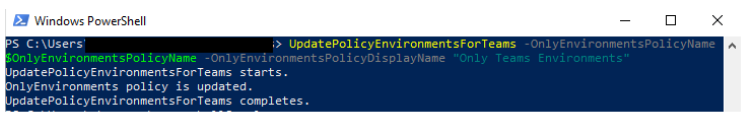
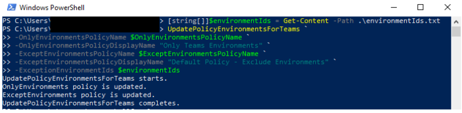
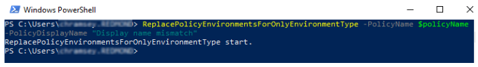

# About the Microsoft Dataverse for Teams environment 

[!INCLUDE[new-PPAC-banner](~/includes/new-PPAC-banner.md)]

<!-- fwlink 2143567 -->

Introduced in September 2020, *Microsoft Dataverse for Teams* is a built-in, low-code data platform for Microsoft Teams that empowers users to build custom apps, agents, and flows in Microsoft Teams by using Power Apps, Microsoft Copilot Studio, and Power Automate. Dataverse for Teams—built on Microsoft Dataverse—provides relational data storage, rich data types, enterprise-grade governance, and one-click solution deployment to the Microsoft Teams app store. More information: [Dataverse for Teams overview](/powerapps/teams/overview-data-platform)

The Dataverse for Teams environment is automatically created for the selected team when you create an [app](/powerapps/teams/create-first-app) or [agent](/microsoft-copilot-studio/fundamentals-get-started-teams) in Microsoft Teams for the first time or install an app created using Power Apps from the app catalog for the first time. The Dataverse for Teams environment is used to store, manage, and share team-specific data, apps, and flows. Each team can have one environment, and all data, apps, agents, and flows created with the app created using Power Apps inside a team are available from that team's Dataverse for Teams database.  

You can identify a Dataverse for Teams environment in the [Power Platform admin center](https://admin.powerplatform.microsoft.com) by checking the **Type** column in the list of environments. Environments where the **Type** is marked as **Microsoft Teams** are Dataverse for Teams environments.

## Licensing and restrictions

Note the following regarding access to Microsoft Power Platform apps in Teams:

- Dataverse for Teams will be available as part of select Microsoft 365 subscriptions with Microsoft Power Platform and Microsoft Teams capabilities, excluding plans for EDU A1 and SUB SKUs. 

- Apps created in Microsoft Teams that use Dataverse for Teams will be accessible outside of Microsoft Teams in a web browser if you have a trial or standalone Power Apps license. However, note the following:
  - Apps created in Teams are not displayed in the list of apps in make.powerapps.com or Power Apps mobile app. The only way to run these apps is to launch them in a web browser from Teams using **Go to website** or **Open in browser** in the Power Apps mobile app.
  - When run outside of Teams, the Teams integration object’s values won’t be available.

- For any standalone Power Apps or Power Automate usage, which also includes Dataverse API access, the Dataverse for Teams environment needs to upgrade to Dataverse.  

- Teams can invite guests who can access the apps, agents, flows, and data in the Dataverse for Teams database within their team. However, they won't be allowed to install, make, or edit apps. They can only discover and run apps in their team.

- No direct API access to Dataverse for Teams is provided, and only apps, agents, and flows embedded within the Microsoft Teams client can access the Dataverse for Teams runtime.

More information: [Dataverse for Teams licensing FAQ](powerapps-flow-licensing-faq.md#dataverse-for-teams)

## Environment lifecycle

This section provides a summary of key lifecycle operations that will be allowed with Dataverse for Teams environments.

> [!NOTE]
> The Dataverse for Teams environment name is the same as the team name. You can filter the list of environments in the Power Platform admin center to show just Dataverse for Teams environments.

|Operations  |Feature description  |Available in GA  |
|---------|---------|---------|
|Backup     | Automated backups and labeled backups can be taken. Admins can view them in the Power Platform admin center. Backups will be available for up to 7 days.        |  Yes       |
|Restore     | Teams environments only support self-restore. Only point-in-time restores to the same environment will be possible. Note: if the environment has been upgraded, the point-in-time restore will only be available starting from the moment it was upgraded. | Yes        |
|Copy     | Not available by default for Dataverse for Teams environments.        | No        |
|Create     | Only through Microsoft Teams. Note: Dataverse for Teams environments will be limited to a 1:1 mapping to the Microsoft Teams team it was created in and bound to the Microsoft 365 group associated with the team.        | No        |
|Delete     | The environment can be deleted by the team owner. The environment will be deleted automatically if the team it was created in is also deleted.| Yes  |
|Reset     | Not available by default for Dataverse for Teams environments.        | No        |
|Upgrade     | Unlocks all the functionality of Dataverse services for the environment.         | Yes        | 

The lifetime of the environment will be tied to the team it was created in. If you upgrade an environment to Dataverse, the 1:1 mapping isn't guaranteed because the environment can be used by applications outside of Microsoft Teams. The upgraded environment is bound by the lifecycle rules associated with the Power Apps license and the configuration of the environment.

Some operations are blocked by default, such as the Copy and Reset operations. For scenarios where you need this capability, use an environment with a Dataverse database. Refer to the previous table for details.

> [!IMPORTANT]
> Dataverse for Teams environments won't be allowed to change types until the upgrade operation has been carried out on the environment. After the upgrade is complete, the Dataverse for Teams environment will have the full capabilities found in Dataverse.  
>
> If the team is deleted, the Dataverse for Teams environment that was created will also be deleted. The Dataverse for Teams environment itself can be deleted from within the team by the team owner. A warning will be provided prior to allowing the deletion to go through, to ensure there are no accidental deletions. 

## User access to Dataverse for Teams environments

In an environment such as Dataverse for Teams that can be collaborative in the development and use of apps, bots, and data, it's important to understand how access is granted to the different types of roles within the service.

This section summarizes user access to Dataverse for Teams environments and resources.

### Conceptual model

Every team in Microsoft Teams is linked 1:1 to a [Microsoft 365 group](/microsoft-365/admin/create-groups/office-365-groups?view=o365-worldwide&preserve-view=true).

Microsoft 365 Groups supports two user membership types: owners and members. Members can be users from the customer's own tenant or from a guest tenant. Any user management (addition, removal, user type change) made in a team is reflected in the Microsoft 365 group, and vice versa.

Access to a Dataverse for Teams environment and its resources (apps, data) is restricted to users in the team. The Microsoft 365 group linked to a team is automatically associated with the Dataverse for Teams environment, restricting access to users of that group. This Microsoft 365 Group association with the Dataverse for Teams environment is not editable until the environment is upgraded to Dataverse.

There's a difference in the models for adding users to an environment with a Dataverse database and adding them to Dataverse for Teams environments. The following table describes the differences.

|Feature  |Dataverse for Teams  |Dataverse  |
|---------|---------|---------|
|Automatic addition of all users in the Microsoft 365 group associated with the environment    |  No       |  Yes       |
|Just-in-time addition of users the first time they access a resource in the environment  |  Yes       |  Yes       |
|On-demand addition of users (refer to [Add users to an environment](add-users-to-environment.md))      |  Yes       |  Yes       |

### Role assignments 

<table width="100%">
<tr>
<th>Persona</th>
<th>Description</th>
<th>Security role auto-assigned</th>
</tr>
<tr>
<td width="20%"> Teams owner </td>
<td width="50%"> Owners can manage team membership and settings in the team. They have full access to the Dataverse for Teams environment's apps, resources, and data. They can perform environment maintenance tasks such as backup and restore through the Power Platform admin center.</td>
<td width="30%"> System Administrator   </td>
</tr>
<tr>
<td width="20%"> Teams member </td>
<td width="50%"> Members can view the Dataverse for Teams environment's resources, run all apps and resources, and create or update all resources. They have full access to all data. </td>
<td width="30%"> Teams Member </td>
</tr>
<tr>
<td width="20%"> Teams guest</td>
<td width="50%">  Guests are people from outside the tenant that a team owner invites, such as a partner or a customer. They can view and run all resources in the team. By default, guests have full access to records they create and don't have access to other users' records. </td>
<td width="30%"> Teams Guest</td>
</tr>
<tr>
<td width="20%"> Global admin / Power Platform admin</td>
<td width="50%"> These are tenant-level admins who manage the health and maintenance of the tenant's environments. They need not be owners or members of the team, but through their tenant-level admin privileges they can perform environment maintenance tasks such as backup and restore for all Dataverse for Teams environments. Similar to Dataverse, these tenant-level admins will have System Administrator privileges with Read-Write access mode to Dataverse for Teams environments. </td>
<td width="30%"> System Administrator  </td>
</tr>
<tr>
<td width="20%"> Dynamics 365 admin </td>
<td width="50%"> These admins need to be owners or members of the team (because every team is linked to a Microsoft 365 group and the Dataverse for Teams environment will always be restricted for access to that Microsoft 365 group) to have System Administrator&ndash;level privileges to manage the health and maintenance of the environment. </td>
<td width="30%"> System Administrator if they are an owner in the team; System Administrator and Teams Member if they are a member in the team. No access if they aren't an owner or member in the team. </td>
</tr>
<tr>
<td width="20%"> Colleagues with access </td>
<td width="50%"> Colleagues with access are people in the tenant who aren't in the team but have been invited to run apps in the team. By default, colleagues with access have no access to data. Their data access rights can be granted based on the app or resources that they need to run. Note: when a colleague with access is invited to run apps in a team, the Microsoft 365 group association with the team's Dataverse for Teams environment will be automatically removed to allow app run access to the colleague with access. </td>
<td width="30%"> Basic User</td>
</tr>
</table>

> [!NOTE]
> [Record sharing](wp-security-cds.md#record-sharing) isn't supported in Dataverse for Teams.  You can't share a record with another user or team.

## Dataverse for Teams environment settings and actions
<!-- fwlink 2133713 2134780(settings) 213924(backup/restore) -->

Access requires sufficient permissions, such as System Administrator or System Customizer role. To check your security role, see [View your user profile](/powerapps/user/view-your-user-profile). If you don’t have the correct permissions, contact your system administrator.

To change settings for a Dataverse for Teams environment, follow these steps:

#### [New admin center](#tab/new)
1. Sign in to the [Power Platform admin center](https://admin.powerplatform.microsoft.com/).
1. In the navigation pane, select **Manage**.
1. In the **Manage** pane, select **Environments**.
1. On the Environments page, select an environment where the Type is marked as **Microsoft Teams**.
1. In the command bar, select **Settings**. 
1. Expand **Integration**, then select **Teams integration settings**.
   
#### [Classic admin center](#tab/classic)
1. Sign in to the [Power Platform admin center](https://admin.powerplatform.microsoft.com/).
1. In the navigation pane, select **Environments**.
1. On the Environments page, select an environment where the Type is marked as **Microsoft Teams**.
1. In the command bar, select **Settings**.  
1. Expand **Integration**, then select **Teams integration settings**.
---

In the **Microsoft Teams collaboration and chat** settings, choose one of the following options:

- **Turn on for all Dynamics 365 apps** – Enables Teams chat for all supported Dynamics 365 apps in your organization, including any that you add in the future.
- **Turn on for selected Dynamics 365 apps** – Enables Teams chat for the apps you choose. If your organization already uses Teams, the selection you made previously remains. If you didn't previously set up Teams, it's on by default for the Copilot Service workspace and Customer Service Hub apps.

Select **Save** to apply the changes.

### Users + permissions
<!-- fwlink 2123134 2127762 -->

You can specify users in an environment to provide access to Dataverse for Teams environment apps, bots, and data.

#### [New admin center](#tab/new)
1. Sign in to the [Power Platform admin center](https://admin.powerplatform.microsoft.com/).
1. In the navigation pane, select **Manage**.
1. In the **Manage** pane, select **Environments**.
1. On the **Environments** page, select an environment where the **Type** is marked as **Microsoft Teams**.
1. In the command bar, select **Settings**. 
1. Expand **Users + permissions**, then select **Users**.
1. In the command bar, select **Add user**.
1. Enter a name or email address of a user who meets the necessary user-access requirements to be added to the Dataverse for Teams environment.
1. Select **Add** to save the changes.
   
#### [Classic admin center](#tab/classic)
1. Sign in to the [Power Platform admin center](https://admin.powerplatform.microsoft.com/).
1. In the navigation pane, select **Environments**.
1. On the **Environments** page, select an environment where the **Type** is marked as **Microsoft Teams**.
1. In the command bar, select **Settings**.  
1. Expand **Users + permissions**, then select **Users**.
1. In the command bar, select **Add user**.
1. Enter a name or email address of a user who meets the necessary user-access requirements to be added to the Dataverse for Teams environment.
1. Select **Add** to save the changes.
---

In the top command bar, select **Refresh** to update the list and view the newly added user.

The list displays users with enabled and disabled statuses who are members of the Dataverse for Teams environment. You can select a user to run diagnostics, check their access details, and review their status.

### Delete a Dataverse for Teams environment

To delete a Dataverse for Teams environment, follow these steps:

#### [New admin center](#tab/new)
1. Sign in to the [Power Platform admin center](https://admin.powerplatform.microsoft.com/).
1. In the navigation pane, select **Manage**.
1. In the **Manage** pane, select **Environments**.
1. On the **Environments** page, select an environment where the **Type** is marked as **Microsoft Teams**.
1. In the command bar, select **Delete**. 
1. Enter the environment name and select **Confirm** to delete the environement.
   
#### [Classic admin center](#tab/classic)
1. Sign in to the [Power Platform admin center](https://admin.powerplatform.microsoft.com/).
1. In the navigation pane, select **Environments**.
1. On the **Environments** page, select an environment where the **Type** is marked as **Microsoft Teams**.
1. In the command bar, select **Delete**. 
1. Enter the environment name and select **Confirm** to delete the environement.
---

### Upgrade a Dataverse for Teams environment to production

Select **Upgrade to production**. More information: [Upgrade process](#upgrade-process)

## Capacity limits

The consumption of capacity by Dataverse for Teams environments won't count toward the tenant's capacity limits. Instead, we provide a pool of capacity for Dataverse for Teams environments, which is separate from the tenant's Microsoft Power Platform Dataverse capacity pool. Capacity isn't transferable between these two pools.  

**Per-environment limits on Dataverse for Teams environments**: Each Dataverse for Teams environment provides 2 GB of combined database and file storage, with a portion of this amount reserved for system use. 

To see the consumption of each Dataverse for Teams environment in a tenant, take these steps:

#### [New admin center](#tab/new)
1. Sign in to the [Power Platform admin center](https://admin.powerplatform.microsoft.com/).
1. In the navigation pane, select **Licensing**.
1. In the **Licensing** pane, select **Capacity add-ons**.
1. On the **Capacity** page, select the **Microsoft Teams** tab to view consumption details.
   
#### [Classic admin center](#tab/classic)
1. Sign in to the [Power Platform admin center](https://admin.powerplatform.microsoft.com/).
1. In the navigation pane, click **Resources**, then select **Capacity**.
1. On the **Capacity** page, select the **Microsoft Teams** tab to view consumption details.
---

**Tenant-wide limits on Dataverse for Teams environments**: Each tenant also has limits related to Dataverse for Teams environments defined in this table. 

|Unit  |Service limit  |
|---------|---------|
|Dataverse for Teams environments      | 5 environments, + 1 additional environment for every 20 eligible Microsoft 365 user licenses.<br /> Should more instances be needed, consider deleting unused environments or upgrading environments to Dataverse.  <br />Customers with more than 200,000 eligible Microsoft 365 seats should contact their Microsoft representative.  |
|Max Dataverse for Teams environment storage per tenant      | Dataverse for Teams environments &times; 2 GB (up to a maximum of 19.5 TB). <br /> The 2 GB storage limit can't be extended further. Should more storage be needed, consider upgrading environments to Dataverse.  |
|Max Dataverse for Teams environments API calls  | API requests in Microsoft Power Platform consist of various actions that a user makes across various products.  <br /> For more information about API calls and the per-user limits available, go to [Microsoft Power Platform request entitlements](./api-request-limits-allocations.md). |

### Enforcement

The following actions are taken when customers approach and exceed the environment-level or tenant-wide Microsoft Teams limits. 

#### Environment-level enforcement actions  

When a Dataverse for Teams environment in a team approaches or reaches the 2 GB capacity limit, the following actions are taken: 
- At 80 percent of the limit, the Microsoft Teams users see in the Microsoft Teams maker experience a message informing them the capacity limit is about to be reached. At this point, customers are encouraged to either reduce storage usage or contact their admin for other options.  
- At 100 percent of the limit, any existing apps, agents, and flows will continue to work and existing apps can be updated. However, new apps, agents, flows, and tables can't be created or installed as a result of having reached the capacity limit. 

#### Tenant-level enforcement  

When a tenant approaches or reaches their tenant-wide Microsoft Teams limits described earlier, the following actions are taken: 
- At 80 percent of the limit, a notification that capacity is reaching its limit is sent to the tenant admin (Microsoft 365 Global admin, Power Platform admin, Dynamics 365 admin). The admin is encouraged to consider reducing storage usage or upgrading some of the Dataverse for Teams environments.
- At 100 percent of the limit, the creation of new Dataverse for Teams environments is blocked. Any users attempting to create a new Dataverse for Teams environment are prompted to contact the tenant admin as the result of the capacity limit being reached. Additionally, new apps, agents, flows, and tables won't be allowed to be created or installed in any existing Dataverse for Teams environment.  

As mentioned for the environment-level enforcement, any existing apps will still be able to function as expected.  

## Upgrade process 
<!-- fwlink 2122620 for failure need 1GB -->
<!-- fwlink 2134779 for for a few thing to know -->
 
The high-level flow and business rules for upgrading a Dataverse for Teams environment follow. 

A tenant admin will be allowed to upgrade a Dataverse for Teams environment to a Dataverse database environment. A typical flow is as follows:  

:::image type="content" source="media/teams-environment-promotion-process.png" alt-text="Dataverse for Teams environment upgrade process.":::

1. Within a team, the Microsoft Teams user chooses to create an app by using the new integrated app created using Power Apps creation experience in Microsoft Teams, or by installing an existing Dataverse for Teams environment&ndash;based app. At this point, a Dataverse for Teams environment is provisioned for that team.  

2. Over time, the data stored in the Dataverse for Teams environment grows and eventually reaches the set environment-capacity limits (2 GB). At this point, existing apps continue to operate but users are not allowed to create or install new applications. At this point, users are directed to contact a tenant admin to upgrade the Dataverse for Teams environments to Dataverse and obtain more capacity. Alternatively, Microsoft Teams users can request that the admin upgrade the environment because they want to use a certain feature in Dataverse.  

3. Admins review the request from the Microsoft Teams user and make the decision to upgrade the environment from Microsoft Teams to Dataverse. At this point, the admin goes to the Power Platform admin center environments view to execute the upgrade.

   > [!NOTE]
   > To successfully carry out the upgrade, the tenant must have at least as much available capacity as the size of the Dataverse for Teams environment that's being upgraded. After its upgrade, the consumed capacity of the upgraded Dataverse for Teams environment starts counting toward the tenant's capacity. If an attempt is made to upgrade a Dataverse for Teams environment when the tenant doesn't have enough capacity, the upgrade operation is blocked and an error message is displayed.

4. Admins are given a message with the implications of upgrading and asked to confirm the action.  

5. If the admin confirms, the upgrade goes forward. As the upgrade progresses, various notifications are provided as the operation transitions through the various states.  

After upgrade, the following applies to the newly upgraded environment:  
- To find and edit apps and flows, app makers need to go to the [Power Apps](https://make.powerapps.com) portal.
- The upgraded environment's lifecycle is no longer tied to the lifecycle of that team. If the team is deleted, the upgraded environment remains. 
- Any apps running on the environment require Microsoft Power Platform (Power Apps, Power Automate) licenses to be accessed. 
- The apps can run inside and outside of Microsoft Teams. 
- All existing apps are associated with the upgraded environment (Dataverse) and can take advantage of the extended set of tables. 
- The upgraded environment capacity starts counting against the tenant's Dataverse capacity. 
- The Microsoft 365 Groups association becomes editable. 
- Team owners are assigned the System Admin roles on their environment and can access the environment by using the [Power Platform admin center](https://admin.powerplatform.microsoft.com). 
- Adding a new Microsoft Teams Template app to the former team doesn't create a new Dataverse for Teams environment for the team. 

## Ability to govern Dataverse for Teams

The ability to create apps or agents with the new Power Apps and Microsoft Copilot Studio apps is enabled by default in Microsoft Teams. Admins can enable or disable it for specific users by using the Microsoft Teams apps permission policies in Microsoft Teams.

In your Microsoft Teams admin center, you can use **Power Apps** and **Microsoft Copilot Studio** applications available under **Microsoft Apps** to enable or disable these new capabilities for specific users. More information: [Manage app permission policies in Microsoft Teams](/microsoftteams/teams-app-permission-policies)

In addition to the new experience of creating apps or agents with Power Apps and Microsoft Copilot Studio, users can use sample apps to instantiate Microsoft Teams apps (and associated Dataverse for Teams environments). Available sample apps are listed [here](/powerapps/teams/use-sample-apps-from-teams-store). You can enable or disable these apps for specific users by using the Microsoft Teams apps permissions policies. For example, for app permissions policies under **Microsoft Apps** in the Microsoft Teams admin center, you'll find **Employee Ideas**, **Inspection**, and **Issue Reporting** sample apps.

Note that when you disable an app created using Power Apps, users won't have access to any standalone apps that you pinned in their Microsoft Teams channels with the app created using Power Apps. For users to continue using standalone apps in the Microsoft Teams experience even after the Power Apps maker experience has been turned off for them, you can use the new **Built by your colleagues** catalog entry point to pin standalone apps to Microsoft Teams channels or a user's personal scope. This action only needs to be performed once: it updates the experience for all members of the team, allowing them to use existing apps they already had access to. We recommend that if you choose to disable Power Apps for any user in your tenant, you advise them that they can use the **Built by your colleagues** catalog to restore the standalone apps they were using before in Microsoft Teams channels. For more information about this entry point and corresponding controls, go to [Manage Microsoft Power Platform apps in the Microsoft Teams admin center](/microsoftteams/manage-power-platform-apps).

The **Built by your colleagues** catalog intentionally filters out **Shared with Everyone** apps. You can add these apps to the Microsoft Teams app catalog by using the **Upload a custom app** capability in Microsoft Teams. More information: [Publish a custom app by uploading an app package](/microsoftteams/upload-custom-apps)

> [!NOTE]
> Disabling Power Apps and Microsoft Copilot Studio in Teams prevents users from creating new apps and agents but does not prevent the creation of Dataverse for Teams environments. There are other apps (Inspection, Employee Ideas, and Issue reporting) that can create a Dataverse for Teams environment if you add one of those apps to a team. To prevent Dataverse for Teams environments from being created with these apps, these apps need to be blocked.
>
> Microsoft Power Platform data governance policies like data loss prevention (DLP) and tenant isolation apply to Microsoft Teams and Dataverse for Teams environments, similar to other environment types.

## Applying a data policy to all Dataverse for Teams environments 

Microsoft offers a solution that applies a data policy to all Teams environments within a tenant, allowing you to better control your organization's data without hindering your ability to create low-code and no-code solutions within Teams. 

Follow these steps to apply a DLP policy:

1. Choose or create the policy that you want applied to your Teams environments. This policy must be marked to apply to specific environments, which can be done as follows: 
   - In [PowerShell](powerapps-powershell.md#create-a-dlp-policy), make sure its `environmenType` is `OnlyEnvironments`. 
   - In the [web app](prevent-data-loss.md), make sure the scope is set to multiple environments. 

You need to add at least one environment to save your policy. Any environments you add now get overridden by the PowerShell function, which automatically adds the Teams environments to the policy. 

2. Import the necessary modules using this command: 

   ```powershell
   Install-Module -Name Microsoft.PowerApps.Administration.PowerShell -Force 
   ```

3. Run the [UpdatePolicyEnvironmentsForTeams](https://github.com/microsoft/PowerApps-Samples/blob/master/powershell/admin-center/Microsoft.PowerApps.Administration.PowerShell.Samples.psm1#L1270-L1401) function (available in the [DLP SDK](data-loss-prevention-sdk.md)). This identifies the Teams environments in the tenant and adds them to the given policy. 

   > [!div class="mx-imgBorder"] 
   > 

   1. Both the name and display name of the policy are required. If the policy name and display name don’t match, the policy isn't updated.   
      1. `OnlyEnvironmentsPolicyName` – the name (guid) of the policy 
      2. `OnlyEnvironmentsPolicyDisplayName` – the display name of the policy 
   2. (Optional) Additionally, you can exclude these Teams environments from another policy. This policy must be scoped to apply to *Exclude certain environments*.  
      1. `ExceptEnvironmentsPolicyDisplayName` – the display name of the policy 
      2. `ExceptEnvironmentsPolicyName` - the name (guid) of the policy 
      3. `ExceptionEnvironmentIds` - a list of environment IDs that should also be included in this *Except Environments* policy in addition to the Teams environments. We recommend generating this list from a text file. 
 
   You can either use none of these parameters or b.i. and b.iii. together or b.i., b.ii., and b.iii. together. 

For example, you can specify a default policy for all environments except Teams environments using parameters b.i. and b.ii. This replaces all the environments in the exclusion list of the default policy with all the Teams environments. In addition to the Teams environments, if you want to exclude other environments from this default policy, you can use the b.iii. parameter. If an environment is added to the exclusion list of this default policy (through the DLP UI or another PowerShell script), but is not included in the `environmentIds` text file, it gets removed the next time the script runs. 

   > [!div class="mx-imgBorder"] 
   > 

> [!NOTE]
> Each time the function runs, it replaces the existing list of environments in each given policy with a new list of environments. Because the function immediately updates the policy, it requires both the policy name and the policy display name as parameters to ensure that you're targeting the correct policy. If the display name doesn't match the given policy name, the policy is not modified.  
>
> [!div class="mx-imgBorder"] 
> 
>
> We recommend that this script is run on a schedule to ensure that the DLP policy always applies to the most recent list of Teams environments. If a Teams environment is created after this script is run, it's not governed by the policy until the policy's environments are updated, either by rerunning the script or manually adding the new environment to the policy. If a non-Teams environment is added to the *OnlyEnvironments* policy, it's removed next time the script runs. 

## Known issues

- The **Run diagnostics** feature in the Power Platform admin center for team owners, members, and guests who don't have Microsoft Entra admin roles like Global Admin, or Power Platform Admin assigned, shows an alert that no security roles have been assigned directly to them. Security roles are automatically assigned by the system for Microsoft Teams personas, so this alert can be ignored.

### See also
[Automatic deletion of inactive Microsoft Dataverse for Teams environments (preview)](inactive-teams-environment.md) <br />
[Power Apps and Teams](/powerapps/teams/overview) <br/>
[Power Automate and Teams](/power-automate/teams/overview)<br/>
[Microsoft Copilot Studio and Teams](/power-virtual-agents/teams/fundamentals-what-is-power-virtual-agents-teams)<br />
[Manage your apps in the Microsoft Teams admin center](/MicrosoftTeams/manage-apps) <br />
[Get started with Microsoft Dataverse for Teams](/training/modules/get-started-dataverse-teams/)

[!INCLUDE[footer-include](../includes/footer-banner.md)]
