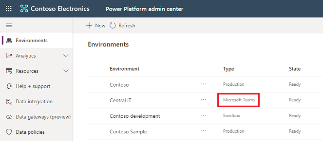
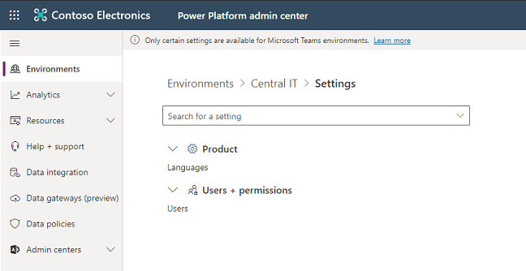
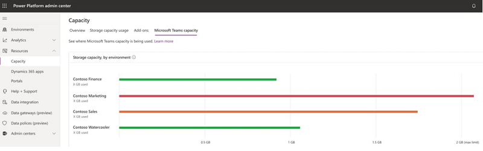

# About the Teams environment

Introduced in August, 2020, the Teams environment is automatically created for the selected team when you add an app in Teams using Power Apps for the first time or install a Power Apps app from the app catalog. The Teams environment is used to store, manage, and share team-specific data, apps, and flows. Each team can have one environment and all data, apps and flows created using Power Apps inside a team are available from that team's Microsoft Dataflex database. Dataflex is a new offering from Microsoft that comprises a subset of Microsoft Dataflex Pro (formerly Common Data Service) capabilities. 

You can identify a Teams environment in the Power Platform admin center by selecting **Environments** and viewing the list of environments.

> [!div class="mx-imgBorder"] 
> 

## Licensing and restrictions 
Apps created in Teams that use Dataflex will only be accessible in Teams and Teams Mobile, regardless of the user’s license.  

For any standalone Power Apps or Power Automate usage, which includes API access as well, the Dataflex schema will need to be promoted to Dataflex Pro.  

No direct API access or pro developer experience will be provided and only Power Apps embedded within the Teams client will be able to access runtime.  

## Admin experience 
Tenant owners and members will be allowed to create their first app template or create a blank table app for the Team. For more detailed guidance on creating blank table apps, see [Dataflex tables: Overview](https://review.docs.microsoft.com/en-us/powerapps/teams/overview-tables?branch=teams-preview). 

Team owners will be allowed to delete a team associated to a Teams environment which will trigger the deletion of that environment.  

By design and per GDPR guidelines, tenant admins and/or Power Platform admins will not be able to access any of the core customer data in the Teams environment. However, they will be able to perform all system management operations, including customizations and updating user records, among other options. 
 
Team members that have a valid Teams license will be allowed to access Power Platform apps which are powered by the Teams environment in the team. This access will include the ability to install, make, edit, run, share, and remove apps.  

Teams will also be able to invite guests who will be able to access the apps, flows, and data in the Teams Dataflex database within their team. However, they won’t be allowed to install, make, or edit apps. They can only discover and run apps in their team. 

## Environment lifecycle

This section provides a summary of key lifecycle operations that will be allowed with Teams environments.

> [!NOTE]
> The Teams environment name is the same as the team name. You can filter the list of environments in the Power Platform admin center to show just Teams environments.

|Operations  |Feature description  |Available in preview  |
|---------|---------|---------|
|Backup     | Automated backups and labeled backups can be taken. Admins can view them in the Power Platform admin center. Note that backups will be available for up to 7 days.        |  Yes       |
|Restore     | Only point-in-time restores to the same environment will be possible. Note: if the environment has been promoted, the point in time restore will only be available starting from the moment it was promoted. | Yes        |
|Copy     | Not available by default for Teams environments.        | No        |
|Create     | Only through Teams. Note: these Teams environments will be limited to a 1:1 mapping to the Teams team it was created in and bound to the Microsoft 365 Group associated to the team.        | Yes        |
|Delete     | The environment can be deleted by the team owner. Note: the environment will be deleted automatically if the team it was created in is also deleted.| Yes  |
|Reset     | Not available by default for Teams environments.        | No        |
|Promote     | Unlocks all the functionalities of the Dataflex Pro services for the environment.         | Yes        |

The lifetime of the environment will be tied to the team it was created in. If you promote an environment to Dataflex Pro, the 1:1 mapping is not guaranteed as the environment can now be used by applications outside of Teams. The promoted environment is bound by the lifecycle rules associated to the Power Apps license and the configuration of the environment.

Some operations are blocked by default, such as the Copy and Reset operations. For scenarios where you would need this capability, Dataflex Pro environments should be used. See the previous table for details.

> [!IMPORTANT]
> Teams environments won’t be allowed to change types until the promote operation has been carried out on the environment. Once the promotion completes, the Teams environment will have the full capabilities found in Dataflex Pro. In addition to the standard termination of the environments, if the Microsoft Office license expires, there will also be an inactivity clause for these environments. Specifically, when an environment is unused for over 3 months, it will be disabled and ultimately deleted. 
>
> If the team is deleted, the Teams environment that was created will also be deleted. The Teams environment itself may be deleted from within the team by the team owner. A warning will be provided prior to allowing the deletion to go through, to ensure there are no accidental deletions. 

## User access to Teams environments

In an environment such as Teams which can be collaborative in the development and use of apps, bots, and data, it’s important to understand how access is granted to the different types of roles within the service.

This section summarizes user access to Teams environments and resources.

### Conceptual model

Every Microsoft Teams is linked 1:1 to a Microsoft 365 Group.

Microsoft 365 Groups support two user membership types: owners and members. Members can be users from the customer‘s own tenant or from a guest tenant. Any user management (addition, removal, user type change) made in a team will be reflected in the Microsoft 365 Group, and vice versa.

Access to a Teams environment and its resources (apps, data) will be restricted to only users in the team. The Microsoft 365 Group linked to a team will be automatically associated with the Teams environment, restricting access to only users of that Microsoft 365 Group. This Microsoft 365 Group association with the Teams environment will not be editable until the environment is promoted to Dataflex Pro. 

### Role assignments 

|Persona  |Security role auto-assigned   |
|---------|---------|
|Teams owner      | System Customizer, Dataflex Pro User         |
|Teams member/guest      | Same as for Teams owner        |
|Tenant admin / Power Platform admin who is not in the team      | System Admin with Administrative access mode          |
|Dynamics 365 admin who is not in the team (that is, not in the Microsoft 365 Group)      | No access since a Teams environment will always have the Team’s Microsoft 365 Group associated with it, and Dynamics 365 service admins are excluded from environments for which they are not in the associated group.         |
|Tenant/Power Platform/Dynamics 365 admin who is in the team   | All Teams users' roles plus System Admin with Read-Write access mode         |

### User sync for Teams environments

On a user’s first access of an app in their team, a user record will be created in the Teams environment associated with the team. If an app in a team has a need for a user record to pre-exist in the Teams environment (for example, a scenario where the app lists the users in the Teams environment by looking up user records from Dataflex), the PowerShell Add-AdminPowerAppsSyncUser command can be invoked from the app to create user records for users on-demand. 

Once a user record is created in the Teams environment, background sync jobs will run every 24 hours to synchronize any user record changes from Azure Active Directory into the Teams environment. 

It can take up to 24 hours to: 
- Synchronize changes made to user properties (name, address, etc.) in Azure AD into their user record in the Teams environment’s Dataflex database. 
- Recognize removal of users from a team and disable them in the Teams environment so they don’t have access to the environment and its resources. 
- Recognize a user who left the organization (user record deletion in Azure Active Directory) and disable them in the Teams environment. 
- Recognize removal of Azure AD admin roles (Tenant admin, Power Platform service admin, Dynamics 365 service admin) from a user, and synchronize the change to the Teams environment. 

## Teams environments settings and actions

To change settings for a Teams environment, go to **Environments** > [select an environment] > **Settings**.

> [!div class="mx-imgBorder"] 
> 

### Languages
Select **Languages** and see the following topic for settings: [Regional and language options for your environment](enable-languages.md).

### Users + permissions
Select **Users + permissions** > **Users**. Select **+ Add user** to add users.

Only users that meet the access requirements can be added to this environment. Add one user at a time.

**User access requirements**

- [Enabled in Azure Active Directory](create-users-assign-online-security-roles.md#create-a-user-account)
- Has an active Office 365 license that includes Teams. The Office 365 A1 plan does not provide user access.
- Member of the environment's [security group](control-user-access.md#create-a-security-group-and-add-members-to-the-security-group)

### Delete a Teams environment

To delete a Teams environment, select it from the list of environments and then select **Delete**.

> [!div class="mx-imgBorder"] 
> 

### Promote a Teams environment to production

Select **Promote to production**. See [Promotion Process](#promotion-process).

### Refresh cadence

In **Details**, you'll see information on the refresh cadence. 

## Capacity limits

The consumption of capacity by Teams environments will not count towards the tenant’s capacity limits. Instead, we will provide a pool of database capacity for Teams environments, which will be separate from the tenant’s Power Platform Dataflex Pro capacity pool. Note that capacity will not be transferable between these two pools.  

**Per-environment limits on Teams environments**: Each Teams environment will be restricted to 2 GB of database storage. To see the consumption of each Teams environment in a tenant, navigate to Power Platform admin center (https://aka.ms/ppac), then to **Resources** -> **Capacity** -> **Microsoft Teams Capacity**.   

> [!div class="mx-imgBorder"] 
> 

**Tenant-wide limits on Teams environments**: Each tenant will also have limits related to Teams environments defined as follows:  

|Unit  |Service limit  |
|---------|---------|
|Teams environments      | 5 + 1 per 20 eligible office seats (up to a maximum of 500 environments)  
Note that this limit on the number of environments cannot be extended further in Teams environments. Should more instances be needed, consider deleting unused environments or promoting to Dataflex Pro.   |
|Max Teams environment storage per tenant      | 10 GB + Teams environments x 2 GB (up to a max of 1 TB).  
Note that this storage limit cannot be extended further in Teams environments. Should more storage be needed, consider promoting to Dataflex Pro.  |
|Max Teams environments API calls  | API requests in Microsoft Power Platform consist of various actions which a user makes across various products.   
For more information on API calls and the per user limits available, see the following documentation:  https://aka.ms/PowerPlatformRequestEntitlements  |

### Enforcement

Below are the actions that we will take when customers approach and exceed the environment-level or tenant-wide Teams limits. 

#### Environment-level enforcement actions  

When a Teams environment in a team approaches or hits the 2 GB capacity limit, the following actions will be taken: 
- At 80% of the limit, the Teams users will see in the Teams maker experience a message informing them the capacity limit is about to be reached. At this point, customers are encouraged to either reduce storage usage or contact their admin for other options.  
- At 100% of the limit, any existing apps will continue to work, and existing apps will be allowed to be updated. However, new apps and flows will not be allowed to be created or installed as a result of having reached the capacity limit. 

#### Tenant-level enforcement  

When a tenant approaches or reaches their tenant-wide Teams limits described above, the following actions will be taken: 
- At 80% of the limit, a notification will be sent to the Power Platform admin center admin informing of the approaching capacity limit, and to consider reducing storage usage or promoting some of the Teams environments. 
- At 100% of the limit, the creation of new Teams environments will be blocked. Any users attempting to create a new Teams environment will be prompted to contact the tenant admin as the result of the capacity limit being reached. Additionally, new apps and flows will not be allowed to be created or installed in an existing Teams environment.  

As mentioned for the environment-level enforcement, any existing apps will still be able to function as expected.  

## Promotion Process 

The high-level flow and business rules for promoting a Teams environment follow. 

A tenant admin will be allowed to promote a Teams environment to a Dataflex Pro database environment. A typical flow is as follows:  

:::image type="content" source="media/teams-environment-promotion-process.png" alt-text="Teams environment promotion process":::

1. Within a team, the Teams user chooses to create a Power Apps app using the new integrated Teams/Power Apps app creation experience, or install a pre-existing Teams environment-based app. At this point, a Teams environment is provisioned for that team.  

2. Over time, the data stored in the Teams environment will grow and will eventually reach the capacity limit that these environments have (2 GB). At this point, existing apps will continue to operate but new applications will not be allowed to be created or installed. Customers will be directed to contact a tenant admin to promote the Teams environments to Dataflex Pro and obtain more capacity. Note that alternatively, a Teams user could request the admin to promote because of a feature they want to use in Dataflex Pro.  

3. Admins will review the request from the Teams user and will make the decision to promote the environment from Teams to Dataflex Pro. At this point, the admin will go to the Power Platform admin center environments view to execute the promotion.   

   Note: to successfully carry out the promotion, the tenant must have at least as much available capacity as the size of the Teams environment that is being promoted. Post promotion, the consumed capacity of the promoted Teams environment will start counting towards the tenant’s capacity. Should a customer attempt to promote it anyways, the promote operation will be blocked and an appropriate error message will be displayed explaining why it failed.  

4. Admins will be given a message with the implications of promoting and asked to confirm the action.  

5. If the Admin confirms, the promotion will now go forward. As the promotion progresses, various notifications will be provided as the operation transitions through the various states.  

Post promotion, the following applies to the newly promoted environment:  
-	The promoted environment’s lifecycle will no longer be tied to the lifecycle of that team. If the team is deleted, the promoted environment remains. 
-	Any apps running on the environment will require Power Platform (Power Apps, Power Automate) licenses to be accessed. 
-	The apps can run inside and outside of Teams. All existing apps will then be associated with the promoted environment (Dataflex Pro) and can leverage the extended set of entities. 
-	The promoted environment capacity will start counting against the tenant’s Dataflex Pro capacity. The Microsoft 365 Group association will then become editable. 
-	Azure AD admins (Tenant admin, Power Platform service admin, Dynamics 365 service admin) will continue to be System Admins in the promoted Dataflex Pro database environment. 
-	Teams owners will not have access to this environment through the Power Platform admin center, unless they are explicitly assigned the System Admin role. 
-	Adding a new Teams Template app to the prior team will create a new Teams environment for the team. 

