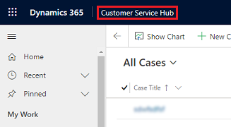
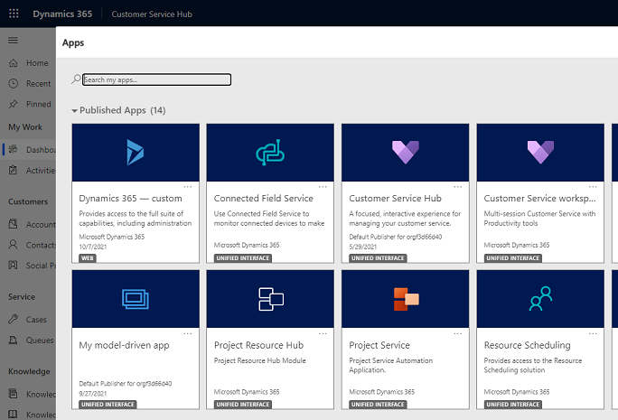

# About Unified Interface for model-driven apps in Power Apps 

[!INCLUDE [cc-data-platform-banner](../includes/cc-data-platform-banner.md)]

Unified Interface uses responsive web design principles to provide an optimal viewing and interaction experience for any screen size, device, or orientation. It brings all the rich experiences to any client that you are using. Whether you are using a browser, tablet, or phone, you will be able to consume similar experiences.

More information: 
- [Enhanced user experience with Unified Interface for model-driven apps](https://docs.microsoft.com/powerapps/user/unified-interface)
- [Blog: Moving forward with your transition to Unified Interface](https://powerapps.microsoft.com/blog/moving-forward-with-your-transition-to-unified-interface/)
- [Blog: Performance benefits of unified interface](https://powerapps.microsoft.com/blog/performance-benefits-of-unified-interface/)

## Accessing Unified Interface apps in browsers

Once provisioned, you can access the installed Unified Interface and legacy web apps in a browser.

> [!NOTE]
> The legacy web client is deprecated; you should plan to convert your legacy web apps to use the new Unified Interface. More information: [Legacy web client is deprecated](https://docs.microsoft.com/dynamics365/get-started/whats-new/customer-engagement/important-changes-coming#legacy-web-client-is-deprecated)

You can access Unified Interface apps from the following locations in a browser: 

1. In [https://home.dynamics.com/](https://home.dynamics.com/):

   

2. In app navigation:

   

3. In **My Apps** page under **Settings**:

   

## Accessing Unified Interface apps on phone and tablets
The Unified Interface apps are the only apps supported on phones and tablets. When users sign in to their environment, they will see the Unified Interface apps only on their apps landing page. 

|  | |  |
|---------|---------|---------|
|On phone       |    |On tablet      |

## Capabilities not yet on Unified Interface

Some capabilities of the legacy web client are available in the hybrid experience in Unified Interface. You can [enable the hybrid experience](enable-hybrid-experience.md) to get them in the browser client.

There are certain capabilities that continue to be unavailable in Unified Interface and we are working to provide these in future releases:

-	Custom styling of advanced chart properties (excluding colors and basic formatting)
-	Composite address control
- Composite fullname control
-	Global notifications
-	Admin experiences
-	Editable grids on phones
-	Learning Path
- Duplicate detection in Lookups

## Read-only entities on Unified Interface

There are certain entities that are currently read-only on Unified Interface. Users will not be able to make changes to these entity records within an Unified Interface app. We are working to make them editable in future releases.

> [!NOTE]
> Some entities are being deprecated. More information: [Important changes (deprecations) coming](https://docs.microsoft.com/dynamics365/get-started/whats-new/customer-engagement/important-changes-coming#contracts-contract-line-items-and-contract-templates-entities-are-deprecated)

The following are entities that are currently read-only in Unified Interface:

- KnowledgeArticleViews
- KnowledgeBaseRecord
- SharePointDocument
- SharePointSite
- SLA
- SLAKPIInstance
- Template
- Contract
- Contract Lines
- Contract Templates
- Case Resolution

### Workaround for out-of-the-box or custom entities appearing as read-only

Follow these steps to make all the out-of-the-box actions available and entities editable.

1. On the navigation bar in your app, select the **Settings** icon and then select **Advanced Settings**.

   :::image type="content" source="media/advanced-settings-option.png" alt-text="Advanced Settings option on the Settings menu":::

   The **Business Management** page opens in a new browser tab.

2. On the navigation bar, select Settings and then select Customizations.

   :::image type="content" source="media/customization-in-sitemap.png" alt-text="Select Customizations":::

3. On the **Customization** page, select **Customize the System**.

4. In the solution explorer, under **Components**, expand **Entities** and then select the specific entity that's appearing as read-only.

5. On the **General** tab, under **Outlook & Mobile**, clear the **Read-only in Unified Client** check box.

   :::image type="content" source="media/read-only-in-unified-client-setting.png" alt-text="Setting to make an entity read-only in the Unified Client":::

6. Save and publish the customizations.

7. In the Unified Interface app, refresh the window.

### See also
[Overview of building model-driven apps](https://docs.microsoft.com/powerapps/maker/model-driven-apps/model-driven-app-overview)
