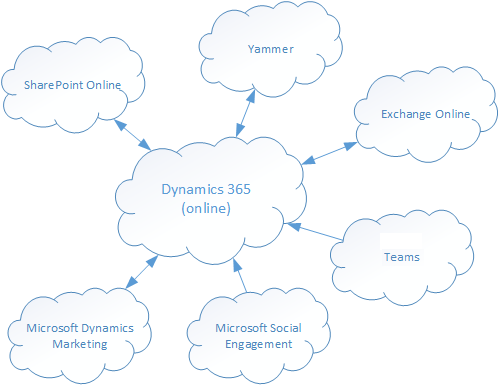

# Add Microsoft 365 Online services
Integrating [!INCLUDE[pn_MS_Office_365](../includes/pn-ms-office-365.md)] with customer engagement apps (Dynamics 365 Sales, Dynamics 365 Customer Service, Dynamics 365 Field Service, Dynamics 365 Marketing, and Dynamics 365 Project Service Automation), is a great way to enhance your customer relationship management with the power of cloud services: easier maintenance, broader availability, and better coordination across multiple devices.  
  
   
  
 The following topics provide information on how to integrate [!INCLUDE[pn_Exchange_Online](../includes/pn-exchange-online.md)], [!INCLUDE[pn_sharepoint_online](../includes/pn-sharepoint-online.md)], and [!INCLUDE[pn_skype](../includes/pn-skype.md)] into customer engagement apps.  
  
> [!NOTE]
> [!INCLUDE[cc_Office365PlanRequirement](../includes/cc-office365planrequirement.md)]  
 
