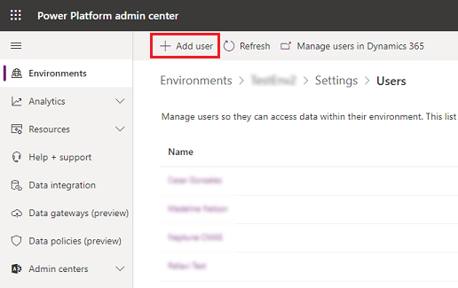
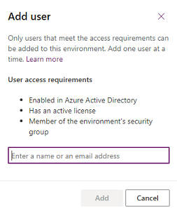

# Add users to an environment 

Environments can have zero or one Microsoft Dataverse database. The process for adding users to environments that have no Dataverse database differs from the process for environments that have one Dataverse database. For an overview of environments, see [Environments overview](environments-overview.md). 

## Add users to an environment that has no Dataverse database 

You don't have to add users to environments that have no Dataverse database, because all users in the organization are present in these environments by default. However, for a user to get access to an environment's resources, a security role needs to be assigned to them. For information about assigning a security role to users in an environment, see [Configure user security to resources in an environment](database-security.md). 

## Add users to an environment that has a Dataverse database 

When an environment is created with a Dataverse database or a Dataverse database is added to an existing environment, all users in the organization are added automatically to the environment unless a security group is selected as an access filter. Review the following on automatic user addition to environments. 

- For a user to be successfully added to an environment that has a Dataverse database, the user must meet certain criteria. This same criteria applies to [enabling a user who is already present in an environment](create-users-assign-online-security-roles.md#enable-or-disable-user-accounts).

- Automatic user addition to an environment takes time, especially if your organization is large and access to the environment isn't restricted to any security group. As a best practice, we recommend that you restrict access to your environment to a specific set of users by [associating your environment to a security group](control-user-access.md). 

- In most cases, adding users to an environment only gives users access to the environment itself, not to any resources (apps and data) in the environment. You need to configure access to resources by [assigning security roles to users](database-security.md). Users with certain Dynamics 365 app licenses will be assigned some security roles by default that only give them read access to the environment's resources. Users who have been assigned service admin roles or the Global admin role, assigned through the Microsoft 365 admin center, will get the [System Administrator role](database-security.md#predefined-security-roles) by default. They will have admin privileges to the environment's resources when they get added to the environment. 

- Because it can take a long time to automatically add users to an environment, you can use the following procedure to add specific users to the environment sooner. 

**To add users to an environment that has a Dataverse database**

1. From the [Power Platform admin center](https://admin.powerplatform.microsoft.com), select the environment to which you want to add users. 

2. Select **Settings** > **Users + permissions** > **Users**. 

   You'll see the list of users that have already been added to the environment. This user list includes users with enabled and disabled status. More information: [Enable or disable users](create-users-assign-online-security-roles.md#enable-or-disable-user-accounts) 

4. Check to see whether the user you want to add might already be present in the environment by doing a search (because automatic user addition might have added the user already). If you don't find the user in the environment yet, select **Add user**. 

   > [!div class="mx-imgBorder"] 
   > 

6. In the **Add user** pane, enter the user's name or email address, select it, and add them to the environment. Note the requirements for successfully adding a user, and see [enable a user in an environment](create-users-assign-online-security-roles.md#enable-or-disable-user-accounts) for details about how to ensure the requirements are met. 

   > [!div class="mx-imgBorder"] 
   > 

7. After a user is added to the environment, [assign a security role to the user](database-security.md) to configure their access to resources in the environment. 
