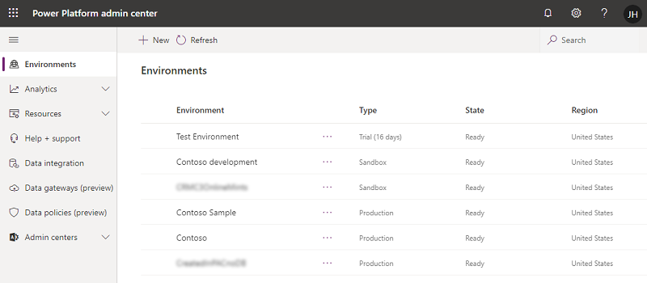

# Administer Microsoft Power Platform 

The [Power Platform admin center](https://admin.powerplatform.microsoft.com) provides a unified portal for administrators to manage environments and settings for Power Apps, Power Automate, and customer engagement apps (Dynamics 365 Sales, Dynamics 365 Customer Service, Dynamics 365 Field Service, Dynamics 365 Marketing, and Dynamics 365 Project Service Automation).

> [!div class="mx-imgBorder"] 
> 

## Power Platform admin center capabilities

Currently, the admin center provides the following capabilities.

|Feature  |Description  |
|---------|---------|
|Environments | View, create, and manage your environments. Select an environment to see details and manage its setting. More information: [Manage environment settings](./admin-settings.md)|
|Analytics     | Get a detailed view of key metrics for Microsoft Power Platform apps. More information: [Microsoft Dataverse analytics](./analytics-common-data-service.md)      |
|Resources  |  More information: [View and manage resources](view-manage-resources.md)  |
|Help + support     | Get a list of self-help solutions or create a support ticket for technical support. More information: [Get Help + Support](./get-help-support.md)       |
|Data integration| More information: [Integrate data into Dataverse ](data-integrator.md)  |
|Data gateways| More information: [Set up data transfer between on-premises data and cloud services ](onpremises-data-gateway-management.md) |
|Data policies     | More information: [Create and manage data loss prevention policies](create-dlp-policy.md).       |

## Home page dashboard

You can personalize your home page by selecting a theme, setting your language, and timezone from the **Settings** gear.

To personalize your dashboard, select **+ Add cards** on top of the homepage and drag any card onto the dashboard to the location you want.

:::image type="content" source="media/home-page.png" alt-text="Power Platform admin center Home page":::

The following are the cards you can add to the dashboard.

> [!NOTE]
> Cards typically don't include data from the last 24 to 48 hours.

### Service health

This card shows whether your Microsoft services are healthy, or if they're experiencing an active advisory or incident. For more info about an advisory or incident, select it to open the **Service health** page of the Microsoft 365 admin center.

### Message center

This card helps you manage upcoming changes to hour Microsoft services. Select a post to open it in the details panel. To view the full list of messages across all Microsoft services, select **Show all**. [More info about the message center](/office365/admin/manage/message-center)

### Documentation and training

This card provides links to related documentation and information sources.

### SharePoint file activity

This card shows how many files you have in SharePoint. It also shows a chart of files by activity type over the past 30 days. (If an activity occurs multiple times in one day on the same file, the file is counted only once for that day.) To view the full report in the Microsoft 365 admin center, select the card title. [More info about SharePoint activity reports in the Microsoft 365 admin center](/microsoft-365/admin/activity-reports/sharepoint-activity-ww)

### OneDrive file activity

This card shows how many files you have in OneDrive. It also shows a chart of files by activity type over the past 30 days. (If an activity occurs multiple times in one day on the same file, the file is counted only once for that day.) To view the full report in the Microsoft 365 admin center, select the card title. [More info about OneDrive activity reports in the Microsoft 365 admin center](/microsoft-365/admin/activity-reports/onedrive-for-business-activity-ww)

### SharePoint site usage 

This card shows the percentage of active sites in your organization and a chart of total and active sites over the past 30 days. To view the full report in the Microsoft 365 admin center, select the card title. [More info about SharePoint site usage reports in the Microsoft 365 admin center](/microsoft-365/admin/activity-reports/sharepoint-site-usage-ww)

### OneDrive usage

This card shows the percentage of active OneDrive accounts in your organization and a chart of total and active accounts over the past 30 days. To view the full report in the Microsoft 365 admin center, select the card title. [More info about the OneDrive usage report in the Microsoft 365 admin center](/microsoft-365/admin/activity-reports/onedrive-for-business-usage-ww)

### Sharepoint storage usage

This card shows how much of your SharePoint storage you've used and a chart of your storage usage over the past 180 days. To view all SharePoint site usage reports in the Microsoft 365 admin center, select the card title. [More info about SharePoint site usage reports in the Microsoft 365 admin center](/microsoft-365/admin/activity-reports/sharepoint-site-usage-ww)

### Term store operations

This card shows how many term store operations are being performed and a chart of operations by type over the past 15 days.

### Sensitivity labels

If your organization has enabled and set up [sensitivity labels to protect SharePoint sites](/microsoft-365/compliance/sensitivity-labels-teams-groups-sites), this card shows the usage of the labels across all sites.

### Sites creation sources

This card shows the top workloads from where sites are created in your organization.

### SharePoint site search

This card lets you search active sites from the home page.

### information barriers in OneDrive

This card shows the top segments associated with OneDrive accounts.

### Network performance - SharePoint and OneDrive

This card shows a chart of your employees network performance for SharePoint and OneDrive over the past 30 days.

### See also
[Working with the admin portals](wp-work-with-admin-portals.md)  
[Introduction to Microsoft Power Platform](/learn/modules/introduction-power-platform/)

[!INCLUDE[footer-include](../includes/footer-banner.md)]
