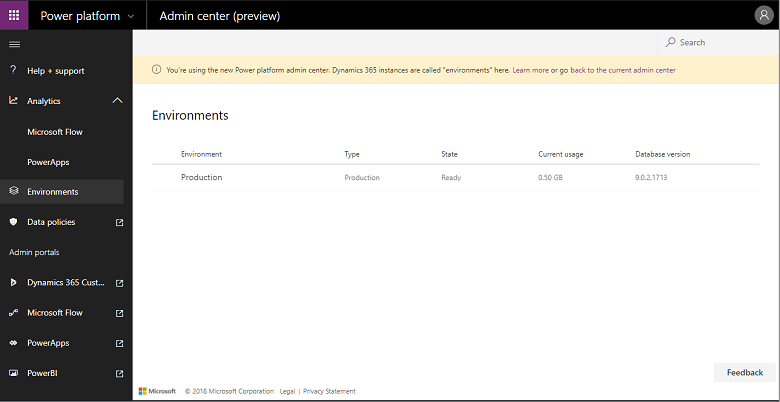

# Preview: Introducing the Power Platform Admin center

[!INCLUDE [cc-beta-prerelease-disclaimer](../includes/cc-beta-prerelease-disclaimer.md)]

[!INCLUDE [cc-customer-engagement-apps-note](../includes/cc-customer-engagement-apps-note.md)]

> [!IMPORTANT]
> - This feature currently has limited availability.
> - [!INCLUDE[cc_preview_features_definition](../includes/cc-preview-features-definition.md)]  
> - [!INCLUDE[cc_preview_features_expect_changes](../includes/cc-preview-features-expect-changes.md)]  
> - [!INCLUDE[cc_preview_features_no_MS_support](../includes/cc-preview-features-no-ms-support.md)]  

If you've managed Dynamics 365 for Customer Engagement tenants and instances, you've used the Dynamics 365 admin center.

With the merge of Common Data Service (CDS) for Apps and the Dynamics 365 for Customer Engagement platform, we're launching a new admin center experience bringing PowerApps, Flow, and Dynamics 365 administration management together in a single site - the [Power Platform Admin center](https://admin.dynamics.com).

Check out the following blog: [Introducing the Power Platform admin center](https://blogs.msdn.microsoft.com/crm/2018/09/25/introducing-the-power-platform-admin-center/).

## Admin center interface

|Element  |Description  |
|---------|---------|
|Help + support     | Get a list of self-help solutions or create a support ticket for technical support.         |
|Analytics     | Get a detailed view of key metrics for Power Platform apps.       |
|Environments | A list of your environments. Select an environment to see details.|
|Data integration| [Integrate data into Common Data Service for Apps ](https://docs.microsoft.com/powerapps/administrator/data-integrator)  |
|Data Gateway| [Set up data transfer between on-premises data and cloud services ](onpremises-data-gateway-management.md) |
|Data policies     | Create and manage [data loss prevention policies](https://docs.microsoft.com/powerapps/administrator/create-dlp-policy).       |
|Admin centers    |Links to other admin centers.        |

## Using the various admin centers

For now, there are multiple admin centers you use to manage and monitor your environments. Here's some guidance on the basic role of each.

|Admin Center  |Common Tasks  |
|---------|---------|
|Power Platform Admin center  [https://admin.powerplatform.microsoft.com](https://admin.powerplatform.microsoft.com)     |The new unified administrative portal for Power Platform admins.  Currently this portal can be used for CDS for Apps environment management, to submit CDS for Apps and Flow support tickets, and to view PowerApps and Flow admin analytics.   |
|PowerApps Admin center  [https://admin.powerapps.com](https://admin.powerapps.com)    |Creating and managing environments including security starts here. Within each environment you can manage the apps and flows.  Monitor who is licensed and building things. Create and manage Data Loss Prevention policies. Manage CDS for Apps Data Integration projects.    |
|PowerApps Maker Portal [https://web.powerapps.com](https://web.powerapps.com)      |This portal is focused on building PowerApps but can also view and manage CDS for Apps components, manage connectors and gateways.  You can also see application statistics from details on apps here.         |
|Microsoft Flow Admin Portal [https://admin.flow.microsoft.com](https://admin.flow.microsoft.com)   | This points to the same site as admin.powerapps.com.    |
|Business platform admin center [https://admin.businessplatform.microsoft.com](https://admin.businessplatform.microsoft.com)      |This points to the same site as admin.powerapps.com.  **Over time, this will migrated to and replaced by the Power Platform Admin center.**        |
|Dynamics 365 Admin center [https://port.crm.dynamics.com/G/manage/index.aspx](https://port.crm.dynamics.com/G/manage/index.aspx)     |The Dynamics 365 Admin Center, that can be leveraged to perform certain CDS environment management like renaming, deleting, and resetting.    |
|Dynamics 365 Instance Management [https://port.crm<N>.dynamics.com/G/Instances/InstancePicker.aspx](https://port.crm<N>.dynamics.com/G/Instances/InstancePicker.aspx) | This instance management portal is reached from admin.powerapps.com when managing the CDS for Apps database or from the Dynamics 365 Admin center. Here you will see a list of all the CDS for Apps databases and can perform actions such as backup, as well as other actions on a per instance basis.   |
|Office 365 Admin center [https://portal.office.com/adminportal](https://portal.office.com/adminportal)      |Here you manage users and their license assignment as well as launch into many of the individual admin centers.         |
|Microsoft Azure [https://portal.azure.com](https://portal.azure.com)      |Advanced Azure AD management tasks like conditional access and support for developer application registration is done here. This is also where you start setup of your on-premises gateways.         |
|Security and Compliance Center [https://protection.office.com](https://protection.office.com)     |In addition to the general compliance tasks, administrators can come here to search the Audit log to see Flow audit events.         |

<!--
## What about the Office 365 admin center?

You'll continue to use the Office 365 admin center to manage settings like:

> - users, licenses, roles, passwords
> - subscriptions, billing, purchase services
> - service health
> - usage and security reports

-->