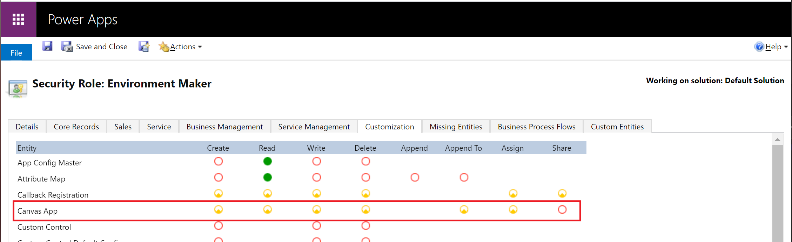
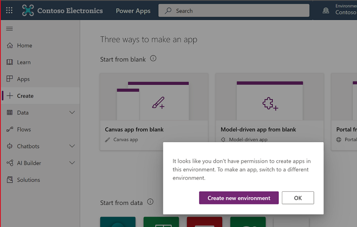

# Manage Power Apps
If you're an Environment Admin, Global admin, or Microsoft Power Platform admin, you can manage the apps created in your organization.

Admins can do the following from the Power Platform admin center:

- Add or change the users with whom an app is shared
- Delete apps not currently in use

## Prerequisites

- Either a Power Apps plan or Power Automate plan. Alternatively, you can sign up for a [free Power Apps trial](/powerapps/maker/signup-for-powerapps).

- Power Apps Environment Admin, Global admin, or Power Platform admin permissions. For more information, see [Environments administration in Power Apps](environments-administration.md).

## Manage Power Apps

1. Sign in to the [Power Platform admin center](https://admin.powerplatform.microsoft.com).

2. In the navigation pane, select **Environments**, select an environment with resources, and then select the **Power Apps** resource.

   > [!div class="mx-imgBorder"] 
   > 

3. Select an app to manage.

   > [!div class="mx-imgBorder"] 
   >  

4. Select your desired action.

   > [!div class="mx-imgBorder"] 
   >  

## Manage who can share canvas apps

Power Apps respects the Canvas App ‘Share’ privilege in Dataverse. A user will not be able to share canvas apps in an environment if they do not have a security role with the Canvas App Share privilege set to a value other than ‘None selected’. This Dataverse Canvas App Share privilege is also respected in the default environment. This article outlines how to edit a privileges in a security role: [Edit a security role](create-edit-security-role.md#edit-a-security-role).

   > [!div class="mx-imgBorder"] 
   > 

> [!NOTE]
> The ability to granularly control the Canvas App Share privilege in a security role requires Dataverse in the environment where the privilege is to be changed. Power Apps does not discretely recognize the other Dataverse Canvas app entity privileges set for the environment. 

### Surface your organization’s governance error content 
If you specify governance error message content to appear in error messages, it will be included in the error message displayed when users observe they don’t have permission to share apps in an environment. See: [PowerShell governance error message content commands](powerapps-powershell.md#governance-error-message-content-commands).

## Distinguish Microsoft SharePoint custom form makers from general Environment Makers

In addition to the ability to save SharePoint custom form resources to a non-default environment, it is also possible to limit maker privileges to only be able to create and edit SharePoint custom forms in a non-default environment. Outside of the default environment, an admin can un-assign the Environment Maker security role from users and assign the SharePoint custom form maker security role. 

> [!NOTE]
> The ability to distinguish SharePoint custom form makers from general Environment Makers requires Dataverse in the environment where the privilege is to be changed.
>
> A user with only the SharePoint custom form maker role in an environment will not see the environment in the environment list in https://make.powerapps.com or https://flow.microsoft.com.

Do the following to limit maker privileges to only be able to create and edit SharePoint custom forms in a non-default environment. 

1.	Have an admin, [designate an environment for SharePoint custom forms](powerapps-powershell.md#designate-sharepoint-custom-form-environment) that is different from the default environment. 

2.	Have an admin, install the [SharePoint custom form maker solution from AppSource](https://appsource.microsoft.com/product/dynamics-365/mscrm.sharepointcustomformmaker) to your environment designated for SharePoint custom forms.

3.	In the Power Platform admin center, select the environment you designated for SharePoint custom forms in step one and assign the SharePoint custom form maker security role to users expected to create SharePoint custom forms. See [Assign security roles to users in an environment that has a Dataverse database](database-security.md#assign-security-roles-to-users-in-an-environment-that-has-a-dataverse-database). 

### Frequently asked questions

#### Can I edit privileges in the SharePoint custom form maker security role? 

No, the SharePoint custom form maker security role is added to an environment by importing a non-customizable solution. Note, SharePoint custom form creation requires a user to have permissions in SharePoint and Power Platform. The platform verifies a user has write permissions for the targeted SharePoint list and the user has permission in Power Platform to create or update the SharePoint custom form. For a SharePoint custom form maker to satisfy the Power Platform check, the user must have the SharePoint custom form security role or the Environment Maker security role.

#### Will a user with only the SharePoint custom form maker role see an environment in the make.powerapps.com environment picker? 

No, a maker that doesn’t have a security role called out in the [Choose environments documentation](/powerapps/maker/canvas-apps/intro-maker-portal#choose-an-environment) will not see a the environment in the environment picker in https://make.powerapps.com. A user with the SharePoint custom form maker role might attempt to navigate to the environment by manipulating the URI. If the user attempts to create a standalone app they’ll see a permission error. 

   > [!div class="mx-imgBorder"] 
   > 

## Manage app quarantine state (preview)

As a complement to [Power Platform’s data loss prevention policies](wp-data-loss-prevention.md), Power platform enables admins to 'quarantine' a resource, setting guardrails for low-code development. A resource’s quarantine state is managed by admins and controls whether a resource is accessible to end-users. In Power Apps, this capability allows admins to directly limit availability of apps that may need attention to meet an organization’s compliance requirements. 

The following table outlines how the quarantine state impacts experiences for admins, makers, and end-users. 

| Persona  | Experience                                                                                                                                   |
|----------|----------------------------------------------------------------------------------------------------------------------------------------------|
| Admin    | Regardless of an app’s quarantine state, an app is visible to admins in the Power Platform Admin Center and PowerShell cmdlets.                  |
| Maker    | Regardless of an app’s quarantine state, an app is visible in https://make.powerapps.com and can be opened for editing in Power Apps Studio. |
| End User | A quarantined app will present end-users that launch the app a message indicating they’re unable to access the app.                          |

End users will see the following message when they launch an app that has been quarantined. 

> [!div class="mx-imgBorder"] 
> 

The following table reflects quarantine support:

| Power Apps type  | Quarantine support   |
|------------------|----------------------|
| Canvas app       | Preview availability |
| Model driven app | Not supported yet    |

### Quarantine an app
```PowerShell
Set-AppAsQuarantined -EnvironmentName <EnvironmentName> -AppName <AppName>
```

### Un-quarantine an app
```PowerShell
Set-AppAsUnquarantined -EnvironmentName <EnvironmentName> -AppName <AppName>
```

### Get an app's quarantine state
```PowerShell
Get-AppQuarantineState -EnvironmentName <EnvironmentName> -AppName <AppName>
```

### See also
[Power Apps admin PowerShell support](powerapps-powershell.md#power-apps-commands)


[!INCLUDE[footer-include](../includes/footer-banner.md)]
