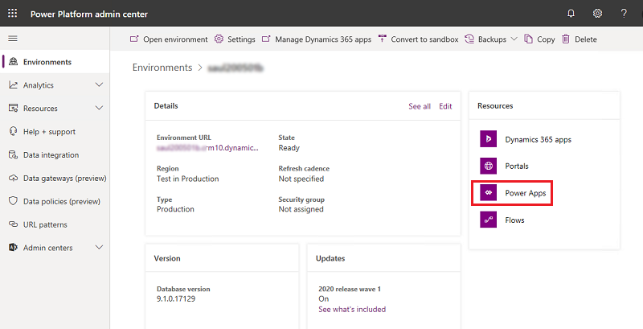
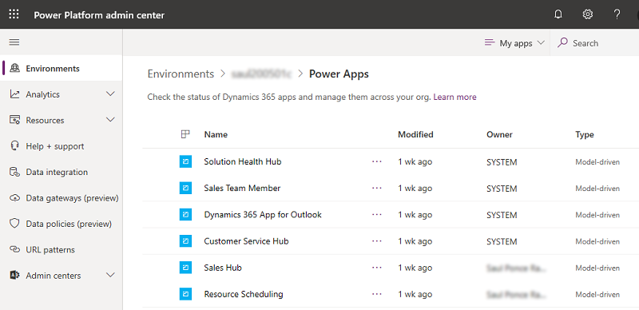
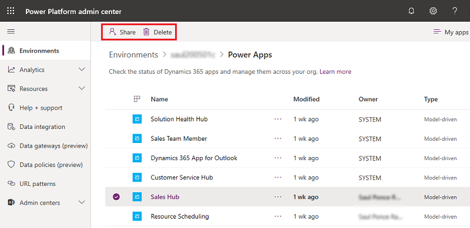

# Manage Power Apps
If you're an Environment Admin, Global admin, or Power Platform admin, you can manage the apps created in your organization.

Admins can do the following from the Power Platform admin center:

- Add or change the users with whom an app is shared
- Delete apps not currently in use

## Prerequisites

- Either a Power Apps plan or Power Automate plan. Alternatively, you can sign up for a [free Power Apps trial](https://docs.microsoft.com/powerapps/maker/signup-for-powerapps).

- Power Apps Environment Admin, Global admin, or Power Platform admin permissions. For more information, see [Environments administration in Power Apps](environments-administration.md).

## Manage Power Apps

1. Sign in to the [Power Platform admin center](https://admin.powerplatform.microsoft.com).

2. In the navigation pane, select **Environments**, select an environment with resources, and then select the **Power Apps** resource.

   > [!div class="mx-imgBorder"] 
   > 

3. Select an app to manage.

   > [!div class="mx-imgBorder"] 
   >  

4. Select your desired action.

   > [!div class="mx-imgBorder"] 
   >  

