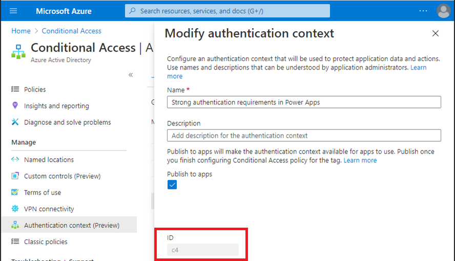

# Manage Power Apps

[!INCLUDE[new-PPAC-banner](~/includes/new-PPAC-banner.md)]

If you're an environment admin or a Microsoft Power Platform admin, you can manage the apps created in your organization.

Admins can do the following from the Power Platform admin center:

- Add or change the users with whom an app is shared
- Delete apps not currently in use

## Prerequisites

- Either a Power Apps plan or Power Automate plan. Alternatively, you can sign up for a [free Power Apps trial](/powerapps/maker/signup-for-powerapps).
- Power Apps environment admin or Power Platform admin permissions. For more information, see [Environments administration in Power Apps](environments-overview.md).

## Manage Power Apps

### [New admin center](#tab/new)

1. Sign in to the [Power Platform admin center](https://admin.powerplatform.microsoft.com/).
1. In the navigation pane, select **Manage**.
1. In the **Manage** pane, select **Environments**.
1. On the **Environments** page, select an environment.
1. In the **Resources** pane, select **Power Apps**.
1. Select the app you want to manage.
1. In the command bar, choose your desired action: **Share** or **Delete**.

### [Classic admin center](#tab/classic)

1. Sign in to the [Power Platform admin center](https://admin.powerplatform.microsoft.com/).
1. In the navigation pane, select **Environments**.
1. On the **Environments** page, select an environment.
1. In the **Resources** pane, select **Power Apps**.
1. Select the app you want to manage.
1. In the command bar, choose your desired action: **Share** or **Delete**.

---

## Manage who can share canvas apps

Power Apps respects the canvas app **Share** privilege in Dataverse. A user won't be able to share canvas apps in an environment if they don't have a security role with the Canvas App Share privilege set to a value other than **None selected**. This Dataverse Canvas App Share privilege is also respected in the default environment. This article outlines how to edit privileges in a security role: [Edit a security role](create-edit-security-role.md#edit-a-security-role).

> [!NOTE]
> The ability to granularly control the Canvas App Share privilege in a security role requires Dataverse in the environment where the privilege is to be changed. Power Apps doesn't discretely recognize the other Dataverse Canvas app entity privileges set for the environment. 
>
> System updates may remove customizations to [predefined security roles](database-security.md#predefined-security-roles), including Environment Maker. This means the removal of the canvas app share privilege may be reintroduced during a system update. Until the customization to the canvas app share privilege is preserved during system updates, the share privilege customization may need to be reapplied. 

### Surface your organization’s governance error content 
If you specify governance error message content to appear in error messages, it's included in the error message displayed when users observe they don’t have permission to share apps in an environment. Learn more in [PowerShell governance error message content commands](powerapps-powershell.md#governance-error-message-content-commands).

## Distinguish Microsoft SharePoint custom form makers from general Environment Makers

In addition to the ability to save SharePoint custom form resources to a nondefault environment, it's also possible to limit maker privileges to only be able to create and edit SharePoint custom forms in a nondefault environment. Outside of the default environment, an admin can unassign the Environment Maker security role from users and assign the SharePoint custom form maker security role. 

> [!NOTE]
> The ability to distinguish SharePoint custom form makers from general Environment Makers requires Dataverse in the environment where the privilege is to be changed.
>
> A user with only the SharePoint custom form maker role in an environment won't see the environment in the environment list in https://make.powerapps.com or https://flow.microsoft.com.

Do the following to limit maker privileges to only be able to create and edit SharePoint custom forms in a nondefault environment. 

1.	Have an admin [designate an environment for SharePoint custom forms](powerapps-powershell.md#designate-sharepoint-custom-form-environment) that is different from the default environment. 

2.	Have an admin install the [SharePoint custom form maker solution from AppSource](https://appsource.microsoft.com/product/dynamics-365/mscrm.sharepointcustomformmaker) to your environment designated for SharePoint custom forms.

3.	In the Power Platform admin center, select the environment you designated for SharePoint custom forms in step one and assign the SharePoint custom form maker security role to users expected to create SharePoint custom forms. See [Assign security roles to users in an environment that has a Dataverse database](database-security-configure.md#assign-security-roles-to-users-in-an-environment-that-has-a-dataverse-database). 

### Frequently asked questions

#### Can I edit privileges in the SharePoint custom form maker security role? 

No, the SharePoint custom form maker security role is added to an environment by importing a noncustomizable solution. Note, SharePoint custom form creation requires a user to have permissions in SharePoint and Power Platform. The platform verifies a user has write permissions for the targeted list created using Microsoft Lists and the user has permission in Power Platform to create or update the SharePoint custom form. For a SharePoint custom form maker to satisfy the Power Platform check, the user must have the SharePoint custom form security role or the Environment Maker security role.

#### Will a user with only the SharePoint custom form maker role see an environment in the make.powerapps.com environment picker? 

No, a maker that doesn’t have a security role called out in the [Choose environments documentation](/powerapps/maker/canvas-apps/intro-maker-portal#choose-an-environment) won't see the environment in the environment picker in https://make.powerapps.com. A user with the SharePoint custom form maker role might attempt to navigate to the environment by manipulating the URI. If the user attempts to create a standalone app, they’ll see a permission error. 

## Manage app quarantine state

As a complement to [Power Platform’s data loss prevention policies](wp-data-loss-prevention.md), Power platform enables admins to 'quarantine' a resource, setting guardrails for low-code development. A resource’s quarantine state is managed by admins and controls whether a resource is accessible to end users. In Power Apps, this capability allows admins to directly limit availability of apps that may need attention to meet an organization’s compliance requirements. 

> [!NOTE]
> A quarantined app won't be accessible to users who have never previously launched the app. 
> 
> A quarantined app may be accessible, momentarily, to users who have played the app before it was quarantined. These users may be able to use the quarantined app for a few seconds if they've used it in the past. But after that, they'll get a message telling them that the app is quarantined if they try to open it again.

The following table outlines how the quarantine state impacts experiences for admins, makers, and end users. 

| Persona  | Experience                                                                                                                                   |
|----------|----------------------------------------------------------------------------------------------------------------------------------------------|
| Admin    | Regardless of an app’s quarantine state, an app is visible to admins in the Power Platform Admin Center and PowerShell cmdlets.                  |
| Maker    | Regardless of an app’s quarantine state, an app is visible in https://make.powerapps.com and can be opened for editing in Power Apps Studio. |
| End User | A quarantined app presents end users that launch the app a message indicating they’re unable to access the app.                          |

End users will see an error message when they launch an app that has been quarantined. 

The following table reflects quarantine support:

| Power Apps type  | Quarantine support   |
|------------------|----------------------|
| Canvas app       | Generally Available  |
| Model-driven app | Not supported yet    |

### Quarantine an app
```PowerShell
Set-AppAsQuarantined -EnvironmentName <EnvironmentName> -AppName <AppName>
```

### Unquarantine an app
```PowerShell
Set-AppAsUnquarantined -EnvironmentName <EnvironmentName> -AppName <AppName>
```

### Get an app's quarantine state
```PowerShell
Get-AppQuarantineState -EnvironmentName <EnvironmentName> -AppName <AppName>
```

## Managed Environments: Conditional access on individual apps
In addition to respecting conditional access policies applied to the Power Apps service, in Managed Environments it's possible to apply Microsoft Entra conditional access policies to individual apps created using Power Apps. For example, an admin can apply a conditional access policy requiring multi-factor authentication only on apps containing sensitive data. Power Apps uses [conditional access authentication context](/entra/identity/conditional-access/concept-conditional-access-cloud-apps#authentication-context) as the mechanism to target conditional access policies on granular apps. Admins are the persona allowed to add and remove authentication contexts on an app. Makers can't edit authentication contexts on an app.   

> [!NOTE]
> 1. Authentication contexts set on an app aren't moved with apps in solutions and moved across environments. This allows different authentication contexts to be applied to apps in different environments. Also, as an app moves across environments via solutions the authentication context set in an environment is preserved. For example, if an authentication context is set on an app in a UAT environment, that authentication context is preserved. 
> 2. Multiple authentication contexts might be set on an app. An end user must pass the union of conditional access policies applied by multiple authentication contexts.
> 3. Conditional access on individual apps is a Managed Environments feature.

The following table outlines how conditional access enforcement on a specific app impacts the experiences for admins, makers, and end users.  

| Persona  | Experience     |
|----------|--------------|
| Admin    | Regardless of conditional access policies associated with an app, an app is visible to admins in Power Platform Admin Center and PowerShell cmdlets.  |
| Maker    | Regardless of conditional access policies associated with an app, an app is visible in https://make.powerapps.com and can be opened for editing in Power Apps Studio.|
| End User | Conditional access policies applied to an app are enforced when end users launch the app. A user that doesn't pass the conditional access checks is presented a dialog in the authentication experience indicating they’re not allowed to access the resource. |

After admins associate authentication contexts to conditional access policies in https://portal.azure.com they may set the authentication context ID on an app. The following image illustrates where to get the authentication context ID. 

> [!div class="mx-imgBorder"] 
> 

End users that don't meet the conditional access policy requirements receive an error message that indicates they don't have access.

The following table reflects conditional access on granular apps support:

| Power Apps type  | Conditional access on individual apps support |
|------------------|---------------------------------------------|
| Canvas app       | Preview availability                        |
| Model-driven app | Not supported                               |

### Add conditional access authentication context IDs to an app
```PowerShell
Set-AdminPowerAppConditionalAccessAuthenticationContextIds –EnvironmentName <EnvironmentName> -AppName <AppName> -AuthenticationContextIds <id1, id2, etc...>
```

### Get conditional access authentication context IDs set on an app
```PowerShell
Get-AdminPowerAppConditionalAccessAuthenticationContextIds –EnvironmentName <EnvironmentName> -AppName <AppName>
```

### Remove conditional access authentication context IDs on an app
```PowerShell
Remove-AdminPowerAppConditionalAccessAuthenticationContextIds –EnvironmentName <EnvironmentName> -AppName <AppName>
```

### Related content
[Power Apps admin PowerShell support](powerapps-powershell.md#power-apps-commands)


[!INCLUDE[footer-include](../includes/footer-banner.md)]
