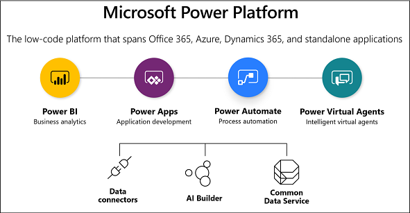

# Administering a Power Apps enterprise deployment

Power Apps is a high-productivity application development platform from Microsoft.  The platform is used by Microsoft to build their own first-party applications Dynamics 365 Sales, Service, Field Service, Marketing, and Talent.  This means these applications are built natively on the platform.   Enterprise customers can also build their own custom line-of-business applications using the same technology.  Individual users and teams within your organization can also build personal or team productivity applications with no-code or low-code. 

Check out the following downloadable whitepaper: [Administering a Power Apps enterprise deployment](https://aka.ms/powerappsadminwhitepaper)

This whitepaper is targeted toward the enterprise application administrator responsible for planning, securing, deploying, and supporting applications built on the Power Apps platform.  The goal of the paper is to help you understand what currently is in your environment, how to proactively plan for applications being developed and deployed and finally how to handle day to day administrative tasks to manage deployments.
In this whitepaper, we will cover key concepts, platform architecture, and decisions that will be necessary.  Where possible we will help you develop best practices for your organization to ensure successful deployments and high productivity for users using the platform.

The Power Apps platform is part of the larger Microsoft Power Platform that also includes Power BI and Power Automate, leveraging the common infrastructure of the Microsoft Dataverse and Data Connectors. These capabilities are built on and leverage Microsoft Azure cloud services.  Applications built on the Power Apps platform can also include Azure cloud services to scale from individual productivity to enterprise mission critical line-of-business applications.

