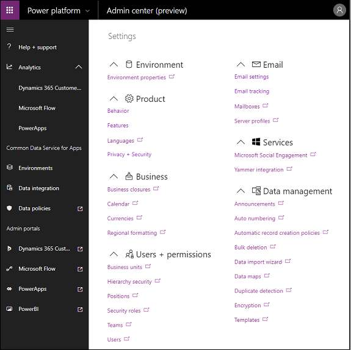
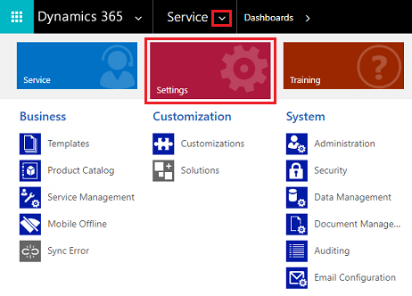

# Manage Microsoft Dataverse settings

You can view and manage the settings for your environments by signing in to the Microsoft [Power Platform admin center](https://admin.powerplatform.microsoft.com), going to the **Environments** page, selecting an environment, and then selecting **Settings**.

Settings for the selected environment can be managed here.

## Environment settings are moving
Across organization admin settings are gradually moving from the web client to the Power Platform admin center, Apps with unified interface, or Power Apps. Meanwhile, you’ll still be able to manage settings in customer engagement apps (Dynamics 365 Sales, Dynamics 365 Customer Service, Dynamics 365 Field Service, Dynamics 365 Marketing, and Dynamics 365 Project Service Automation), as usual.

Many of these settings...

...are moving here.

Use the links on this page to manage organization-wide settings. App-specific settings will remain in customer engagement apps and accessed through the app settings. 

## New location for admin settings
The following web client admin settings have moved.

### Security settings

These security settings are now managed in the Power Platform admin center.

- [Manage application users in the Power Platform admin center](manage-application-users.md)
- [Dataverse teams management](manage-teams.md)
- [Assign security roles to users in an environment that has a Dataverse database](database-security.md#assign-security-roles-to-users-in-an-environment-that-has-a-dataverse-database)

## App settings

Getting to app feature settings can vary based on the type of app you're using. 

The following app settings have modernized experience available in the unified interface - 

Legacy settings | Modernized experience  |
--- | --- | 
|**Administration** ||
| System Settings > Goals | Sales Hub|
|**Business Management**  ||
| Business Closures    | Customer Service Hub|
| Currencies           | App-less unified interface|
| Facilities/Equipment | Customer Service Hub|
| Goal Metrics        | Customer Service Hub|
| Queues              | Customer Service Hub|
| Resource Groups     | Customer Service Hub|
| Rollup Queries      | Sales Hub |
| Sales Territories   | Sales Hub |
| Services            | Customer Service Hub|
| Sites               | Customer Service Hub|
| Subjects            | Customer Service Hub|
| LinkedIn Sales Navigator |  Sales Hub     |
| **Data Management** | |
| Similar Record Suggestion Settings | Customer Service Hub|
| **Product Catalog** | |
|  Discount Lists     | Sales Hub|
|  Families & Products| Sales Hub|
|  Price Lists        | Sales Hub|
|  Unit Groups        | Sales Hub|
| **Service Management** | |
| Business Closures   | Customer Service Hub| 
| Categories          | Customer Service Hub|
| Customer Service Schedule | Customer Service Hub|
| Email Templates     | Customer Service Hub|
| Embedded Knowledge Search | Customer Service Hub|
| Entitlement Templates | Customer Service Hub|
| Entitlements         | Customer Service Hub|
| Facilities/Equipment | Customer Service Hub|
| Holiday Schedule     | Customer Service Hub|
| Parent and Child case settings | Customer Service Hub|
| Queues               | Customer Service Hub|
| Resource Groups      | Customer Service Hub|
| Routing Rule Sets    | Customer Service Hub|
| Service Configuration Settings | Customer Service Hub|
| Services             | Customer Service Hub|
| Sites                | Customer Service Hub|
|**Templates** | |
| Document Templates   | App-less unified interface|
| Email Signatures     | Customer Service Hub|
| Email Templates      | Customer Service Hub|

### Settings in Unified Interface apps

To open settings for apps that use [Unified Interface](about-unified-interface.md), look in the upper-right corner and select the **Gear** icon (). Then select **Advanced settings**. 

> [!div class="mx-imgBorder"] 
> 

### Settings in legacy web client apps

To open settings for legacy client apps, select the arrow next to the app name, and then select **Settings**. 

> [!div class="mx-imgBorder"] 
> 

[!INCLUDE[footer-include](../includes/footer-banner.md)]
