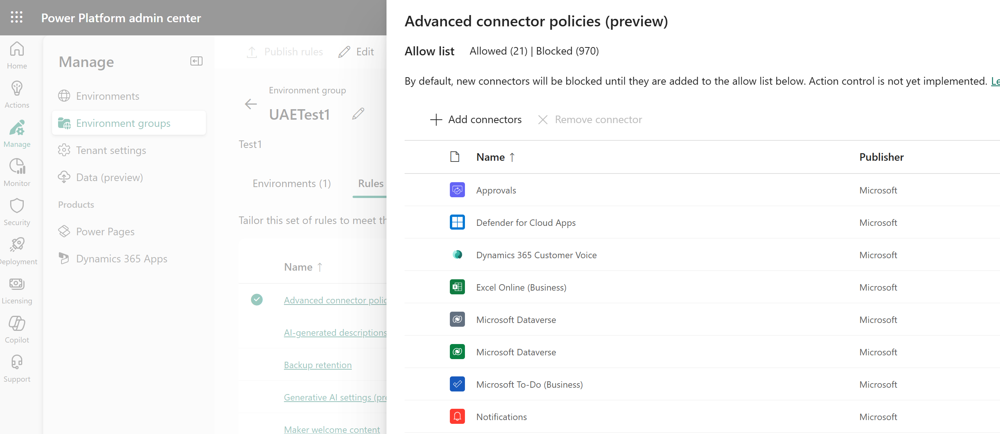
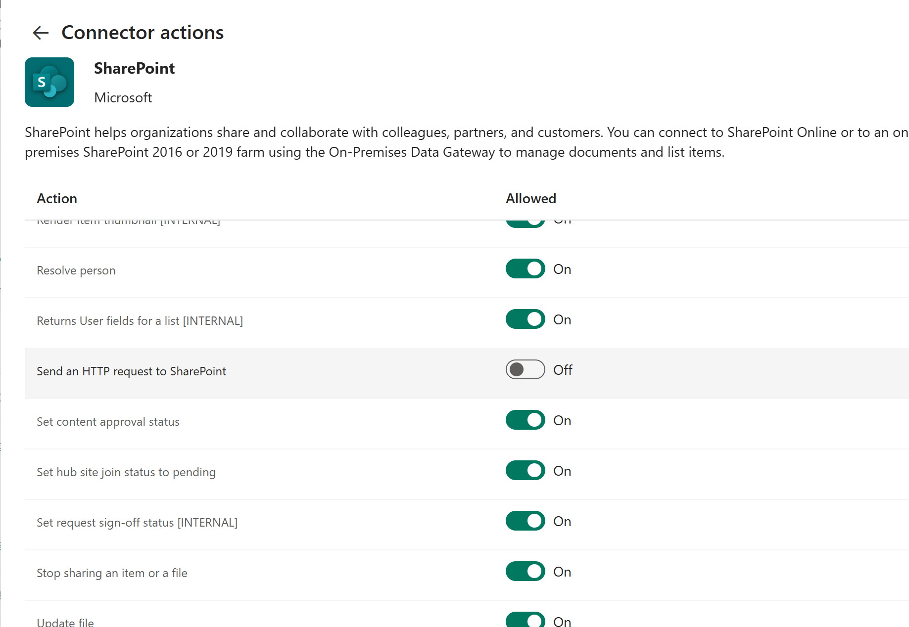

# Advanced connector policies (preview)

[!INCLUDE [cc-beta-prerelease-disclaimer](../includes/cc-beta-prerelease-disclaimer.md)]

## Overview
Advanced Connector Policies (ACP) represent the next generation of securing connector usage within the Power Platform. This feature provides a modern and flexible approach to managing all [Certified Connectors](/power-platform/admin/dlp-connector-classification), aligning with the broader governance strategy of per-environment security controls paired with [environment group support](power-platform/admin/environment-groups).

By adopting Advanced Connector Policies, administrators gain greater control and granularity in securing and managing connector usage while enhancing the overall governance of their Power Platform environments.

## Known limitations

While Advanced Connector Policies (ACP) offer robust capabilities, there are a few limitations to consider:

1. **Environment Group dependencies**: Per-environment support is not yet available.  When it becomes available we will update this article.
2. **Endpoint filtering**: Endpoint filtering will be replaced by a broader Connection Parameter Filtering capability of which is not yet available.
3. **Managed environments**: This feature require's managed environments to be enabled.  In the future you will be able to use it on non-managed environments provided that you are not limiting the non-blockable connectors.  

## Configure a Policy

To configure an Advanced Connector Policy, follow these steps:

1. **Access the Admin Center**: Navigate to the Power Platform Admin Center and select the environment group where the policy will be applied.
2. **Select the Rules tab**: Under the Rules tab, choose **Advanced Connector Policies (Preview)**.
 

3. **Define the policy**:
   - By default, the non-blockable connectors are pre-loaded as Allowed.
   - Add new connectors by clicking the **Add connectors** button to choose from all Certified Connectors.
   - Remove connectors by clicking the **Remove connectors** button.  You can remove any connector and it will be blocked.
4. **Save the Policy**:
   - When all connectors are set as you require, click the **Save** button.
5. **Publish**: After all rules are updated to your requirements, click the Publish button.

During publishing, an environment lifecycle operation will be performed on every environment that is part of the group, or the individual environment depending on where you are configuring the policy.  This operation will be available in environment history as *Update Managed Environment Settings* and will be what cascades the new connector policy to the design time and runtime infrastructure.

### More visibility and control

Previously, in Data Policies (DLP) customers could not see Triggers, Internal Actions, or if an action is Deprecated.  We have now added these tags across all certified connectors so that administrators can quickly decide to block specific triggers from use or turning off actions which are deprecated and no longer supported by the connector publisher.

### Easier management experience

We have taken feedback from customers and drastically simplified the management experience by making the policy a strict allow list.  When configured, all new connectors are blocked.  If you configure the allowed actions on a given connector, then no new actions, triggers, or internal actions will be allowed.  The concept of the Business and Non-Business categories in Data Policies (DLP) is not brought forward as it was not deemed effective in policy management.  

### Proactive policy management

Advanced connector policies has shipped as part of environment groups and rules.  These have publicly documented APIs available on [Power Platform API](/rest/api/power-platform/environmentmanagement/environment-groups) so that you can build automated scenarios such as creating new policies, updating policies, and moving environments in to groups for management at scale. 

## Data Policy (DLP) Mixed Mode

Advanced connector policies (ACP) can be used in mixed mode with classic Data Policies (DLP).  This allows for complimenting configurations to be made such that DLP can achieve action control and endpoint filtering until such time as those features are native to ACP.  In addition, you can use ACP to block any connector which is not possible in classic DLP.  

At runtime, when a connector operation is invoked, it will query the effective policy for the current hosting environment.  This will include a combined policy that merges the most restrictive settings from both classic DLP and ACP to provide full enforcement.

In the future, a separate rule will become available to allow you to skip Data Policy (DLP) evaluation in favor of only relying upon Connector Policy.  

## Provide Feedback

Trying out the new Advanced connector policies?  We would love your feedback!  Please join our Viva Engage network for keeping the conversation going under non-disclosure agreement (NDA):
[Public Preview - Advanced Connector Policies](https://www.yammer.com/dynamicsaxfeedbackprograms/#/threads/inGroup?type=in_group&feedId=215134347264&view=all).
