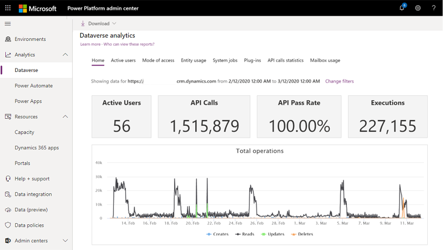
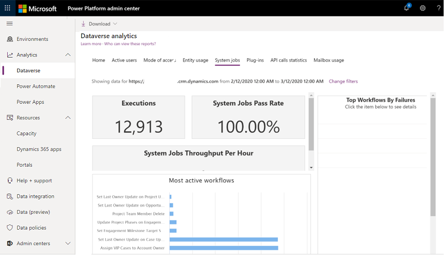

# Microsoft Dataverse analytics 

[!INCLUDE [cc-data-platform-banner](../includes/cc-data-platform-banner.md)]

We've improved how you view metrics for your organization. You no longer need to install or update a solution. Instead, you can view Dataverse analytics right from the Power Platform admin center to quickly view adoption ad user metrics for your organization. 

To access these reports:

1. Go to the navigation bar on the left side.
2. Select **Analytics**.
3. Select **Common Data Service**.
4. View the reports on the right side.

## Who can view these reports?

Admins with the following roles and a [license](pricing-billing-skus.md) can view the reports in Dataverse analytics: 
- Environment Admin - can view reports for the environments that the admin has access to.
- Power Platform admin – can view reports for all environments.
- Dynamics 365 admin - can view reports for all environments.
- Microsoft 365 Global admin – can view reports for all environments.

For more information on the different roles for managing your tenant across the platform, see [Use service admin roles to manage your tenant](use-service-admin-role-manage-tenant.md).

 **Key highlights**  

- **Deprecating the solution**: Organization Insights, available as a preferred solution from AppSource, will no longer be supported or available for use in future releases.  

- **Deprecating Organization Insights dashboard**: This dashboard will be removed from Dataverse in future releases. 

- **Monitor adoption and use**: Identify your most active users, the number and types of operations they're performing, number of pages requests, most-used entities, workflows, plug-ins, and more, over a period of time as you work toward your adoption goals.  

- **Manage storage and performance**: Monitor storage quotas, storage use, and top tables by size to optimize performance.  

- **Troubleshoot effectively**: Drill down into the details of your top failing workflows and API calls to quickly diagnose and troubleshoot errors.

   

## Home (default)  

> [!div class="mx-imgBorder"] 
>   

### About this dashboard  
 This is the default dashboard that provides information on the number of active Dataverse users, storage usage, the most active workflows, and more.  

### What's included in this dashboard  

> [!div class="mx-tableFixed"]
> |Chart element|Description|  
> |--------------|-----------------|  
> |           Active Users            |                         Number of active users (unique users) who performed an operation that caused one of these SDK calls:  `Retrieve`, `Retrieve Multiple`, `Delete`, `Create`, and `Update`.                          |
> |             API Calls             |                                            Number of API calls that were made by the Dataverse environment for the selected time period.                                            |
> |            API Pass Rate             |                        This chart shows the API pass rate as percentage of total API calls that were made in the Dataverse environment over the specified time.                        |
> |           Executions            |                                        This chart shows how many plug-ins have been executed in the Dataverse environment over the specified time.                                        |
> |            Total Operations             |                         This chart shows how many operations (create, update, deletes, reads) have occurred in the Dataverse environment over the specified time.                         |
> | Most Active Users Performing Operations | List of most active users who performed an operation that caused a `Create`, `Update`, `Read`, or `Delete` SDK call in the [!INCLUDE[pn_crm_shortest](../includes/pn-crm-shortest.md)] environment over the selected time period. |
> |        Top Plug-ins by Failures         |                                            This chart shows top 10 most failing plug-in in the Dataverse environment over the specified time.                                             |

   

## Active Users  

> [!div class="mx-imgBorder"] 
>   
 
### About this dashboard  
 Use this dashboard to find out how many [!INCLUDE[pn_dyn_365](../includes/pn-dyn-365.md)] users there are, how many licenses are in use, what custom entities are used most frequently, and more.  

### What's included in this dashboard  

> [!div class="mx-tableFixed"]
> |Chart element|Description|  
> |--------------|-----------------|  
> |             Total Active Users              |                            Total number of active users (unique users) who performed an operation that caused one of these SDK calls:  `Retrieve`, `Retrieve Multiple`, `Delete`, `Create`, and `Update`.                            | 
> |             Most Used  Entities             |                                                            Ten Entities which had the most  `Retrieve`, `Retrieve Multiple`, `Delete`, `Create`, and  `Update SDK Calls`.                                                             | 
> |             Total Page Requests             | The number of page load requests for forms, dashboards, and reports. This is the count of requests received by the [!INCLUDE[pn_dyn_365](../includes/pn-dyn-365.md)] server. Pages that are cached while browsing won't be counted. | 
> |              Total Operations               |                         This chart shows how many operations (create, update, deletes, reads) have occurred in the Dataverse environment for the selected time period.                         | 
> | Active Users Performing Specific Operations |                       Total number of active users (unique users) over time who performed an operation that caused one of these SDK calls:  `Retrieve`, `Retrieve Multiple`, `Delete`, `Create`, and `Update`.                       | 
> |                Active Users                 |                 Number of active users (unique users) in your environment who performed an operation that caused one of these SDK calls:  `Retrieve`, `Retrieve Multiple`, `Delete`, `Create`, and `Update` over time.                  | 
> |   Most Active Users Performing Operations   |                        List of  most active users (unique users) over time who performed an operation that caused one of these SDK calls:  `Retrieve`, `Retrieve Multiple`, `Delete`, `Create`, and `Update`.                        | 
> |          Most Used Custom Entities          |   List of custom entities which had the most  `Retrieve`, `Retrieve Multiple`, `Delete`, `Create`, and  `Update SDK Calls`.                                                       | 
> |           Most Used OOB Entities            |  List of out-of-box entities which had the most  `Retrieve`, `Retrieve Multiple`, `Delete`, `Create`, and  `Update SDK Calls`.                                                     | 
> |          Usage Active Users by OS           |                                                                                           The number of active users by operating system.                                                                                           | 
> |         Active Users by Device Type         |                                                                                             The number of active users by device type.                                                                                              | 
> |           Active Users by Browser           |                                                                                               The number of active users by browser.                                                                                                | 
> |       Active Users by Security Roles        |                                                                                            The number of active users by security roles.                                                                                            | 
> |           Users by Business Unit            |                                                                                            The number of active users by business unit.                                                                                             | 
> |         Number of Creates by Entity         |                                    How many create operations are performed by the selected user in the Dataverse environment for the selected time period.                                    | 
> |         Number of Updates by Entity         |                         How many update operations are performed on different entities by the selected user in the Dataverse environment for the selected time period.                         | 
> |          Number of Reads by Entity          |                          How many read operations are performed on different entities by the selected user in the Dataverse environment for the selected time period.                          | 
> |         Number of Deletes by Entity         |                         How many delete operations are performed on different entities by the selected user in the Dataverse environment for the selected time period.                         | 
> |         Total Operations Over Time          |                                        The total operations performed by the selected user in the Dataverse environment over the selected time period.                                         | 
> |         Total Operations by Entity          |                              The total operations performed on different entities by the selected user in the Dataverse environment for the selected time period.                              | 
> |          Active Users by Entities           |                                                                            Show the active users distributed over different entities                                                                            | 
> |           Active Users by Client            |                                                                                   The active users distributed by client type                                                                                  | 
> |   Active Users Using More than One Client   |                                                      The number of active users using more than one client, distributed over different client combinations                                                       | 

> [!NOTE]
> **Retrieve** and **RetrieveMultiple** SDK calls are reported as **Reads**.  

### Update frequency  
 Active usage chart data is updated as follows.  

|Chart|Update frequency|  
|-----------|----------------------|  
|Total Active Users|24 hours|  
|Most Used Entities|24 hours|  
|Most Active Users (Reads)|24 hours|  
|Total API Calls|24 hours|  
|Total Page Requests|24 hours|  
|Most Active Users (Changes)|24 hours|  
|Total Operations|24 hours|  
|Active Users Performing Specific Operations|24 hours|  
|Active Users|24 hours|  
|Most Active Users Performing Operations|24 hours|  
|Most Used Custom Entities|24 hours|  
|Most Used OOB Entities|24 hours|  

   

## System Jobs  

> [!div class="mx-imgBorder"] 
> 
   
### About this dashboard  
 Use this dashboard to monitor and troubleshoot workflows.  

### What's included in this dashboard  

> [!div class="mx-tableFixed"]
> |Chart element|Description|  
> |--------------|-----------------|  
> |      Workflow Executions      | This chart shows how many workflows have been executed in the Dataverse environment over the specified time. | 
> |     System Jobs Pass Rate     | This chart shows the system job's pass rate as percentage of system jobs that were executed in the Dataverse environment over the specified time.  | 
> | System Jobs Throughput/Minute | This chart shows the average system jobs that have been executed per hour in the Dataverse environment over the specified time. | 
> |    Executions and Backlog     |  This chart shows the number of executions and the backlog for system jobs in the Dataverse environment over the specified time.   | 
> |     Most Active Workflows     |  This chart shows top 10 most executed workflows in the Dataverse environment over the specified time.  | 
> |   Top Workflows by Failures   | This chart shows top 10 most failing workflows in the Dataverse environment over the specified time. Click on a workflow to see the failures and their number of occurrences. | 

### Update frequency  
 System jobs chart data is updated as follows.  

|Chart|Update frequency|  
|-----------|----------------------|  
|Workflow Executions|24 hours|  
|System Jobs Pass Rate|24 hours|  
|System Jobs Throughput / Hour|24 hours|  
|Most Active Workflows|24 hours|  
|System Jobs Executions and Backlog|24 hours|  
|Top Workflows by Failures|24 hours|  

   

## Plug-ins  

> [!div class="mx-imgBorder"] 
>   

### About this dashboard  
 Use this dashboard to monitor and troubleshoot plug-ins.  

### What's included in this dashboard  

> [!div class="mx-tableFixed"]
> |Chart element|Description|  
> |--------------|-----------------|  
> |      Plug-in Success Rate      | This chart shows the plug-in pass rate as percentage of total plug-in executions that were executed in the Dataverse environment over the specified time. | 
> |       Plug-in Executions       |                        This chart shows how many plug-ins have been executed in the Dataverse environment over the specified time.                        | 
> | Average Plug-in Execution Time |                This chart shows average time taken to successfully execute a plug-in in the Dataverse environment over the specified time.                | 
> |      Most Active Plug-ins      |                           This chart shows top 10 most executed plug-ins in the Dataverse environment over the specified time.                            | 
> |    Top Plug-ins by Failures    |                            This chart shows top 10 most failing plug-ins in the Dataverse environment over the specified time.                            | 

### Update frequency  
 Plug-ins chart data is updated as follows.  

|Chart|Update frequency|  
|-----------|----------------------|  
|Plug-in Success Rate|24 hours|  
|Most Active Plug-ins|24 hours|  
|Plug-in Executions|24 hours|  
|Average Plug-in Execution Time|24 hours|  
|Top Plug-ins by Failures|24 hours|  

   

## API Call Statistics  

> [!div class="mx-imgBorder"] 
>   

### About this dashboard  
 Use this dashboard to monitor and troubleshoot API calls.  

### What's included in this dashboard  

> [!div class="mx-tableFixed"]
> |Chart element|Description|  
> |--------------|-----------------|  
> |  API Success Rate   | This chart shows the API success rate as percentage of total API calls that were made in the Dataverse environment over the specified time. | 
> | Top API by Failures |  This chart shows top 10 failing API calls in the Dataverse environment over the specified time.  | 
> |   Total API Calls   | This chart shows how many API calls have been made in total in the Dataverse environment over the specified time.     | 
> |    Most Used API    | This chart shows top 10 most executed API calls in the Dataverse environment database. Adding the individual counts here will provide the total of the top 10 API calls. This will not be the same as the all up Total API Calls metric above.       | 
> |      API Calls      | This chart shows how many API calls have been made over time in the Dataverse environment over the specified time. Adding up the individual counts will equal the Total API Calls count.  |

### Update frequency  
 API Call Statistics chart data is updated as follows.  

|Chart|Update frequency|  
|-----------|----------------------|  
|API Success Rate|24 hours|  
|Top API by Failures|24 hours|  
|Most Used API|24 hours|  
|Total API Calls|24 hours|  
|API Calls|24 hours|  

   

## Mailbox Usage  

> [!div class="mx-imgBorder"] 
>   
 
### About this dashboard  

 Use this dashboard to monitor email mailbox usage.  

### What's included in this dashboard  

> [!div class="mx-tableFixed"]
> |Chart element|Description|  
> |--------------|-----------------|  
> |         Mailbox Details by GEO         | This chart shows mailbox details like: <ul><li>the number of server-side synch configured mailboxes</li><li>the number of server-side synch enabled mailboxes</li><li>the number of server-side synch Appointments, Contacts, and Tasks enabled mailboxes</li><li>the number of server-side synch incoming enabled mailboxes</li><li>the number of server-side synch outgoing enabled mailboxes categorized by the geo location the mailbox is hosted in</li></ul> | 
> |        Mailboxes by Server Type |  This chart shows the mailbox distribution by server type.  | 
> |  Active Email Server Profiles by Geo   | This chart shows active server-side synch enabled mailboxes distributed over the geo location they are hosted in.  | 
> |  Mailboxes by Exchange Configuration  |  This chart shows the number of mailboxes categorized by their [!INCLUDE[pn_Exchange](../includes/pn-exchange.md)] configuration.  | 
> | Number of Mailbox Configuration Errors | This chart shows the number of mailboxes configuration errors which occurred over the user-selected time frame. | 
> | Mailbox Usage  |  This chart shows the number of server-side synch mailboxes over the time range selected by the user. | 
> |      Number of Outlook Mailboxes       |   This chart shows the number of [!INCLUDE[pn_Outlook_short](../includes/pn-outlook-short.md)] mailboxes configured for the organization.  | 
> | Number of Active Email Server Profiles |  This chart shows the number of active email server profiles for the time range configured by the user.   | 

### Update frequency  
 Mailbox Usage chart data is updated as follows.  

|Chart|Update frequency|  
|-----------|----------------------|  
|Mailbox Details by Geo|24 hours|  
|Active Email Server Profiles by Geo|24 hours|  
|Mailboxes by Server Type|24 hours|  
|Mailbox Usage|24 hours|  
|Number of Mailbox Configuration Errors|24 hours|  
|Number of Active Email Server Profiles|24 hours|  
|Number of Outlook Mailboxes|24 hours|  
|Mailboxes by Exchange Configuration|24 hours|  

## Download Reports

Select **Download** to view available downloads and then select any of the reports to download them into Microsoft Excel.

All the download reports, except "Active Dynamics 365 Customer Engagement Plan Users by Application", show data:   
- for an environment  
  and  
- per the timeline in the filters for the out-of-box Dataverse analytics reports. If you select a certain date range for the out-of-box Dataverse reports, the same time filter applies to the downloads.  
- The maximum duration for data availability is 30 days.

The "Active Dynamics 365 Customer Engagement Plan Users by Application" report always shows the last 30 days of data at the tenant level. 

> [!div class="mx-imgBorder"] 
>   

### What's included  

> [!div class="mx-tableFixed"]
> |Chart element|Description|  
> |--------------|-----------------|  
> | Active users by device type  | List of active users by device type used to access [!INCLUDE [pn-dyn-365](../includes/pn-dyn-365.md)]  |
> | Active users by business unit  | List of active users by their business unit  |
> | Active users by security role  | List of active users by their security roles  |
> | Active users by client  | List of active users, by client type used to access [!INCLUDE [pn-dyn-365](../includes/pn-dyn-365.md)]  |
> | Active users by entities | List of active users distributed by entity   |
> | Most active users performing operations | List of  most active users (unique users) over time who performed an operation that caused one of these SDK calls:  `Retrieve`, `Retrieve Multiple`, `Delete`, `Create`, and `Update`. |
> | Most used custom entities |  List of custom entities which had the most  `Retrieve`, `Retrieve Multiple`, `Delete`, `Create`, and  `Update SDK Calls`. |
> | Most used OOB entities  |  List of out-of-box entities which had the most  `Retrieve`, `Retrieve Multiple`, `Delete`, `Create`, and  `Update SDK Calls`. |
> | Most active workflows | List of top 10 most executed workflows in the Dataverse environment over the specified time.   |
> | Most active plug-ins | List of top 10 most executed plug-ins in the Dataverse environment over the specified time.  |
> | Most used API  | List of top 10 most executed API calls in the Dataverse environment database.   |
> | Active Dynamics 365 Customer Engagement Plan Users by Application | Active Dynamics 365 Customer Engagement plan users by application. Helps customers to know usage across different apps and entities so that when it is time to renew their subscription, they can chose the individual apps to be bought (for example Dynamics 365 for Sales, Dynamics 365 for Customer Service, etc.). The Customer Engagement plan which was a suite of all Customer Engagement applications is no longer being sold and people need to choose the individual apps to be bought.    |
> | Non-conformant usage by users with Team Member license   | Shows customers how their users (with team member licenses) are using the product in ways that are deemed to be not conformant with the use rights entitled to this license, as per licensing guide.   |

   

## View data for different environments and date-time ranges

Select **Change filters**.  

> [!div class="mx-imgBorder"] 
>   

Select the environment and time-period from the drop-down lists, and then select **Apply** to save the changes. All the Dataverse analytics reports are available using this selection. 

> [!div class="mx-imgBorder"] 
>   
