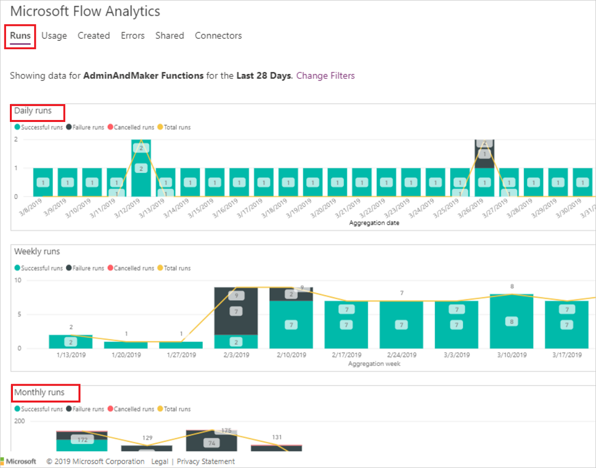
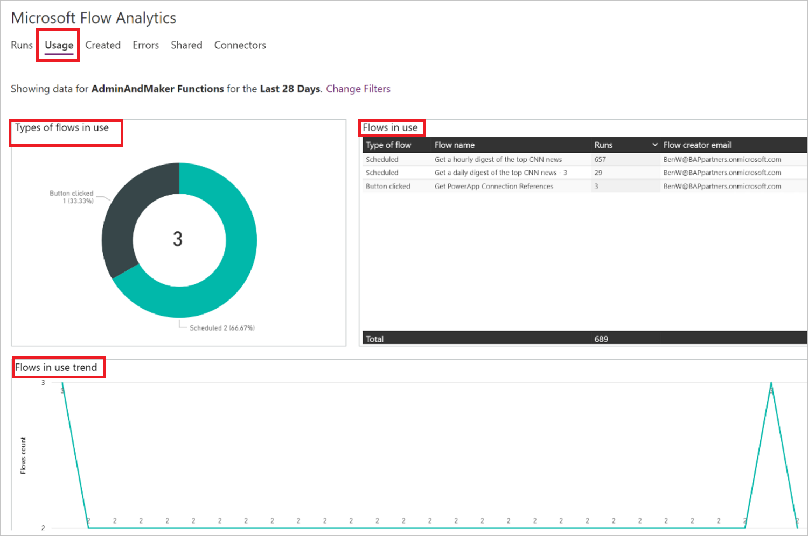
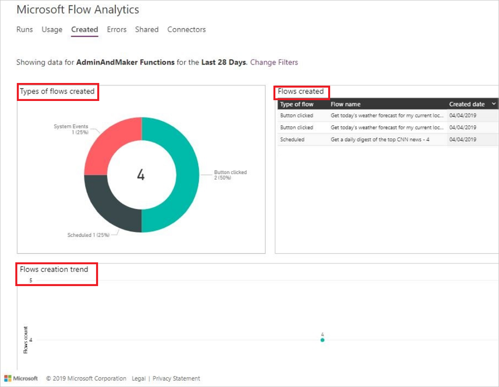
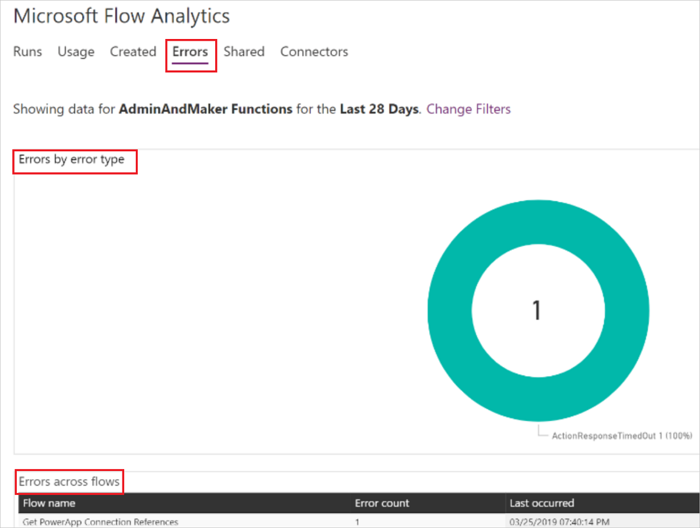
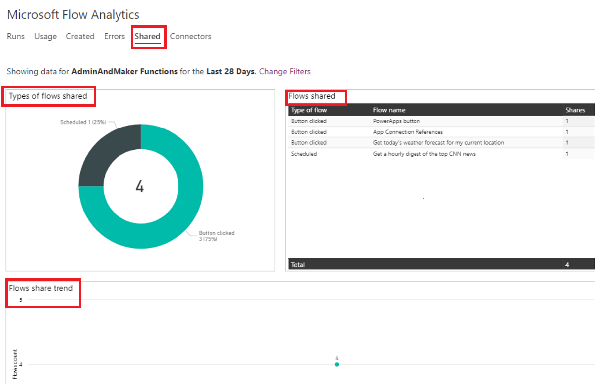
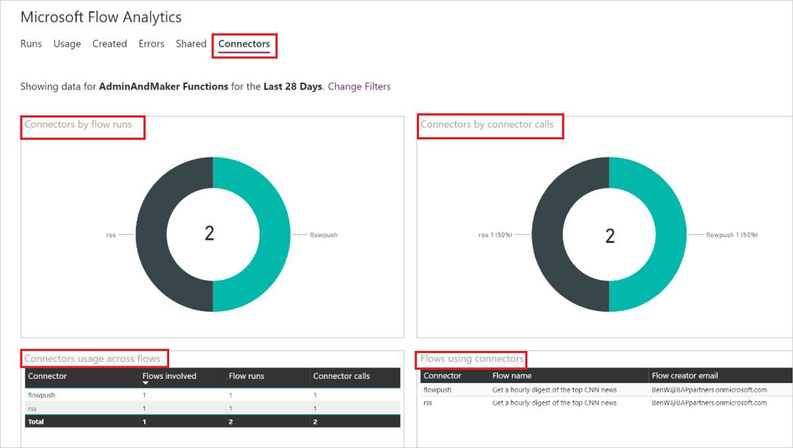
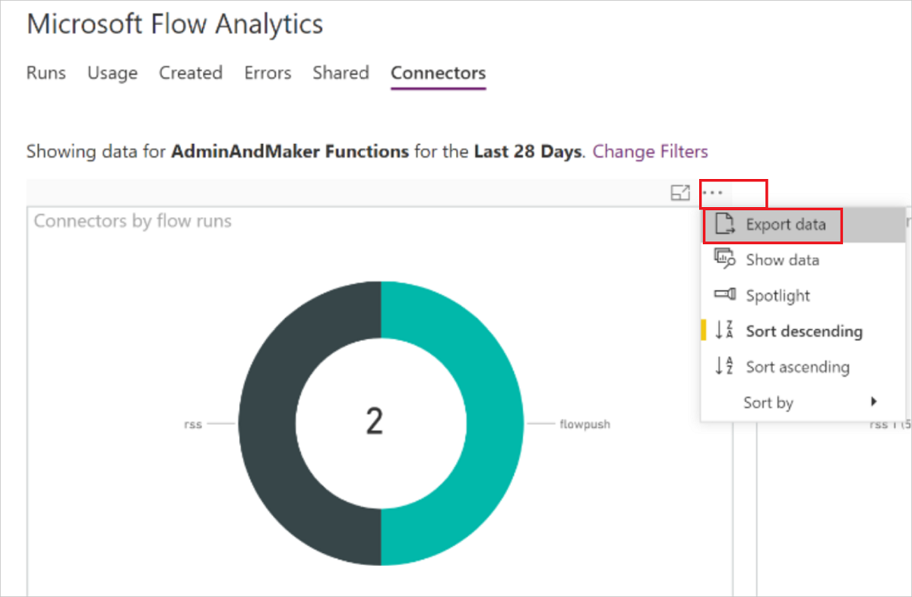
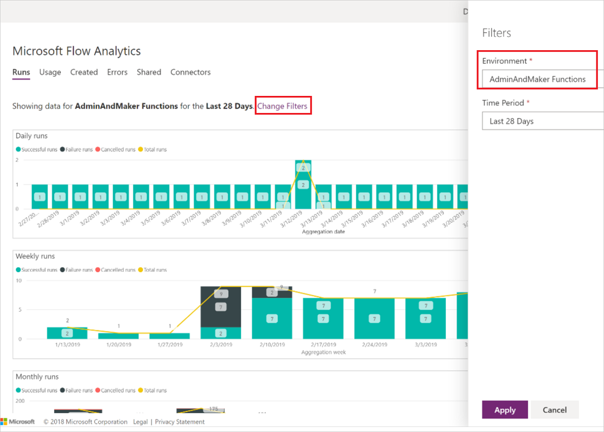

# View analytics for cloud flows

[!INCLUDE[new-PPAC-banner](~/includes/new-PPAC-banner.md)]

Environment admins can access analytics for Power Automate in the Microsoft [Power Platform admin center](https://admin.powerplatform.microsoft.com/analytics/flow). The reports provide insights into runs, usage, errors, types of flows created—such as automated, button, scheduled, approval, and business process flows. They also include details on shared flows and connectors associated with each flow type. However, these reports don't include insights for desktop flows.

To access these reports:

1. Sign in to the [Power Platform admin center](https://admin.powerplatform.microsoft.com/).
1. In the navigation pane, select **Manage**.
1. In the **Manage** pane, under **Products**, select **Power Automate**.
1. View the reports on the right side. 

### [Classic admin center](#tab/classic)
1. Sign in to the [Power Platform admin center](https://admin.powerplatform.microsoft.com/).
1. In the navigation pane, expand **Analytics**, then select **Power Automate**.
1. View the reports on the right side. 
---

## Who can view these reports?

Admins with the following roles and a [license](pricing-billing-skus.md) can view the reports in Power Automate analytics:
- Environment Admin - can view reports for the environments that the admin has access to.
- Power Platform admin – can view reports for all environments.
- Dynamics 365 admin - can view reports for all environments.
- Microsoft 365 Global admin – can view reports for all environments.

For more information on the different roles for managing your tenant across the platform, see [Use service admin roles to manage your tenant](use-service-admin-role-manage-tenant.md).

## Data storage

When a user creates an environment in a region, it is hosted there, and all data remains within that region for up to 28 days. 

The data refresh cycle is about 24 hours and you can find the last refresh time at the top right corner of the page.

## What are the available reports?

The following tenant-level reports are available for tenant and environment admins. The reports within the **Runs**, **Usage**, **Created**, and **Errors** tabs provide insights for Cloud flows and Desktop flows. By default, you see reports for the last viewed environment.

### Runs report

By default, you see the **Runs** report. It provides a view into the daily, weekly, and monthly run data of all flows in an environment.

### Usage report

This report provides insights into the different types of flows in use, the trends, and the flow creator's names.

### Created report

This report provides insights into the types of flows created, trends, and details like the created date and the creator's email address.

### Error report

This report provides insights into recurring error types and details like the error count, creator's email address, last occurred time, and the creator's email address for each flow.

### Shared report

This report provides details on the flows shared and trends in the environment.

### Connectors report

This report provides details on connectors and their associated flows. Metrics like the number of calls from each flow per connector, flow runs, and the flow creator's email address are available for both standard and custom connectors.

## Download reports

The reports are built with Power BI. Users can select the ellipsis (…) for a KPI and then select **Export data**.

## View reports in other environments

To view reports in another environment:

1. Select **Change Filters**.
1. Select the new environment from the **Environment** list and optionally, select a **Time Period**.
1. Select **Apply**.

[!INCLUDE[footer-include](../includes/footer-banner.md)]
