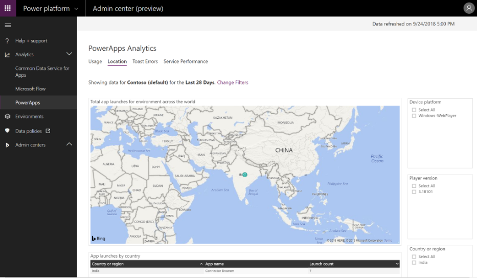
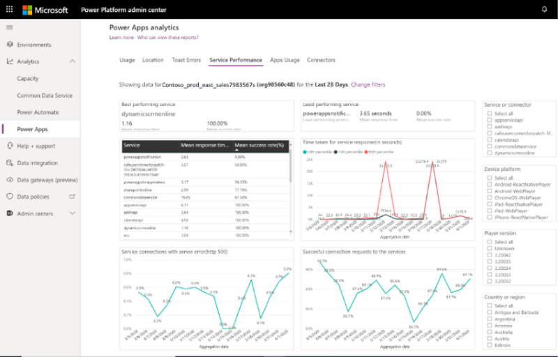
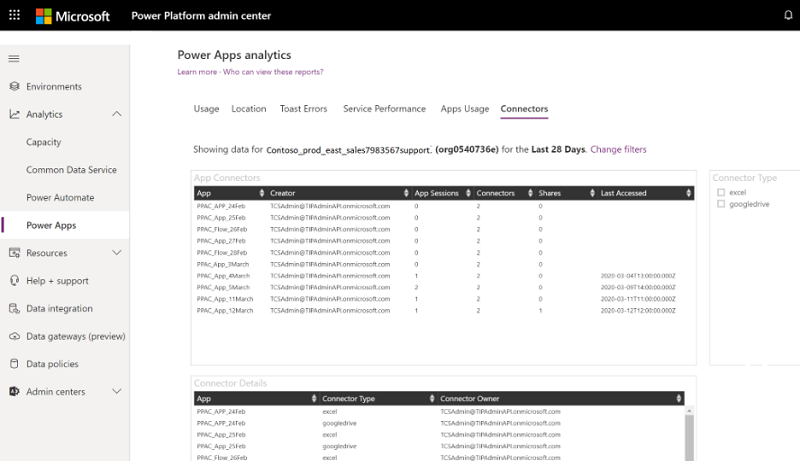
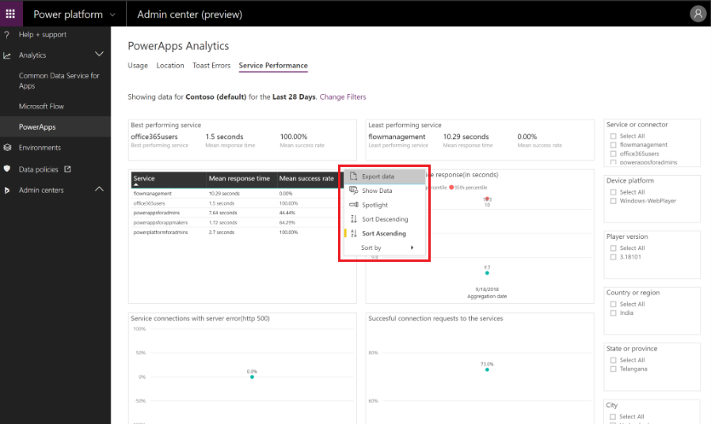
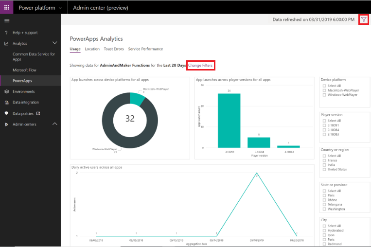
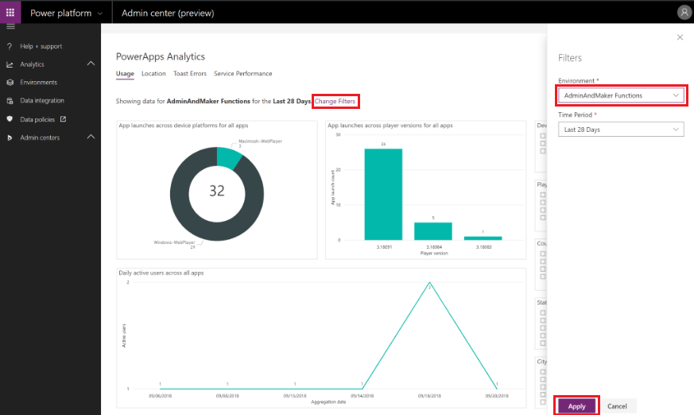

# Admin Analytics for Power Apps

Analytics for the environment admin is available at the Microsoft Power Platform admin center. The admin reports provide a view into environment level usage, errors, service performance to drive governance, and change management services to users. These reports are available for canvas apps only and not available for model-driven apps.

To access these reports, sign in to the Power Platform admin center and select **Analytics** > **Power Apps**. Reports appear in a menu bar at the top of the page.

> [!div class="mx-imgBorder"] 
> 

## Who can view these reports?

Admins with the following roles and a [license](pricing-billing-skus.md) can view the reports in Power Apps analytics:
- Environment Admin - can view reports for the environments that the admin has access to.
- Power Platform admin – can view reports for all environments.
- Dynamics 365 admin - can view reports for all environments.
- Microsoft 365 Global admin – can view reports for all environments.

For more information on the different roles for managing your tenant across the platform, see [Use service admin roles to manage your tenant](use-service-admin-role-manage-tenant.md).

## Where is my data stored? 

When a user first creates an environment from a region, the environment is always hosted in that region. The data is stored only in the region that an environment is hosted in. Data is stored for a maximum of 28 days. The data refresh cycle is about 3 hours and the last refresh time in UTC time standard is displayed on the upper-right corner of the page. 

## What are the available reports? 

The following tenant-level reports are available for tenant admins. 

### Power Apps - Usage report 

Power Apps reports provide insights into tenant and environment usage and inventory of all apps and connectors. The report answers questions such as: 
- What is the total unique canvas/model-driven apps users across the tenant or environments? 
- What is the count of first-time users across canvas and model-driven apps? 
- How many apps exist in my tenant or environment? 
- Which of my environments had the most unique users? 
- What were the top apps by unique users/app sessions? 

:::image type="content" source="media/powerapps-usage-report.png" alt-text="Power Apps Usage report":::

> [!NOTE]
> The service only starts collecting the data visualized in the Usage report when the feature is enabled. It can take up to 12 hours to reflect service activities from the previous day. 

### Power Apps - Maker Activity report 

The Power Apps Maker Activity report provide insights into tenant and environment usage and inventory of all apps and connectors. The report answers questions such as: 

- What is the total number of apps created/published/modified/deleted by app makers across the tenant or environments? 
- What is the count of first-time makers across canvas and model-driven apps? 
- Who are the top makers across the tenant or environments? 
- How many of these apps are using premium or standard connectors? 
- What are the total number of connections defined for apps to consume in one or more environments? 
- Allow me to filter the above list based on connector type. 

:::image type="content" source="media/powerapps-maker-activity-report.png" alt-text="Power Apps Maker Activity report":::

> [!NOTE]
> The service only starts collecting the data visualized in the Maker Activity report when the feature is enabled. It can take up to 12 hours to reflect service activities from the previous day. 

### Power Apps - Inventory report 

The Power Apps Inventory report offers a complete catalog of Power Apps distributed across the tenant. This view includes filters that allow admins to search for apps based on various criteria. The report answers questions such as: 

- What is the total number of model-driven and canvas apps across the tenant or environments? 
- Which apps depend on specific connectors or connector types like Premium? 
- Who are the owners of the apps hosted in one or more environments? 
- What is the distribution of canvas versus model-driven apps across the organization? 

:::image type="content" source="media/powerapps-inventory-report.png" alt-text="Power Apps Inventory report":::

> [!NOTE]
> Depending on the size of the organization, it can take up to 2 hours to initially populate the data sets backing the Inventory report. 

### Download Inventory 

Power Platform admin center reports can be downloaded directly from the report visuals. Users have the option of choosing between Summarized and Underlying data. 

- Summarized data: select this option to download the data underlying the current report visual 
- Underlying data: select this option to download the full result set backing the report 

:::image type="content" source="media/powerapps-download-inventory.png" alt-text="Power Apps download reports from Inventory tab":::

For more information on downloading data from the tenant level reports, see [Exporting data from Power BI visuals](/power-bi/consumer/end-user-export). 

<!-- current content

There are six reports available for Power Apps admins. The last viewed environment is selected by default.  

**Usage** report is the default reports seen by the logged in environment admin. It provides total app launches and daily active users across all apps in the environment. Admins can filter the view with attributes like device platform, player version, country, state, and city.

> [!div class="mx-imgBorder"] 
> 

**Location** report provides a map-based view of usage. It gives an insight into regional adoption and usage trends.  

> [!div class="mx-imgBorder"] 
> 

**Toast Errors** report provides insights into the toast error trends, types, and counts per app to help drive improvements in app quality. The toast errors are errors displayed to the end users of the app. 

> [!div class="mx-imgBorder"] 
> 

**Service Performance** report provides details of all standard and custom connectors to understand performance bottlenecks and client versus service API issues. An environment admin will get insights into:  

- Connectors used in the environment. 
- Best and least performant service and the API service response times.  
- Success rates for each service to determine areas that need attention. 
- The 50th, 75th, and 90th percentile response times for each service. 
- The number of HTTP 500 error codes of connectors indicating issues around the server not responding to calls from the client. 
- The number of successful connection requests. 

All the service performance KPI's can be filtered with attributes like a specific service or connector, device platform, player version, and country, state, or city to drill down into the specific API. 

> [!div class="mx-imgBorder"] 
> 

**Connectors report** provides visibility into the standard and custom connectors being used by canvas apps. The last 28 days of data is visible at the environment level.  

Admins can gain insights into the number of connectors associated with each app, the specific connectors being used by each app, and the owner of the connector. It also provides data on the number of times the app has been shared, the number of app sessions, and the last accessed time for visibility into high usage apps and connectors.  

**A sample scenario**: An admin can gain insight into the number of shares and usage of a specific finance app using one or more connectors. This will allow the admin to engage with the app owner to ensure no sensitive data is inadvertently being shared through the app.  

Note that the current iteration of this specific report does not have a download report feature. 

> [!div class="mx-imgBorder"] 
> 
-->

## How can I download the reports? 

The reports are built on Power BI. To download a report, select the ellipsis (…) of the specific KPI and select **Export data**. 

> [!div class="mx-imgBorder"] 
> 

## How do I change environments? 

Select **Change Filter** or the **Filter** button () in the upper-right corner of the page.

> [!div class="mx-imgBorder"] 
> 

Select the environment and time period from the drop-down lists, and then select **Apply** to save the changes. All the Power Apps analytics reports will now use this selection.

> [!div class="mx-imgBorder"] 
> 

## FAQ

### Why are some apps missing in my report?
Currently, Power Apps analytics reports do not display model-driven apps data. Only canvas apps related data is displayed.

[!INCLUDE[footer-include](../includes/footer-banner.md)]
