# View analytics for UI flows

As an admin, you will need to view the overall status of automation that runs in your organization. There are two options to monitor the analytics for automation that's built with UI flows:

1. The Power Platform admin center.
1. The Center of Excellence (CoE) Starter Kit.

This article discusses the viewing UI flows analytics reports in the Power Platform admin center.

The easiest option for an admin to view analytics for the UI flows in their organization is to visit Power Platform admin center (PPAC). In the PPAC by default, you will find the following three reports:

Report | Description
--- | ---
Runs | This report gives you an overview of the daily, weekly, and monthly UI flows run statistics. This report also provides trend lines and run results (success/failure/cancel). This report gives insights on how actively UI flows are used in each environment.
Usage | This report shows you the UI flows that are being used most, giving you insights into your automation inventory.
Created | This report shows you analytics against recently created UI flows, giving you insights into your most active UI flows makers.

## Prerequisites

You must have the **environment admin** privilege to access the Power Platform admin center reports.

To access the reports:

1. Sign into [Power Automate]().

   >[!NOTE]
   >You may have to select your country/region if it's your first time signing in.

1. Select the **Settings** icon > **Admin Center**.

   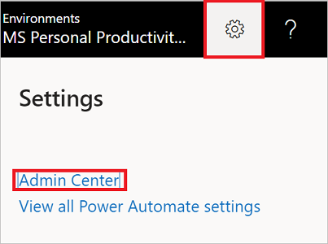

1. Expand **Analytics**, and then select **Power Automate**.

   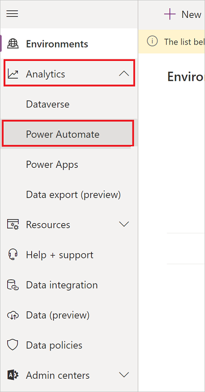

1. Select **UI flows**.

   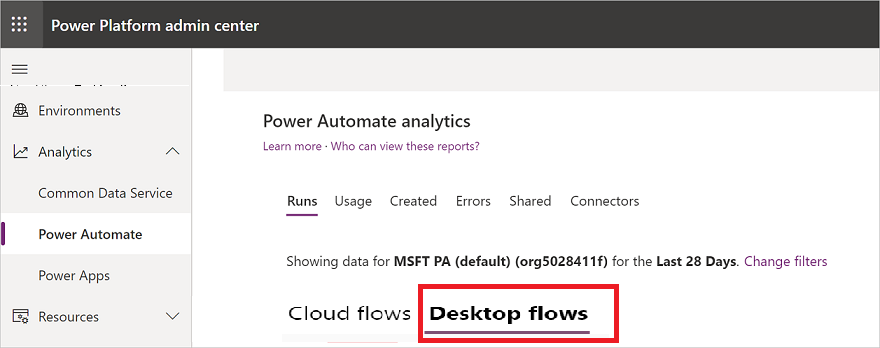

1. View the reports.

   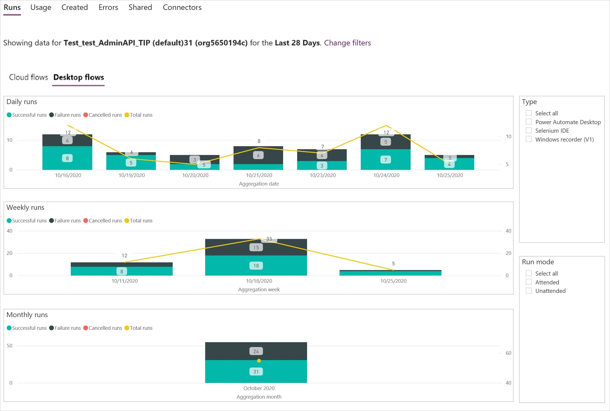

## Filter your view

You can filter your view to display reports from a specific **environment** or for a specific **Time period**

1. Select the filter icon.

   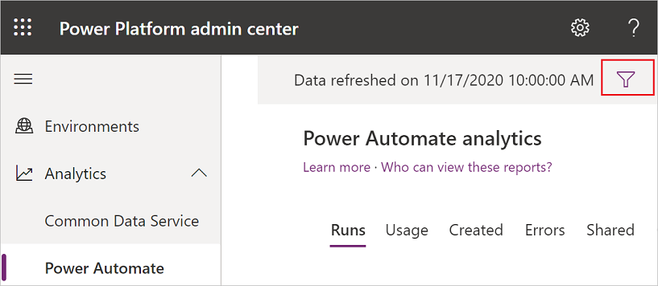

1. Expand the **Environment** list, and then select the environment for which you'd like to view reports.

1. Expand the **Time period** list, and then select the number of days for which you'd like to view reports.

   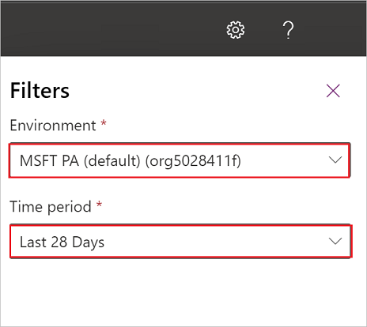

1. Select **Apply**.

## View the runs report

1. Select **Runs**.

   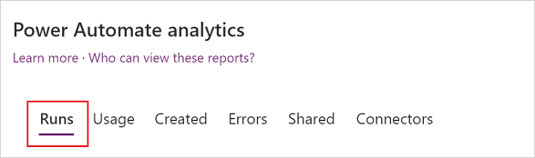

1. [Filter](#filter-your-view) the view to display the **Runs** reports from a specific environment and for a specific time period. 

   

## View the usage report

1. Select **Usage**.

   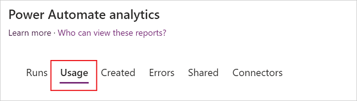

1. [Filter](#filter-your-view) the view to display the **Usage** reports from a specific environment and for a specific time period. 

   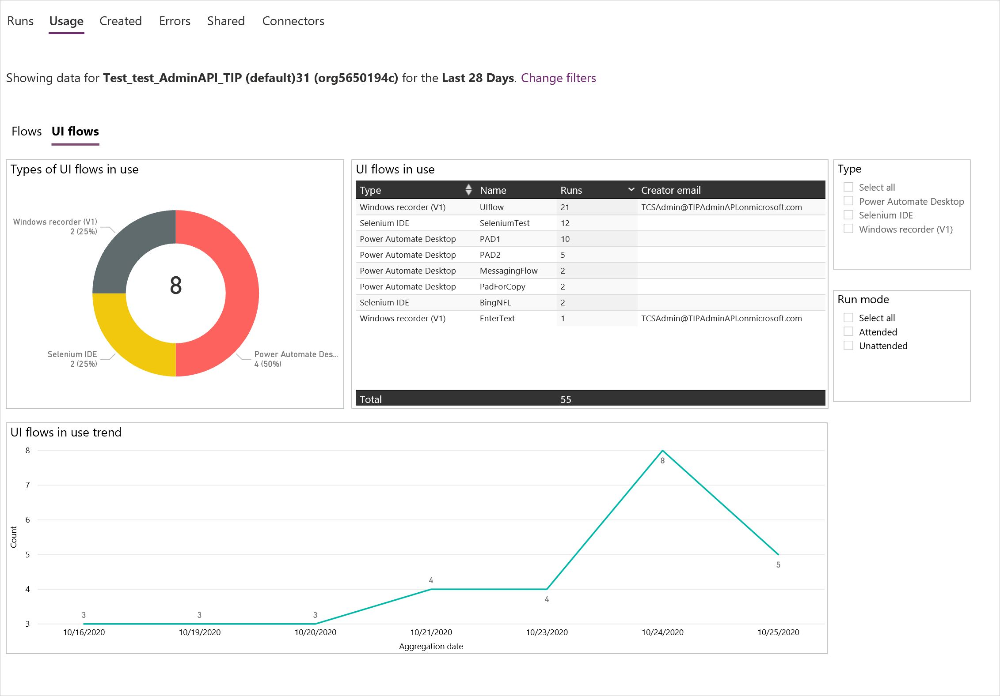

## View the created report

>[!IMPORTANT]
>You must upgrade the Power Automate Desktop (preview) app to the version of 2.1.43.20312 or later, in order to generate correct data for this report.

1. Select **Created**.

   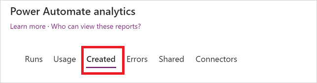

1. [Filter](#filter-your-view) the view to display the **Created** reports from a specific environment and for a specific time period. 

   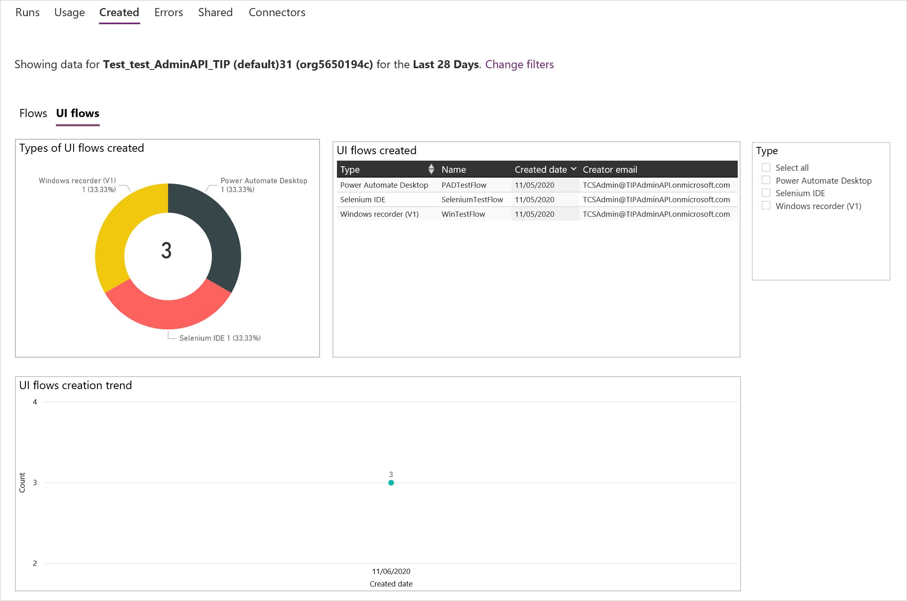

## Learn more

- Analyze the [UI flows risk assessment](https://docs.microsoft.com/power-platform/guidance/coe/power-bi-govern#ui-flows-risk-assessment) in your environment.
- [Create desktop UI flows](https://docs.microsoft.com/power-automate/ui-flows/create-desktop).
- [Create Web UI flows](https://docs.microsoft.com/power-automate/ui-flows/create-web).
- Run [UI flows](https://docs.microsoft.com/power-automate/ui-flows/run-ui-flow).