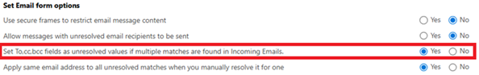

# Associate an email address with a row

When customer engagement apps track an email, it associates the email address to a row within customer engagement apps. The contents of the email **From** field can only be associated with one row. If there are duplicate rows within customer engagement apps with the same email address, the contents of the email **From** field will resolve to the first active row in the following order:

1. SystemUser (*This will be first unless the tracking user is also the owner of the duplicated row, such as Contact, Account and others listed below. If the tracking user does NOT own the duplicated row, such as Contact, the sender email will resolve to the SystemUser*).
2. Contact
3. Account
4. Lead
5. Equipment
6. Team
7. Business unit
8. Email-enabled tables (such as Queues, custom, etc.)

In the email **To** field,  all of the rows of email-enabled tables with the email address will be listed.

If **Set To,cc,bcc fields as unresolved values if multiple matches are found in Incoming Emails** is set to **No**, a tracked email in Dynamics that contains an email address that resolves to multiple rows, will display each resolved row in the Email.

   > [!div class="mx-imgBorder"] 
   > 
