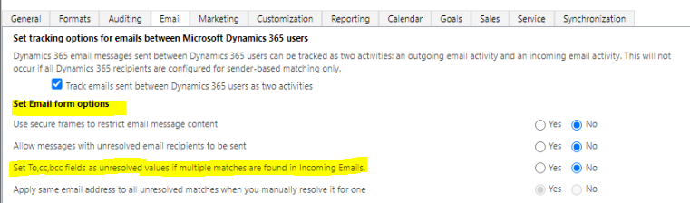

# Associate an email address with a row

## Sender resolution

When customer engagement apps track an email, it associates the email address to a row within customer engagement apps. The contents of the email **From** field can only be associated with one row. If there are less than 100 duplicate rows within customer engagement apps with the same email address, the contents of the email **From** field resolves to the first active row in the following order:

1. SystemUser
2. Contact
3. Account
4. Lead
5. Equipment
6. Team
7. Business unit
8. Email-enabled tables (such as Queues, custom, etc.)

If the email address resolves to more than 100 rows, the **From** field won't be associated to a row and appears as unresolved. If the [UnresolveSenderInCaseOfMultipleMatch OrgDBOrgSetting](OrgDbOrgSettings.md) is allowed and the sender email address matches multiple records, the **From** field remains unresolved.

> [!NOTE]
> - The only exception is when the owner of the mailbox or the queue tracking the email is the owner of the duplicated row. A row that's owned by you takes precedence over any rows that you don't own. For example, if the email address exists in a contact and account table and the mailbox owner also owns the account but not the contact, the **From** field will resolve to the account.
> - When an email is tracked immediately by an app, such as Dynamics 365 App for Outlook, the list of records that may be associated are limited to those which the user can access. However, if the email is created by server-side sync, the creation of the email is performed by the SYSTEM account which has access to all records. This applies to both sender and recipient resolution.

## Recipient resolution

In the email **To** field,  all of the rows of email-enabled tables with the email address will be listed.

If **Set To,cc,bcc fields as unresolved values if multiple matches are found in Incoming Emails** is set to **No**, a tracked email in Dynamics that contains an email address that resolves to multiple rows, will display each resolved row in the Email.

   > [!div class="mx-imgBorder"] 
   > 
