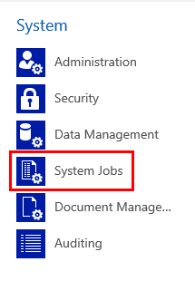

# Asynchronous processing of cascading transactions

Certain transactions can be configured to cascade across all related records. This means the change on a parent record will be transacted upon (cascade down through) all the child records. Cascading relationships are configured at the entity level. For more information about cascading relationships, see [Configure entity relationship cascading behavior](https://docs.microsoft.com/powerapps/developer/common-data-service/configure-entity-relationship-cascading-behavior).

## Synchronous versus asynchronous modes
 By default, cascading operations are performed as a synchronous transaction. For a synchronous cascading transaction, all impacted records are identified by the system. As the records are processed, they are locked by the system. Once all the changes have been completed, the records are unlocked and the transaction is completed.

Synchronous transactions with a large number of records can cause performance issues for environments when long running transactions fail due to server timeouts. The records are locked preventing other jobs and user transactions that operate on the same records from executing. Also, long running transactions might result in a backlog of pending transactions and requests that decrease system performance and might cause work stoppage.

If an environment is encountering timeouts or degraded performance while the synchronous cascading operations are in progress, your environment could benefit by enabling the asynchronous mode. The main differences between the modes are described here.

|Synchronous mode  |Asynchronous mode  |
|---------|---------|
|No other jobs can be executed on the entire set of selected records (direct or cascading) until the cascading operation is complete.   | Cascading changes are batched, locking only the records being processed within the batch. This allows other jobs to execute during the full cascading change operation.         |
|When the job is completed, all data shows the new desired value.     | As the job runs, each completed batch displays the desired value. This means that there will be a time when some data shows the desired value and some shows the original value until the full operation is completed. This is referred to as “eventual consistency.”  |
|If a single record fails, all data is rolled back to the original value. The rollback will require re-editing all completed records, which takes additional time.     |  If a single job fails, it is retried multiple times to attempt completion. If the job can't be completed the failure is recorded in the **System Jobs** area. Notice that successfully completed records retain the new value.       |
|If one of the records in the cascading list has a value that is different than the expected value, the job will fail and roll back. For example, the starting record belongs to *Owner 1* and the cascading operation wants to change it to *Owner 2*. If one of the downstream related records has changed to *Owner 3* or is deleted before the lock occurs, the entire job will roll back.     | The operation always works in overwrite mode changing the current value to the new value based on the parent child relationship. There are no job failures due to an original value mismatch.        |

## Asynchronous mode and plug-ins
When a cascading transaction has more than 100 records and does not have any plug-ins associated with the records, the records will be processed asynchronously. 

If inside of the asynchronous batch, there is a plug-in assigned to a record, the single record update/delete along with all associated plug-ins for that record will run synchronously as part of a transaction before moving to the next record in the asynchronous batch. 

If a plug-in inside the asynchronous transaction triggers a new cascading delete or assign, the new cascading transaction will always run synchronously within the current asynchronous transaction. This prevents having multiple layers of asynchronous transactions. 

## Tracking asynchronous operation progress
Administrators can monitor the processing of asynchronous operations in the **Settings** area. 

1. Go to **Settings** > **System Jobs**. For unified client apps, see [Settings](/powerapps/maker/model-driven-apps/advanced-navigation#settings)

    > [!div class="mx-imgBorder"] 
    > 
 
2. Cascading operations are displayed in the **System Jobs** view. 

    > [!div class="mx-imgBorder"] 
    > 

> [!TIP]
> To view only cascading operations, in the **View** selector select **Cascade Operations**. 
   > [!div class="mx-imgBorder"] 
   >  

Cascading operations have any one of the following statuses: 
- **Completed**. All batches of the cascading transaction have been completed successfully.
- **In Progress**. Cascading changes are in progress.
- **Failed**. After multiple retries, some of the cascading changes have failed.

> [!NOTE]
> It isn't possible to cancel an asynchronous cascading job. You must wait for it to complete by indicating a status of **Completed** or **Failed**.

Opening a cascading operation displays:
- How many retries have occurred for the particular transaction.
- Created and completed dates and times.
- Who created the job.
- Any messages associated with the job, such as failure reasons, or exceptions.

    > [!div class="mx-imgBorder"] 
    > 
 
## Which cascading transactions can be processed asynchronously?
Assign, Delete, and Merge cascading transactions can be processed asynchronously. 

> [!NOTE]
> Other transactions, such as share/unshare, rollup view, and re-parent are are currently under review for asynchronous processing. 

### See also
[Entity relationships overview](/powerapps/maker/common-data-service/create-edit-entity-relationships)
