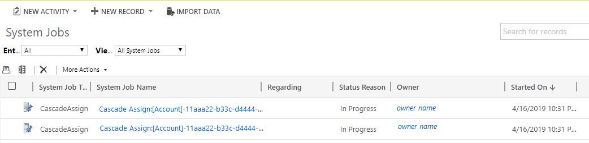
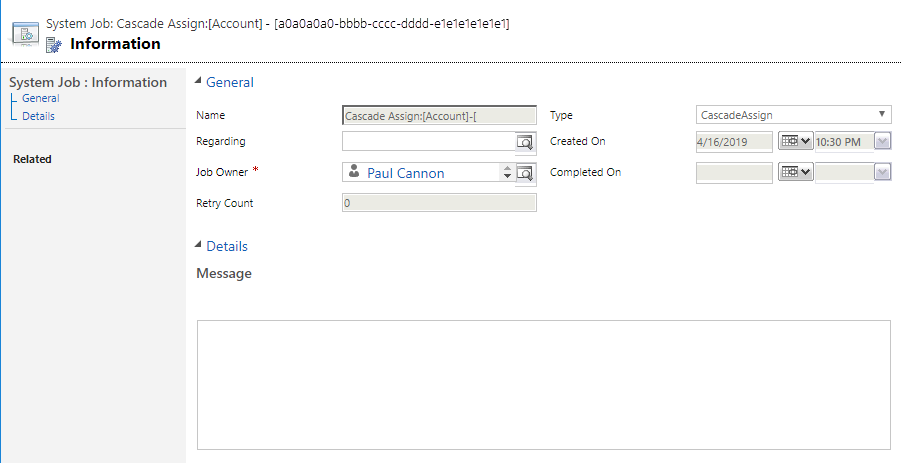

# Asynchronous processing of cascading transactions

[!INCLUDE [cc-data-platform-banner](../includes/cc-data-platform-banner.md)]

Certain transactions can be configured to cascade across all related records. This means the change on a parent record will be transacted upon (cascade down through) all the child records. Cascading relationships are configured at the entity level. For more information about cascading relationships, see [Configure entity relationship cascading behavior](https://docs.microsoft.com/powerapps/developer/common-data-service/configure-entity-relationship-cascading-behavior).

## Synchronous versus asynchronous modes
 By default, cascading operations are performed as a synchronous transaction. For a synchronous cascading transaction, all impacted records are identified by the system. As the records are processed, they are locked by the system. Once all the changes have been completed, the records are unlocked and the transaction is completed.

Synchronous transactions with a large number of records can cause performance issues for environments when long running transactions fail due to server timeouts. The records are locked preventing other jobs and user transactions that operate on the same records from executing. Also, long running transactions might result in a backlog of pending transactions and requests that decrease system performance and might cause work stoppage.

If an environment is encountering timeouts or degraded performance while the synchronous cascading operations are in progress, your environment could benefit by enabling the asynchronous mode. The main differences between the modes are described here.

|Synchronous mode  |Asynchronous mode  |
|---------|---------|
|No other jobs can be executed on the entire set of selected records (direct or cascading) until the cascading operation is complete.   | For Assign and Delete, cascading changes are batched, locking only the records being processed within the batch. This allows other jobs to execute during the full cascading change operation.  For Merge, the changes are still run as a single batch but done asynchronously to provide control back to the user more quickly.       |
|When the job is completed, all data shows the new desired value.     | As the job runs, each completed batch displays the desired value. This means that there will be a time when some data shows the desired value and some shows the original value until the full operation is completed. This is referred to as “eventual consistency.”  |
|If a single record fails, all data is rolled back to the original value. The rollback will require re-editing all completed records, which takes additional time.     |  If a single job fails, it is retried multiple times to attempt completion. If the job can't be completed the failure is recorded in the **System Jobs** area. Notice that successfully completed records retain the new value.       |
|If one of the records in the cascading list has a value that is different than the expected value, the job will fail and roll back. For example, the starting record belongs to *Owner 1* and the cascading operation wants to change it to *Owner 2*. If one of the downstream related records has changed to *Owner 3* or is deleted before the lock occurs, the entire job will roll back.     | For Assign, the operation always works in overwrite mode changing the current value to the new value based on the parent child relationship, there are no job failures due to an original value mismatch.  For Delete if a record that was expected as part of the set is missing, all the records up to the failure point are considered completed. The user or admin can re-execute the failed job, which will recalculate the job to continue without the missing record. For Merge, if there is an issue with a missing record the entire job will fail admins or users can run the job again to detect the correct records.      |

## Asynchronous mode and plug-ins
When a cascading transaction meets the threshold for included records and does not have any plug-ins associated with the records, the records will be processed asynchronously. 

|Operation  |Threshold |
|---------|---------|
|Assign|1,000 records|
|Delete|10,000 records|
|Merge|Always asynchronous|

If there's a plug-in assigned to a record inside the asynchronous batch, the single record update or delete along with all associated plug-ins for that record will run synchronously. This occurs as part of a transaction before moving to the next record in the asynchronous batch.

If a plug-in inside the asynchronous transaction triggers a new cascading delete or assign, the new cascading transaction will always run synchronously within the current asynchronous transaction. This prevents having multiple layers of asynchronous transactions. 

## Tracking asynchronous operation progress
Administrators can monitor the processing of asynchronous operations in the **Settings** area. 

1. Sign into the **[Power Platform admin center](https://admin.powerplatform.microsoft.com/environments/)**, and then select the environment you want. Select **Settings**, expand **Audit and logs**, and then select **System jobs**.
 
2. The cascading operations are displayed in the **All System Jobs** view. 

    > [!div class="mx-imgBorder"] 
    > 

   To view only cascading operations, in the **View** selector select **Cascade Operations**. 
    > [!div class="mx-imgBorder"] 
    > 

Cascading operations have any one of the following statuses:
- **Completed**. All batches of the cascading transaction have been completed successfully.
- **In Progress**. Cascading changes are in progress.
- **Failed**. After multiple retries, some of the cascading changes have failed.

> [!NOTE]
> It isn't possible to cancel an asynchronous cascading job. You must wait for it to complete by indicating a status of **Completed** or **Failed**.

Opening a cascading operation displays:
- How many retries have occurred for the particular transaction.
- Created and completed dates and times.
- Who created the job.
- Any messages associated with the job, such as failure reasons, or exceptions.

    > [!div class="mx-imgBorder"] 
    > 
 
## Which cascading transactions can be processed asynchronously?
Assign, Delete, and Merge cascading transactions can be processed asynchronously. 

> [!NOTE]
> Other transactions, such as share/unshare, rollup view, and re-parent are are currently under review for asynchronous processing. 

## Troubleshooting issues with asynchronous cascading operations
When synchronous cascading jobs fail, they stop and roll back all the changes so that none of the records include the changes requested. This can be a time-consuming process as rollbacks can take as long as the original attempt and retrying the operation will start again from the first record. 

Asynchronous operations will retry numerous times if a failure occurs. In most cases, retrying the job results in success and the job can continue to completion. In some rare cases, retrying won’t resolve the issue. When this happens, the asynchronous job will pause, and the administrator and user can troubleshoot the issue and resume the job from the point where it paused.

### Common causes of failures in cascading operations
Common reasons for failures in processing cascading operations include:
- Plugin exceptions.
- Security exceptions.

#### Plugin Exceptions
Plugins are added to the processing of cascading operations to take specific actions when changes are made to a record, such as sending an email or triggering a different update on other records. These may be provided by third parties or developed in-house. If a plugin generates an exception, the cascading operation will fail. Depending on the reason for the exception, a retry may resolve the issue. If the asynchronous cascade job is paused due to failures, validate all plugins that are associated with the operations to make sure they are not generating exceptions. Once fixed, the job can be resumed.

#### Security Exceptions
Security exceptions occur when the user who executed the cascading operation has insufficient privileges to make a change to one or more records, or the user is disabled or removed from the system. 

If the user is still in the system, validate they have the needed privileges to modify the records and that they have permissions to execute the specified actions. Once this is resolved, resume the job.

If the user has been disabled or removed from the system, re-enabling or readding the user will resolve the issue and the job can be resumed. However, if the user must be deleted or disabled or is not supposed to have permissions for the actions or records, the job should be canceled and restarted by someone with appropriate permissions. 

For any other issues with failed jobs, contact Microsoft Support. More information: [Support overview](/power-platform/admin/support-overview)

### Troubleshooting file deletion issues during cascade merge
If you experience failures with cascade merge operations because files are deleted during the job run, you can skip the parenting check. This allows your merge to continue even if someone deletes a record from the set while the job is running in the background. To do this, when you choose to merge records, at the bottom of the merge window clear the option **Parenting check is enabled by default. Uncheck this to ignore the parenting check**.

> [!div class="mx-imgBorder"] 
> 

#### Merge record example

Imagine that you have accounts with a relationship to contact, which has a relationship to orders. You want to merge two account records.

If the job runs successfully, the merge assigns all the related contacts and their orders to the target account.

If during the record merge process another user deletes a related contact record, but order records still exist related to the contact record, the merge job will fail because a parent to a child record is missing. If you choose to skip the parenting check during the record merge, the orders with the missing contact record will be merged into the target account record. However, no related contact records will be assigned to the target account and the job will complete.

### See also

[Entity relationships overview](/powerapps/maker/common-data-service/create-edit-entity-relationships)
