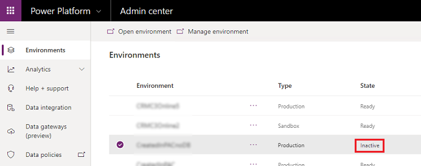

# Automatic environment cleanup

Operational processes for datacenters periodically identify environments that do not have an active subscription. They mark them for deactivation and eventual deletion. These processes can free up capacity from environments that are not in use, so that you can apply it elsewhere in your tenant.

To see the status of your environments:

1. Sign in as an admin to the [Power Platform admin center](https://admin.powerplatform.microsoft.com/).
2. Select **Environments**.
3. Look for environments with **Inactive** status.

> [!div class="mx-imgBorder"] 
> 

## Scope

Only production and sandbox environments are affected by the automatic cleanup.

## Admin notification because of environment cleanup 

This section covers what you can expect to receive if you, as an admin or someone in your organization, has created an environment that is marked for clean up. 

- 14 days prior to disabling the environment, an email is sent to all admins in your organization.
- 7 days prior to disabling the environment, an email is sent to all admins in your organization.
- 1 day prior to disabling the environment, an email is sent to all admins in your organization.
- If no action is taken, the environment will be deleted 10 days after the final email.

## Actions you can take to prevent environment disabling and deletion

Anytime prior to the environment deletion you can purchase licenses. Be sure to purchase enough licenses and/or capacity to cover all the production environments in your tenant. See [Licensing overview for Microsoft Power Platform](pricing-billing-skus.md).

Within 24 hours after the licenses and capacity are applied to your tenant, the environment is automatically enabled. If your environment has already been deleted, it is possible to recover it within a limited window of time. See [Recover environment](recover-environment.md).

> [!IMPORTANT] 
> Please allow ample time to take appropriate action. Your organization may have a central admin and purchasing group and might be purchasing through Microsoft partners. Please plan accordingly. 

### See also
[Backup and restore environments](backup-restore-environments.md)  
[Licensing overview for Microsoft Power Platform](pricing-billing-skus.md) 
[Microsoft Power Apps and Power Automate Licensing Guide](https://go.microsoft.com/fwlink/?linkid=2085130)

[!INCLUDE[footer-include](../includes/footer-banner.md)]
