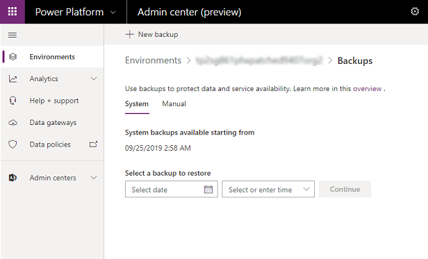
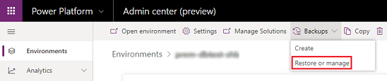
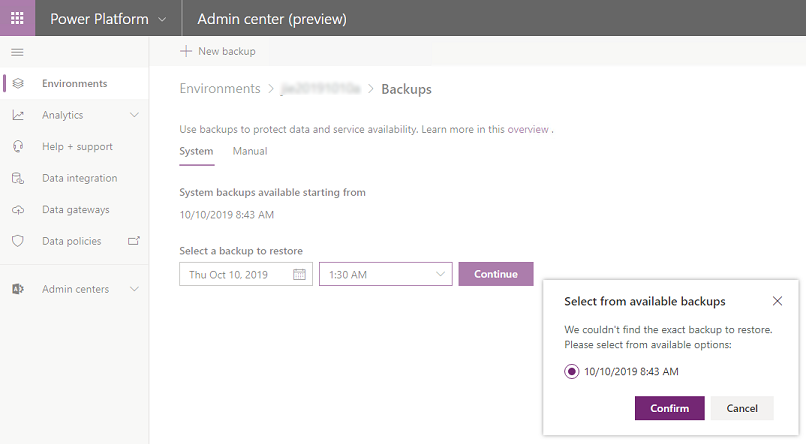
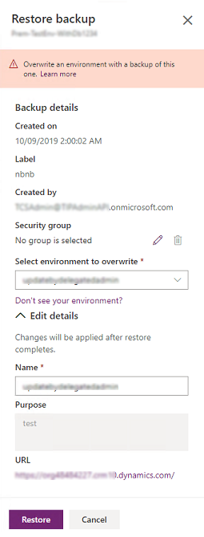
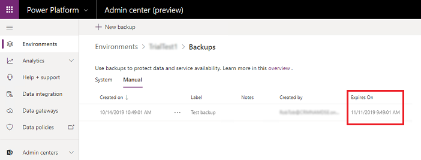
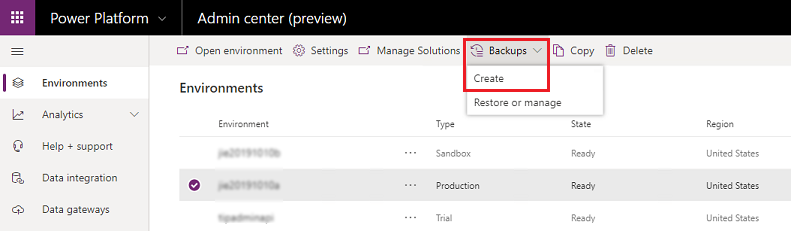

# Back up and restore environments

Protecting your data in customer engagement apps (Dynamics 365 Sales, Dynamics 365 Customer Service, Dynamics 365 Field Service, Dynamics 365 Marketing, and Dynamics 365 Project Service Automation), and providing continuous availability of service are important. You have multiple options for backing up and restoring your environments.   
 
## System backups  
Some backups take place without you having to do anything.  

> [!div class="mx-imgBorder"] 
> 

About **system backups**:  
  
- All your environments are backed up.  
- System backups occur continuously. The underlying technology used is Azure SQL Database. See SQL Database documentation [Automated backups](https://docs.microsoft.com/azure/sql-database/sql-database-automated-backups) for details.
- System backups for production environments that have been created with a database and have one or more Dynamics 365 applications installed are retained up to 28 days. System backups for production environments which do not have Dynamics 365 applications deployed in them will be retained for 7 days. System backups for sandbox environments will be retained for 7 days.
- You must restore an environment to the same region in which it was backed up.
  
### Restore a system backup  
  
1. Browse to the Power Platform admin center and sign in using administrator credentials. Consider using the less privileged service admin role instead of the global admin role. See [Use the service admin role to manage your tenant](use-service-admin-role-manage-tenant.md).
  
2. Go to **Environments** > [select an environment] > **Backups** > **Restore or manage**.
  
   > [!div class="mx-imgBorder"] 
   > 

3. Select the **System** tab.  
  
4. Under **Select a backup to restore**, choose a date and time to select a system backup to restore, and then select **Continue**. 

5. You'll be provided with a list of available backups at or close to the date and time you chose if the selected time is not available. Pick the desired backup, and then select **Confirm**.

   > [!div class="mx-imgBorder"] 
   > 

6. Select an environment to restore to (overwrite), enter other settings as desired, and then select **Restore**.

   > [!div class="mx-imgBorder"] 
   > 

   > [!NOTE]
   > - Only sandbox environments can be restored to.
   > - Under **Edit details**, you can change the environment name.

7. Confirm overwrite of the environment. 

## Manual backups
Automated system backups are great, but you'll want to make your own backups before making some significant customization change or applying a version update. You can do this with manual backups.  
  
About **manual backups**:  

- A backup is created for you when we update your environment.  
- You can back up production and sandbox environments. 
- You can't back up the default environment.
- Sandbox backups are retained for up to 7 days. 
- Manual backups for production environments that have been created with a database and have one or more Dynamics 365 applications installed are retained up to 28 days. Manual backups for production environments which do not have Dynamics 365 applications deployed in them will be retained for 7 days.
- Check your expiration date.  
  
  > [!div class="mx-imgBorder"] 
  > 
  
- You are not limited in the number of manual backups you can make.
- Manual backups do not count against your storage limits.  
- You must restore an environment to the same region in which it was backed up.

### Create a manual backup
  
1. Browse to the Power Platform admin center and sign in using administrator credentials.
  
2. Go to **Environments** > [select an environment] > **Backups** > **Create**.
  
   > [!div class="mx-imgBorder"] 
   > 

3. Fill in the information, and then select **Create**.

There is no status as the backup is processing. When the backup is completed, you'll see the following message: "*The [backup name] backup was successfully created.*" 

### Restore a manual backup  
You can only restore to sandbox environments. To restore to a production environment, first switch it to a sandbox environment. See [Switch an environment](switch-environment.md).

> [!IMPORTANT]
> Note that changing an environment type to sandbox will immediately reduce backup retention to 7 days. If you do not need backups (restore points) older than 7 days, then you can safely switch the type. If you think you may need restore points older than 7 days, we strongly recommend that you keep the environment as production and consider restoring to a different environment of type sandbox.

1. Browse to the Power Platform admin center and sign in using administrator credentials.
  
2. Go to **Environments** > [select an environment] > **Backups** > **Restore or manage**.
  
3. Select the **Manual** tab.  
  
4. Select a manual backup to restore, and then select **Restore**. 

5. Select an environment to restore to (overwrite), and then select **Restore**.

   > [!NOTE]
   > Only sandbox environments can be restored to.

6. Confirm overwrite of the environment. 

<!--
### Edit a manual backup  
Edit a backup to change its label and your notes about the backup.  
  
1. Browse to the Power Platform admin center and sign in using administrator credentials.
  
2. Go to **Environments** > [select an environment] > **Backups** > **Restore or manage**.

3. Select the **Manual** tab.

4. Select **Edit**.
  
5. Fill in the information, and then select **Save**.
-->

### Delete a manual backup  
 You can  delete manual backups. You can't delete system backups.  
  
1. Browse to the Power Platform admin center and sign in using administrator credentials.
  
2. Go to **Environments** > [select an environment] > **Backups** > **Restore or manage**.
  
3. Select the **Manual** tab.

4. Select **Delete**.

5. Confirm deletion of the environment. 
 
## FAQ

### How are system backups taken?

In the current version of the product, system backups occur continuously; this is different from previous versions where backups were once a day. Because the underlying technology used is Azure SQL Database, see [Automated backups](https://docs.microsoft.com/azure/sql-database/sql-database-automated-backups) for details.

### How are manual/on-demand backups taken?
In the current version of the product, system backups occur continuously; this is different from previous versions where backups were once a day. Because the underlying technology used is Azure SQL Database, see [Automated backups](https://docs.microsoft.com/azure/sql-database/sql-database-automated-backups) for details.

Because Azure SQL Database takes backups continuously, there is no need to take additional backups or specify Azure SQL Database to take additional backups or an on-demand full backup. That means our on-demand backup is just a label and a time stamp that we store in our system and use during restore requests. This is different from previous versions that took a full backup during an on-demand backup. 

### Why can't I see a status of the manual backup?
There is no status as the backup is processing. When the backup is completed, you'll see the following message: "*The [backup name] backup was successfully created.*" 

### Should I open a support ticket for taking a full backup?
No. In the current version of the product, system backups occur continuously; this is different from previous versions where backups were once a day. Because the underlying technology used is Azure SQL Database, see [Automated backups](https://docs.microsoft.com/azure/sql-database/sql-database-automated-backups) for details.

Because Azure SQL Database takes backups continuously and there is no specific way to take additional on-demand backups, we recommend you use our on-demand backup feature to label your backups. 

### How long are my manual/on-demand backups and system backups retained?
System and manual backups for certain production-type environments are retained up to 28 days. Other environment type backups are retained up to 7 days only. Please see the following FAQ, [How do I determine if backups of a production environment are retained for 28 days?](#how-do-i-determine-if-backups-of-a-production-environment-are-retained-for-28-days)

### How do I determine if backups of a production environment are retained for 28 days? 

Production environments that have been created with a database will give you the option to enable one or more Dynamics 365 applications if you have purchased licenses that entitle you to deploy such applications (for example, Dynamics 365 Sales, Dynamics 365 Customer Service). Backups of production environments with a database and Dynamics 365 applications deployed are retained for up to 28 days. In contrast, backups of production environments which do not have Dynamics 365 applications deployed in them will be retained for 7 days. 

### Can I extend my backup to be retained beyond the standard number of days?
You can't extend your system backups or manual/on-demand backups. However, if you want to keep the data for longer than the standard retention period, we recommend you copy your environment to an additional environment and do not modify that additional environment. 

### Can I move my data from an online environment to an on-premises version?
Obtaining a copy of your database backup isn't available. If you want to move your online data to Dynamics 365 Customer Engagement (on-premises), this requires data migration. For smaller data sets, consider [exporting data to Excel](https://docs.microsoft.com/powerapps/user/export-data-excel). For larger data sets, find a third-party data migration solution on [Microsoft AppSource](https://appsource.microsoft.com/).  

### How can I download a copy of my backup?
Obtaining a copy of your database backup isn't available. Moving your online data requires data migration. For smaller data sets, consider [exporting data to Excel](https://docs.microsoft.com/powerapps/user/export-data-excel). For larger data sets, find a third-party data migration solution on [Microsoft AppSource](https://appsource.microsoft.com/).  

### Do we have any database size restriction to take a backup or restore an organization through user interface (UI) or API?
We don't have any restriction on database size (or storage capacity/entitlement) to take a backup through UI or API. However, when an organization’s storage capacity usage is greater than the entitled capacity, the following admin operations will be blocked:

- **Restore an environment**
- Create new environment (requires minimum 1GB capacity available)
- Copy an environment
 
To be compliant with storage usage requirements, customers can always [free up storage](free-storage-space.md), [archive data](recover-database-space-deleting-audit-logs.md), [delete unwanted environments](delete-environment.md), or buy more capacity. To learn more about capacity add-ons, see the Add-ons section in the Dynamics 365 Licensing Guide or the Power Apps and Power Automate Licensing Guide. You can work through your organization’s standard procurement process to purchase capacity add-ons.
 
### Can I restore to a production environment?
In order to prevent accidental overwrites, we don't allow users to directly restore to a production environment. To restore to a production environment, first switch it to a sandbox environment. See [Switch an environment](switch-environment.md). Note that changing an environment type to sandbox will immediately reduce backup retention to 7 days. If you do not need backups (restore points) older than 7 days, then you can safely switch the type. If you think you may need restore points older than 7 days, we strongly recommend that you keep the environment as production and consider restoring to a different environment of type sandbox.

### Why is my organization in administration mode after a restore and how do I disable it?
The newly restored environment is placed in administration mode. To disable administration mode, see [Set administration mode](admin-mode.md#set-administration-mode). You can set administration mode in sandbox or production environments.  

## Troubleshooting

### Don't see your environment to restore to? 
Only sandbox environments can be restored to.

### See also
[Automatic environment cleanup](automatic-environment-cleanup.md)  
[Manage sandbox environments](sandbox-environments.md)  
[Environments overview](environments-overview.md)  
[Licensing overview for Power Platform](pricing-billing-skus.md)