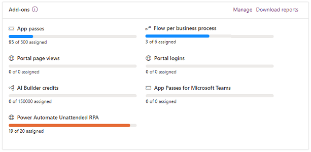
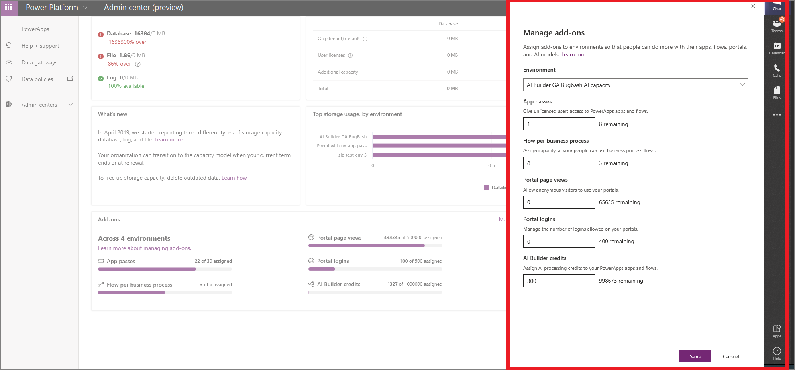
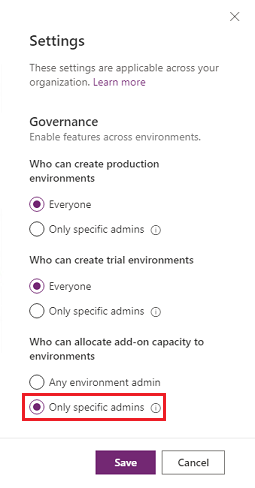

# Capacity add-ons

If your organization has purchased capacity add-ons, you have to allocate that capacity to any environment where you want to use it. You also have to make sure that your users have access to those environments and have the correct permissions before they can use the products for which you've purchased a capacity add-on.

There are three stages for using capacity add-ons:

1. Purchase: you buy individual capacity add-ons. For purchasing information, see the [Power Apps and Power Automate Licensing Guide](https://go.microsoft.com/fwlink/?linkid=2085130).
2. Allocate: assign the purchased add-ons to an environment.
3. Consume: once allocated, you can consume the capacity add-ons.

> [!TIP]
> Consider purchasing Power Apps per app plans which allow individual users to run two applications and one portal. See [About Power Apps per app plans](about-powerapps-perapp.md).

## View capacity add-ons in Power Platform admin center

If your organization has purchased capacity add-ons, an **Add-ons** tile appears on the **Capacity** screen in the [Power Platform admin center](https://admin.powerplatform.microsoft.com/). Sign into the Admin center, and select **Resources** > **Capacity** in the left-side navigation pane.

The **Add-ons** tile shows summary information about the capacity add-ons that your organization has.

Each capacity has a usage gauge that shows how many units have been assigned compared to the available capacity. Capacities are measured in different ways depending on the product. For example, App passes are assigned individually, while AI Builder capacity is measured in credits. Refer to the product documentation for more information about metering.

## Allocate or change capacity in an environment

To allocate capacity to an environment:

1. Sign into the [Power Platform admin center](https://admin.powerplatform.microsoft.com/). 

2. Select **Resources** > **Capacity** in the left-side navigation pane.

3. On the **Capacity** screen, do **one** of the following to open the **Manage add-ons** screen:

   - Scroll down to the Add-ons tile, and then select **Manage** on the top-right corner of the Add-ons tile.
   - Select the **Add-ons** tab. Select **Assign to an environment** in the upper-left menu bar.    
   - Select the **Add-ons** tab. Select an environment, and then select **Manage add-ons** in the upper-left menu bar.

4. Select the environment where you want to add capacity from the **Environment** drop-down menu, and then allocate from your available capacity.

   > [!div class="mx-imgBorder"] 
   > 

   **Some examples**

   - If you have 10 users who are going to be using 1 app each, you should assign 10 **app passes** to the app environment.
   - If you want to create 5 flows in an environment which are going to be used for business process flows, assign a capacity of 5 for **flow per business process**.
  - If a company has created a portal and anticipate 50,000 views of the portal, they should allocate 50,000 **portal page views**.

## Control who can allocate add-on capacity

As an admin, you can restrict who can allocate add-on capacity to environments.

1. Sign in to the Power Platform admin center at [https://admin.powerplatform.microsoft.com](https://admin.powerplatform.microsoft.com).
2. Select the **Gear** icon () in the upper-right corner of the Power Platform site.
3. Select **Power Platform settings**.
4. Under **Who can allocated add-on capacity to environments**, select **Only specific admins**.

   > [!div class="mx-imgBorder"] 
   > 

The following admins will be able to allocate add-on capacity in the Power Platform admin center:

- Global admins
- Dynamics 365 admins
- Power Platform admins

### See also
[About Power Apps per app plans](about-powerapps-perapp.md)