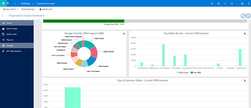

# Capacity and storage

[!INCLUDE [cc-beta-prerelease-disclaimer](../includes/cc-beta-prerelease-disclaimer.md)]

We're introducing a new business model for Common Data Service storage which we think you're going to love. 

While storage was once viewed in multiple places...

|  |  |
|---------|---------|
|Dynamics 365 Administration Center     |        |
|Common Data Service for Apps analytics     |        |
|Organization Insights Dashboard | |

...the new storage model provides a single place to view your data.

> [!div class="mx-imgBorder"] 
> 

## About the new storage model

We're optimizing data management for database storage, attachments, and audit logs.

Some of the benefits of this change: 

- Scalability with purpose-built storage management solutions
- Ability to enable new business scenarios
- Reduced need to free up storage
- Support for variety of data types
- Additional default and full user entitlements
- Flexibility to create new environments/instances 

To cover:

1. Review of current storage model
2. Overview of new storage model
   - Enterprise data architectures are evolving with rapid growth of newer formats (unstructured, streaming, file etc.)​
   - Dynamics 365 platforms will provide flexible data management optimized for enterprise application types and corresponding business value​
3. View and manage storage
   - Three ways to manage storage
4. Updated storage reports
5. A walkthrough of the UI
6. Timeline
7. Important considerations

Evolution of the Common Data Service for Apps storage capacity 