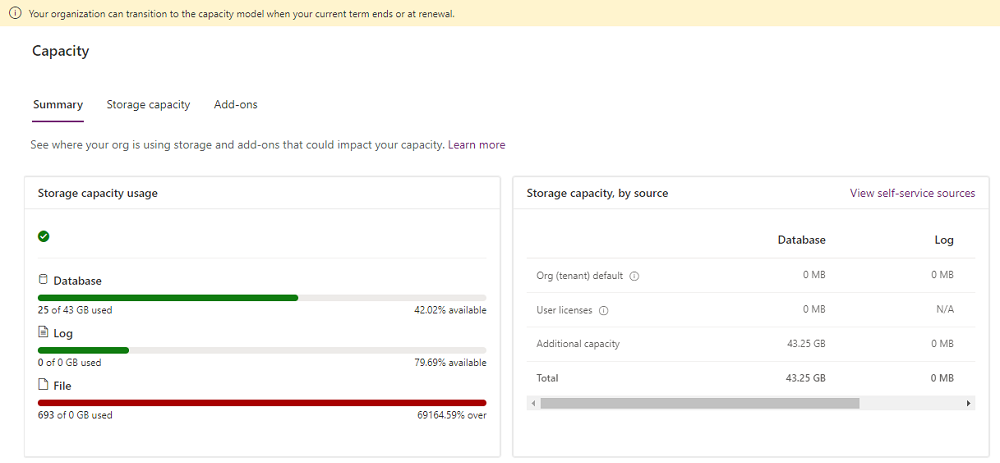
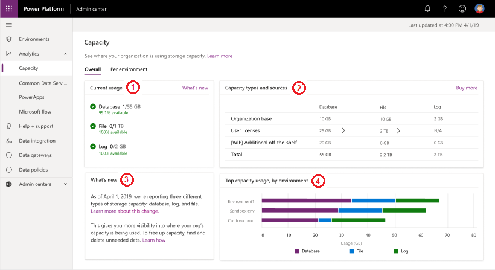
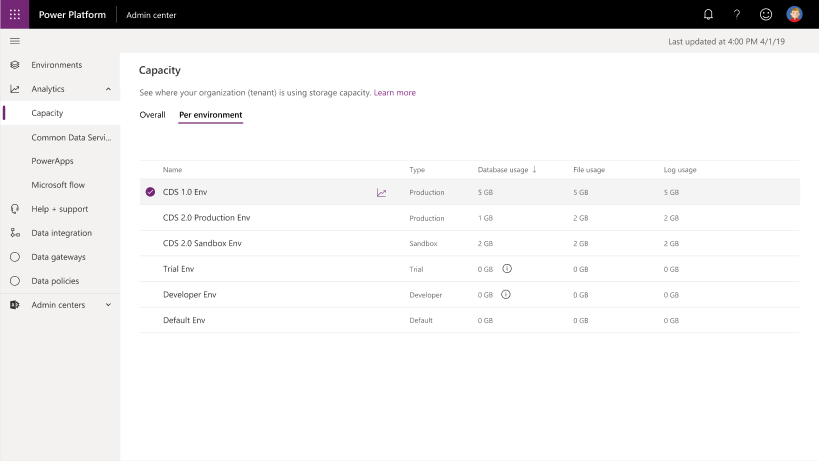
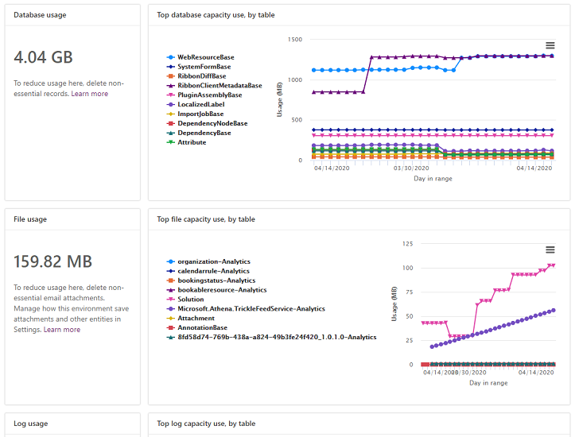

# New Microsoft Dataverse storage capacity 

[!INCLUDE [cc-data-platform-banner](../includes/cc-data-platform-banner.md)]

If you purchased storage in or after April 2019, or you have a mix of storage purchases made before and after April 2019, you'll see your storage capacity entitlement and usage by database, file, and log as it appears in the Power Platform admin center today. 

Data volume continues to grow exponentially, as businesses advance their digital transformation journey and bring data together across their organization. Modern business applications need to support new business scenarios, manage new data types, and help organizations with the increasing complexity of compliance mandates. To support the growing needs of today's organizations, data storage solutions need to evolve continuously and provide the right solution to support expanding business needs.

We're rolling out this feature now so check back if your user experience varies from the following content.

> [!NOTE]
> For licensing information, see the [Power Apps and Power Automate licensing guide](https://go.microsoft.com/fwlink/p/?linkid=2085130).
>
> If you purchased your Dynamics 365 subscription through a Microsoft partner, contact them to manage storage capacity. The steps below do not apply to partner-based subscriptions.

## Licenses for the new storage model

The following licenses provide capacity by using the new storage model. If you have any of these licenses, you'll see the new model report: 

- Dataverse for Apps Database Capacity 
- Dataverse for Apps File Capacity 
- Dataverse for Apps Log Capacity 

To see whether you have any of these licenses, sign in to the Microsoft 365 admin center, and then go to **Billing** > **Licenses**.

> [!NOTE]
> If you have a mix of [legacy model licenses](legacy-capacity-storage.md#licenses-for-the-legacy-storage-model) and the abovementioned new model licenses, you'll see the new model report.
> 
> If you have none of the [legacy model licenses](legacy-capacity-storage.md#licenses-for-the-legacy-storage-model) nor the new model licenses, you'll see the new model report.

## Verifying your new storage model

1. Sign in to the Power Platform admin center, and then select an environment. 

2. Select **Resources** > **Capacity**.

3. View the data on the **Summary** page.

The new licensing storage model looks like the following image. 

> [!div class="mx-imgBorder"] 
> 

## Capacity page details

### Summary tab

This page provides a tenant-level view of where your organization is using storage capacity.

To view the **Summary** page, select **Resources** > **Capacity** > **Summary**.

> [!div class="mx-imgBorder"] 
> 

All entities of Dataverse, including system entities, are included in the storage capacity reports.

|Number  |Description |
|---------|---------|
|(1)   |**Storage capacity usage**  <ul><li>**File and database**: The following entities store data in file and database storage: <ul><li>Attachment</li><li>AnnotationBase</li><li>Any custom or out-of-the-box entity that has fields of datatype file or image (full size)</li><li>Any entity that is used by one or more installed Insights applications and [ends in *- Analytics*](#what-are-entities-ending-in---analytics-in-my-capacity-report) </li> </ul></li><li>**Log**: The following entities are used: <ul><li>AuditBase</li><li>PlugInTraceLogBase</li></ul><li>**Database only**: All other entities are counted for your database</li></ul> |
|(2)    |**Storage capacity, by source** <ul><li>**Org (tenant) default**: The default capacity given at the time of sign-up </li><li>**User licenses**: Additional capacity added for every user license purchased</li><li>**Additional storage**: Any additional storage you bought </li><li>**Total**: Total storage available </li><li>**View self-service sources**: See [View self-service license amounts and storage capacity](view-self-service-capacity.md)</li></ul>      |
|(3)     |**Top storage usage, by environment**: The environments that consume the most capacity        |

The actual files such as .pdf (or any other file attachment type) are stored in file storage. However, certain attributes needed to access the files are stored in the database as well.

### Storage capacity tab

This page provides similar information as the **Summary** tab, but with an environment-level view of where your organization is using capacity.

To view the **Storage capacity** page, select **Resources** > **Capacity** > **Storage capacity**. See the next section for using the **Details** button () to see environment capacity analytics.

> [!div class="mx-imgBorder"] 
> 

> [!NOTE]
> - The following environments don't count against capacity and are shown as 0 GB:
>   - Trial
>   - Preview
>   - Support
>   - Developer
> - You can select an environment that's showing 0 GB, and then go to its **Environment Analytics** page to see the actual consumption.

### Environment capacity analytics

This page provides an environment-level detailed view of where your organization is using capacity, in addition to the three types of capacity consumption. 

**To view environment-level capacity analytics**

1. Select **Resources** > **Capacity** > **Storage capacity**.
2. Select an environment.
3. Select **Details** ().

> [!div class="mx-imgBorder"] 
> 

The following details are provided:

-   Actual database usage
-   Top database tables and their growth over time
-   Actual file usage
-   Top files tables and their growth over time
-   Actual log usage
-   Top tables and their growth over time

## Changes for exceeding storage capacity entitlements

We're making changes for what happens when an organization's storage capacity usage is greater than the capacity entitled or purchased via add-ons.

For now, if you exceed your storage capacity, you'll receive notifications alerting you to the over-capacity usage. These notifications will occur as alerts in the Power Platform admin center. In the future, certain admin operations will no longer be available when a tenant exceeds storage capacity entitlements. Check back for updated information. 

## Example storage capacity scenarios, overage enforcement

You should be within limits for your entitled capacity for database, log, and file. If you have used more capacity than you're entitled to, you should buy more capacity or free up capacity. However, if you've overused database, log, or file capacity, review the following scenarios to understand when enforcement will be applied.

### Scenario 1: Database storage is over capacity, overage enforcement

|Type  |Entitled  |Consumed  |
|---------|---------|---------|
|**Database**     | 100 GB        | 110 GB        |
|**Log**     |  10 GB       | 5 GB        |
|**File**     | 400 GB        | 200 GB        |

This tenant is 10 GB over in database usage. Despite having 200 GB excess file storage, the tenant is considered to be in deficit. This tenant should free up storage or purchase more capacity.

### Scenario 2: Log storage is over capacity, overage enforcement

|Type  |Entitled  |Consumed  |
|---------|---------|---------|
|**Database**     | 100 GB        | 95 GB        |
|**Log**     |  10 GB       | 20 GB        |
|**File**     | 400 GB        | 200 GB        |

This tenant is 10 GB over in log usage and has only 5 GB available in database capacity. Therefore, the tenant is in deficit and should free up storage or purchase more capacity.

### Scenario 3: File storage is over capacity, overage enforcement

|Type  |Entitled  |Consumed  |
|---------|---------|---------|
|**Database**     | 100 GB        | 20 GB        |
|**Log**     |  10 GB       | 5 GB        |
|**File**     | 200 GB        | 290 GB        |

This tenant is 90 GB over in file usage. Despite having 85 GB available (80 GB database + 5 GB log) in storage capacity, the tenant is considered to be in deficit. This tenant should free up storage or purchase more capacity.

## Example storage capacity scenario, no overage

### Scenario 4: Log storage is over capacity

|Type  |Entitled  |Consumed  |
|---------|---------|---------|
|**Database**     | 100 GB        | 80 GB        |
|**Log**     |  10 GB       | 20 GB        |
|**File**     | 400 GB        | 200 GB        |

This tenant is 10 GB over in log usage but has 20 GB available in database capacity. Therefore, the tenant isn't in deficit. Note that file storage excess entitlement can't be used to compensate deficits in log or database storage.

## Actions to take for a storage capacity deficit

You can always [free up storage](free-storage-space.md), [delete unwanted environments](delete-environment.md), or buy more capacity to be compliant with storage usage. To learn more about capacity add-ons, see the [Dynamics 365 Licensing Guide](https://go.microsoft.com/fwlink/p/?LinkId=866544) or the ["Add-ons" section of the Power Apps and Power Automate Licensing Guide](https://go.microsoft.com/fwlink/?linkid=2085130). You can work through your organization's standard procurement process to purchase capacity add-ons.

## FAQ

### Why is my storage consumption decreasing in database and growing in file?

We are constantly optimizing the Dataverse for ease of use, performance, and efficiency. Part of this ongoing effort is to move data to the best possible storage with the lowest cost for customers. File-type data such as “Annotation” and “Attachment” is moving from database to file storage. This leads to decreased usage of database capacity and an increase in file capacity.

### Why could my database table size decrease while my table and file data sizes remain the same?

As part of moving file-type data such as “Annotation” and “Attachment” out from database and into file storage, we periodically reclaim the freed database space. This leads to decreased usage of database capacity, while the table and file data size computations remain unchanged.

### Do indexes affect database storage usage?

Possibly. Database storage includes both the database records and index files used to improve search performance. Indexes are created and optimized for peak performance and are updated frequently by the system by analyzing data use patterns. No user action is needed to optimize the indexes, as all Dataverse stores have tuning enabled by default. A fluctuation in database storage can be represented by an increased or decreased number of indexes on the database. Dataverse is continually being tuned to increase efficiency and incorporate new technologies that improve user experience and optimize storage capacity.  Common causes for an increase in index size are:

- An organization making use of new functionality (this can be custom, out-of-the-box, or part of an update or solution installation).
- Data volume or complexity changes.
- A change in usage patterns that indicate new indexes are in need of reevaluation.

If Quick Find lookups are configured for data that's frequently used, this will also create additional indexes in the database. Admin-configured Quick Find values can increase the size of the indexes based on:

- The number of fields chosen and the data type of those fields.
- The volume of records for the entities and fields.
- The complexity of the database structure.

Because custom Quick Find lookups are created by an admin in the org, these can be user-controlled. Admins can reduce some of the storage used by these custom indexes by doing the following: 

- Removing unneeded fields and/or entities
- Eliminating multiline text fields from inclusion

### I just bought the new capacity-based licenses. How do I provision an environment by using this model?

You can provision environments through the Power Platform admin center. More information: [Create and manage environments in the Power Platform admin center](create-environment.md)

### I'm a new customer and I recently purchased the new offers. My usage of database/log/file is showing red. What should I do?

Consider buying additional capacity by using the [Licensing Guide](https://go.microsoft.com/fwlink/p/?LinkId=866544). Alternatively, you can [free up storage](free-storage-space.md).

### Where can I read more about the new capacity offers?

Download the [Licensing Guide](https://go.microsoft.com/fwlink/p/?LinkId=866544) to learn more.

### I'm an existing customer, and my renewal is coming up. Will I be affected?

Customers who renew existing subscriptions can choose to continue to transact by using the existing offers for a certain period of time. Please contact your Microsoft partner or Microsoft sales team for details.

### I'm a Power Apps/Power Automate customer and have environments with and without database. Will they consume storage capacity?

Yes. All environments will consume 1 GB, regardless of whether they have an associated database.

### Do I get notified through email when my org is over capacity?

When you sign in to the Power Platform admin center, you'll be notified if your capacity usage is more than the capacity you're entitled to.

### Why am I no longer getting storage notifications?

We've disabled email notifications with the move to the new storage model. Review the **[Capacity](https://admin.powerplatform.microsoft.com/resources/capacity)** page to monitor usage.

### I'm an existing customer. Should I expect my file and log usage to change?

Log and files data usage isn't expected to be exactly the same size as when the same data is stored by using database, due to different storage and indexing technologies. The current set of out-of-the-box entities stored in file and log storage might change in the future.

### The capacity report shows the entitlement breakdown per license, but I have more licenses in my tenant and not all of them are listed in the breakdown. Why?

Not all licenses give per-user entitlement. For example, the Team Member license doesn't give any per-user database, file, or log entitlement. So in this case, the license isn't listed in the breakdown.

### Which environments are counted in the capacity report?

Default, production, and sandbox environments are counted for consumption. Trial, preview, support, and developer environments aren't counted.

### What are entities ending in “- analytics" in my capacity report?

Entities ending in “– Analytics” are entities used by one or more Insights applications, for example Sales Insights, Customer Service Hub, or Field Service and resource scheduling and optimization analytics dashboard to generate predictive insights and/or analytics dashboards. The data is synched from Dataverse entities. See **More information** below for documentation covering the installed Insights applications and the entities used to create insights and dashboards.

**More information:**
- [Sales Insights ](https://docs.microsoft.com/dynamics365/ai/sales/help-hub#get-started)
- [Field Service and resource scheduling optimization (RSO)](https://docs.microsoft.com/dynamics365/field-service/scheduling-analytics-reports)                                                                                             
- [Customer Service Hub](https://docs.microsoft.com/dynamics365/customer-service/customer-service-analytics-insights-csh) 
- [Field Service](https://docs.microsoft.com/dynamics365/field-service/reports) 

### See also

[Capacity add-ons](capacity-add-on.md) 
[Automatic tuning in Azure SQL Database](https://docs.microsoft.com/azure/sql-database/sql-database-automatic-tuning)  
[What's new in storage](whats-new-storage.md)  
[Free up storage space](free-storage-space.md)  
