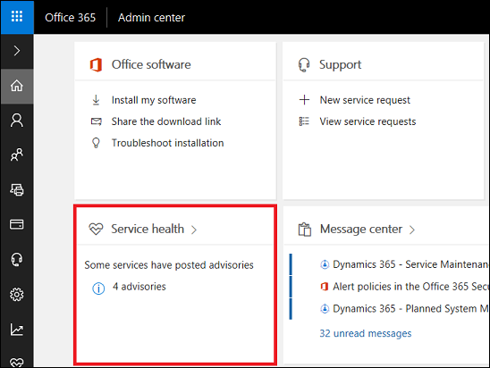
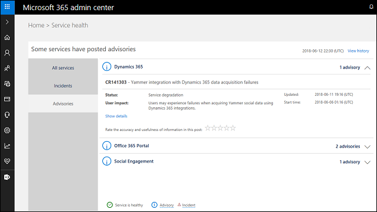
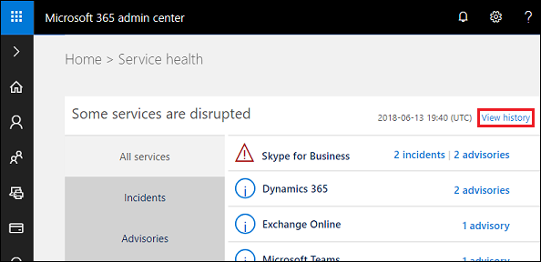
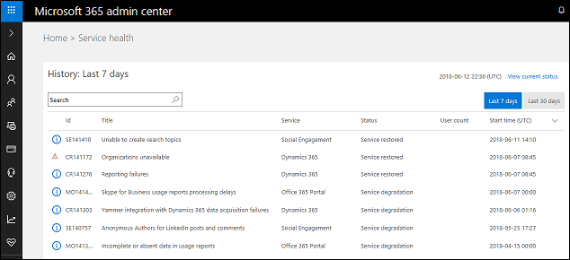

# How do I check my online service health?

You can quickly get a real-time status of your Dynamics 365 and Microsoft 365 services. The dashboard on the Microsoft 365 Admin Center provides a comprehensive view of the service health of your online services. If users are having trouble signing in to Dynamics 365 apps, check this page to see if there is a service outage.
  
## View a snapshot of service health  
Browse to the [Microsoft 365 admin center](https://admin.microsoft.com/) and sign in using Global admin credentials. You can see a quick snapshot of service health for some of your Microsoft 365 services.  Select **Service health** (from the menu: **Health** > **Service health**) to get more information on all your services.  
  
  
  
## View Dynamics 365  service health  
Select **Health** > **Service health** > **Dynamics 365** to see if there are issues; if so, select the **advisory** link. 
  
  
  
## View service health history  
Select **View history** in the upper-right corner to view the past 7 or the past 30 days of service. 

Select an item to see service health status and details for that item. 
  
  

## View planned maintenance  

Select the **Message center** on your home dashboard (from the menu: **Health** > **Message center**) to see if there are any scheduled events for your online service and to view other informative messages.  
  
  
   
### See also  
[Get Help + Support](get-help-support.md)  
[Microsoft Dataverse analytics](analytics-common-data-service.md)
