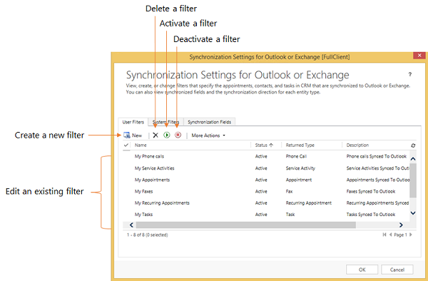
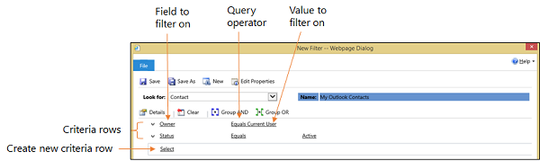
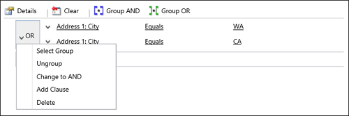

# Choose the records to synchronize between customer engagement apps and Exchange 

<!-- legacy procedure --> 

[!INCLUDE [cc-data-platform-banner](../includes/cc-data-platform-banner.md)]

The customer engagement apps (Dynamics 365 Sales, Dynamics 365 Customer Service, Dynamics 365 Field Service, Dynamics 365 Marketing, and Dynamics 365 Project Service Automation), use online synchronization filters to determine which records to synchronize between customer engagement apps and [!INCLUDE[pn_Exchange](../includes/pn-exchange.md)] (using [!INCLUDE[cc_server_side_synch](../includes/cc-server-side-synch.md)]). You can modify the existing online synchronization filters or create new filters to synchronize certain types of records. You can also delete, deactivate, or activate filters.  
  
 Email is not included in the synchronization filters because email is controlled by when the email is created in customer engagement apps, whether the user is on the recipient list or not.   
  
## Create or modify online synchronization filters  
  
1. In the web app, in the upper-right corner of the screen, click the **Settings** button  > **Options**.  
  
2. In the **Set Personal Options** dialog box, click the **Synchronization** tab.  
  
3. Under **Synchronize customer engagement apps items with Outlook or Exchange**, click the **filters** link.  
  
  Customer engagement apps displays the **Synchronization Settings for [!INCLUDE[pn_Outlook_short](../includes/pn-outlook-short.md)] or [!INCLUDE[pn_Exchange](../includes/pn-exchange.md)]** dialog box with the **User Filters** tab selected. You can use this tab to create or edit a filter, or to delete, activate, or deactivate a filter.  
  
     
  
   > [!NOTE]
   > If you're a system administrator, you can create or modify organization-wide filters (system filters) through the SDK. [!INCLUDE[proc_more_information](../includes/proc-more-information.md)] [Tell me more about system filters](https://docs.microsoft.com/powerapps/developer/common-data-service/outlook-client/offline-outlook-filters-templates) 
  
4. Do one of the following:  
  
   -   To open an existing filter, click the filter.  
  
   -   To create a new filter, click **New**.  
  
## Create or modify filter criteria  
 You use a criteria row to create or modify criteria in an offline synchronization filter. Each criteria row contains three values: the field to use in the filter (for example, **City**), an operator (for example, **Equals** or **Contains**), and the value to filter on (for example, **WA**).  
  
   
  
#### Add a criteria row  
  
1.  In the **Look for** list, select a record type.  
  
2.  Point to **Select** in the criteria grid, and then select the field to filter on from the list.  
  
3.  Select an operator from the list.  
  
4.  Enter a value to filter on.  
  
#### Group rows of criteria  
  
1. For each row you want to group, click the down arrow to the left of the field name, and then click **Select Row**.  
  
    To remove a row from a group, click the down arrow to the left of the field name, and then click **Delete**. To clear all rows from the criteria grid, click **Clear**.  
  
2. Click **Group AND** or **Group OR**.  
  
   After creating a group, you can click the down arrow next to the **And** or **Or** to select from different options. You can select a group, ungroup the group, change a Group AND to a Group OR or vice versa, add a clause, or delete a group.  
  
     
  
### See also  
 [Frequently asked questions about synchronizing records between customer engagement apps and Microsoft Outlook](frequently-asked-questions-synchronizing-records-dynamics-365-and-outlook.md) 

