# Set up default sync filters for multiple users for appointments, contacts, or task

Server-side synchronization uses the sync filter criteria that's set up by a user to determine which app rows are synchronized with Exchange for each user. Sync filters are initialized when server-side synchronization is first configured by a user for rows such as appointments, contacts, and task. For more information, see [Create or modify online synchronization filters](choose-records-synchronize-dynamics-365-outlook-exchange.md#create-or-modify-online-synchronization-filters).

When a user's mailbox is set up with server-side synchronization the sync filters that are listed in **User Filters** in a user's [personal options](/powerapps/user/set-personal-options#email-tab-options) are the default sync filters that are applied for server-side synchronization. When the next sync cycle takes place, server-side sync uses the sync filters set by the user to synchronize existing rows, which meet the *fetchXML* logic.
 
> [!div class="mx-imgBorder"] 
> 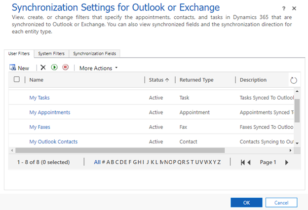

There might be scenarios where you don't want to use the defulat sync filter logic. In the screenshot below, an organization is using a sync filter template called **My Outlook Contacts** but the sync filter criteria in the template doesn't work for the organization. 

> [!div class="mx-imgBorder"] 
> 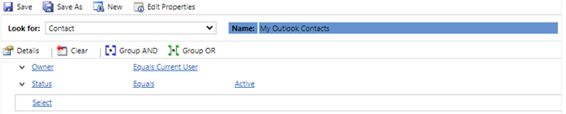

What if an organization doesn't want to synchronize every active contact that is owned by the synchronizing user and wants to put additional restrictions in the filter logic distributed by default. This logic can be changed one by one for each user, but this is time consuming and every time a user sets up server-side sync the default logic would need to be changed. Another way to modify this logic is to change the default logic distributed to users when they’re initially set up to use server-side synchronization.

This topic covers, how to find the current sync filter template and replace it will a new syce filter template for multiple users in your environment.

## Use XrmToolBox

Default synchronization templates can’t be edited within the Dynamics 365 organization solution editor. This needs to be done through calls to the Dynamics 365 API using the XrmToolBox. The [XrmToolBox](https://www.xrmtoolbox.com/) is a third-party application that has many different tools for interacting with Dynamics 365 app data. For more information on the tool, see [Documentation for XrmToolBox](https://www.xrmtoolbox.com/documentation/). 

Open the XrmToolBox and connect to your organization. Make sure the **Sync Filter Manager** tool is installed using the **Tools Library**.

> [!div class="mx-imgBorder"] 
> 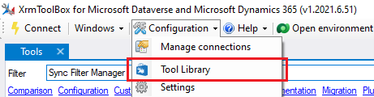

> [!div class="mx-imgBorder"] 
> 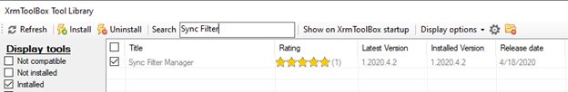

## Step 1. Check the current default sync filter template 

1. In the [XrmToolBox](https://www.xrmtoolbox.com/), go to the the **Tools** menu and open **Sync Filter Manager.** 

   > [!div class="mx-imgBorder"] 
   > 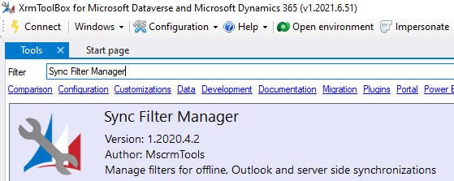

    The default landing page will open and this is where you can modify the default sync filters.

   > [!div class="mx-imgBorder"] 
   > 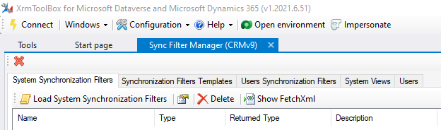

2. To access the default filters for your organization, on the **Synchronization Filters Templates** tab, select **Load Synchronization Filter Templates**.
   
   > [!Note] 
   >  There is two types of templates, **Outlook templates** and **Offline templates**. Server-side synchronization uses **Outlook Templates**. You can igore the **Offline Templates** which was used for offline mode with the [deprecated Dynamics 365 for Outlook (COM add-in)](../important-changes-coming.md#dynamic-365-for-outlook-is-deprecated). 
  
   > [!div class="mx-imgBorder"] 
   > 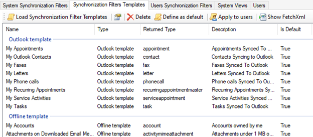

    As long as no changes have been made at a user level, the Outlook templates should match what a user has in their filter settings in [personal options](/powerapps/user/set-personal-options#email-tab-options).

   > [!div class="mx-imgBorder"] 
   > 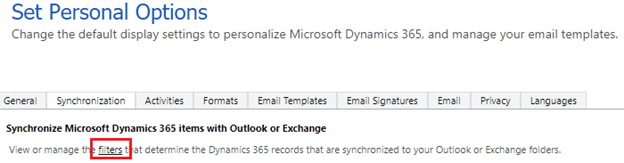

   > [!div class="mx-imgBorder"] 
   > 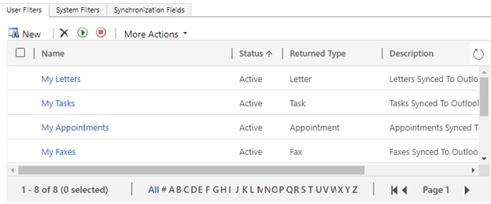

## Step 2. Create a view for the table and set sync filters

To set different default filter for a table, such as Contact row you'll need to edit the default view.

1. Open [solution explorer](/powerapps/maker/model-driven-apps/advanced-navigation.md#solution-explorer), expand **Entities**, select the table that you want, and then select **Views**. 

2. Select **Create a new view**.

   > [!div class="mx-imgBorder"] 
   > 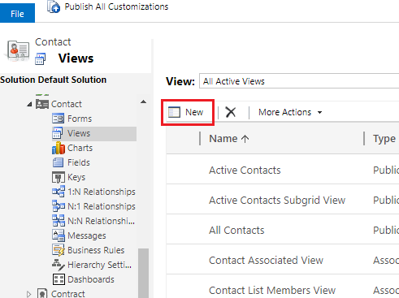
 
3. On the **View Properties** dialog enter a name and description for the view and then select **OK**.
4. Under **Common Tasks** select **Edit Filter Criteria**.

   > [!div class="mx-imgBorder"] 
   > 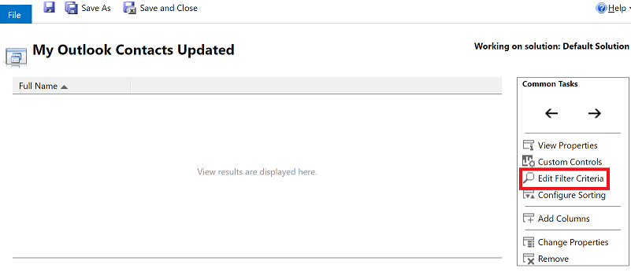

5. In the **Edit Filter Criteria** dialog, define the filter criteria for the view. For example, you can set the contact table filter with changes made to only synchronize contacts past a certain date. The other conditions that are in the existing **My Outlook Contacts** filter remain the same.

   > [!div class="mx-imgBorder"] 
   > 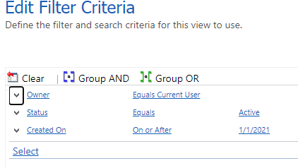

6. Select ok **OK** to save the view.

## Step 3. Set the new view as the default sync filter template

After saving the view, load the view using the XrmToolBox.

1. Open the [XrmToolBox](https://www.xrmtoolbox.com/).
2. From the default landing page, select the **System Views** tab.
3. From the list of views, select the view that you created and then select **Create** > **Synchronization Filter Template from selected view(s)**.

   > [!div class="mx-imgBorder"] 
   > 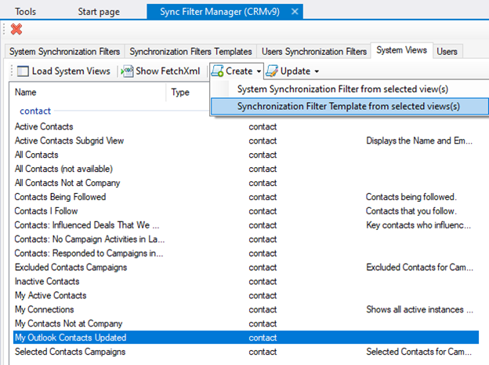

4. On the **Select Rule Template type** dialog, select **Outlook Template** and then select **OK**.

   > [!div class="mx-imgBorder"] 
   > 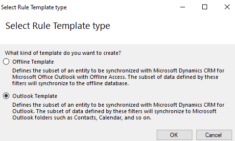

5. On the next screen, select **NO** when asked to apply to some users. Current users that are set up with server-side sync already the **My Outlook Contacts** filter applied, so adding will create an additional contact table filter.

6. Select the **Synchronization Filters Templates** tab and find the new view that was created as a template. Select it and then select **Define as Default**.

   > [!div class="mx-imgBorder"] 
   > 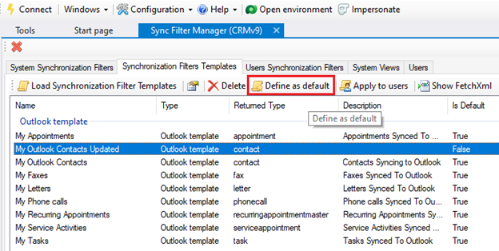

Only the filter templates where the **Is Default** value set to **True** will be distributed to new users. When new users are set up in your organization they will use the **My Outlook Contacts Updated** set as the filter criteria along with all of the other default views shown in the above screenshot. This won't change the filter set of any existing user already configured to use server-side sync for appointments, contacts and tasks. You can delete the old **My Outlook Contacts** filter if you're not going to use it anymore.

## Step 4. Delete the old sync filter template

For users that have the old default filter, you'll need to remove old filter. 

1. Open the [XrmToolBox](https://www.xrmtoolbox.com/).
2. From the default landing page, select the **Users Synchronization Filters** tab and uncheck **Display Offline Filters**.

   > [!div class="mx-imgBorder"] 
   > 

3. On the command bar, select **Load Users Synchronization Filters** menu and then select **For all users**. It might take time to load the list, depending on the number of users in your organization.

   > [!div class="mx-imgBorder"] 
   > 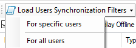

4. When the list is fully loaded on the command bar, select **Group By** and select **Returned Type**. This will group the filters by the table so they can be deleted as a group.

   > [!div class="mx-imgBorder"] 
   > 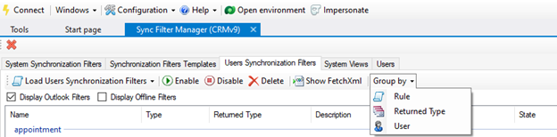

5. Select the rows that you want to delete and then on the command bar, select **Delete**. 

## Step 5. Apply the new sync filter template

Once the old filters are deleted, now you can apply the new Outlook filter template.

1. Open the [XrmToolBox](https://www.xrmtoolbox.com/).
2. From the default landing page, select the **Synchronization Filter Templates** tab and then the new template that was created in step 2. On the command bar, select **Apply to users**.

   > [!div class="mx-imgBorder"] 
   > 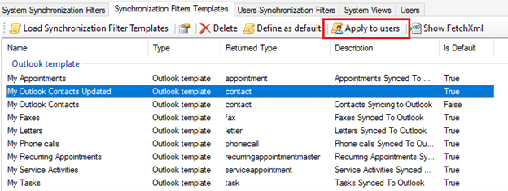

3. In the pop-up, use the search to find users. Select the users that you want to apply the template for and then select **OK**.   The filter application can be checked from the **User's Synchronization Filters** tab.

  Once the new filter is applied a user will be able to see the applied template via **Set Personal Options** settings.
  
  
   > [!div class="mx-imgBorder"] 
   > 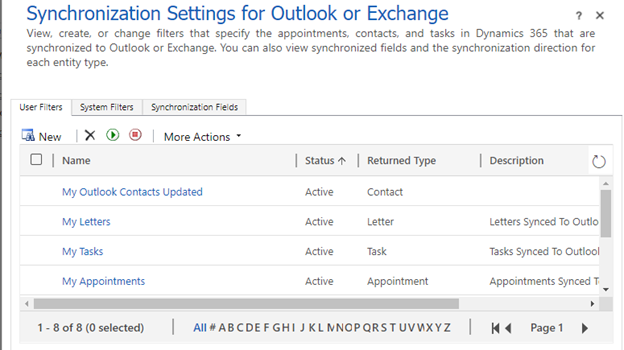
  
## Best practices for Synchronization filter logic

Changing default synchronization filter logic can change row synchronization significantly. Here are some best practices when making modifications:

- Validation of custom synchronization filters should be performed in a test environment before you apply it to a production environment.

- Applying filter conditions to an advanced find filter will show the rows being synchronized for the current user. This is important to know when troubleshooting filter conditions that don't work correctly.

- Activity parties and their party types shouldn't be changed, as they tie to values in Exchange. A good example is the Owner participation type, which has nothing to do with row ownership. For a breakdown of Activity Party SDK values, see [ActivityParty TableType](/dynamics365/customer-engagement/web-api/activityparty?view=dynamics-ce-odata-9)

- The best approach to applying a more restrictive filter criteria is to add a custom field to the table being modified and add the field as a condition for synchronization.   A common modification is to add the **Sync This Record** boolean field to the contact table and set the contact table synchronization filter criteria to require this field be set to **yes** or **true**.

## Frequently asked questions

### 1. What happens if there's two filters that exist for the same table?

  When a synchronization occurs for a table, each filter is independently applied to a set of rows to synchronize, and any rows found in each of those filter sets is synchronized. This means that since each filter is applied independently, the different row sets will still synchronize in the event filters contain conflicting logic.

  Here's an example: If filter A has **Synchronize everything** and filter B has **Synchronize this subset**, the end result is everything will be synchronized, including that subset. The resulting sync filter is essentially a combination of all synchronization filter criteria specified for a certain table.

  It's important to note that due to this, row synchronization can't be further restricted by adding additional filters, only by modifying or removing existing ones.

### 2. What happens if no enabled filters exist for a given table?

  If all filters for a table are removed then no data will be synchronized for that table. The system will still sync data for other tables that has sync filters enabled.
  
### 3. How can the list of rows that will be synchronized by a filter set be checked to ensure the right rows are being created in Exchange?

  Use advanced find and search for the exact name of the filters listed on the **Synchronization Filters** tab in the XrmToolBox. The rows listed in the search results are the rows that are synchronized with Exchange for user who has the filters applied for the specific table.
