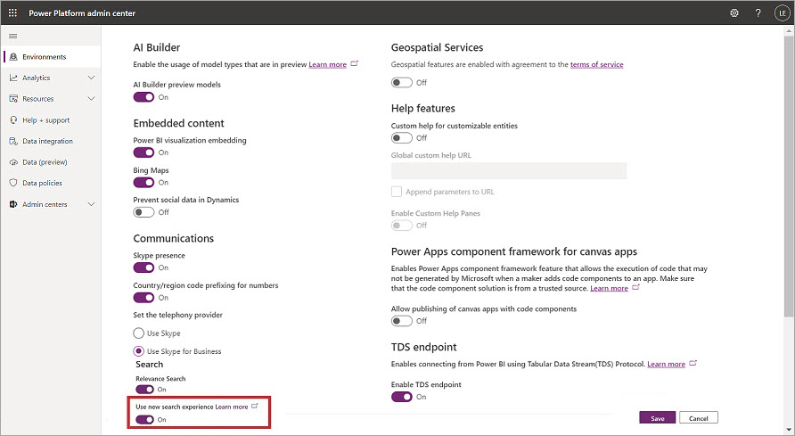
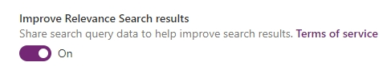

# Configure Relevance Search to improve search results and performance 

[!INCLUDE [cc-data-platform-banner](../includes/cc-data-platform-banner.md)]

<!-- legacy procedure -->

Relevance Search delivers fast and comprehensive search results in a single list, sorted by relevance. As an administrator or customizer, you'll be able to enable and configure Relevance Search as described below. Many of the configuration steps use the same user interface as the Quick Find configuration.

Relevance Search is available in addition to single-entity Quick Find on the entity grid, and as an alternative to multi-entity Quick Find (also called Categorized Search), which is accessible from the navigation bar.

Changes made to the Relevance Search configuration or to the searchable data may take up to 15 minutes to appear in the search service. It may take up to an hour or more to complete a full sync for average size organizations, and a couple of days for very large size organizations.

## What is Relevance Search?

Relevance Search brings the following benefits:

- Improved performance compared to Categorized Search. 

- Finds matches to any word in the search term in any field in the entity. Matches may include inflectional words, like "stream," "streaming," or "streamed."

- Returns results from all searchable entities in a single list sorted by relevance, based on factors, such as number of words matched or their proximity to each other in the text.

- Matches in the result list are highlighted. These appear as bolded and italicized text in the search results.

- Includes the ability to search documents found in Notes and Attachments on Emails and Appointments 

For more information about Relevance Search, see: [Using relevance search to search for records](https://docs.microsoft.com/powerapps/user/relevance-search).

Relevance Search is available in customer engagement apps (Dynamics 365 Sales, Dynamics 365 Customer Service, Dynamics 365 Field Service, Dynamics 365 Marketing, and Dynamics 365 Project Service Automation) that have installed version 9.0. It is not available for Customer Engagement (on-premises) organizations. Full-text Quick Find is available for Customer Engagement (on-premises) organizations, starting with Dynamics CRM 2015 Update Rollup 1. Quick Find is available for customer engagement apps organizations and Customer Engagement (on-premises) organizations.

For more detailed comparison of the searches available in Microsoft Dataverse, see: [Compare search options in Dataverse](https://docs.microsoft.com/powerapps/user/search).

### Language support

All searchable fields in Relevance Search  are processed in the language most closely matching the organization's base language, except Kazakh where all fields are processed using a basic, language-agnostic text processor.

## Enable Relevance Search

Relevance Search is an opt-in feature, set to off by default. Enabling Relevance Search makes this search option available to all members of your organization.

To enable Relevance Search, do the following:

1.	In the [Power Platform admin center](https://admin.powerplatform.microsoft.com), select an environment.

2.	Select **Settings** > **Product** > **Features**.

3.	Under **Search**, set **Relevance Search** to **On**.

4.	Select **Save**.

## Enable the new Relevance Search experience

The new search experience is available as a feature setting in the Power Platform admin Center. It combines the strength of Relevance Search as a service, with a user interface that is intuitive, familiar, and easy to use. When the Use new search experience setting is turned on, it will enable the new experience to all the apps in the environment.

> [!NOTE]
> The **Use new search experience feature** setting is only available for environments where Relevance Search is already turned on. For environments where Relevance Search has never been not turned on, the setting **Use new search experience** will not be shown and the new experience is turned on by default.

To enable the new Relevance Search experience:

1.	In the [Power Platform admin center](https://admin.powerplatform.microsoft.com), select an environment.

2.	Select **Settings** > **Product** > **Features**.

3.	Under **Search**, set **Use new search experience** to **On**.

   > [!div class="mx-imgBorder"] 
   > 

4.	Select **Save**.

For information on using the new Relevance Search experience, see [Use the new Relevance Search experience](https://docs.microsoft.com/powerapps/user/relevance-search#use-the-new-relevance-search-experience).

> [!TIP]
> We are addressing an issue that makes the feature **Use new search experience** not show up in environments that were created from another environment as a copy. Please try the following steps to mitigate the issue.
> 
> 1. Turn **Relevance Search** off.
> 2. Wait approximately 5 to 10 minutes.
> 3. Turn **Relevance Search** on. 

## Select entities for Relevance Search  
 To configure Relevance Search, use the **Configure Relevance Search** selection on the task bar, as shown here.  

   

 There is no limit on how many entities you can include in the Relevance Search results. However, there is a limit on the total number of fields that can be enabled in Relevance Search. The maximum is 1000 searchable fields for an organization. Out of these 1000 fields, up to 50 fields are required by the Relevance Search system, so you can configure up to 950 searchable fields in Relevance Search. When you select an entity to include in the search results, you'll notice a number in parentheses next to the entity name. The number indicates how many fields each entity uses in the Relevance Search index. Some fields, such as **Primary Name** and **ID**, are shared by multiple entities and don't count toward the total. Additionally, some field types use more than one field in the Relevance Search index as indicated in this table.  

|Field type|Number of fields used in the Relevance Search index|  
|----------------|--------------------------------------------------------|  
|Lookup (customer, owner, or Lookup type attribute)|3|  
|Option Set (state, or status type attribute)|2|  
|All other types of fields|1|  

 The progress bar **Total fields indexed** shows the percentage of indexed fields to the maximum allowed number of searchable fields.  

 When you have reached the indexed field limit, you'll see a warning message. If you want to add more fields to the index, you'll have to free up space, either by removing some of the fields that are already in the index or removing entire entities from Relevance Search scope.  

 To select entities for the Relevance Search results, do the following:  

1. [!INCLUDE[proc_settings_customization](../includes/proc-settings-customization.md)]  

2. Select **Customize the System**.  

3. Under **Components**, expand **Entities**, and then select **Configure Relevance Search**.  

4. The **Select Entities** dialog box opens. Select **Add** to select the entities for the search results. When you're done, select **OK**.  

     

5. Select **Publish All Customizations** for your changes to take effect.  

By default, some out-of-the-box system entities are included in Relevance Search. However, custom entities aren't included. You must add them to Relevance Search.  

## Configure searchable fields for Relevance Search  

 The fields you add in the Quick Find view become part of the Relevance Search index. There is no limit on how many searchable fields you can add for each entity. However, there is a limit on the total number of indexed fields, as was explained in the previous section. **Find Columns** on a **Quick Find View** define the searchable fields in the Relevance Search index. Text fields such as Single Line of Text and Multiple Lines of Text, Lookups, and Option Sets are searchable. **Find Columns** with other data types are ignored. The **View Columns** on a **Quick Find View** define the fields that are displayed in the user interface by default when the matched results are returned. The fields that are highlighted replace the fields that don't have the highlighting. The first four matched fields are displayed in the results. The **filter** on a Quick Find view is also applied to the Relevance Search results.  See the table below for the list of filter clauses not supported by Relevance Search. 

> [!NOTE]
> There are some fields, called common fields, common to every CRM entity that are defined on the index by default. They are:
> 1. ownerid (Name of lookup)
> 2. owningbusinessunit (Name of lookup)
> 3. statecode (Label of optionset)
> 4. statuscode (Label of optionset)
> 5. name (Primary name field of any entity. This may or may not be the same as the logical name (fullname, subject etc.) of the entity)
> If a common field is added to any entity for Relevance Search, search will be performed for that common field across all entities. However, once you choose a specific entity through the Record Type facet, Relevance Search will follow the settings you have defined for that specific entity through Quick Find View.

 You can use the **Quick Find** view to define which fields appear as facets when users search by using Relevance Search.  All **View Columns** with data types other than Single Line of Text and Multiple Lines of Text are marked as facetable and filterable in the index. By default, the first four facetable fields in the **Quick Find** view for the selected entity are displayed as facets when users search by using Relevance Search. At any time, you can only have four fields selected as facets.  

1. [!INCLUDE[proc_settings_customization](../includes/proc-settings-customization.md)]  

2. Select **Customize the System**.  

3. Under **Components**, expand **Entities**, and then expand the entity you want.  

4. In the navigation tree, click **View**. Double-click **Quick Find View**. The following illustration shows the **Quick Find** view for the `Account` entity.  

     

5. Select **Add Find Columns**. In the dialog box, select the fields you want to add to the search index. When done, select **OK**. In the following illustration, you see the                  `Account` entity fields added to the Relevance Search index.  

     

6. Repeat the steps for the **View Columns**.  

7. Select **Publish All Customizations** for your changes to take effect.  

> [!NOTE]
> The changes you make in **Quick Find** view also apply to single-entity and multi-entity (Categorized Search) Quick Find configurations. This is why we don't prevent you from including the fields that aren't supported for Relevance Search when you configure **Quick Find** view. However, unsupported fields aren't synced to the Relevance Search index and don't appear in the Relevance Search results.  

 For Relevance Search, fields on a related entity are not supported as Find, View, or Filter fields.  

 The following table contains the **Quick Find Filter** operators that aren't supported for Relevance Search:  

|Operator|  
|---------------------------|  
|**Like**|  
|**NotLike**|  
|**BeginsWith**|  
|**DoesNotBeginWith**|  
|**EndWith**|  
|**DoesNotEndWith**|  
|**ChildOf**|  
|**Mask**|  
|**NotMask**|  
|**MaskSelect**|  
|**EqualUserLanguage**|  
|**Under**|  
|**NotUnder**|  
|**UnderOrEqual**|  
|**Above**|  
|**AboveOrEqual**|  
|**NotNull** |
|**Null** |

## Set managed property for Relevance Search  

 If you want to include an entity in Relevance Search, the **Can enable sync to external search index** managed property for this entity must be set to **True**. By default, the property is set to **True** for some of the out-of-the-box system entities and all custom entities. Some of the system entities can't be enabled for Relevance Search.  

 To set the managed property, do the following:  

1. [!INCLUDE[proc_settings_customization](../includes/proc-settings-customization.md)]  

2. Select **Customize the System**.  

3. Under **Components**, expand **Entities**, and then select the entity you want.  

4. On the menu bar, select **Managed Properties**. For **Can enable sync to external search index**, select **True** or **False** to set the property to the desired state. Select **Set** to exit, as shown here.  

     

5. Select **Publish** for your changes to take effect.  

   If you want to change the **Can enable sync to external search index** property to **False**, you must first deselect the entity from Relevance search. If the entity is included in Relevance Search, you'll see the following message: "This entity is currently syncing to an external search index. You must remove the entity from the external search index before you can set the **Can Enable Sync to External Search Index** property to **False**." If **Can Enable Sync to External Search Index** is set to **False**, you'll see the following message when you try to include an entity in Relevance Search: "Entity can't be enabled for Relevance Search because of the configuration of its managed properties." For custom entities with particularly sensitive data, you may consider setting the **Can enable sync to external search index** property to **False**. Keep in mind, after you install the managed solution on the target system, you won't be able to change the value of the property because it's a managed property.  

## Help improve Relevance Search results

To help Microsoft improve Relevance Search, you can share your organization’s Relevance Search queries in Dynamics 365 and Power Platform applications with Microsoft. This data will help Microsoft build, improve, and validate the Microsoft machine learning model for the Dynamics 365 Natural Language search query technology.

Your organization’s queries and results are reviewed by people using secured computers in the United States. Aggregate data about queries and results are used by Microsoft engineers and data scientists to improve future search query results for all users worldwide. Your data remains your property. Your organization’s data will be stored within your tenant’s compliance boundary and is automatically deleted after 30 days. You can delete the data at any time by navigating to the Power Platform admin center and toggling **Improve Relevance Search results** to **Off**. For more information, see **Terms of Service** in the Power Platform admin center.

**Improve Relevance Search results** is off by default. To enable:

1.	In the [Power Platform admin center](https://admin.powerplatform.microsoft.com), select an environment.

2.	Select **Settings** > **Product** > **Features**.

3. Under **Search**, set **Improve Relevance Search results** to **On**.

   > [!div class="mx-imgBorder"] 
   > 

4.	Select **Save**.

### See also  
 [Use relevance search to search for records](https://docs.microsoft.com/powerapps/user/relevance-search)  
 [Use the new Relevance Search experience](https://docs.microsoft.com/powerapps/user/relevance-search#use-the-new-relevance-search-experience)