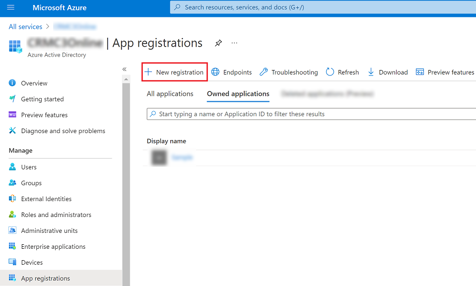
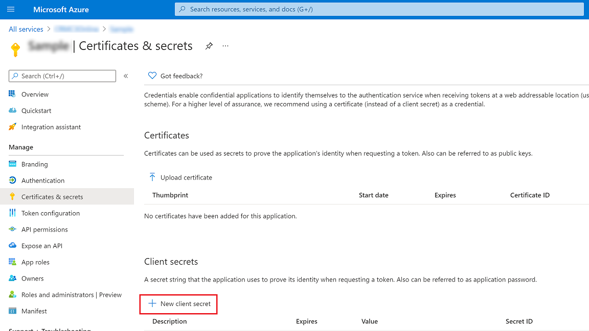
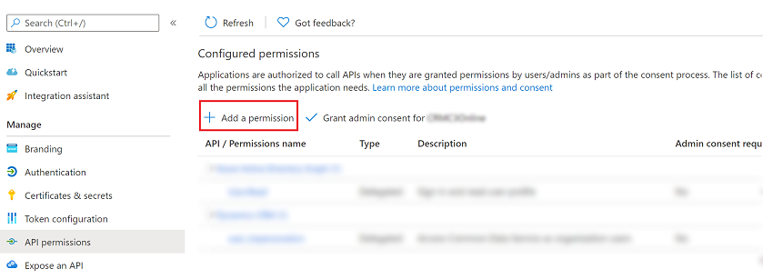
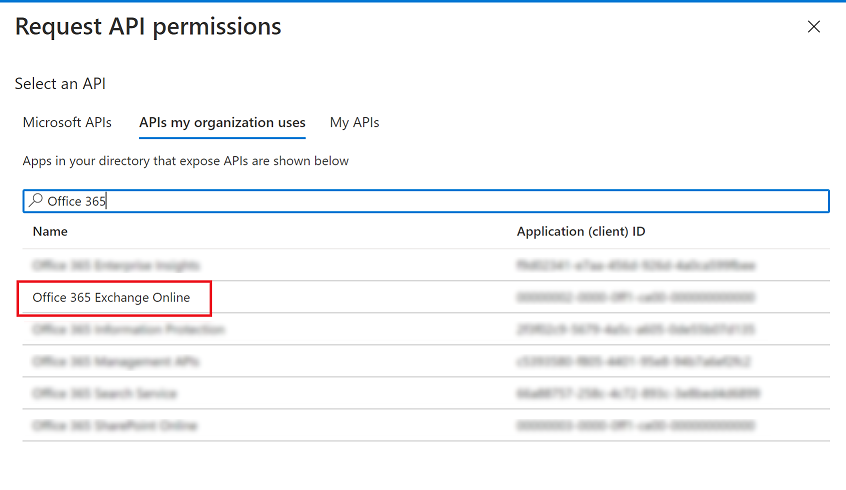
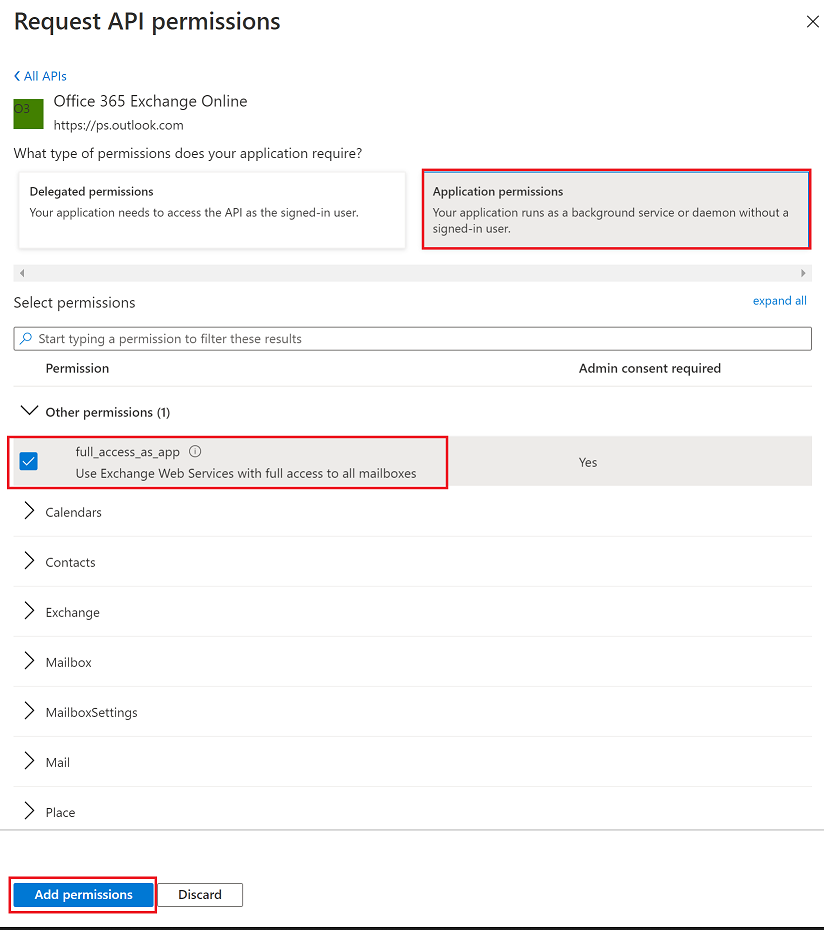
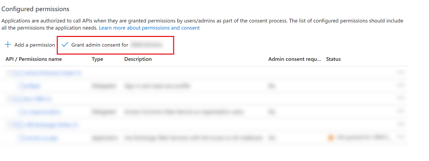
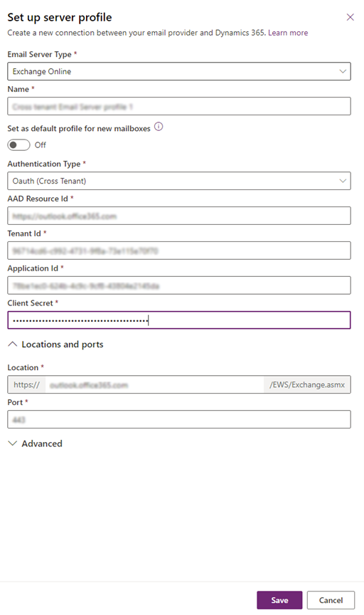

# Exchange Online cross tenant authentication

Use Server-Side Sync to synchronize Exchange Online mailboxes that reside on different Exchange Online tenants. Follow the steps in this topic to complete the prerequisites before you set up an Exchange Online server profile using Oauth cross tenant authentication. For more information, see [Create an email server profile for Exchange Online](connect-exchange-online.md#create-an-email-server-profile-for-exchange-online).

## Configuration

Sign in to the [Azure portal](https://portal.azure.com/), create the App registration and then configure the email server profile.

## Register your app

Register your app on Azure portal on the tenant where Microsoft Exchange Online resides. Follow the steps in this topic to create the app registration: [Register an application](/azure/active-directory/develop/quickstart-register-app#register-an-application).

> [!NOTE]
> You don't need to enter anything for **Redirect URI** since it's not needed.

When you register your app, note the **Application (client) ID** and **Directory (tenant) ID** because you will need this information later to configure the email server profile.

> [!div class="mx-imgBorder"] 
> 

## Add a Client Secret

A client secret is a string value your app uses to identity itself. It's used by Dynamics 365 to authenticate to your app.

To create a client secret, follow the steps in this topic, [Add a client secret](/azure/active-directory/develop/quickstart-register-app#add-a-client-secret). Remember to note the **Secret Value**, as you will need this information later to configure the email server profile.

> [!div class="mx-imgBorder"] 
> 

## Add API permissions 

To allow your app to have access to Exchange Online, you need to grant **Office 365 Exchange Online** API permission. 

1. Select **API permissions** &gt; **Add a permission**.
    
   > [!div class="mx-imgBorder"] 
   > 

2. Select the **APIs my organization uses** tab and then look for and select **Office 365 Exchange Online.**
   
   > [!div class="mx-imgBorder"] 
   > 

3. For type of permissions, select **Application permissions** and then select the checkbox for **full\_access\_to\_app**. When you're done, select **Add permissions**.

   > [!div class="mx-imgBorder"] 
   > 

   > [!NOTE]
   > if having an app with full access on all mailboxes that doesn't not align with your business requirements, then the Exchange online admin can scope the mailboxes the App can access using Application Access Policy or configuring the Application Impersonation role on Exchange. More information:
   > - [Scoping application permissions to specific Exchange Online mailboxes](/graph/auth-limit-mailbox-access)
   > - [Configure impersonation](/exchange/client-developer/exchange-web-services/how-to-configure-impersonation)

4. On the **Configured permissions** screen, select **Grand admin content for (tenant name)**.

    > [!div class="mx-imgBorder"] 
    > 

5. On the consent confirmation dialog, select **Yes**.

## Email server profile for Exchange Online with authentication type: Oauth (Cross Tenant)

To [create an email server profile for Exchange Online using Oauth (Cross Tenant)](connect-exchange-online.md#create-an-email-server-profile-for-exchange-online), you need to collect the following information from the Azure portal:

- TenantId: It's the tenantId of the tenant where the Exchange online is configured.
- Application ID: It's the appId used by Dynamics to connect to Exchange Online.
- Client Secret: It's the client secret used by Dynamics 365 to authenticate as the app.

  > [!div class="mx-imgBorder"]
  >  
