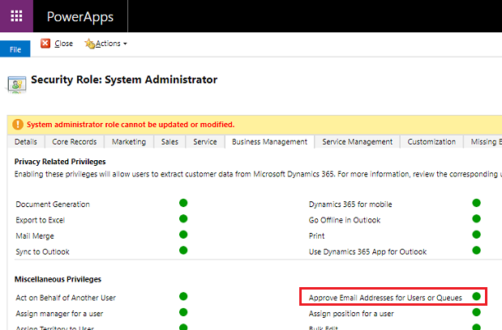
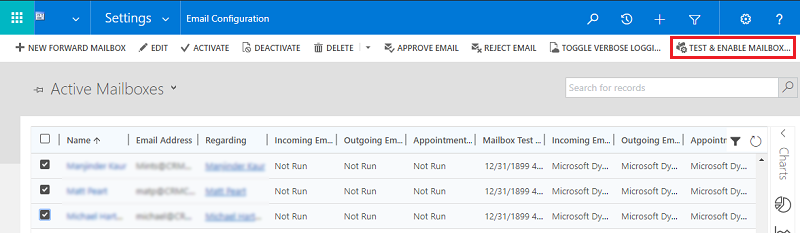

# Connect to Exchange Online

[!INCLUDE [cc-data-platform-banner](../includes/cc-data-platform-banner.md)]

<!-- legacy procedure -->

With both customer engagement apps (Dynamics 365 Sales, Dynamics 365 Customer Service, Dynamics 365 Field Service, Dynamics 365 Marketing, and Dynamics 365 Project Service Automation), and [!INCLUDE[pn_Microsoft_Exchange_Online](../includes/pn-microsoft-exchange-online.md)] hosted as online services, connecting the two is a simpler, more straightforward configuration.  
  
> [!TIP]
>  Check out the following video: [Connect to Exchange Online using server-side sync](https://go.microsoft.com/fwlink/p/?linkid=836831).  
> 
> [!IMPORTANT]
> [!INCLUDE[cc_feature_requires_office_365](../includes/cc-feature-requires-office-365.md)]  
  
   

## Get Exchange ready  
 To use [!INCLUDE[pn_Exchange_Online](../includes/pn-exchange-online.md)] with customer engagement apps, you must have an [!INCLUDE[pn_Exchange_Online](../includes/pn-exchange-online.md)] subscription that comes as part of an [!INCLUDE[pn_Office_365](../includes/pn-office-365.md)] subscription or that can be subscribed to separately. For information on [!INCLUDE[pn_Exchange_Online](../includes/pn-exchange-online.md)], see:  
  
-   [Exchange Online](https://technet.microsoft.com/library/jj200580\(v=exchg.150\).aspx)  
  
-   [Exchange Online Service Description](https://technet.microsoft.com/library/jj819276.aspx)  
  
-   [Microsoft 365 and Office 365 service descriptions](https://technet.microsoft.com/office/dn788955)  
  
> [!TIP]
>  To make sure you've got a good connection to [!INCLUDE[pn_Exchange_Online](../includes/pn-exchange-online.md)], run the [Microsoft Remote Connectivity Analyzer](https://testconnectivity.microsoft.com/). For information on what tests to run, see [Test mail flow with the Remote Connectivity Analyzer](https://technet.microsoft.com/library/dn305950\(v=exchg.150\).aspx).  
  
   

## Verify you have the profile: Microsoft Exchange Online  
 If you have an [!INCLUDE[pn_Exchange_Online](../includes/pn-exchange-online.md)] subscription in the same tenant as your subscription, customer engagement apps create a default profile for the email connection: **Microsoft Exchange Online**. To verify this profile:  
  
1. In the Power Platform admin center, select an environment. 

2. Select **Settings** > **Email** > **Server profiles**.  
  
3. Select **Active Email Server Profiles** and check that the **Microsoft Exchange Online** profile is in the list. If the [!INCLUDE[pn_Microsoft_Exchange_Online](../includes/pn-microsoft-exchange-online.md)] profile is missing, verify you have an [!INCLUDE[pn_Exchange_Online](../includes/pn-exchange-online.md)] subscription and that it exists in the same tenant as your subscription.  
  
4. If there are multiple profiles, select the **Microsoft Exchange Online** profile and set it as default.  
  
   

## Configure default email processing and synchronization  
 Set server-side synchronization to be the default configuration method for newly created users.  
  
1. In the Power Platform admin center, select an environment. 

2. Select **Settings** > **Email** > **Email settings**.  
  
3. Set the processing and synchronization fields as follows:  
  
   - **Server Profile**: [!INCLUDE[pn_Microsoft_Exchange_Online](../includes/pn-microsoft-exchange-online.md)]  
  
   - **Incoming Email**: Server-Side Synchronization or Email Router  
  
   - **Outgoing Email**: Server-Side Synchronization or Email Router  
  
   - **Appointments, Contacts, and Tasks**: Server-Side Synchronization
  
4. Select **Save**.  
  
All new users will have these settings applied to their mailbox.  
  
   

## Configure mailboxes  
 New users will have their mailboxes configured automatically with the settings you made in the prior section. For existing users added prior to the above settings, you must set the Server Profile and the delivery method for email, appointments, contacts, and tasks.  
  
 In addition to administrator permissions, you must have Read and Write privileges on the Mailbox entity to set the delivery method for the mailbox.  
  
 Choose **one** of the following methods:  
  
### Set mailboxes to the default profile  
  
1. In the web app, go to **Settings** > **Email Configuration** > **Mailboxes**.  
  
2. Choose **Active Mailboxes**.  
  
3. Select all the mailboxes that you want to associate with the [!INCLUDE[pn_Microsoft_Exchange_Online](../includes/pn-microsoft-exchange-online.md)] profile, select **Apply Default Email Settings**, verify the settings, and then select **OK**.  
  
     
  
    By default, the mailbox configuration is tested and the mailboxes are enabled when you select **OK**.  
  
### Edit mailboxes to set the profile and delivery methods  
  
1.  In the web app, go to **Settings** > **Email Configuration** > **Mailboxes**.  
  
2.  Select **Active Mailboxes**.  
  
3.  Select the mailboxes that you want to configure, and then select **Edit**.  
  
4.  In the **Change Multiple Records** form, under **Synchronization Method**, set **Server Profile** to **Microsoft Exchange Online**.  
  
5.  Set **Incoming** and **Outgoing** **Email** to **Server-Side Synchronization or Email Router**.  
  
6.  Set **Appointments, Contacts, and Tasks** to **Server-Side Synchronization**.  
  
7.  Select **Change**.  
  
   

## Approve email  

To approve emails for customer engagement apps, a user requires:

1. The **Approve Email Addresses for Users or Queues** privilege. 
2. The permissions as described in the table below.

### Require admin approval?

Decide which approach you want your organization to follow for mailbox approval.

### Permission model
The following table describes the permissions required to approve emails.

**Terminology**
- **Yes**: can approve email
- **No**: cannot approve email
- **n/a**: not applicable

> [!NOTE]
> This permission model is being gradually rolled out and will be available once it is deployed to your region. Check the version number provided below for when the change will be provided. 

<table>
  <tr>
    <th colspan="2">Security roles / Applications in use</th>
    <th colspan="2">Both roles required: Global admin and  System admin</th>
    <th colspan="2">Both roles required: Exchange admin and  System admin</th>
    <th>System admin</th>
    <th>Service admin</th>
    <th>Exchange admin</th>
    <th>Global admin</th>
  </tr>
  <tr>
    <td rowspan="2">Customer engagement apps</td>
    <td>Exchange Online</td>
    <td colspan="2">2Yes</td>
    <td colspan="2">2Yes</td>
    <td>No</td>
    <td>No</td>
    <td>No</td>
    <td>No</td>
  </tr>
  <tr>
    <td>Exchange On-premises</td>
    <td colspan="2">3Yes</td>
    <td colspan="2">3Yes</td>
    <td>3No</td>
    <td>No</td>
    <td>n/a</td>
    <td>n/a</td>
  </tr>
  <tr>
  <tr>
    <td rowspan="2">Customer Engagement (on-premises)</td>
    <td>Exchange Online</td>
    <td colspan="2">n/a</td>
    <td colspan="2">n/a</td>
    <td>1Yes</td>
    <td>n/a</td>
    <td>n/a</td>
    <td>n/a</td>
  </tr>
  <tr>
    <td>Exchange On-premises</td>
    <td colspan="2">n/a</td>
    <td colspan="2">n/a</td>
    <td>1Yes</td>
    <td>n/a</td>
    <td>n/a</td>
    <td>n/a</td>
  </tr>
</table>

1 We recommend you include your Exchange admin in custom business processes your organization follows for this configuration.  
2 We are updating for customer engagement apps/Exchange Online, for version 9.1.0.5805 or later.   
3 We will be updating for customer engagement apps/Exchange On-premises. Check back for version information.

 To determine your version, sign in and in the upper-right corner of the screen, select the **Settings** button () > **About**.  

### Require and configure mailbox approval 

Follow these steps to approve email addresses for users and queues. By default, admins, as described in the Permission model table, are required to approve emails.

#### Add Approve Email Addresses for Users or Queues privilege

To approve emails, a Dynamics user requires the **Approve Email Addresses for Users or Queues** privilege.  A system admin can assign the **Approve Email Addresses for Users or Queues** privilege to any security role and assign the security role to any user. 

To manually assign the **Approve Email Addresses for Users or Queues** privilege to a security role: 

1. In the Power Platform admin center, select an environment. 

2. Select **Settings** > **Users + permissions** > **Security roles**.  

3. Select a security role, and then select the **Business Management** tab. 

4. Under **Miscellaneous Privileges**, set the privilege level for **Approve Email Addresses for Users or Queues**.
  
> [!div class="mx-imgBorder"] 
> 

#### Approve mailboxes

1. In the web app, go to **Settings** > **Email Configuration** > **Mailboxes**.  
  
2. Select **Active Mailboxes**.  
  
3. Select the mailboxes that you want to approve, and then select **More Commands** (**…**) > **Approve Email**.  
  
4. Select **OK**.  

### Remove requirement to approve mailboxes

Admins, as described in the Permission model table, can change the settings so mailbox approval is not required.

1. In the Power Platform admin center, select an environment. 

2. Select **Settings** > **Email** > **Email settings**.  

2. Under **Security and permissions**, **Process emails only for approved users** and **Process emails only for approved queues** to **Off**. These settings are enabled by default.

3. Select **Save**.

   

## Test configuration of mailboxes  

1. In the web app, go to **Settings** > **Email Configuration** > **Mailboxes**.  
  
2. Select **Active Mailboxes**.  
  
3. Select the mailboxes you want to test, and then select **Test & Enable Mailbox**.  

   > [!div class="mx-imgBorder"] 
   > 
  
   This tests the incoming and outgoing email configuration of the selected mailboxes and enables them for email processing. If an error occurs in a mailbox, an alert is shown on the Alerts wall of the mailbox and the profile owner. Depending on the nature of the error, customer engagement apps try to process the email again after some time or disables the mailbox for email processing.  
  
   To see alerts for an individual mailbox, open the mailbox and then under **Common**, select **Alerts**.  
  
   The result of the email configuration test is displayed in the **Incoming Email Status**, **Outgoing Email Status**, and **Appointments, Contacts, and Tasks Status** fields of a mailbox record. An alert is also generated when the configuration is successfully completed for a mailbox. This alert is shown to the mailbox owner.  
  
   You can find information on recurring issues and other troubleshooting information in [Blog: Test and Enable Mailboxes in Microsoft Dynamics CRM 2015](https://blogs.msdn.com/b/crm/archive/2015/08/31/test-and-enable-mailboxes-in-microsoft-dynamics-crm-2015.aspx) and [Troubleshooting and monitoring server-side synchronization](../admin/troubleshooting-monitoring-server-side-synchronization.md).  
  
   Make sure you've got a good connection to [!INCLUDE[pn_Exchange_Online](../includes/pn-exchange-online.md)] by running the [Microsoft Remote Connectivity Analyzer](https://testconnectivity.microsoft.com/). For information on what tests to run, see [Test mail flow with the Remote Connectivity Analyzer](https://technet.microsoft.com/library/dn305950\(v=exchg.150\).aspx).  
  
> [!TIP]
>  If you're unable to synchronize contacts, appointments, and tasks for a mailbox, you may want to select the **Sync items with Exchange from this org only, even if Exchange was set to sync with a different org** check box. [Read more about this check box](when-would-want-use-check-box.md).  
  
   

## Test email configuration for all mailboxes associated with an email server profile 

1. In the Power Platform admin center, select an environment. 

2. Select **Settings** > **Email** > **Server profiles**.  
  
3. Select the [!INCLUDE[pn_Microsoft_Exchange_Online](../includes/pn-microsoft-exchange-online.md)] profile, and then select **Test & Enable Mailboxes**.  
  
    When you test the email configuration, an asynchronous job runs in the background. It may take a few minutes for the test to be completed. Customer engagement apps test the email configuration of all the mailboxes associated with the [!INCLUDE[pn_Microsoft_Exchange_Online](../includes/pn-microsoft-exchange-online.md)] profile. For the mailboxes configured with server-side synchronization for synchronizing appointments, tasks, and contacts, it also checks to make sure they're configured properly.  
  
> [!TIP]
>  If you're unable to synchronize contacts, appointments, and tasks for a mailbox, you may want to select the **Sync items with Exchange from this org only, even if Exchange was set to sync with a different org** check box. [Read more about this check box](when-would-want-use-check-box.md).  
  
### See also  
[Troubleshooting and monitoring server-side synchronization](../admin/troubleshooting-monitoring-server-side-synchronization.md)   
[Test mail flow by validating your connectors](https://docs.microsoft.com/exchange/mail-flow-best-practices/test-mail-flow)   
