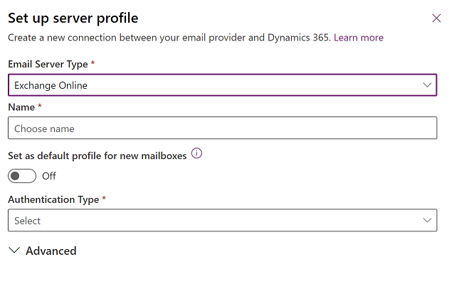

# Connect to Exchange Online

[!INCLUDE [cc-beta-prerelease-disclaimer](../includes/cc-beta-prerelease-disclaimer.md)]

With both [!INCLUDE[pn_Microsoft_Exchange_Online](../includes/pn-microsoft-exchange-online.md)] and customer engagement apps (such as [Dynamics 365 Sales](/dynamics365/sales-professional/help-hub), [Dynamics 365 Customer Service](/dynamics365/customer-service/help-hub), [Dynamics 365 Marketing](/dynamics365/marketing/help-hub), [Dynamics 365 Field Service](/dynamics365/field-service/overview), and [Dynamics 365 Project Service Automation](/dynamics365/project-operations/psa/overview)) hosted as online services, connecting the two is a simpler, more straightforward configuration.  
  

> [!IMPORTANT]
> [!INCLUDE[cc_feature_requires_office_365](../includes/cc-feature-requires-office-365.md)]  

## Get Exchange ready

 To use [!INCLUDE[pn_Exchange_Online](../includes/pn-exchange-online.md)] with customer engagement apps, you must have an [!INCLUDE[pn_Exchange_Online](../includes/pn-exchange-online.md)] subscription that either comes as part of a [!INCLUDE[pn_Office_365](../includes/pn-office-365.md)] subscription or can be subscribed to separately. For information about [!INCLUDE[pn_Exchange_Online](../includes/pn-exchange-online.md)], go to:  
  
-   [Exchange Online](/exchange/exchange-online)
-   [Exchange Online service description](/office365/servicedescriptions/exchange-online-service-description/exchange-online-service-description)
-   [Microsoft 365 and Office 365 service descriptions](/office365/servicedescriptions/office-365-service-descriptions-technet-library)  
  
> [!TIP]
>  To make sure you've got a good connection to [!INCLUDE[pn_Exchange_Online](../includes/pn-exchange-online.md)], run the [Microsoft Remote Connectivity Analyzer](https://testconnectivity.microsoft.com/). For information about which tests to run, see [Test mail flow with the Remote Connectivity Analyzer](https://technet.microsoft.com/library/dn305950\(v=exchg.150\).aspx).


## Preview: Create an email server profile for Exchange Online

1. In the [Power Platform admin center](https://admin.powerplatform.microsoft.com), select an environment. 

2. On the command bar, select **Settings** > **Email** > **Server profiles**.  

   > [!div class="mx-imgBorder"] 
   > 

3. On the command bar, select **New server profile**.

   > [!div class="mx-imgBorder"] 
   > 

4. For **Email Server Type**, select **Exchange Online**, and then enter a meaningful **Name** for the profile.

   > [!div class="mx-imgBorder"] 
   > 

5. If you want to use this server profile as the default profile for new mailboxes, turn on **Set as default profile for new mailboxes**.

6. For **Authentication Type**, choose one of the following:

    - **S2S auth (Same Tenant)**: Use this option when Exchange resides in the same tenant as Dynamics 365. More information: [Build web applications using server-to-server (S2S) authentication](/powerapps/developer/data-platform/build-web-applications-server-server-s2s-authentication)

    - **Oauth (Cross Tenant)**: Use this option when Exchange resides in a different tenant than Dynamics 365. To get the information for this option, follow the steps in [Exchange Online cross-tenant authentication](connect-exchange-online-server-profile-oauth.md). Note that the **Locations and ports** fields are automatically populated.

      > [!div class="mx-imgBorder"]
      >  

7. Expand the **Advanced** section, and then use the tooltips to choose your email processing options. 

8. When you're done, select **Save**.

## Verify that you have the profile Microsoft Exchange Online

 If you have an [!INCLUDE[pn_Exchange_Online](../includes/pn-exchange-online.md)] subscription in the same tenant as your subscription, customer engagement apps create a default profile named **Microsoft Exchange Online** for the email connection. To verify that you have this profile, do the following:  
  
1. Do one of the following: 

   - In the [Power Platform admin center](https://admin.powerplatform.microsoft.com), select an environment.    
   - In the legacy web client in the upper-right corner, select , and then select **Advanced settings**. 

2. Select **Settings** > **Email** > **Server profiles**.  
  
3. Select **Active Email Server Profiles**, and verify that the **Microsoft Exchange Online** profile is in the list. If the [!INCLUDE[pn_Microsoft_Exchange_Online](../includes/pn-microsoft-exchange-online.md)] profile is missing, verify that you have an [!INCLUDE[pn_Exchange_Online](../includes/pn-exchange-online.md)] subscription and that it exists in the same tenant as your subscription.  
  
4. If there are multiple profiles, select the **Microsoft Exchange Online** profile and set it as default.  

## Configure default email processing and synchronization

Set server-side synchronization to be the default configuration method for newly created users.  
  
1. Do one of the following: 

   - In the [Power Platform admin center](https://admin.powerplatform.microsoft.com), select an environment.    
   - In the legacy web client in the upper-right corner, select , and then select **Advanced settings**. 

2. Select **Settings** > **Email** > **Email settings**.  
  
3. Set the processing and synchronization columns as follows:  
  
   - **Server Profile**: [!INCLUDE[pn_Microsoft_Exchange_Online](../includes/pn-microsoft-exchange-online.md)]  
  
   - **Incoming Email**: Server-Side Synchronization or Email Router  
  
   - **Outgoing Email**: Server-Side Synchronization or Email Router  
  
   - **Appointments, Contacts, and Tasks**: Server-Side Synchronization
  
4. Select **Save**.  
  
All new users will have these settings applied to their mailbox.  

## Configure mailboxes

New users will have their mailboxes configured automatically with the settings you made in the prior section. For existing users who were added before you made these above settings, you must set the server profile and the delivery method for email, appointments, contacts, and tasks.  
  
In addition to administrator permissions, you must have Read and Write privileges on the Mailbox table to set the delivery method for the mailbox.  
  
Choose *one* of the following methods: set mailboxes to the default profile, or edit mailboxes to set profile and delivery methods.

<!--markdownlint-disable MD036--> 
**To set mailboxes to the default profile**

1. Do one of the following: 

   - In the [Power Platform admin center](https://admin.powerplatform.microsoft.com), select an environment.    
   - In the legacy web client in the upper-right corner, select , and then select **Advanced settings**.  

2. Select **Settings** > **Email** > **Mailboxes**.  
  
3. Select **Active Mailboxes**.  
  
4. Select all the mailboxes that you want to associate with the [!INCLUDE[pn_Microsoft_Exchange_Online](../includes/pn-microsoft-exchange-online.md)] profile, select **Apply Default Email Settings**, verify the settings, and then select **OK**.  
  
     
  
   By default, the mailbox configuration will be tested and the mailboxes enabled when you select **OK**.  
  
**To edit mailboxes to set the profile and delivery methods**
  
1. Do one of the following: 

   - In the [Power Platform admin center](https://admin.powerplatform.microsoft.com), select an environment.    
   - In the legacy web client in the upper-right corner, select , and then select **Advanced settings**. 

2. Select **Settings** > **Email** > **Mailboxes**.  
  
3. Select **Active Mailboxes**.  
  
4. Select the mailboxes that you want to configure, and then select **Edit**.  
  
5. In the **Change Multiple Records** form, under **Synchronization Method**, set **Server Profile** to **Microsoft Exchange Online**.  
  
6. Set **Incoming** and **Outgoing** **Email** to **Server-Side Synchronization or Email Router**.  
  
7. Set **Appointments, Contacts, and Tasks** to **Server-Side Synchronization**.  
  
8. Select **Change**.  
  
## Approve email  

To approve emails for customer engagement apps, a user requires:

- The **Approve Email Addresses for Users or Queues** privilege. 
- The permissions as described in the **Permissions model** table later in this topic.

### Require admin approval?

Decide which approach you want your organization to follow for mailbox approval.<!--note from editor: Please verify the long alt text.-->

:::image type="complex" source="media/approval-flow-chart.png" alt-text="Flowchart for deciding on your mailbox approval approach.":::
   Flowchart with the starting condition "You must be an Office 365 Global admin + Dynamics 365 System admin OR an Exchange admin + Dynamics 365 System admin." The first decision point is "Do you want to require mailbox approval?" The "No" path leads to "See 'Remove requirement to approve mailboxes'". The "Yes" path leads to "See Permissions model."
:::image-end:::

<!---->

> [!NOTE]
> We're planning to revise the mailbox approval process with scenarios that don't require global admin approval. We'll update this documentation when that becomes available.

### Permissions model

The following table describes the permissions required to approve emails.

**Terminology**

- **Yes**: Can approve email
- **No**: Can't approve email
- **n/a**: Not applicable

> [!NOTE]
> This permissions model is being gradually rolled out and will be available as soon as it's deployed to your region. Check the version number provided in the following table for when the change will be provided. 

<table>
  <tr>
    <th colspan="2">Security roles /<br />Applications in use</th>
    <th colspan="2">Both roles required:<br />Global admin<br />and <br />System admin</th>
    <th colspan="2">Both roles required:<br />Exchange admin<br />and <br />System admin</th>
    <th>System admin</th>
    <th>Service admin</th>
    <th>Exchange admin</th>
    <th>Global admin</th>
  </tr>
  <tr>
    <td rowspan="2">Customer engagement apps</td>
    <td>Exchange Online</td>
    <td colspan="2">Yes<sup>1</sup></td>
    <td colspan="2">Yes<sup>1</sup></td>
    <td>No</td>
    <td>No</td>
    <td>No</td>
    <td>No</td>
  </tr>
  <tr>
    <td>Exchange (on-premises)</td>
    <td colspan="2">Yes<sup>2</sup></td>
    <td colspan="2">Yes<sup>2</sup></td>
    <td>No<sup>2</sup></td>
    <td>No</td>
    <td>n/a</td>
    <td>n/a</td>
  </tr>
  <tr>
  <tr>
    <td rowspan="2">Customer Engagement (on-premises)</td>
    <td>Exchange Online</td>
    <td colspan="2">n/a</td>
    <td colspan="2">n/a</td>
    <td>Yes<sup>3</sup></td>
    <td>n/a</td>
    <td>n/a</td>
    <td>n/a</td>
  </tr>
  <tr>
    <td>Exchange (on-premises)</td>
    <td colspan="2">n/a</td>
    <td colspan="2">n/a</td>
    <td>Yes<sup>3</sup></td>
    <td>n/a</td>
    <td>n/a</td>
    <td>n/a</td>
  </tr>
</table>
 
<sup>1</sup> We're updating for customer engagement apps and Exchange Online, for version 9.1.0.5805 or later.  <br />
<sup>2</sup> We'll be updating for customer engagement apps and Exchange (on-premises). Check back for version information.<br>
<sup>3</sup> We recommend that you include your Exchange admin in the custom business processes your organization follows for this configuration.

 To determine your version, sign in, and in the upper-right corner of the screen, select **Settings**  > **About**.  

### Require and configure mailbox approval 

Follow these steps to approve email addresses for users and queues. By default, admins as described in the preceding permissions model table are required to approve emails.

#### Add the Approve Email Addresses for Users or Queues privilege

To approve emails, a Dynamics 365 user requires the **Approve Email Addresses for Users or Queues** privilege.  A system admin can assign the **Approve Email Addresses for Users or Queues** privilege to any security role and assign the security role to any user. 

**To manually assign the Approve Email Addresses for Users or Queues privilege to a security role**

1. Do one of the following: 

   - In the [Power Platform admin center](https://admin.powerplatform.microsoft.com), select an environment.    
   - In the legacy web client in the upper-right corner, select , and then select **Advanced settings**. 

2. Select **Settings** > **Users + permissions** > **Security roles**.  

3. Select a security role, and then select the **Business Management** tab. 

4. Under **Miscellaneous Privileges**, set the privilege level for **Approve Email Addresses for Users or Queues**.
  
> [!div class="mx-imgBorder"] 
> 

#### Approve mailboxes

1. Do one of the following: 

   - In the [Power Platform admin center](https://admin.powerplatform.microsoft.com), select an environment.    
   - In the legacy web client in the upper-right corner, select , and then select **Advanced settings**. 

2. Select **Settings** > **Email** > **Mailboxes**.  
  
3. Select **Active Mailboxes**.  
  
4. Select the mailboxes that you want to approve, and then select **More Commands** (**…**) > **Approve Email**.  
  
5. Select **OK**.  

### Remove the requirement to approve mailboxes

Admins, as described in the preceding permissions model table, can change the settings so that mailbox approval isn't required.

1. Do one of the following: 

   - In the [Power Platform admin center](https://admin.powerplatform.microsoft.com), select an environment.    
   - In the legacy web client in the upper-right corner, select , and then select **Advanced settings**. 

2. Select **Settings** > **Email** > **Email settings**.  

3. Under **Security and permissions**, turn off **Process emails only for approved users** and **Process emails only for approved queues**. (These settings are enabled by default.)

4. Select **Save**.

## Test the configuration of mailboxes  

1. Do one of the following: 

   - In the [Power Platform admin center](https://admin.powerplatform.microsoft.com), select an environment.    
   - In the legacy web client in the upper-right corner, select , and then select **Advanced settings**. 

2. Select **Settings** > **Email** > **Mailboxes**.  
  
3. Select **Active Mailboxes**.  
  
4. Select the mailboxes you want to test, and then select **Test & Enable Mailbox**.  

   > [!div class="mx-imgBorder"] 
   > 
  
This tests the incoming and outgoing email configuration of the selected mailboxes and enables them for email processing. If an error occurs in a mailbox, an alert is shown on the **Alerts** wall of the mailbox and the profile owner. Depending on the nature of the error, customer engagement apps try to process the email again after some time or disable the mailbox for email processing.  
  
To see alerts for an individual mailbox, open the mailbox, and then under **Common**, select **Alerts**.  
  
The result of the email configuration test is displayed in the **Incoming Email Status**, **Outgoing Email Status**, and **Appointments, Contacts, and Tasks Status** columns of a mailbox record. An alert is also generated when the configuration is successfully completed for a mailbox. This alert is shown to the mailbox owner.  
  
You can find information about recurring issues and other troubleshooting information in [Blog: Test and Enable Mailboxes in Microsoft Dynamics CRM 2015](https://cloudblogs.microsoft.com/dynamics365/no-audience/2015/08/31/test-and-enable-mailboxes-in-microsoft-dynamics-crm-2015/)<!--note from editor: Edit okay? The other link just went to the Dev Blogs home page.--> and [Troubleshooting and monitoring server-side synchronization](../admin/troubleshooting-monitoring-server-side-synchronization.md).  
  
Make sure you've got a good connection to [!INCLUDE[pn_Exchange_Online](../includes/pn-exchange-online.md)] by running the [Microsoft Remote Connectivity Analyzer](https://testconnectivity.microsoft.com/). For information about what tests to run, see [Test mail flow with the Remote Connectivity Analyzer](https://technet.microsoft.com/library/dn305950\(v=exchg.150\).aspx).<!--note from editor: This is repeated from earlier in the topic, is that okay? -->
  
> [!TIP]
>  If you're unable to synchronize contacts, appointments, and tasks for a mailbox, you might want to select the **Sync items with Exchange from this org only, even if Exchange was set to sync with a different org** checkbox. More information: [When would I want to use this check box?](when-would-want-use-check-box.md)
  
## Test email configuration for all mailboxes associated with an email server profile 

1. Do one of the following: 

   - In the [Power Platform admin center](https://admin.powerplatform.microsoft.com), select an environment.    
   - In the legacy web client in the upper-right corner, select , and then select **Advanced settings**. 

2. Select **Settings** > **Email** > **Server profiles**.  
  
3. Select the [!INCLUDE[pn_Microsoft_Exchange_Online](../includes/pn-microsoft-exchange-online.md)] profile, and then select **Test & Enable Mailboxes**.  
  
    When you test the email configuration, an asynchronous job runs in the background. It might take a few minutes for the test to be completed. Customer engagement apps test the email configuration of all the mailboxes associated with the [!INCLUDE[pn_Microsoft_Exchange_Online](../includes/pn-microsoft-exchange-online.md)] profile. For the mailboxes configured with server-side synchronization for synchronizing appointments, tasks, and contacts, it also checks to make sure that they're configured properly.  
  
> [!TIP]
> If you're unable to synchronize contacts, appointments, and tasks for a mailbox, you might want to select the **Sync items with Exchange from this org only, even if Exchange was set to sync with a different org** checkbox. More information: [When would I want to use this check box?](when-would-want-use-check-box.md)
  
## Enable server-side synchronization functionality for Exchange Online in China

To connect Dynamics 365 with your Exchange Online tenant in China and use server-side synchronization functionality, follow these steps:

1. If your org was provisioned before October 17, 2020, contact 21Vianet support to allow your org to connect to Exchange Online. If your org was provisioned after October 17, 2020, this step isn't required.
2. Run the following PowerShell script to point your Exchange Online email server profile to the required Exchange Web Services (EWS) endpoint.
3. Configure the mailbox, and then test and enable the mailbox.

Use the following PowerShell script to change the EWS endpoint:

```powershell
#Specify email server profile Id and orgUrl
param ( 
    [string]$emailServerProfileId = "<profile id>", 
    [string]$orgUrl = "<org url>", 
    [string]$defaultserverlocation = "https://partner.outlook.cn/EWS/Exchange.asmx" 
) 
Install-Module Microsoft.Xrm.Data.PowerShell -Force
$conn = Connect-CrmOnline -Credential $cred -ServerUrl $orgUrl 
$emailserverprofile = Get-CrmRecord -conn $conn -EntityLogicalName emailserverprofile -Id $emailServerProfileId -Fields defaultserverlocation
$emailserverprofile.defaultserverlocation = $defaultserverlocation; 
Set-CrmRecord -conn $conn -CrmRecord $emailserverprofile  
```

### See also

[Troubleshooting and monitoring server-side synchronization](../admin/troubleshooting-monitoring-server-side-synchronization.md)   
[Test mail flow by validating your connectors](/exchange/mail-flow-best-practices/test-mail-flow)   


[!INCLUDE[footer-include](../includes/footer-banner.md)]
