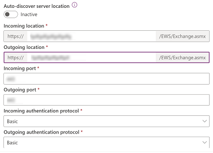

# Connect to Exchange Server (on-premises)

[!INCLUDE [cc-beta-prerelease-disclaimer](../includes/cc-beta-prerelease-disclaimer.md)]

With version 9.0, you can connect your customer engagement apps (such as [Dynamics 365 Sales](/dynamics365/sales-professional/help-hub), [Dynamics 365 Customer Service](/dynamics365/customer-service/help-hub), [Dynamics 365 Marketing](/dynamics365/marketing/help-hub), [Dynamics 365 Field Service](/dynamics365/field-service/overview), and [Dynamics 365 Project Service Automation](/dynamics365/project-operations/psa/overview)) with [!INCLUDE[pn_Exchange_Server_full](../includes/pn-exchange-server-full.md)] (on-premises). More information: [Setup Guide: Server-side synchronization for CRM Online and Exchange Server](https://download.microsoft.com/download/E/D/0/ED05CA70-190F-4BAE-9F6A-0BB2F0010B81/Setup%20Guide%20Server-side%20synchronization%20for%20CRM%20Online%20and%20Exchange%20Server.pdf) (white paper)

## Prerequisites  

1. **Exchange Server**. The following versions are supported: [!INCLUDE[pn_Exchange_Server_2013_short](../includes/pn-exchange-server-2013-short.md)] SP1, [!INCLUDE[pn_exchange_server_2016_short](../includes/pn-exchange-server-2016-short.md)], and Exchange Server 2019.  

2. **Authentication**. During installation, [!INCLUDE[pn_Exchange](../includes/pn-exchange.md)]<!--note from editor: Should this be "Exchange Server"?--> configures [!INCLUDE[pn_Internet_Information_Services](../includes/pn-internet-information-services.md)]. To connect customer engagement apps with [!INCLUDE[pn_Exchange_Server_short](../includes/pn-exchange-server-short.md)], you must enable Windows NT LAN Manager (NTLM) or Basic authentication in [!INCLUDE[pn_Exchange_Server_short](../includes/pn-exchange-server-short.md)]. If you configure NTLM authentication, make sure Basic authentication is disabled on Exchange Server.  

For more information about authentication, go to:  

   - Exchange Server 2013: [Authentication and Exchange Web Services (EWS) in Exchange](/exchange/client-developer/exchange-web-services/authentication-and-ews-in-exchange)  
   - Exchange Server 2013: [Default settings for Exchange virtual directories](/exchange/default-settings-for-exchange-virtual-directories-exchange-2013-help) 
   - Exchange Server 2016: [Default settings for Exchange virtual directories](/Exchange/clients/default-virtual-directory-settings?view=exchserver-2019)
   - Exchange Server 2019: [Default settings for Exchange virtual directories](/Exchange/clients/default-virtual-directory-settings?view=exchserver-2019)

3. **ApplicationImpersonation role**. You need to create and configure a service account with the **ApplicationImpersonation** role in [!INCLUDE[pn_Exchange](../includes/pn-exchange.md)].<!--note from editor: Should this be "Exchange Server"?--> [!INCLUDE[proc_more_information](../includes/proc-more-information.md)] [Impersonation and EWS in Exchange](https://msdn.microsoft.com/library/office/dn722377\(v=exchg.150\).aspx) 

4. **Secured connection**. The connection between customer engagement apps and Exchange<!--note from editor: Should this be "Exchange Server"?--> must be encrypted via [TLS/SSL](/windows/win32/secauthn/cipher-suites-in-schannel) and current [cipher suites](server-cipher-tls-requirements.md). 

5. **Exchange Web Services (EWS)**. Connections to EWS must be allowed through the firewall. Often a reverse proxy is used for the exterior-facing connection.  

> [!TIP]
> To make sure you've got a good connection to [!INCLUDE[pn_Exchange](../includes/pn-exchange.md)]<!--note from editor: Should this be "Exchange Server"?--> (on-premises), run the [Microsoft Remote Connectivity Analyzer](https://testconnectivity.microsoft.com/). For information about which tests to run, see [Test mail flow with the Remote Connectivity Analyzer](https://technet.microsoft.com/library/dn305950\(v=exchg.150\).aspx). 
> 
> To learn more about the protocols and ciphers used to secure the connection between Dynamics 365 and external email services, see [Server cipher suites and TLS requirements](server-cipher-tls-requirements.md).

## Preview: Create an email server profile  

1. In the [Power Platform admin center](https://admin.powerplatform.microsoft.com), select an environment. 

2. On the command bar, select **Settings** > **Email** > **Server profiles**.  
    
   > [!div class="mx-imgBorder"] 
   > 

3. On the command bar, select **New server profile**.

   > [!div class="mx-imgBorder"] 
   > 

4. For **Email Server Type**, select **Exchange Server (On Prem)**, and then specify a meaningful **Name** for the profile.

   > [!div class="mx-imgBorder"] 
   > 

5. If you want to use this server profile as the default profile for new mailboxes, turn on **Set as default profile for new mailboxes**. 

6. For **Authentication Type**, choose one of the following:

    - **Credential specified in email server profile**: The credentials specified in the email server profile are used for sending or receiving email for the mailboxes of all users and queues associated with this profile. The credentials must have impersonation or delegation permissions on the mailboxes associated with the profile. This option requires some configuration on the email server, for example configuring impersonation rights on Exchange for the mailboxes associated with the profile.
      > [!NOTE]
      > To ensure the credentials are secured, SQL encryption is used to encrypt the credentials stored in the email server profile.<!--note from editor: I removed "...if you're processing email by using server-side synchronization" because this same note occurs in other topics without this extra wording. If using server-side synchronization is something the reader can choose not to do, and in such a case SQL encryption won't be used, this note should say something like "If you're processing email by using server-side synchronization, SQL encryption is used to encrypt the credentials stored in the email server profile to ensure that they're secured."-->
    
      > [!div class="mx-imgBorder"] 
      > 

    - **Exchange Hybrid Modern Auth (HMA)**: To get the information for this option, follow the steps in [Hybrid Modern Authentication (HMA) for Exchange on-premises](connect-exchange-server-onprem-hma.md)
        > [!div class="mx-imgBorder"] 
        > ")

7. Expand **Locations and ports**, and follow these steps:

   - If **Authentication Type** is set to **Credential specified in email server profile**, select whether **Auto-discover server location** is **Active** or **Inactive**.    If you choose **Inactive**, enter the incoming and outgoing email server information. Enter the ports for the email server to use for accessing incoming and outgoing email. Select the protocol that will be used for authentication for incoming and outgoing email. 
   
      > [!div class="mx-imgBorder"] 
      > 
   
   -  If **Authentication Type** is set to **Exchange Hybrid Modern Auth (HMA)**, enter the location and port for the email server.

8. Expand the **Advanced** section, and then use the tooltips to choose your email processing options. 

9. When you're done, select **Save**.

## Create an email server profile  

1. Do one of the following: 

   - In the [Power Platform admin center](https://admin.powerplatform.microsoft.com), select an environment. 
   - In the legacy web client in the upper-right corner, select , and then select **Advanced settings**. 

2. Select **Settings** > **Email** > **Server profiles**.  

3. Select **New** > **Exchange Server (Hybrid)**.  

4. **For an Exchange email server profile, specify the following details:**  

   |                                         Fields                                         |                                                                                                                                                                                                                                                                                                                                                       Description                                                                                                                                                                                                                                                                                                                                                       |
   |----------------------------------------------------------------------------------------|-------------------------------------------------------------------------------------------------------------------------------------------------------------------------------------------------------------------------------------------------------------------------------------------------------------------------------------------------------------------------------------------------------------------------------------------------------------------------------------------------------------------------------------------------------------------------------------------------------------------------------------------------------------------------------------------------------------------------|
   |                                      **General**                                       |                                                                                                                                                                                                                                                                                                                                                                                                                                                                                                                                                                                                                                                                                                                         |
   |                                          Name                                          |                                                                                                                                                                                                                                                                                                                                       Specify a meaningful name for the profile.                                                                                                                                                                                                                                                                                                                                        |
   |                                      Description                                       |                                                                                                                                                                                                                                                                                                                        Type a short description about the objective of the email server profile.                                                                                                                                                                                                                                                                                                                        |
   |                             Auto Discover Server Location                              |                                                                                                                                                                                                                                                          Select **Yes** (recommended), if you want to use the automatically discover service to determine the server location. If you set this to **No**, you must specify the email server location manually.                                                                                                                                                                                                                                                           |
   |                 Incoming Server Location and Outgoing Server Location                  |                                                                                                                                                                                                                                                                                        If you select **No** in **Auto Discover Server Location**, enter a URL for **Incoming Server Location** and **Outgoing Server Location**.                                                                                                                                                                                                                                                                                        |
   |                                    **Credentials**                                     |                                                                                                                                                                                                                                                                                                                                                                                                                                                                                                                                                                                                                                                                                                                         |
   |                            Authenticate Using Impersonation                            |                                                                                                                                                                                                                                                                                    Enter the credentials for the [!INCLUDE[pn_Exchange](../includes/pn-exchange.md)] service account granted the **ApplicationImpersonation** role.                                                                                                                                                                                                                                                                                     |
   |                                       User Name                                        |                                                                                                                                                                                                                                                                                                             Type the user name for the [!INCLUDE[pn_Exchange](../includes/pn-exchange.md)] service account.                                                                                                                                                                                                                                                                                                             |
   |                                        Password                                        |                                                                                                                                                                                                                                                                                                             Type the password for the [!INCLUDE[pn_Exchange](../includes/pn-exchange.md)] service account.                                                                                                                                                                                                                                                                                                              |
   |                                      **Advanced**                                      |                                                                                                                                                                                                                                                                                                                                                                                                                                                                                                                                                                                                                                                                                                                         |
   |                                **Additional Settings**                                 |                                                                                                                                                                                                                                                                                                                                                                                                                                                                                                                                                                                                                                                                                                                         |
   |                                   Process Email From                                   |                                                                                                                                                                                             Select a date and time. Email received after the date and time will be processed by server-side synchronization for all mailboxes associated with this profile. If you set a value less than the current date, the change will be applied to all newly associated mailboxes and their earlier processed emails will be pulled.                                                                                                                                                                                              |
   |                          Minimum Polling Intervals in Minutes                          |                                                                                                                                                                                                                                           Type the minimum polling interval, in minutes, for mailboxes that are associated with this email server profile. The polling interval determines how often server-side synchronization polls your mailboxes for new email messages.                                                                                                                                                                                                                                           |
   |                             Maximum Concurrent Connections                             | Type the maximum number of simultaneous connections that can be made by customer engagement apps to the corresponding email server per mailbox. Increase the value to allow more parallel calls to [!INCLUDE[pn_Exchange](../includes/pn-exchange.md)] to improve performance or reduce the value if there are errors on [!INCLUDE[pn_Exchange](../includes/pn-exchange.md)] due to large number of calls from customer engagement apps. The default value of this field is 10. The maximum number is considered per mailbox or per email server profile depending on whether the credentials are specified in a mailbox or email server profile. |
   |                       Move Failed Emails to Undeliverable Folder                       |                                                                                                                                                                                                     To move the undelivered email to the Undeliverable folder, select **Yes**. If there's an error in tracking email messages in Dynamics 365 apps as email activities, and if this option is set to **Yes**, the email message will be moved to the Undeliverable folder.                                                                                                                                                                                                     |
   |                                **Email Notifications**                                 |                                                                                                                                                                                                                                                                                                                                                                                                                                                                                                                                                                                                                                                                                                                         |
   | Send an alert email to the owner of the email server profile reporting on major events |                                                                                                                                                                                                                                                                                                   If you want the email server profile owner to be notified when more than 50% of the mailboxes fail, select **Yes**.                                                                                                                                                                                                                                                                                                    |

5. Select **Save**.  

6. Select **Test Connection** and review the results. To diagnose issues, see the following section.  

### Troubleshooting the Exchange Server (Hybrid) profile connection

 If you've run the **Test Connection** command and have issues with the Exchange Server (Hybrid) profile connection, use the information in the **Test Connection** dialog to diagnose and fix the connection.

   

 In this example, there was a problem with the auto-discover server location feature. Review the username and password used for **Authentication Using Impersonation** for the Exchange Server (Hybrid) profile.  

 You can find information about recurring issues and other troubleshooting information in [Blog: Test and Enable Mailboxes in Microsoft Dynamics CRM 2015](https://cloudblogs.microsoft.com/dynamics365/no-audience/2015/08/31/test-and-enable-mailboxes-in-microsoft-dynamics-crm-2015/)<!--note from editor: The other link resolved to the Dev Blogs home page.--> and [Troubleshooting and monitoring server-side synchronization](troubleshooting-monitoring-server-side-synchronization.md).  

## Configure default email processing and synchronization

Set server-side synchronization to be the default configuration method.  

1. In the Power Platform admin center, select an environment. 

2. Select **Settings** > **Email** > **Email settings**.  

3. Under **Synchronization methods**, set the processing and synchronization fields as follows:  

   - **Server Profile**: The profile you created in the preceding section.  

   - **Incoming Email**: Server-Side Synchronization or Email Router  

   - **Outgoing Email**: Server-Side Synchronization or Email Router  

   - **Appointments, Contacts, and Tasks**: Server-Side Synchronization or Email Router  

     If you leave **Email processing for unapproved user and queues**<!--note from editor: Edit okay?--> at the default values (selected), you'll need to approve emails and queues for user mailboxes as directed in [**Approve email**](#approve-email), later in this topic.  

4. Select **Save**.  

## Configure mailboxes

To set mailboxes to use the default profile, you must first set the server profile and the delivery method for email, appointments, contacts, and tasks.  

In addition to administrator permissions, you must have Read and Write privileges on the Mailbox table to set the delivery method for the mailbox.  

Choose *one* of the following methods: set mailboxes to the default profile, or edit mailboxes to set profile and delivery methods.

<!--markdownlint-disable MD036--> 
**To set mailboxes to the default profile**  

1. In the Power Platform admin center, select an environment. 

2. Select **Settings** > **Email** > **Mailboxes**.  

3. Select **Active Mailboxes**.  

4. Select all the mailboxes that you want to associate with the [!INCLUDE[pn_Exchange_Server_short](../includes/pn-exchange-server-short.md)] profile you created, select **Apply Default Email Settings**, verify the settings, and then select **OK**.  

     

    By default, the mailbox configuration is tested and the mailboxes are enabled when you select **OK**.  

**To edit mailboxes to set the profile and delivery methods**  

1. In the Power Platform admin center, select an environment. 

2. Select **Settings** > **Email** > **Mailboxes**.  

3. Select **Active Mailboxes**.  

4. Select the mailboxes that you want to configure, and then select **Edit**.  

5. In the **Change Multiple Records** form, under **Synchronization Method**, set **Server Profile** to the [!INCLUDE[pn_Exchange_Server_short](../includes/pn-exchange-server-short.md)] profile you created earlier.  

6. Set **Incoming** and **Outgoing** **Email** to **Server-Side Synchronization or Email Router**.  

7. Set **Appointments, Contacts, and Tasks** to **Server-Side Synchronization**.  

8. Select **Change**.  

## Approve email

You need to approve each user mailbox or queue before that mailbox can process email.  

1. In the Power Platform admin center, select an environment. 

2. Select **Settings** > **Email** > **Mailboxes**.  

3. Select **Active Mailboxes**.  

4. Select the mailboxes that you want to approve, and then select **More Commands** (**…**) > **Approve Email**.  

5. Select **OK**.  

## Test the configuration of mailboxes  

1. In the Power Platform admin center, select an environment. 

2. Select **Settings** > **Email** > **Mailboxes**.  

3. Select **Active Mailboxes**.  

4. Select the mailboxes you want to test, and then select **Test & Enable Mailboxes**.  

   This tests the incoming and outgoing email configuration of the selected mailboxes and enables them for email processing. If an error occurs in a mailbox, an alert is shown on the **Alerts** wall of the mailbox and the profile owner. Depending on the nature of the error, customer engagement apps try to process the email again after some time or disable the mailbox for email processing.  

   The result of the email configuration test is displayed in the **Incoming Email Status**, **Outgoing Email Status**, and **Appointments, Contacts, and Tasks Status** fields of a mailbox record. An alert is also generated when the configuration is successfully completed for a mailbox. This alert is shown to the mailbox owner.  

> [!TIP]
>  If you're unable to synchronize contacts, appointments, and tasks for a mailbox, you might want to select the **Sync items with Exchange from this org only, even if Exchange was set to sync with a different org** checkbox. More information: [When would I want to use this check box?](when-would-want-use-check-box.md) 

## Test email configuration for all mailboxes associated with an email server profile  

1. In the Power Platform admin center, select an environment. 

2. Select **Settings** > **Email** > **Server profiles**.  

3. Select the profile you created, and then select **Test & Enable Mailboxes**.  

    When you test the email configuration, an asynchronous job runs in the background. It might take a few minutes for the test to be completed. Customer engagement apps test the email configuration of all the mailboxes associated with the [!INCLUDE[pn_Exchange_Server_short](../includes/pn-exchange-server-short.md)] profile. For the mailboxes configured with server-side synchronization for synchronizing appointments, tasks, and contacts, it also checks to make sure they're configured properly.  

> [!TIP]
>  If you're unable to synchronize contacts, appointments, and tasks for a mailbox, you might want to select the **Sync items with Exchange from this org only, even if Exchange was set to sync with a different org** checkbox. More information: [When would I want to use this check box?](when-would-want-use-check-box.md)  

### See also

 [Troubleshooting and monitoring server-side synchronization](troubleshooting-monitoring-server-side-synchronization.md)   
 [Test mail flow with the Remote Connectivity Analyzer](https://technet.microsoft.com/library/dn305950\(v=exchg.150\).aspx)   
 [Server-side synchronization](server-side-synchronization.md)   
 [Autodiscover service](https://technet.microsoft.com/library/bb124251\(v=exchg.150\).aspx)   
 [Managing the Autodiscover Service](https://technet.microsoft.com/library/aa995956\(v=exchg.141\).aspx)

[!INCLUDE[footer-include](../includes/footer-banner.md)]
