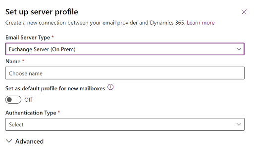
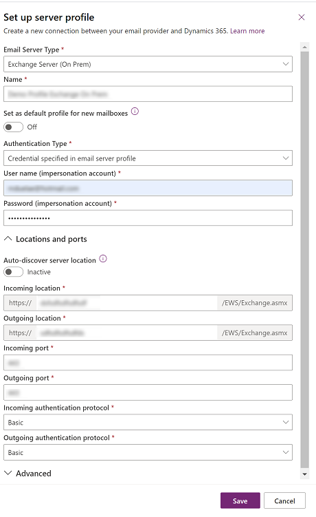

# Connect to Exchange Server (on-premises)

With version 9.0., you can connect your customer engagement apps (such as [Dynamics 365 Sales](./../sales-professional/help-hub.md), [Dynamics 365 Customer Service](dynamics365/customer-service/help-hub.md), [Dynamics 365 Marketing](dynamics365/marketing/help-hub.md), [Dynamics 365 Field Service](dynamics365/field-service/overview.md), and [Dynamics 365 Project Service Automation](dynamics365/project-operations/psa/overview.md), with [!INCLUDE[pn_Exchange_Server_full](../includes/pn-exchange-server-full.md)] (on-premises).  

 Check out the following white paper: [Setup Guide: Server-side synchronization for CRM Online and Exchange Server](https://download.microsoft.com/download/E/D/0/ED05CA70-190F-4BAE-9F6A-0BB2F0010B81/Setup%20Guide%20Server-side%20synchronization%20for%20CRM%20Online%20and%20Exchange%20Server.pdf)  

## Prerequisites  

1. **Exchange Server**. The following versions are supported: [!INCLUDE[pn_Exchange_Server_2013_short](../includes/pn-exchange-server-2013-short.md)] SP1, [!INCLUDE[pn_exchange_server_2016_short](../includes/pn-exchange-server-2016-short.md)], or Exchange Server 2019.  

2. **Authentication**. During installation, [!INCLUDE[pn_Exchange](../includes/pn-exchange.md)] configures [!INCLUDE[pn_Internet_Information_Services](../includes/pn-internet-information-services.md)]. To connect customer engagement apps with [!INCLUDE[pn_Exchange_Server_short](../includes/pn-exchange-server-short.md)], Windows (NTLM) or Basic authentication must be enabled in [!INCLUDE[pn_Exchange_Server_short](../includes/pn-exchange-server-short.md)]. When configuring Windows (NTLM) authentication, make sure Basic authentication is disabled on Exchange server.  

     For more information on authentication, see:  

   - Exchange Server 2013: [Authentication and EWS in Exchange](/exchange/client-developer/exchange-web-services/authentication-and-ews-in-exchange)  

   - Exchange Server 2013: [Default settings for Exchange virtual directories](/exchange/default-settings-for-exchange-virtual-directories-exchange-2013-help) 

   - Exchange Server 2016: [Default settings for Exchange virtual directories](/Exchange/clients/default-virtual-directory-settings?view=exchserver-2019)

   - Exchange Server 2019: [Default settings for Exchange virtual directories](/Exchange/clients/default-virtual-directory-settings?view=exchserver-2019)

3. **ApplicationImpersonation role**. You need to create and configure a service account with the **ApplicationImpersonation** role in [!INCLUDE[pn_Microsoft_Exchange](../includes/pn-microsoft-exchange.md)]. [!INCLUDE[proc_more_information](../includes/proc-more-information.md)] [Impersonation and EWS in Exchange](https://msdn.microsoft.com/library/office/dn722377\(v=exchg.150\).aspx).  

4. **Secured connection**. The connection between customer engagement apps and Exchange must be encrypted via [TLS/SSL](/windows/win32/secauthn/cipher-suites-in-schannel) and current [cipher suites](server-cipher-tls-requirements.md). 

5. **Exchange Web Services (EWS)**. Connections to EWS must be allowed through the firewall. Often a reverse proxy is used for the exterior facing connection.  

> [!TIP]
>  To make sure you've got a good connection to [!INCLUDE[pn_Exchange](../includes/pn-exchange.md)] on-premises run the [Microsoft Remote Connectivity Analyzer](https://testconnectivity.microsoft.com/). For information on what tests to run, see [Test mail flow with the Remote Connectivity Analyzer](https://technet.microsoft.com/library/dn305950\(v=exchg.150\).aspx).  

## Create an email server profile  

1. In the  [Power Platform admin center](https://admin.powerplatform.microsoft.com), select an environment. 

2. On the command bar select **Settings** > **Email** > **Server profiles**.  
    
   > [!div class="mx-imgBorder"] 
   > 

3. On the command bar, select **New server profile**.

   > [!div class="mx-imgBorder"] 
   > 

4. Select **New** > **Exchange Server (On Prem)** and then specify a meaningful **Name** for the profile.

   > [!div class="mx-imgBorder"] 
   > 
   
5. For **Set as default profile for new mailboxes** choose wheater you want this server profile as the default profile for new mailboxes. 

6. For **Authentication Type** choose one of the following:

    - **Credential specified in email server profile**: Enter the credentials for the [!INCLUDE[pn_Exchange](../includes/pn-exchange.md)] inpersonation account.
        > [!div class="mx-imgBorder"] 
        > 

    - **Exchange Hybrid Modern Auth (HMA)**: To get the information for this option, follow the steps in this topic: [Hybrid Modern Authentication (HMA) for Exchange on-premises](connect-exchange-server-onprem-hma.md)
        > [!div class="mx-imgBorder"] 
        > ")

7. Expand the **Locations and ports** section and then select whether **Auto-disver location** is active or inactvie. If you shoose **Inactive** then fill in the incoming and outgoing location along with port and type of authentication protocol.

8. Expand the **Advanced** section and then use the tooltips to choose your email processing options. 

9. When you're done, select **Save**.

### Troubleshooting the Exchange Server (Hybrid) profile connection  
 If you've run **Test Connection** and have issues with the Exchange Server (Hybrid) profile connection, use the information in the **Test Connection** dialog box to diagnose and fix the connection.  

   

 In this case, there's a problem with Auto Discover. The admin should review the user name and password used for **Authentication Using Impersonation** for the Exchange Server (Hybrid) profile.  

 You can find information on recurring issues and other troubleshooting information in [Blog: Test and Enable Mailboxes in Microsoft Dynamics CRM 2015](https://blogs.msdn.com/b/crm/archive/2015/08/31/test-and-enable-mailboxes-in-microsoft-dynamics-crm-2015.aspx) and [Troubleshooting and monitoring server-side synchronization](../admin/troubleshooting-monitoring-server-side-synchronization.md).  

## Configure default email processing and synchronization  
 Set server-side synchronization to be the default configuration method.  

1. In the Power Platform admin center, select an environment. 

2. Select **Settings** > **Email** > **Email settings**.  

3. Under **Synchronization methods**, set the processing and synchronization fields as follows:  

   - **Server Profile**: The profile you created in the above section.  

   - **Incoming Email**: Server-Side Synchronization or Email Router  

   - **Outgoing Email**: Server-Side Synchronization or Email Router  

   - **Appointments, Contacts, and Tasks**: Server-Side Synchronization or Email Router  

     If you leave the **Email processing form unapproved user and queues** at the default values (checked), you will need to approve emails and queues for user mailboxes as directed below in **Approve Email**.  

4. Select **Save**.  

## Configure mailboxes  
 To set mailboxes to use the default profile, you must first set the Server Profile and the delivery method for email, appointments, contacts, and tasks.  

 In addition to administrator permissions, you must have Read and Write privileges on the Mailbox table to set the delivery method for the mailbox.  

 Select **one** of the following methods:  

### Set mailboxes to the default profile  

1. In the Power Platform admin center, select an environment. 

2. Select **Settings** > **Email** > **Mailboxes**.  

3. Select **Active Mailboxes**.  

4. Select all the mailboxes that you want to associate with the [!INCLUDE[pn_Exchange_Server_short](../includes/pn-exchange-server-short.md)] profile you created, select **Apply Default Email Settings**, verify the settings, and then select **OK**.  

     

    By default, the mailbox configuration is tested and the mailboxes are enabled when you select **OK**.  

### Edit mailboxes to set the profile and delivery methods  

1. In the Power Platform admin center, select an environment. 

2. Select **Settings** > **Email** > **Mailboxes**.  

3. Select **Active Mailboxes**.  

4. Select the mailboxes that you want to configure, and then select **Edit**.  

5. In the **Change Multiple Records** form, under **Synchronization Method**, set **Server Profile** to the [!INCLUDE[pn_Exchange_Server_short](../includes/pn-exchange-server-short.md)] profile you created earlier.  

6. Set **Incoming** and **Outgoing** **Email** to **Server-Side Synchronization or Email Router**.  

7. Set **Appointments, Contacts, and Tasks** to **Server-Side Synchronization**.  

8. Select **Change**.  

## Approve email  
 You need to approve each user mailbox or queue before that mailbox can process email.  

1. In the Power Platform admin center, select an environment. 

2. Select **Settings** > **Email** > **Mailboxes**.  

3. Select **Active Mailboxes**.  

4. Select the mailboxes that you want to approve, and then select **More Commands** (**…**) > **Approve Email**.  

5. Select **OK**.  

## Test configuration of mailboxes  

1. In the Power Platform admin center, select an environment. 

2. Select **Settings** > **Email** > **Mailboxes**.  

3. Select **Active Mailboxes**.  

4. Select the mailboxes you want to test, and then select **Test & Enable Mailboxes**.  

    This tests the incoming and outgoing email configuration of the selected mailboxes and enables them for email processing. If an error occurs in a mailbox, an alert is shown on the Alerts wall of the mailbox and the profile owner. Depending on the nature of the error, customer engagement apps try to process the email again after some time or disables the mailbox for email processing.  

    The result of the email configuration test is displayed in the **Incoming Email Status**, **Outgoing Email Status**, and **Appointments, Contacts, and Tasks Status** fields of a mailbox record. An alert is also generated when the configuration is successfully completed for a mailbox. This alert is shown to the mailbox owner.  

> [!TIP]
>  If you're unable to synchronize contacts, appointments, and tasks for a mailbox, you may want to select the **Sync items with Exchange from this org only, even if Exchange was set to sync with a different org** check box. [Read more about this check box](when-would-want-use-check-box.md).  

## Test email configuration for all mailboxes associated with an email server profile  

1. In the Power Platform admin center, select an environment. 

2. Select **Settings** > **Email** > **Server profiles**.  

3. Select the profile you created, and then select **Test & Enable Mailboxes**.  

    When you test the email configuration, an asynchronous job runs in the background. It may take a few minutes for the test to be completed. Customer engagement apps test the email configuration of all the mailboxes associated with the [!INCLUDE[pn_Exchange_Server_short](../includes/pn-exchange-server-short.md)] profile. For the mailboxes configured with server-side synchronization for synchronizing appointments, tasks, and contacts, it also checks to make sure they're configured properly.  

> [!TIP]
>  If you're unable to synchronize contacts, appointments, and tasks for a mailbox, you may want to select the **Sync items with Exchange from this org only, even if Exchange was set to sync with a different org** check box. [Read more about this check box](when-would-want-use-check-box.md).  

### See also  
 [Troubleshooting and monitoring server-side synchronization](../admin/troubleshooting-monitoring-server-side-synchronization.md)   
 [Test mail flow with the Remote Connectivity Analyzer](https://technet.microsoft.com/library/dn305950\(v=exchg.150\).aspx)   
 [Server-side synchronization](../admin/server-side-synchronization.md)   
 [Autodiscover service](https://technet.microsoft.com/library/bb124251\(v=exchg.150\).aspx)   
 [Managing the Autodiscover Service](https://technet.microsoft.com/library/aa995956\(v=exchg.141\).aspx)

[!INCLUDE[footer-include](../includes/footer-banner.md)]
