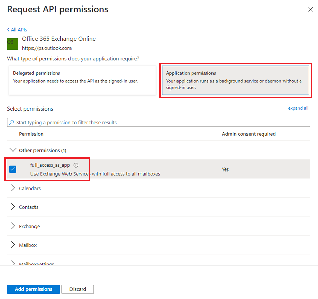
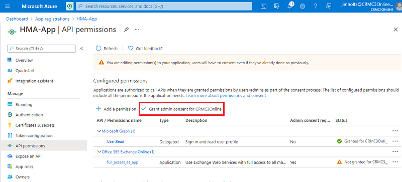

# Hybrid Modern Authentication (HMA) for Exchange on-premises

Dynamics 365 can now connect to mailboxes hosted on Exchange<!--note from editor: It's okay that this isn't "Exchange Server"?--> (on-premises) by using Hybrid Modern Authentication (HMA). Server-side synchronization will authenticate against Azure Active Directory (Azure AD) by using a certificate you provide<!--note from editor: Should this be "provided"? I'm confused by who does the storing here.--> and stored securely in Azure Key Vault. You'll need to establish an application registration secured by a client secret to enable Dynamics 365 to access the certificate in Key Vault. After Dynamics 365 is able to retrieve the certificate, the certificate will be used to authenticate as a specific app and access the Exchange (on-premises) resource. 

## Supported Exchange versions

HMA will only be available from Exchange 2013 (CU19+) or Exchange 2016 (CU8+)<!--note from editor: Is it okay that in the post, these CU versions are given for Exchange Server? I'll stop asking now.-->. More information: [Announcing Hybrid Modern Authentication for Exchange On-Premises](https://techcommunity.microsoft.com/t5/exchange-team-blog/announcing-hybrid-modern-authentication-for-exchange-on-premises/ba-p/607476) (blog)

## Prerequisites

To deploy HMA with Dynamics 365, you'll need to meet the following requirements:

- **HMA must be enabled on Exchange by using Azure AD pass-through authentication**. More information:

  - [Exchange Server hybrid deployments](/exchange/exchange-hybrid)
  - [Hybrid Configuration wizard](/exchange/hybrid-configuration-wizard)
  - [What is Azure AD Connect?](/azure/active-directory/hybrid/whatis-azure-ad-connect)
  - [Azure Active Directory Pass-through Authentication: Quickstart](/azure/active-directory/hybrid/how-to-connect-pta-quick-start)
  - [How to configure Exchange Server on-premises to use Hybrid Modern Authentication](/microsoft-365/enterprise/configure-exchange-server-for-hybrid-modern-authentication?view=o365-worldwide)
 
- **A certificate is required for this authentication scheme**. You must provide a valid certificate to configure server-side sync for HMA. It can be generated directly in Azure Key Vault or through your company's process for generating and uploading a certificate to Key Vault.

- **You need a Key Vault location** where the certificate can be stored securely. You'll also need to configure app registration with an AppId and ClientSecret to allow Dynamics 365 access to the certificate. More information: [Key Vault](https://azure.microsoft.com/services/key-vault/)

## Configuration 

Follow the steps below to configure HMA for Exchange (on-premises).

### Make a certificate available on Key Vault

1. In the [Azure portal](https://portal.azure.com/), open Key Vault and go to the **Certificates** section. 

2. Select **Generate/Import**.

   > [!div class="mx-imgBorder"] 
   > 

3. At this point, a certificate can be either generated or imported. Specify a certificate name, and then select **Create**. 

The certificate name will be used later to reference the certificate. In this example, the certificate is named **HMA-Cert**. 

### Create a new app registration for Key Vault access 

Create a new app registration in the Azure portal in the tenant where the Key Vault resides. For these example, the app will be named **KV-App** during the configuration process. More information: [Quickstart: Register an application with the Microsoft identity platform](/azure/active-directory/develop/quickstart-register-app)

### Add a client secret for KV-App 

The client secret will be used by Dynamics 365 to authenticate the app and retrieve the certificate. More information: [Add a client secret](/azure/active-directory/develop/quickstart-register-app#add-a-client-secret)

### Add KV-App to the Key Vault access policies 

1. In the [Azure portal](https://portal.azure.com/), open Key Vault and go to the **Access policies** section. 

2. Select **Add Access Policy**.

   > [!div class="mx-imgBorder"] 
   > 

3. For **Select principal**, select a principal. For these example, we'll select **KV-App**. 

4. Select permissions. Be sure to add **Get permission** under **Secret permissions** and **Certificate permissions**.  Both are required for the KV-App to be able to access the certificate.

   > [!div class="mx-imgBorder"] 
   > 

5. Select **Add**.

## Create a new app registration for HMA access 

Create a new app registration in the Azure portal in the tenant where Exchange is hybridized. 

In this example, the app will be named **HMA-App** during this configuration process and will represent the actual app that Dynamics 365 will use to interact with Exchange (on-premises) resources. More information: [Quickstart: Register an application with the Microsoft identity platform](/azure/active-directory/develop/quickstart-register-app)

## Add the certificate for HMA-App 

This will be used by Dynamics 365 to authenticate HMA-App. HMA only supports certificate usage to authenticate an app; therefore, a certificate is needed for this authentication scheme. 

Add the HMA-Cert previously provisioned in Key Vault. More information: [Add a certificate](/azure/active-directory/develop/quickstart-register-app#add-a-certificate)

## Add API permission 

To allow HMA-App to have access to Exchange (on-premises), grant the **Office 365 Exchange Online** API permission.

1. In the [Azure portal](https://portal.azure.com/), open **App registrations** and select **HMA-App**. 

2. Select **API Permissions** > **Add a permission**.

   > [!div class="mx-imgBorder"] 
   > 

3. Select **APIs my organization uses**.

4. Enter **Office 365 Exchange Online**, and select it.

5. Select **Application permissions**.

6. Select the **full_access_as_app** checkbox to allow the app to have full access to all the mailboxes, and then select **Add permissions**.

   > [!div class="mx-imgBorder"] 
   > 

   > [!NOTE]
   > If it doesn't align with your business requirements to have an app with full access on all mailboxes, the Exchange (on-premises) admin can scope the mailboxes that the app can access by configuring the ApplicationImpersonation role on Exchange. More information: [Configure impersonation](/exchange/client-developer/exchange-web-services/how-to-configure-impersonation)

7. Select **Grant admin consent**.

   > [!div class="mx-imgBorder"] 
   > 

## Email server profile with authentication type Exchange Hybrid Modern Auth (HMA)

Before you [create an email server profile](connect-exchange-server-on-premises.md) on Dynamics 365 by using Exchange Hybrid Modern Auth (HMA), you need to collect the following information from the Azure portal:

- EWS URL: The Exchange Web Services (EWS) endpoint where Exchange (on-premises) is located, which must be publicly accessible from Dynamics 365. 
- AAD resource Id: The Azure resource ID to which the HMA app will request access. It's usually the host part of the EWS endpoint URL. 
- TenantId: The tenant ID of the tenant where Exchange (on-premises) is configured with Azure AD pass-through authentication. 
- HMA Application Id: The App ID for HMA-App. It can be found on the main page for the app registration of HMA-App.
- Key Vault Uri: The URI of the Key Vault used for certificate storage. 
- Key Vault KeyName: The certificate name used in Key Vault. 
- KeyVault Application Id: The the app ID of the KV-App used by Dynamics to retrieve the certificate from Key Vault.
- KeyVault Client Secret: The client secret for the KV-App used by Dynamics 365. 

  > [!div class="mx-imgBorder"] 
  > ")
