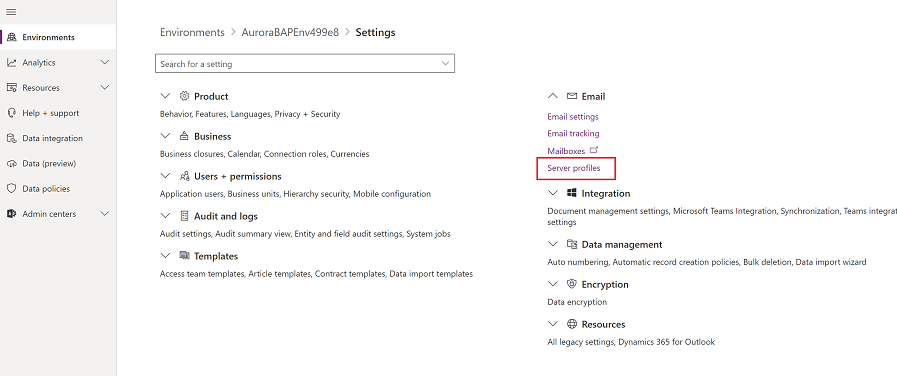
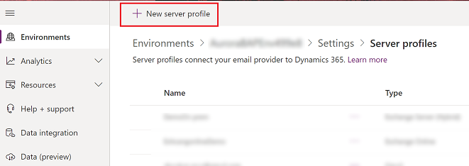
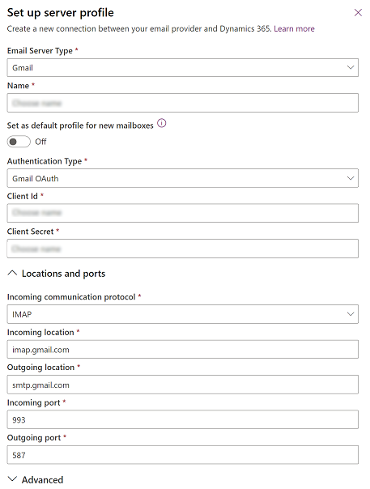
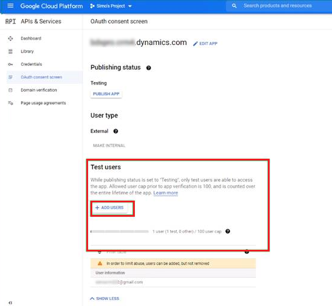

# Connect Gmail accounts using OAuth 2.0 

Follow the steps in this article to set up server-side synchronization to send and receive email in customer engagement apps (such as [Dynamics 365 Sales](dynamics365/sales-professional/help-hub.md), [Dynamics 365 Customer Service](dynamics365/customer-service/help-hub.md), [Dynamics 365 Marketing](dynamics365/marketing/help-hub.md), [Dynamics 365 Field Service](dynamics365/field-service/overview.md), and [Dynamics 365 Project Service Automation](dynamics365/project-operations/psa/overview.md) from Gmail accounts using OAuth 2.0 as the authorization mechanism.

> [!NOTE]
> The Gmail OAuth email server profile works for up to 100 users. Create multiple OAuth profiles (steps 1-4) if you want to associate the same profile with multiple users.

## Availability

We're in the process of rolling out this feature. To determine if your environment can connect Gmail accounts using OAuth 2.0, do the following:

1.  In the  [Power Platform admin center](https://admin.powerplatform.microsoft.com), select an environment. 

2. Select **Settings** > **Email** > **Mailboxes**. To open settings for apps that use [Unified Interface](about-unified-interface.md), look in the upper-right corner and select the **Gear** icon (). Then select **Advanced settings**. 

3. Select a mailbox and check the top menu bar for the **Signin To Gmail** icon. If present, the feature is enabled for this environment.

   > [!div class="mx-imgBorder"] 
   > 

## Step 1: Enable IMAP or POP in Gmail

> [!NOTE]
> These steps should be done by the system administrator.

For IMAP, follow the steps in: [Check Gmail through other email platforms](https://support.google.com/mail/answer/7126229)

For POP, follow the steps in: [Read Gmail messages on other email clients using POP](https://support.google.com/mail/answer/7104828)

## Step 2: Create a project

> [!NOTE]
> These steps should be done by the system administrator.

Using a Google account (could be the same one you’ll use to send and retrieve email or a different one), go to the Google Developers Console and create a new project.

Follow the steps for **Create a project** in: [Create, shut down, and restore projects](https://support.google.com/googleapi/answer/6251787)

## Step 3: Configure OAuth consent 

> [!NOTE]
> These steps should be done by the system administrator.

1. Select **OAuth consent screen** and then select the user type. Select **Internal** if you're using a GSuite admin tenant and will be creating the app exclusively for your organization. Select **External** if you’re testing with a stand-alone Gmail account. 

   > [!div class="mx-imgBorder"] 
   > 

2. Select **Create**.

3. Enter an application name and your environment’s top private domain name (for example: dynamics.com) for **Authorized domains**. Then, select **Save**.

   > [!div class="mx-imgBorder"] 
   > 

4. Select **Credentials** > **Create credentials**.

   > [!div class="mx-imgBorder"] 
   > 

5. Select **OAuth client ID**.

6. Select **Configure consent screen**.

7. Enter the following settings:

   |Setting  |Use  |
   |---------|---------|
   |Application type     | Web application         |
   |Name     |  The name of your web client       |
   |Authorized JavaScript origins     | Your environment's  URL (for example, https://contoso.crm.dynamics.com)        |
   |Authorized redirect URIs     | Your environment's URL with "/_grid/cmds/dlg_gmailoauth.aspx" appended to it (for example, https://contoso.crm.dynamics.com/_grid/cmds/dlg_gmailoauth.aspx)        |

   > [!div class="mx-imgBorder"] 
   > 

8. Select **Create**. In the screen that appears, make note of the client ID and client secret. You'll use this data in the next step.

## Step 4: Create an email server profile

1. In the  [Power Platform admin center](https://admin.powerplatform.microsoft.com), select an environment. 

2. On the command bar select **Settings** > **Email** > **Server profiles**.  
    
   > [!div class="mx-imgBorder"] 
   > 

3. On the command bar, select **New server profile**.

   > [!div class="mx-imgBorder"] 
   > 

4. For **Email Server Type** select **Gmail** and then specify a meaningful **Name** for the profile.

   > [!div class="mx-imgBorder"] 
   > 

5. For **Set as default profile for new mailboxes** choose wheater you want this server profile as the default profile for new mailboxes.

6. For **Authentication Type** select **Gmail OAuth**.

7. To get the **Client id** and **Client Secret** information see the previous step.

8. The **Locations and ports** fields are automatically populated.
   
   > [!div class="mx-imgBorder"] 
   > 

9. Expand **Advanced** and then use the tooltips to choose your email processing options.

10. When you're done select **Save**.

## Step 5: Configure the mailbox

> [!NOTE]
> These steps should be done by the mailbox user.

1. In the web app, go to **Settings** () > **Advanced Settings**.

2. Select **Settings** > **Administration**.

3. Select **Settings** > **Email configuration** > **Mailboxes**.

4. Select the mailbox for the user configured in previous steps.

5. Use the following settings:

   |Setting  |Use  |
   |---------|---------|
   |Server profile    | The profile created in step 4       |
   |Incoming email    | Server-Side Synchronization or Email Router       |
   |Outgoing email | Server-Side Synchronization or Email Router   |

   > [!div class="mx-imgBorder"] 
   > 

6. Select **Save**.

7. Select **Signin to Gmail**.

8. Proceed through the Gmail sign-in and authorization pages.

## Step 6: Add test users

In the Google Cloud Platform (Developer Console), add users in the Test Users section when publishing the app. See [Google Cloud Platform Console Help](https://support.google.com/cloud/answer/7454865).

> [!div class="mx-imgBorder"] 
> 

## Step 7: Test and enable

> [!NOTE]
> These steps should be done by the mailbox user.

Select **Test & Enable Mailbox** to test the mailbox configured in step 6.

   > [!div class="mx-imgBorder"] 
   > 

[!INCLUDE[footer-include](../includes/footer-banner.md)]
