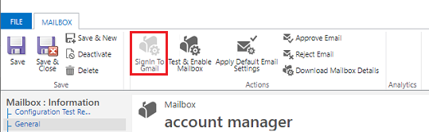
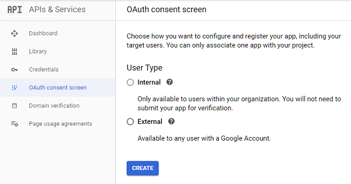
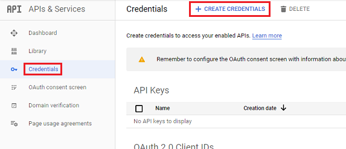
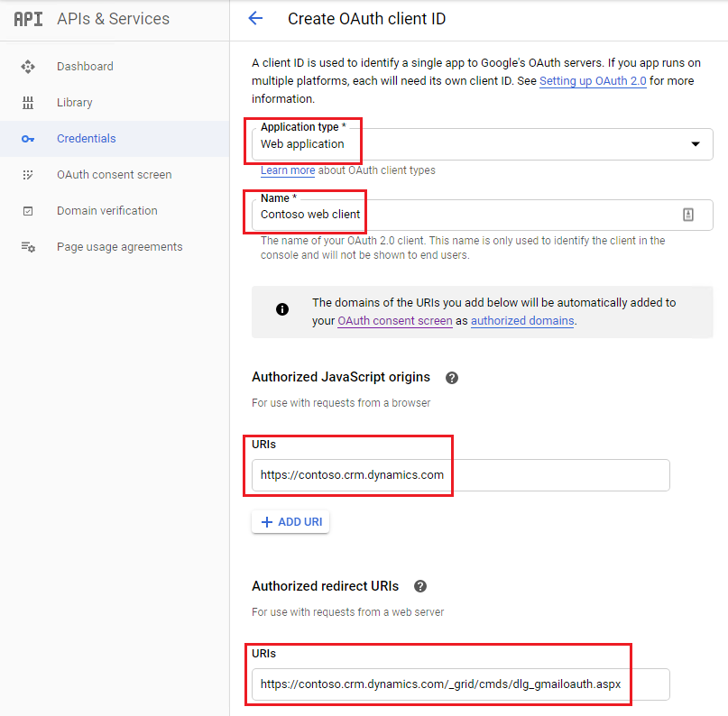
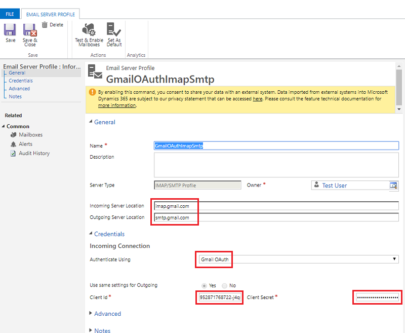
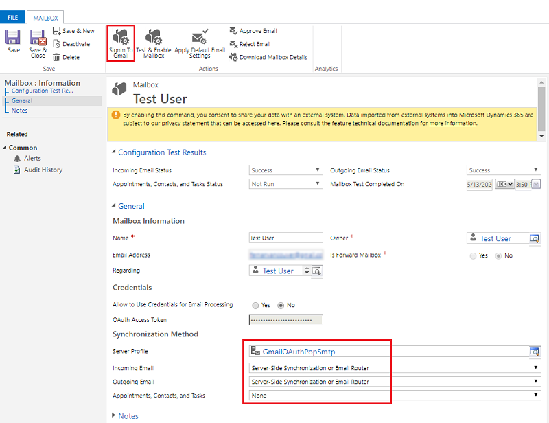
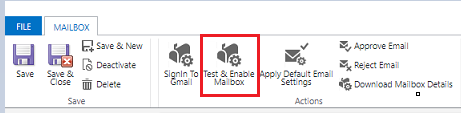

# Connect Gmail accounts using OAuth 2.0 

Follow the steps in this article to set up server-side synchronization to send and receive email in customer engagement apps (Dynamics 365 Sales, Dynamics 365 Customer Service, Dynamics 365 Field Service, Dynamics 365 Marketing, and Dynamics 365 Project Service Automation) from Gmail accounts using OAuth 2.0 as the authorization mechanism.

> [!NOTE]
> The Gmail OAuth email server profile works for up to 100 users. Create multiple OAuth profiles (steps 1-4) if you want to associate the same profile with multiple users.

## Availability

We're in the process of rolling out this feature. To determine if your environment can connect Gmail accounts using OAuth 2.0, do the following:

1. In the web app, select **Settings** > **Email configuration** > **Mailboxes**. To open settings for apps that use [Unified Interface](about-unified-interface.md), look in the upper-right corner and select the **Gear** icon (). Then select **Advanced settings**. 

2. Select a mailbox and check the top menu bar for the **Signin To Gmail** icon. If present, the feature is enabled for this environment.

   > [!div class="mx-imgBorder"] 
   > 

## Step 1: Enable IMAP or POP in Gmail

> [!NOTE]
> These steps should be done by the system administrator.

For IMAP, follow the steps in: [Check Gmail through other email platforms](https://support.google.com/mail/answer/7126229)

For POP, follow the steps in: [Read Gmail messages on other email clients using POP](https://support.google.com/mail/answer/7104828)

## Step 2: Create a project

> [!NOTE]
> These steps should be done by the system administrator.

Using a Google account (could be the same one you’ll use to send and retrieve email or a different one), go to the Google Developers Console and create a new project.

Follow the steps for **Create a project** in: [Create, shut down, and restore projects](https://support.google.com/googleapi/answer/6251787)

## Step 3: Configure OAuth consent 

> [!NOTE]
> These steps should be done by the system administrator.

1. Select **OAuth consent screen** and then select the user type. Select **Internal** if you're using a GSuite admin tenant and will be creating the app exclusively for your organization. Select **External** if you’re testing with a stand-alone Gmail account. 

   > [!div class="mx-imgBorder"] 
   > 

2. Select **Create**.

3. Enter an application name and your environment's fully qualified domain name (for example: contoso.crm.dynamics.com). Then, select **Save**.

   > [!div class="mx-imgBorder"] 
   > 

4. Select **Credentials** > **Create credentials**.

   > [!div class="mx-imgBorder"] 
   > 

5. Select **OAuth client ID**.

6. Select **Configure consent screen**.

7. Enter the following settings:

   |Setting  |Use  |
   |---------|---------|
   |Application type     | Web application         |
   |Name     |  The name of your web client       |
   |Authorized JavaScript origins     | Your environment's  URL (for example, https://contoso.crm.dynamics.com)        |
   |Authorized redirect URIs     | Your environment's URL with "/_grid/cmds?dlg_gmailoauth.aspx" appended to it (for example, https://contoso.crm.dynamics.com/_grid/cmds/dlg_gmailoauth.aspx)        |

   > [!div class="mx-imgBorder"] 
   > 

8. Select **Create**. In the screen that appears, make note of the client ID and client secret. You'll use this data in the next step.

## Step 4: Create an email server profile

> [!NOTE]
> These steps should be done by the system administrator.

Create a new IMAP or POP3 email server profile.

- To create an IMAP email server profile, follow the steps in: [Connect to IMAP or SMTP servers](connect-to-imap-servers.md)
  
- To create a POP3 email server profile, follow the steps in: [Connect to POP3 or SMTP servers](connect-to-pop3-or-smtp-servers.md)

Use the following settings:

|Setting  |Use  |
|---------|---------|
| IMAP incoming server location    | imap.gmail.com        |
| POP3 incoming server location    | pop.gmail.com        |
| IMAP and POP3 outgoing server location | smtp.gmail.com |
| Authenticate using  |  Gmail OAuth  |
| Client ID  | From the previous step    |
| Client secret | From the previous step  |

> [!div class="mx-imgBorder"] 
> 

## Step 5: Configure the mailbox

> [!NOTE]
> These steps should be done by the mailbox user.

1. In the web app, select **Settings** > **Email configuration** > **Mailboxes**.

2. Select the mailbox for the user configured in previous steps.

3. Use the following settings:

   |Setting  |Use  |
   |---------|---------|
   |Server profile    | The profile created in step 4       |
   |Incoming email    | Server-Side Synchronization or Email Router       |
   |Outgoing email | Server-Side Synchronization or Email Router   |

   > [!div class="mx-imgBorder"] 
   > 

4. Select **Save**.

5. Select **Signin to Gmail**.

6. Proceed through the Gmail sign-in and authorization pages.

## Step 6: Test and enable

> [!NOTE]
> These steps should be done by the mailbox user.

In the web app, select **Test & Enable Mailbox** to test the mailbox configured in step 5.

   > [!div class="mx-imgBorder"] 
   > 

