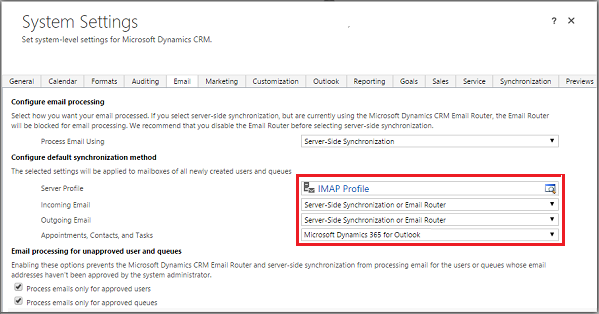

# Connect to IMAP or POP servers

Follow these steps to connect customer engagement apps (such as [Dynamics 365 Sales](./../sales-professional/help-hub.md), [Dynamics 365 Customer Service](dynamics365/customer-service/help-hub.md), [Dynamics 365 Marketing](dynamics365/marketing/help-hub.md), with IMAP or POP email servers such as used for Gmail and Yahoo! Mail.  

> [!NOTE]
> - Only emails in the Inbox folder are synchronized.
> - Existing POP3 email profiles will not be automatically converted to IMAP. There is no support for migrating from POP3 to IMAP.
> - For IMAP/SMTP systems supported by Microsoft, check out the following topic: [Supported email service configurations for server-side synchronization](supported-email-service-configurations-server-side-synchronization.md).  

   

## Create an email server profile  

1. In the  [Power Platform admin center](https://admin.powerplatform.microsoft.com), select an environment. 

2. On the command bar select **Settings** > **Email** > **Server profiles**.  
    
   > [!div class="mx-imgBorder"] 
   > 

3. On the command bar, select **New server profile** and then specify a meaningful **Name** for the profile.

   > [!div class="mx-imgBorder"] 
   > 

4. Choose **Other(IMAP/POP,SMTP)**.  

   > [!div class="mx-imgBorder"] 
   > 

5. For **Set as default profile for new mailboxes** choose wheater you want this server profile as the default profile for new mailboxes. 

6. For **Authentication Type** select **Credential specififed by user or queue**. When you select this option, the credentials specified in the mailbox record of a user or queue are used for sending or receiving email for the respective user or queue. Note: To ensure the credentials are secured, SQL encryption is used to encrypt the credentials stored in the mailbox.

7. Expand the **Locations and ports** and select the following:
    <ol> 
      <li> Incoming communication protocol: Select which protocol that will be used for authentication for incoming email, IMAP or POP..</li>
      <li> Incoming and Ougoing location: Enter the incoming and outgoing email location. </li>
      <li> Incoming and Outgoing port: Enter the port on the email server for accessing the incoming email. </li>
      <li> dfdf </li>
    </ol>  

8. Expand the **Advanced** section and use the tooltips to choose your email processing options. 
9. When you're done, select **Save**.

   

## Configure default email processing and synchronization  
Set server-side synchronization to be the default configuration method. 

1. In the Power Platform admin center, select an environment. 

2. Select **Settings** > **Email** > **Email settings**.  
 
3. Set the processing and synchronization fields as follows:  

   - **Server Profile**: The profile you created in the above section.  

   - **Incoming Email**: Server-Side Synchronization or Email Router  

   - **Outgoing Email**: Server-Side Synchronization or Email Router  

   - **Appointments, Contacts, and Tasks**: Server-Side Synchronization or Email Router  

       > [!NOTE]
       >  Server-Side Synchronization or Email Router for Appointments, Contacts, and Tasks is not supported for the IMAP profile.  

     If you leave the **Email processing form unapproved user and queues** at the default values (checked), you will need to approve emails and queues for user mailboxes as directed below in **Approve Email**.  

       

4. Select **OK**.  
 
## Configure mailboxes  
 To set mailboxes to use the default profile, you must first set the Server Profile and the delivery method for email, appointments, contacts, and tasks.  

 In addition to administrator permissions, you must have Read and Write privileges on the Mailbox table to set the delivery method for the mailbox.  

 Select **one** of the following methods:  

### Set mailboxes to the default profile  

1. In the Power Platform admin center, select an environment. 

2. Select **Settings** > **Email** > **Mailboxes**.  

3. Select **Active Mailboxes**.  

4. Select all the mailboxes that you want to associate with the IMAP profile you created, select **Apply Default Email Settings**, verify the settings, and then select **OK**.  

     

    By default, the mailbox configuration is tested and the mailboxes are enabled when you select **OK**.  

### Edit mailboxes to set the profile and delivery methods  

1. In the Power Platform admin center, select an environment. 

2. Select **Settings** > **Email** > **Mailboxes**.  

3. Select **Active Mailboxes**.  

4. Select the mailboxes that you want to configure, and then select **Edit**.  

5. In the **Change Multiple Records** form, under **Synchronization Method**, set **Server Profile** to the IMAP profile you created earlier.  

6. Set **Incoming** and **Outgoing** **Email** to **Server-Side Synchronization or Email Router**.  

7. Set **Appointments, Contacts, and Tasks** to **None**.  

8. Select **Change**.  

 
  
## Approve email  
You need to approve each user mailbox or queue before that mailbox can process email.  

1. In the Power Platform admin center, select an environment. 

2. Select **Settings** > **Email** > **Mailboxes**.  

3. Select **Active Mailboxes**.  

4. Select the mailboxes that you want to approve, and then select **More Commands** (**…**) > **Approve Email**.  

5. Select **OK**.  

   

## Test configuration of mailboxes  

1. In the Power Platform admin center, select an environment. 

2. Select **Settings** > **Email** > **Mailboxes**.  

3. Select **Active Mailboxes**.  

4. Select the mailboxes you want to test, and then select **Test & Enable Mailboxes**.  

    This tests the incoming and outgoing email configuration of the selected mailboxes and enables them for email processing. If an error occurs in a mailbox, an alert is shown on the Alerts wall of the mailbox and the profile owner. Depending on the nature of the error, customer engagement apps try to process the email again after some time or disables the mailbox for email processing.  

    The result of the email configuration test is displayed in the **Incoming Email Status**, **Outgoing Email Status**, and **Appointments, Contacts, and Tasks Status** fields of a mailbox record. An alert is also generated when the configuration is successfully completed for a mailbox. This alert is shown to the mailbox owner.  

    You can find information on recurring issues and other troubleshooting information in [Blog: Test and Enable Mailboxes in Microsoft Dynamics CRM 2015](https://blogs.msdn.com/b/crm/archive/2015/08/31/test-and-enable-mailboxes-in-microsoft-dynamics-crm-2015.aspx) and [Troubleshooting and monitoring server-side synchronization](troubleshooting-monitoring-server-side-synchronization.md).  

> [!TIP]
>  If you're unable to synchronize contacts, appointments, and tasks for a mailbox, you may want to select the **Sync items with Exchange from this org only, even if Exchange was set to sync with a different org** check box. [Read more about this check box](when-would-want-use-check-box.md).  

   

## Test email configuration for all mailboxes associated with an email server profile  

1. In the Power Platform admin center, select an environment. 

2. Select **Settings** > **Email** > **Server profiles**.  

3. Select the profile you created, and then select **Test & Enable Mailboxes**.  

    When you test the email configuration, an asynchronous job runs in the background. It may take a few minutes for the test to be completed. Customer engagement apps test the email configuration of all the mailboxes associated with the IMAP profile. For the mailboxes configured with server-side synchronization for synchronizing appointments, tasks, and contacts, it also checks to make sure they're configured properly.  

> [!TIP]
>  If you're unable to synchronize contacts, appointments, and tasks for a mailbox, you may want to select the **Sync items with Exchange from this org only, even if Exchange was set to sync with a different org** check box. [Read more about this check box](when-would-want-use-check-box.md).  

   

## Network ports for Power Apps US Government  
 The following ports are open for outbound connections between Power Apps US Government and internet services.  

- 80 HTTP  
- 443 HTTPS 
- 465 Secure SMTP  
- 587 Secure SMTP  
- 993 Secure IMAP  

Customizations or email configurations in Power Apps US Government can only use these ports.  

### See also  
 [Troubleshooting and monitoring server-side synchronization](troubleshooting-monitoring-server-side-synchronization.md)  
 [Test mail flow with the Remote Connectivity Analyzer](https://technet.microsoft.com/library/dn305950\(v=exchg.150\).aspx)   
 [Set up server-side synchronization](set-up-server-side-synchronization-of-email-appointments-contacts-and-tasks.md)   

[!INCLUDE[footer-include](../includes/footer-banner.md)]
