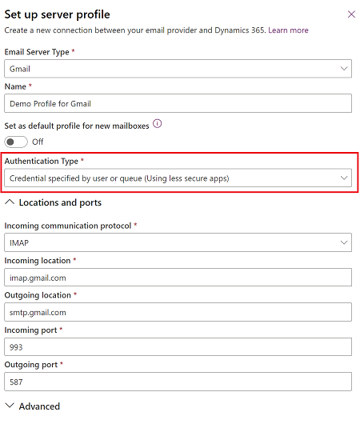

# Connect Gmail accounts, POP3 email server, or SMTP email server by using credentials specified by a user or queue 

 [!INCLUDE [cc-beta-prerelease-disclaimer](../includes/cc-beta-prerelease-disclaimer.md)]

Follow the steps in this article to set up server-side synchronization to send and receive email in customer engagement apps (such as [Dynamics 365 Sales](/dynamics365/sales-professional/help-hub), [Dynamics 365 Customer Service](/dynamics365/customer-service/help-hub), [Dynamics 365 Marketing](/dynamics365/marketing/help-hub), [Dynamics 365 Field Service](/dynamics365/field-service/overview), and [Dynamics 365 Project Service Automation](/dynamics365/project-operations/psa/overview)) from Gmail accounts, POP3 email server, or SMTP email server by using credentials specified by a user or queue as the authorization mechanism.

## Preview: Create an email server profile for Gmail accounts 

1. In the Power Platform admin center, select an environment. 

2. On the command bar, select **Settings** > **Email** > **Server profiles**.  
    
   > [!div class="mx-imgBorder"] 
   > 

3. On the command bar, select **New server profile**.

   > [!div class="mx-imgBorder"] 
   > 

4. For **Email Server Type**, select **Gmail**, and then specify a meaningful **Name** for the profile.

   > [!div class="mx-imgBorder"] 
   > 

5. If you want to use this server profile as the default profile for new mailboxes, turn on **Set as default profile for new mailboxes**.

6. For **Authentication Type**, select **Credential specified by user or queue (Using less secure apps)**. The credentials specified in the mailbox row of a user or queue are used for sending or receiving email for the respective user or queue.

   > [!NOTE]
   > To ensure that the credentials are secured, SQL encryption is used to encrypt the credentials stored in the mailbox.

   > [!div class="mx-imgBorder"] 
   > 

7. The **Locations and ports** fields are automatically populated.

8. Expand **Advanced**, and then use the tooltips to choose your email processing options.

9. When you're done, select **Save**.

## Create an email server profile  

1. In the Microsoft Power Platform admin center, select an environment. 

2. Select **Settings** > **Email** > **Server profiles**.  

3. Choose **New** > **POP3/SMTP Server**.  

4. **For an Exchange email server profile, specify the following details:**  

   |                                Fields                                 |                                                                                                                                                                                                                                                                                                                                                                                                                                                                                                                                                                                                                                                                                                                                                                                                                                                                                          Description                                                                                                                                                                                                                                                                                                                                                                                                                                                                                                                                                                                                                                                                                                                                                                                                                                                                                          |
   |-----------------------------------------------------------------------|-----------------------------------------------------------------------------------------------------------------------------------------------------------------------------------------------------------------------------------------------------------------------------------------------------------------------------------------------------------------------------------------------------------------------------------------------------------------------------------------------------------------------------------------------------------------------------------------------------------------------------------------------------------------------------------------------------------------------------------------------------------------------------------------------------------------------------------------------------------------------------------------------------------------------------------------------------------------------------------------------------------------------------------------------------------------------------------------------------------------------------------------------------------------------------------------------------------------------------------------------------------------------------------------------------------------------------------------------------------------------------------------------------------------------------------------------------------------------------------------------------------------------------------------------------------------------------------------------------------------------------------------------------------------------------------------------------------------------------------------------------------------------------------------------|
   |                              **General**                              |                                                                                                                                                                                                                                                                                                                                                                                                                                                                                                                                                                                                                                                                                                                                                                                                                                                                                                                                                                                                                                                                                                                                                                                                                                                                                                                                                                                                                                                                                                                                                                                                                                                                                                                                                                                               |
   |                                 Name                                  |                                                                                                                                                                                                                                                                                                                                                                                                                                                                                                                                                                                                                                                                                                                                                                                                                                                                          Specify a meaningful name for the profile.                                                                                                                                                                                                                                                                                                                                                                                                                                                                                                                                                                                                                                                                                                                                                                                                                                                                           |
   |                              Description                              |                                                                                                                                                                                                                                                                                                                                                                                                                                                                                                                                                                                                                                                                                                                                                                                                                                                           Type a short description about the objective of the email server profile.                                                                                                                                                                                                                                                                                                                                                                                                                                                                                                                                                                                                                                                                                                                                                                                                                                                           |
   |         Incoming Server Location and Outgoing Server Location         |                                                                                                                                                                                                                                                                                                                                                                                                                                                                                                                                                                                                                                                                                                                                                                                                                     Enter the **Incoming Server Location** and **Outgoing Server Location**   For example, Incoming: pop3.live.com and Outgoing: smtp.live.com                                                                                                                                                                                                                                                                                                                                                                                                                                                                                                                                                                                                                                                                                                                                                                                                                      |
   |                            **Credentials**                            |                                                                                                                                                                                                                                                                                                                                                                                                                                                                                                                                                                                                                                                                                                                                                                                                                                                                                                                                                                                                                                                                                                                                                                                                                                                                                                                                                                                                                                                                                                                                                                                                                                                                                                                                                                                               |
   |                          Authenticate Using                           | Select a method to authenticate while connecting to the specified email server.   - **Credentials Specified by a User or Queue**. If you select this option, the credentials specified in the mailbox row of a user or queue are used for sending or receiving email for the respective user or queue. **Note:**      To ensure the credentials are secured, SQL encryption is used to encrypt the credentials stored in the mailbox. - **Credentials Specified in Email Server Profile**. If you select this option, the credentials specified in the email server profile are used for sending or receiving email for the mailboxes of all users and queues associated with this profile. The credentials must have impersonation or delegation permissions on the mailboxes associated with profile. This option requires some configuration on the email server, for example, configuring impersonation rights on [!INCLUDE[pn_Exchange](../includes/pn-exchange.md)] for the mailboxes associated with the profile. **Note:**      To ensure the credentials are secured, SQL encryption is used to encrypt the credentials stored in the email server profile if you're processing email by using server-side synchronization. - **Windows Integrated Authentication**. This option applies only to [!INCLUDE[pn_Exchange](../includes/pn-exchange.md)] and SMTP email server types. If you select this option, the credentials with which the Asynchronous Service has been configured will be used. - **Without Credentials (Anonymous)**. Not a valid setting. |
   |                               User Name                               |                                                                                                                                                                                                                                                                                                                                                                                                                                                                                                                                  Type the user name used to connect to the email server for sending or receiving email for the mailboxes of all users and queues associated with this profile. This field is enabled and valid only if **Authenticate Using** is set to **Credentials Specified in Email Server Profile**. The user name that you specify must have permission to send and receive email from the mailboxes of users and queues associated with this profile. **Note:**  If you're using HTTP for customer engagement apps, the **User Name** and **Password** fields will be disabled. To enable the option, change the value of the deployment property AllowCredentialsEntryViaNonSecureChannels to 1.                                                                                                                                                                                                                                                                                                                                                                                                                                                                                                                                  |
   |                               Password                                |                                                                                                                                                                                                                                                                                                                                                                                                                                                                                                                                                                                                                               Specify the password of the user that will be used together with the user name to connect to the email server for sending or receiving email for the mailboxes of users and queues associated with this profile. The password is stored securely. **Note:**  If you're using HTTP for customer engagement apps, the **User Name** and **Password** fields will be disabled. To enable the option, change the value of the deployment property AllowCredentialsEntryViaNonSecureChannels to 1.                                                                                                                                                                                                                                                                                                                                                                                                                                                                                                                                                                                                                                |
   |                    Use same settings for Outgoing                     |                                                                                                                                                                                                                                                                                                                                                                                                                                                                                                                                                                                                                                                                                                                                                                                                                                          If you want to use the same credential settings for the incoming and outgoing connections, choose **Yes**.                                                                                                                                                                                                                                                                                                                                                                                                                                                                                                                                                                                                                                                                                                                                                                                                                                           |
   |                             **Advanced**                              |                                                                                                                                                                                                                                                                                                                                                                                                                                                                                                                                                                                                                                                                                                                                                                                                                                                                                                                                                                                                                                                                                                                                                                                                                                                                                                                                                                                                                                                                                                                                                                                                                                                                                                                                                                                               |
   |                             Incoming Port                             |                                                                                                                                                                                                                                                                                                                                                                                                                                                                                                                                                                                                                                                                                                                                                                                                                        This field shows the port on the email server for accessing the incoming email. This field is automatically populated when you save the record.                                                                                                                                                                                                                                                                                                                                                                                                                                                                                                                                                                                                                                                                                                                                                                                                                        |
   |                             Outgoing Port                             |                                                                                                                                                                                                                                                                                                                                                                                                                                                                                                                                                                                                                                                                                                                                                                                                                        This field shows the port on the email server for accessing the outgoing email. This field is automatically populated when you save the record.                                                                                                                                                                                                                                                                                                                                                                                                                                                                                                                                                                                                                                                                                                                                                                                                                        |
   |                    Use SSL for Incoming Connection                    |                                                                                                                                                                                                                                                                                                                                                                                                                                                                                                                                                                                                                                                                                                                                                                                                                    Choose **Yes** if the email channel is on a secure channel and [!INCLUDE[pn_ssl_short](../includes/pn-ssl-short.md)] must be used for receiving email.                                                                                                                                                                                                                                                                                                                                                                                                                                                                                                                                                                                                                                                                                                                                                                                                                     |
   |                    Use SSL for Outgoing Connection                    |                                                                                                                                                                                                                                                                                                                                                                                                                                                                                                                                                                                                                                                                                                                                                                                                                     Choose **Yes** if the email channel is on a secure channel and [!INCLUDE[pn_ssl_short](../includes/pn-ssl-short.md)] must be used for sending email.                                                                                                                                                                                                                                                                                                                                                                                                                                                                                                                                                                                                                                                                                                                                                                                                                      |
   | Incoming Authentication Protocol and Outgoing Authentication Protocol |                                                                                                                                                                                                                                                                                                                                                                                                                                                                                                                                                                                                                                                                                                                                                                                                                                                    Select a protocol that will be used for authentication for incoming and outgoing email.                                                                                                                                                                                                                                                                                                                                                                                                                                                                                                                                                                                                                                                                                                                                                                                                                                                    |
   |                        **Additional Settings**                        |                                                                                                                                                                                                                                                                                                                                                                                                                                                                                                                                                                                                                                                                                                                                                                                                                                                                                                                                                                                                                                                                                                                                                                                                                                                                                                                                                                                                                                                                                                                                                                                                                                                                                                                                                                                               |
   |                          Process Email From                           |                                                                                                                                                                                                                                                                                                                                                                                                                                                                                                                                                                                                                                                                                                                                Select a date and time. Email received after the date and time will be processed by server-side synchronization for all mailboxes associated with this profile. If you set a value less than the current date, the change will be applied to all newly associated mailboxes and their earlier processed emails will be pulled.                                                                                                                                                                                                                                                                                                                                                                                                                                                                                                                                                                                                                                                                                                                                 |
   |                 Minimum Polling Intervals in Minutes                  |                                                                                                                                                                                                                                                                                                                                                                                                                                                                                                                                                                                                                                                                                                                                                                              Type the minimum polling interval, in minutes, for mailboxes that are associated with this email server profile. The polling interval determines how often server-side synchronization polls your mailboxes for new email messages.                                                                                                                                                                                                                                                                                                                                                                                                                                                                                                                                                                                                                                                                                                                                                                              |
   |                    Maximum Concurrent Connections                     |                                                                                                                                                                                                                                                                                                                                                                                                                                                                                                                                    Type the maximum number of simultaneous connections that can be made by customer engagement apps to the corresponding email server per mailbox. Increase the value to allow more parallel calls to [!INCLUDE[pn_Exchange](../includes/pn-exchange.md)] to improve performance or reduce the value if there are errors on [!INCLUDE[pn_Exchange](../includes/pn-exchange.md)] due to large number of calls from customer engagement apps. The default value of this field is 10. The maximum number is considered per mailbox or per email server profile depending on whether the credentials are specified in a mailbox or email server profile.                                                                                                                                                                                                                                                                                                                                                                                                                                                                                                                                    |

5. Choose **Save**.  

  

## Configure default email processing and synchronization 

Set server-side synchronization to be the default configuration method.  

1. Do one of the following: 

   - In the [Power Platform admin center](https://admin.powerplatform.microsoft.com), select an environment. 
   - In the legacy web client in the upper-right corner, select , and then select **Advanced settings**. . 

2. Select **Settings** > **Email** > **Email settings**.  

3. Under **Synchronization methods**, set the processing and synchronization fields as follows:  

   - **Server Profile**: The profile you created in the preceding section.  

   - **Incoming Email**: Server-Side Synchronization or Email Router  

   - **Outgoing Email**: Server-Side Synchronization or Email Router  

   - **Appointments, Contacts, and Tasks**: Server-Side Synchronization or Email Router 

     > [!NOTE]
     >  The **Server-Side Synchronization or Email Router** setting for Appointments, Contacts, and Tasks isn't supported for the POP3-SMTP profile.  

     If you leave **Email processing for unapproved user and queues** at the default values (selected), you'll need to approve emails and queues for user mailboxes as directed in [**Approve email**](#approve-email), later in this topic.  

       

4. Select **Save**.  

   

## Configure mailboxes

To set mailboxes to use the default profile, you must first set the server profile and the delivery method for email, appointments, contacts, and tasks.  

In addition to administrator permissions, you must have Read and Write privileges on the Mailbox table to set the delivery method for the mailbox.  

Choose *one* of the following methods: set mailboxes to the default profile, or edit mailboxes to set profile and delivery methods.

<!--markdownlint-disable MD036--> 
**To set mailboxes to the default profile**

1. In the Power Platform admin center, select an environment. 

2. Select **Settings** > **Email** > **Mailboxes**.  

3. Select **Active Mailboxes**.  

4. Select all the mailboxes that you want to associate with the POP3-SMTP profile you created, select **Apply Default Email Settings**, verify the settings, and then select **OK**.  

     

    By default, the mailbox configuration is tested and the mailboxes are enabled when you select **OK**.  

**To edit mailboxes to set the profile and delivery methods**

1. In the Power Platform admin center, select an environment. 

2. Select **Settings** > **Email** > **Mailboxes**.  

3. Select **Active Mailboxes**.  

4. Select the mailboxes that you want to configure, and then select **Edit**.  

5. In the **Change Multiple Records** form, under **Synchronization Method**, set **Server Profile** to the POP3-SMTP profile you created earlier.  

6. Set **Incoming** and **Outgoing** **Email** to **Server-Side Synchronization or Email Router**.  

7. Set **Appointments, Contacts, and Tasks** to **None**.  

8. Select **Change**.  

 

## Approve email

You need to approve each user mailbox or queue before that mailbox can process email.  

1. In the Power Platform admin center, select an environment. 

2. Select **Settings** > **Email** > **Mailboxes**.  

3. Select **Active Mailboxes**.  

4. Select the mailboxes that you want to approve, and then select **More Commands** (**…**) > **Approve Email**.  

5. Select **OK**.  

   

## Test the configuration of mailboxes  

1. In the Power Platform admin center, select an environment. 

2. Select **Settings** > **Email** > **Mailboxes**.  

3. Select **Active Mailboxes**.  

4. Select the mailboxes you want to test, and then select **Test & Enable Mailboxes**.  

    This tests the incoming and outgoing email configuration of the selected mailboxes and enables them for email processing. If an error occurs in a mailbox, an alert is shown on the **Alerts** wall of the mailbox and the profile owner. Depending on the nature of the error, customer engagement apps will try to process the email again after some time or disable the mailbox for email processing.  

    The result of the email configuration test is displayed in the **Incoming Email Status**, **Outgoing Email Status**, and **Appointments, Contacts, and Tasks Status** fields of a mailbox record. An alert is also generated when the configuration is successfully completed for a mailbox. This alert is shown to the mailbox owner.  

    You can find information about recurring issues and other troubleshooting information in [Blog: Test and Enable Mailboxes in Microsoft Dynamics CRM 2015](https://blogs.msdn.com/b/crm/archive/2015/08/31/test-and-enable-mailboxes-in-microsoft-dynamics-crm-2015.aspx) and [Troubleshooting and monitoring server-side synchronization](troubleshooting-monitoring-server-side-synchronization.md).  

> [!TIP]
>  If you're unable to synchronize contacts, appointments, and tasks for a mailbox, you might want to select the **Sync items with Exchange from this org only, even if Exchange was set to sync with a different org** checkbox. More information: [When would I want to use this check box?](when-would-want-use-check-box.md)  

   

## Test email configuration for all mailboxes associated with an email server profile  

1. In the Power Platform admin center, select an environment. 

2. Select **Settings** > **Email** > **Server profiles**.  

3. Select the profile you created, and then select **Test & Enable Mailboxes**.  

    When you test the email configuration, an asynchronous job runs in the background. It might take a few minutes for the test to be completed. Customer engagement apps test the email configuration of all the mailboxes associated with the POP3-SMTP profile. For the mailboxes configured with server-side synchronization for synchronizing appointments, tasks, and contacts, it also checks to make sure they're configured properly.  

> [!TIP]
> If you're unable to synchronize contacts, appointments, and tasks for a mailbox, you might want to select the **Sync items with Exchange from this org only, even if Exchange was set to sync with a different org** checkbox. More information: [When would I want to use this check box?](when-would-want-use-check-box.md) 

   

## Network ports for Power Apps US Government

The following ports are open for outbound connections between Power Apps US Government and internet services: 

- 80 HTTP  
- 443 HTTPS 
- 465 Secure SMTP  
- 995 Secure POP3  

Customizations or email configurations in Power Apps US Government can only use these ports.  

### See also

[Troubleshooting and monitoring server-side synchronization](troubleshooting-monitoring-server-side-synchronization.md)  
[Test mail flow with the Remote Connectivity Analyzer](https://technet.microsoft.com/library/dn305950\(v=exchg.150\).aspx)   
[Microsoft Power Apps US Government](powerapps-us-government.md)

[!INCLUDE[footer-include](../includes/footer-banner.md)]
