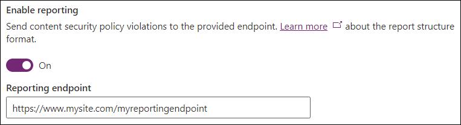
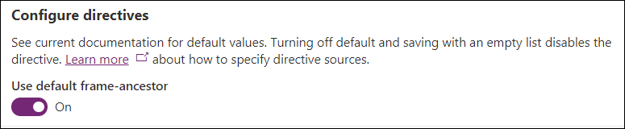
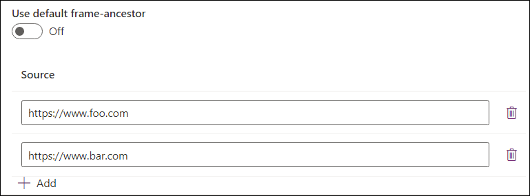
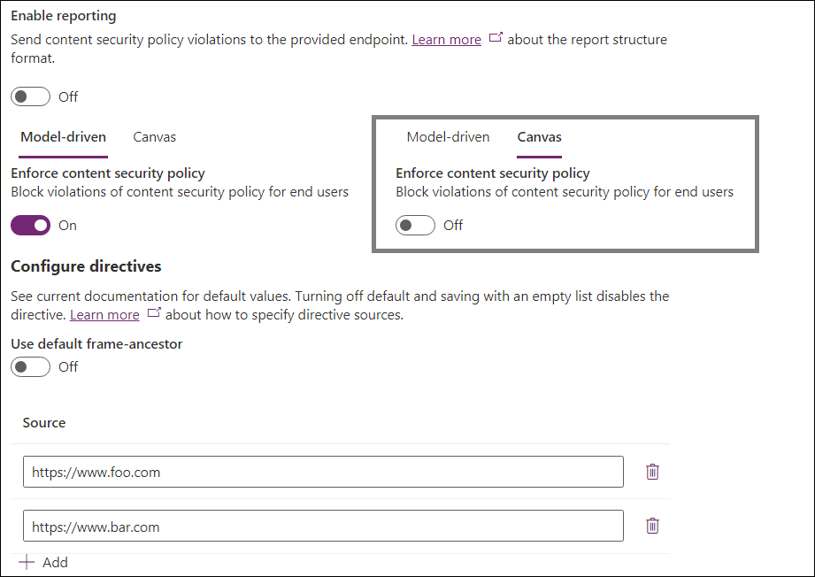

# Content security policy

[Content Security Policy](https://developer.mozilla.org/docs/Web/HTTP/CSP) (CSP) is currently supported in model-driven and canvas Power Apps. Admins can control whether the CSP header is sent and, to an extent, what it contains. The settings are at the environment level, which means it would be applied to all apps in the environment once turned on. 

Each component of the CSP header value controls the assets that can be downloaded and is described in more detail on the Mozilla Developer Network (MDN). The default values are as follows:

| Directive | Default value | Customizable |
| --------- | ------------- | ------------ |
| [script-src](https://developer.mozilla.org/docs/Web/HTTP/Headers/Content-Security-Policy/script-src) | `* 'unsafe-inline' 'unsafe-eval'` | No |
| [worker-src](https://developer.mozilla.org/docs/Web/HTTP/Headers/Content-Security-Policy/worker-src) | `'self' blob:` | No |
| [style-src](https://developer.mozilla.org/docs/Web/HTTP/Headers/Content-Security-Policy/style-src) | `* 'unsafe-inline'` | No |
| [font-src](https://developer.mozilla.org/docs/Web/HTTP/Headers/Content-Security-Policy/font-src) | `* data:` | No |
| [frame-ancestors](https://developer.mozilla.org/docs/Web/HTTP/Headers/Content-Security-Policy/frame-ancestors) | `'self'` | Yes |

This results in a default CSP of `script-src * 'unsafe-inline' 'unsafe-eval'; worker-src 'self' blob:; style-src * 'unsafe-inline'; font-src * data:; frame-ancestors 'self';`

## Configuring CSP

CSP can be toggled and configured through the Power Platform Admin Center (PPAC). **It is important to enable on a dev/test environment first** since enabling this could start blocking scenarios if the policy is violated.  We also support a "report-only mode" to allow for easier ramp-up in production.

To configure CSP, navigate to [PPAC](https://admin.powerplatform.microsoft.com) -> Environments -> Settings -> Privacy + Security. Below is the default state of the settings:

The "Enable reporting" toggle controls whether model-driven and canvas apps send violation reports. Enabling it requires an endpoint to be specified. Violation reports will be sent to this endpoint regardless of whether CSP is enforced or not (using report-only mode if CSP is not enforced).

Enforcement of CSP is controlled independently for model-driven and canvas apps to provide granular control over policies. Use the Model-driven / Canvas pivot to modify the intended app type.

The "Enforce content security policy" toggle turns on the default policy for enforcement, as specified above, for the given app type. Turning this toggle on will change the behavior of apps in this environment to adhere to the policy, so it is suggested to enable on a dev/test environment, then enable report-only mode in production before enforcing in production.

The final section is "Configure directives". This section allows you to control individual directives within the policy. Currently, only `frame-ancestors` can be customized.

Leaving the default directive toggled on uses the default value specified above. Turning off the toggle allows admins to specify custom values for the directive. The example below sets custom values for `frame-ancestors`. The directive would be set to `frame-ancestors: https://www.foo.com https://www.bar.com` in this example, meaning the app could be hosted in `https://www.foo.com` and `https://www.bar.com`, but not in other origins. Use the Add button to add entries to the list and the delete icon to remove them.

**Important considerations:**
- Turning off the default directive does not send the default value as part of the response. For example, using custom `frame-ancestors` would not send `'self'` as part of the directive. Admins would need to manually add `'self'` to the list.
- Turning off the default directive and saving with an empty list *turns the directive off completely*, i.e. does not send it as part of the response.

## Examples

Let's take a look at a couple examples of CSP configuration:

### Example 1

In the above example:
- Reporting is turned off
- Model-driven enforcement is enabled
  - `frame-ancestors` is customized to `https://www.foo.com` and `https://www.bar.com`
- Canvas enforcement is disabled

The effective headers would be:
- Model-driven apps: `Content-Security-Policy: script-src * 'unsafe-inline' 'unsafe-eval'; worker-src 'self' blob:; style-src * 'unsafe-inline'; font-src * data:; frame-ancestors https://www.foo.com https://www.bar.com;`
- Canvas apps: CSP header would not be sent

### Example 2

In the above example:
- Reporting is turned on
  - Reporting endpoint is set to `https://www.mysite.com/myreportingendpoint`
- Model-driven enforcement is enabled
  - `frame-ancestors` is kept as default
- Canvas enforcement is disabled
  - `frame-ancestors` is customized to `https://www.baz.com`

The effective CSP values would be:
- Model-driven apps: `Content-Security-Policy: script-src * 'unsafe-inline' 'unsafe-eval'; worker-src 'self' blob:; style-src * 'unsafe-inline'; font-src * data:; frame-ancestors 'self' report-uri https://www.mysite.com/myreportingendpoint;`
- Canvas apps: `Content-Security-Policy-Report-Only: script-src * 'unsafe-inline' 'unsafe-eval'; worker-src 'self' blob:; style-src * 'unsafe-inline'; font-src * data:; frame-ancestors https://www.baz.com report-uri https://www.mysite.com/myreportingendpoint;`

## Organization settings

CSP can be configured without using UI by modifying the following organization settings directly:

- [IsContentSecurityPolicyEnabled](/powerapps/developer/data-platform/reference/entities/organization#BKMK_IsContentSecurityPolicyEnabled) controls whether the Content-Security-Policy header is sent in model-driven apps.

- [ContentSecurityPolicyConfiguration](/powerapps/developer/data-platform/reference/entities/organization#BKMK_ContentSecurityPolicyConfiguration) controls the value of the frame-ancestors portion (as seen above, it is set to `'self'` if `ContentSecurityPolicyConfiguration` is not set).  This setting is represented by a JSON object with the following structure – `{ "Frame-Ancestor": { "sources": [ { "source": "foo" }, { "source": "bar" } ] } }`.  This would translate into `script-src * 'unsafe-inline' 'unsafe-eval'; worker-src 'self' blob:; style-src * 'unsafe-inline'; font-src * data:; frame-ancestors 'foo' 'bar';`
  - (From MDN) The HTTP Content-Security-Policy (CSP) frame-ancestors directive specifies valid parents that may embed a page using `<frame>`, `<iframe>`, `<object>`, `<embed>`, or `<applet>`.

- [IsContentSecurityPolicyEnabledForCanvas](/powerapps/developer/data-platform/reference/entities/organization#BKMK_IsContentSecurityPolicyEnabledForCanvas) controls whether the Content-Security-Policy header is sent in canvas apps.

- [ContentSecurityPolicyConfigurationForCanvas](/powerapps/developer/data-platform/reference/entities/organization#BKMK_ContentSecurityPolicyConfigurationForCanvas) controls the policy for canvas using the same process described in `ContentSecurityPolicyConfiguration` above.

- [ContentSecurityPolicyReportUri](/powerapps/developer/data-platform/reference/entities/organization#BKMK_ContentSecurityPolicyReportUri) controls whether reporting should be used. This is used by both model-driven and canvas apps. A valid string will send violation reports to the specified endpoint, using report-only mode if `IsContentSecurityPolicyEnabled`/`IsContentSecurityPolicyEnabledForCanvas` is turned off. An empty string disables reporting.

[!INCLUDE[footer-include](../includes/footer-banner.md)]
