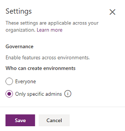

# Control who can create and manage environments in the Power Platform admin center 

With the new provisioning model, those with the correct licenses can create an environment as long as 1GB of capacity is available. To restrict environment creation and management to admins, do the following:

1. Sign in to the Power Platform admin center at [https://admin.powerplatform.microsoft.com](https://admin.powerplatform.microsoft.com).
2. Select the **Gear** icon () in the upper-right corner of the Power Platform site.
3. Select **Power Platform settings**. 
4. Select **Only specific admins**.

   > [!div class="mx-imgBorder"] 
   > 

The following admins will be able to create new environments in the Power Platform admin center:

- Global admins
- Dynamics 365 admins
- Power Platform admins

> [!NOTE]
> Environments created prior to restriction can still be managed after restriction by those who created the environment. Restriction will prevent any new environments being created and managed. 

## Control environment creation through PowerShell

Download and install the admin PowerShell cmdlets as described [here](https://www.powershellgallery.com/packages/Microsoft.PowerApps.Administration.PowerShell/2.0.1). For more information about our cmdlets, see [PowerShell support for Power Apps](powerapps-powershell.md).

Use the following commands to restrict environment creation to Global admins, Dynamics 365 admins, and Power Platform admins. 

```powershell
$settings = @{ DisableEnvironmentCreationByNonAdminUsers = $true }
Set-TenantSettings $settings
```

## FAQ

### Can I disable trial environment creation for users in the tenant?
Yes. Use the following PowerShell commands to restrict trial environment creation.

```powershell
$settings = @{ DisableTrialEnvironmentCreationByNonAdminUsers = $true }
Set-TenantSettings $settings
```

Download and install the admin PowerShell cmdlets as described [here](https://www.powershellgallery.com/packages/Microsoft.PowerApps.Administration.PowerShell/2.0.1). For more information about our cmdlets, see [PowerShell support for Power Apps](powerapps-powershell.md).


