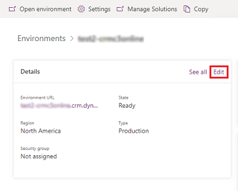
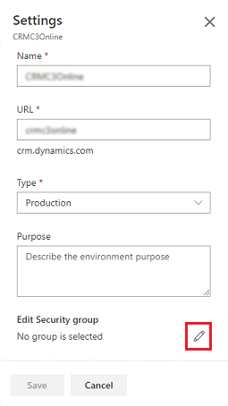
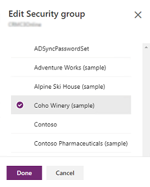
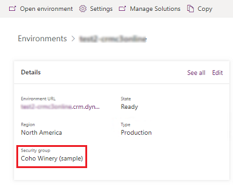
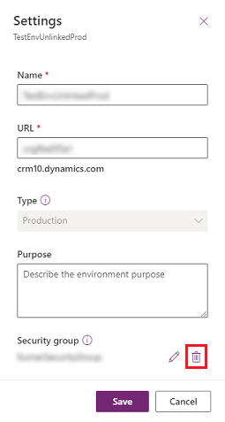

# Control user access to environments: security groups and licenses

If your company has multiple Microsoft Dataverse environments, you can use security groups to control which licensed users can be a member of a particular environment.  

> [!NOTE]
> For information on how user access works for Microsoft Dataverse for Teams, see [User access to Dataverse for Teams environments](about-teams-environment.md#user-access-to-dataverse-for-teams-environments).
  
Consider the following example scenario:  
  
|environment|Security Group|Purpose|  
|--------------|--------------------|-------------|  
|Coho Winery Sales|Sales_SG| Provide access to the environment that creates sales opportunities, handles quotes, and closes deals.|  
|Coho Winery Marketing|Marketing_SG|Provide access to the environment that drives marketing efforts through marketing campaigns and advertising.|  
|Coho Winery Service|Service_SG|Provide access to the environment that processes customer cases.|  
|Coho Winery Dev|Developer_SG|Provide access to the sandbox environment used for development and testing.|  
  
In this example, four security groups provide controlled access to a specific environment.  
  
Note the following about security groups: 
  
- Nested security group.

  Members of a nested security group in an environment security group are not **pre-provisioned or automatically added to the Dataverse environment**. However, they can be added into the environment when you create a [Dataverse group team](manage-group-teams.md#create-a-group-team) for the nested security group. 

  An example of this scenario: you assigned a security group for the environment when the environment was created. During the lifecycle of the environment, you want to add members to the environment which are managed by security groups. You create a security group in Azure Active Directory, for example managers, and assigned all your managers to the group. You then add this security group as a child of the environment security group, create a [Dataverse group team](manage-group-teams.md#create-a-group-team), and assign a security role to the group team. Your managers can now access Dataverse immediately.   
  
  A member of a nested security group is also added into the environment at run-time when the member accesses the environment the first time. But the member will not be able to run any application and access any data until a security role is assigned.   
  
- When users are added to the security group, they are added to the Dataverse environment.  
- When users are removed from the group, they are disabled in the Dataverse environment.  
- When a security group is associated with an existing environment with users, all users in the environment that are not members of the group will be disabled. 
- If a Dataverse environment does not have an associated security group, all users with a Dataverse license (customer engagement apps (Dynamics 365 Sales, Dynamics 365 Customer Service, Dynamics 365 Field Service, Dynamics 365 Marketing, and Dynamics 365 Project Service Automation), Power Automate, Power Apps, etc.) will be created as users and enabled in the environment.  
- If a security group is associated with an environment, only users with Dataverse licenses or per app plan that are members of the environment security group will be created as users in the Dataverse environment.  
- When you assign a security group to an environment, that environment will not show up in [home.dynamics.com](https://home.dynamics.com) for users not in the group.  
- If you do not assign a security group to an environment, the environment will show up in [home.dynamics.com](https://home.dynamics.com) even for those who have not been assigned a security role in that Dataverse environment.  
- If you do not specify a security group, all users who have a Dataverse license (customer engagement apps (such as Dynamics 365 Sales and Customer Service)) or per app plan will be added to the new environment.
- **New**: Security groups cannot be assigned to default and developer environment types. If you've already assigned a security group to your default or developer environment, we recommend removing it since the default environment is intended to be shared with all users in the tenant and the developer environment is intended for use by only the owner of the environment.
- Dataverse environments support associating the following group types: Security and Microsoft 365. Associating [other group types](/microsoft-365/admin/create-groups/compare-groups?view=o365-worldwide&WT.mc_id=365AdminCSH) is not supported.

<!-- 
- When you remove a security group that is associated with a Dataverse environment, either by editing the environment and removing the security group or by deleting the security group, Dataverse licensed users who were members of the security group will have the same access to Dynamics 365 apps. 
- You cannot yet make security groups members of other security groups. Check back for availability of support for nested security groups.
-->

> [!NOTE]
> All licensed users, whether or not they are members of the security groups, must be assigned security roles to access environments. You assign the security roles in the web application. Users can't access environments until they are assigned at least one security role for that environment. For more information, see [Configure environment security](database-security.md).
  
## Create a security group and add members to the security group  

1. Sign in to the [Microsoft 365 admin center](https://admin.microsoft.com).  
  
2. Select **Groups** > **Groups**.  
  
3. Select **+ Add a group**.  
  
4. Change the type to **Security group**, add the group **Name** and **Description**. Select **Add** > **Close**.  
  
5. Select the group you created, and then next to **Members**, select **Edit**.  
  
6. Select **+ Add members**. Select the users to add to the security group, and then select **Save** > **Close** several times to return to the **Groups** list.  
  
7. To remove a user from the security group, select the security group, next to **Members**, select **Edit**. Select **- Remove members**, and then select **X** for each member you want to remove.  
  
> [!NOTE]
> If the users you want to add to the security group are not created, create the users and assign to them the Dataverse licenses.  
> 
> To add multiple users, see: [bulk add users to Office365 groups](/microsoft-365/enterprise/add-several-users-at-the-same-time).  
  
### Create a user and assign license  
  
1. In the [!INCLUDE[pn_office_365_admin_center](../includes/pn-office-365-admin-center.md)], select **Users** > **Active users** > **+ Add a user**. Enter the user information, select licenses, and then select **Add**.  
  
   [!INCLUDE[proc_more_information](../includes/proc-more-information.md)] [Add users and assign licenses at the same time](/microsoft-365/admin/add-users/add-users)  

Or, purchase and assign per app passes: [About Power Apps per app plans](about-powerapps-perapp.md)

> [!NOTE]
> If a Dataverse environment has a Power Apps per app plan allocated, all users will be considered licensed when they attempt to access the environment, including users that do not have individual licenses assigned. Per app plan allocation on a Dataverse environment satisfies the requirement for users to be licensed in order to access the environment.
  
## Associate a security group with a Dataverse environment  
  
1. Sign in to the [Power Platform admin center](https://admin.powerplatform.microsoft.com) as an admin (Dynamics 365 admin, Global admin, or Microsoft Power Platform admin).

2. In the navigation pane, select **Environments**, select an environment, and then select **Edit**.  
  
   > [!div class="mx-imgBorder"] 
   > 

3. In the **Edit details** page, select **Edit** ().
  
   > [!div class="mx-imgBorder"] 
   > 

   Only the first 200 security groups will be returned and selectable by default. To select additional security groups, use **Search** to look for a specific security group.

4. Select a security group, select **Done**, and then select **Save**.

   > [!div class="mx-imgBorder"] 
   > 

The security group is associated with the environment.

   > [!div class="mx-imgBorder"] 
   > 

## Remove a security group's association with a Dataverse environment

1. Sign in to the [Power Platform admin center](https://admin.powerplatform.microsoft.com) as an admin (Dynamics 365 admin, Microsoft 365 Global admin, or Microsoft Power Platform admin).

2. In the navigation pane, select **Environments**, select an environment, and then select **Edit**.

   > [!div class="mx-imgBorder"] 
   > 

3. In the **Settings** page, select **Delete** ().  

   > [!div class="mx-imgBorder"] 
   > 

4. Confirm removal, select **Remove**, and then select **Save**.

The security group associated with the environment will be removed and the environment's access will no longer be restricted to only users that are members of that group.

### See also
[Create users and assign security roles](create-users-assign-online-security-roles.md)

[!INCLUDE[footer-include](../includes/footer-banner.md)]
